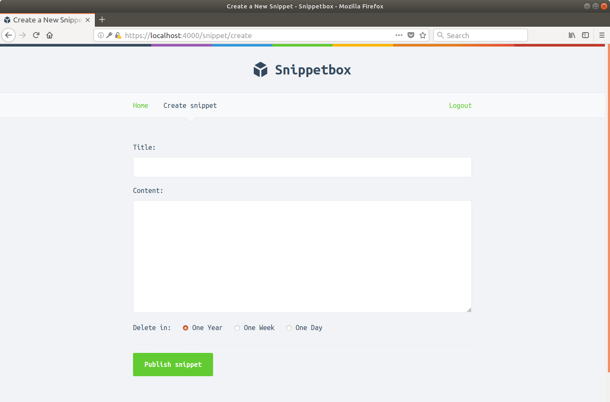

# 介绍

在本书中，我们将构建一个名为 Snippetbox 的 Web 应用程序，它允许人们粘贴和共享文本片段——有点像 Pastebin 或 GitHub 的 Gists。在构建结束时，它看起来有点像这样：



我们的应用程序将非常简单，只有一个网页。然后在每一章中，我们将逐步构建它，直到用户能够通过应用程序保存和查看片段。这将带我们了解诸如如何构建项目、路由请求、使用数据库、处理表单和安全地显示动态数据等主题。

然后在本书的后面，我们将添加用户帐户，并限制应用程序，以便只有注册用户才能创建代码段。这将带我们了解更高级的主题，例如配置 HTTPS 服务器、会话管理、用户身份验证和中间件。

## 先决条件

这本书是为刚接触 Go 的人设计的，但如果你先对 Go 的语法有一个大致的了解，你可能会发现它更有趣。如果你发现自己在语法上苦苦挣扎，Karl Seguin 的 Little Book of Go 是一个很棒的教程，或者如果你想要更具交互性的东西，我建议你浏览 Go 之旅。

我还假设你对 HTML/CSS 和 SQL 有（非常）基本的了解，并且对使用终端（或 Windows 用户的命令行）有一定的了解。如果你以前用任何其他语言构建过一个 Web 应用程序——无论是 Ruby、Python、PHP 还是 C#——那么这本书应该很适合你。

在软件方面，你需要安装 Go（1.16 版）、文本编辑器和 Web 浏览器。

我们还将在整本书的几个地方使用 Curl 来检查我们的应用程序发送的响应。大多数 Mac 上应该预装 curl，Linux/Unix 用户应该在他们的软件包存储库中找到 curl。 Windows 用户可以从这里下载。

## 公约

在本书中，代码块以银色背景显示，如下所示。如果代码特别长，不相关的部分可以用省略号代替。为了便于理解，大多数代码块在顶部还有一个标题栏，指示我们正在处理的文件的名称。

文件：hello.go

```go
package main

... // Indicates that some existing code has been omitted.

func sayHello() {
    fmt.Println("Hello world!")
}
```

> 提示：如果你跟随应用程序构建，我建议使用本书的 HTML 版本，而不是 PDF 或 EPUB。 HTML 版本适用于所有浏览器，如果你想直接从书中复制和粘贴代码，则会保留正确的代码块格式。

终端（命令行）指令以黑色背景显示，并以美元符号开头。这些命令应该适用于任何基于 Unix 的操作系统，包括 Mac OSX 和 Linux。示例输出在命令下方以银色显示，如下所示：

```sh
$ echo "Hello world!"
Hello world!
```

如果你使用的是 Windows，则应使用 DOS 等效命令替换该命令，或通过普通的 Windows GUI 执行该操作。

本书的某些章节以附加信息部分结束。这些部分包含与我们的应用程序构建无关的信息，但仍然很重要（或有时只是有趣）需要了解。如果你是 Go 的新手，你可能想跳过这些部分，稍后再回到它们。

## 关于作者

嘿，我是全栈 Web 开发人员 Alex Edwards。我在 7 年前的 2013 年开始使用 Go，并且一直在教人并撰写有关该语言的文章。

我使用 Go 构建了各种生产应用程序，从简单的网站到高频交易系统。我还维护了几个开源 Go 包，包括流行的会话管理系统 SCS。

我住在奥地利因斯布鲁克附近。你可以在 GitHub、Instagram、Twitter 和我的博客上关注我。

## 版权和免责声明

开始吧：学习使用 Go 构建专业的 Web 应用程序。版权所有 © 2020 亚历克斯·爱德华兹。

最后更新时间 2021-05-20 05:55:45 UTC。版本 1.6.1。

Go gopher 由 Renee French 设计，在 Creative Commons 3.0 Attributions 许可下使用。 Cover gopher 改编自 Egon Elbre 的矢量。

本书中提供的信息仅供一般参考之用。虽然作者和出版商已尽一切努力确保本书中信息的准确性在出版时是正确的，但对于完整性、准确性、可靠性、适用性或可用性不作任何明示或暗示的陈述或保证。出于任何目的包含在本书中的信息、产品、服务或相关图形。使用此信息的任何风险均由你自行承担。
