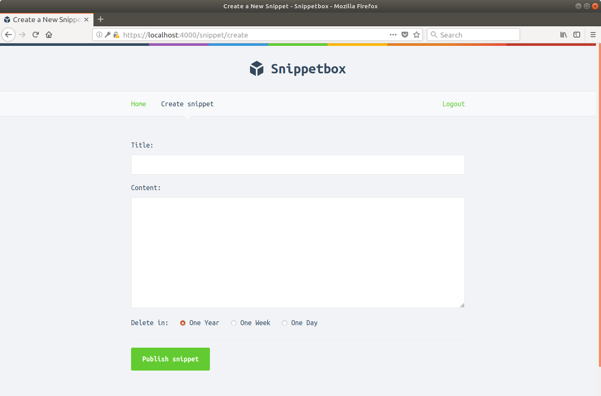

# 介绍

在本书中，我们将构建一个名为 Snippetbox 的 Web 应用程序，它允许人们粘贴和共享文本片段 — 有点像[Pastebin](https://pastebin.com/)或 GitHub 的[Gists](https://gist.github.com/)。构建结束时，它看起来有点像这样：



我们的应用程序一开始非常简单，只有一个网页。然后，我们将在每一章中逐步构建它，直到用户可以通过应用程序保存和查看代码片段。这将带我们了解诸如如何构建项目、路由请求、使用数据库、处理表单和安全地显示动态数据等主题。

稍后，我们将在本书中添加用户帐户，并限制应用程序，以便只有注册用户才能创建代码片段。这将带我们了解更高级的主题，例如配置 HTTPS 服务器、会话管理、用户身份验证和中间件。

## 公约

本书中的代码块以银色背景显示，如下例所示。如果代码块特别长，任何不相关的部分都可以用省略号代替。为了便于理解，大多数代码块顶部还有一个标题栏，指示代码所在文件的名称。如下所示：

文件：hello.go

```go
package main

...  // 表示省略了一些现有代码。

func sayHello() {
    fmt.Println("Hello world!")
}
```

终端（命令行）指令以黑色背景显示，并以美元符号开头。这些命令应该适用于任何基于 Unix 的操作系统，包括 Mac OSX 和 Linux。示例输出以银色显示在命令下方，如下所示：

```sh
$ echo "Hello world!"
Hello world
```

如果你使用的是 Windows，则应该用 DOS 等效命令替换该命令或通过普通 Windows GUI 执行操作。

请注意，屏幕截图中显示的日期和时间戳以及命令的示例输出仅供参考。它们不一定彼此对齐，也不一定按书中的时间顺序排列。

本书中的某些章节以*附加信息*部分结尾。这些部分包含与我们的应用程序构建无关的信息，但仍然很重要（或者有时只是有趣）。如果你是 Go 的新手，你可能希望跳过这些部分并稍后再回过头来阅读。

> **提示：**如果你正在按照应用程序构建步骤操作，我建议使用本书的 HTML 版本，而不是 PDF 或 EPUB。HTML 版本适用于所有浏览器，如果你想直接从书中复制粘贴代码，代码块的正确格式将保留。
>
> 使用 HTML 版本时，你还可以使用键盘上的左右箭头键在章节之间导航。

## 关于作者

嗨，我是 Alex Edwards，一名全栈 Web 开发人员和作家。我住在奥地利因斯布鲁克附近。

我使用 Go 已有 10 多年，为自己和商业客户构建生产应用程序，并帮助世界各地的人们提高他们的 Go 技能。

[你可以在我的博客](https://www.alexedwards.net/blog)（我发布详细教程的地方）上看到更多我的文章，在[GitHub](https://github.com/alexedwards/)上看到我的一些开源作品，也可以在[Instagram](https://www.instagram.com/ajmedwards/)和[Twitter](https://twitter.com/ajmedwards)上关注我。

## 版权和免责声明

*让我们开始吧：学习使用 Go 构建专业的 Web 应用程序*。版权所有 © 2024 Alex Edwards。

最后更新于 2024-08-18 10:55:12 UTC。版本 2.23.0。

[Go gopher 由Renee French](http://reneefrench.blogspot.com/)设计，并根据 Creative Commons 3.0 Attributions 许可证使用。封面 gopher 改编自[Egon Elbre](https://github.com/egonelbre/gophers)的矢量图。

*本书中提供的信息仅供一般参考。尽管作者和出版商已尽一切努力确保本书中信息的准确性（在出版时），但对于本书中包含的信息、产品、服务或相关图形的完整性、准确性、可靠性、适用性或可用性，不作任何明示或暗示的陈述或保证。使用本信息的风险由你自行承担。*

<[以前的](00.01-contents.html)
