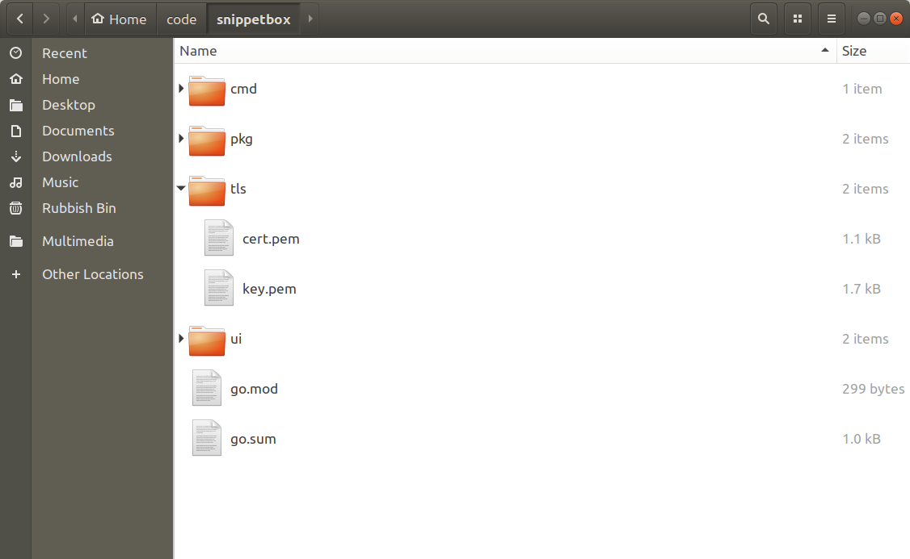
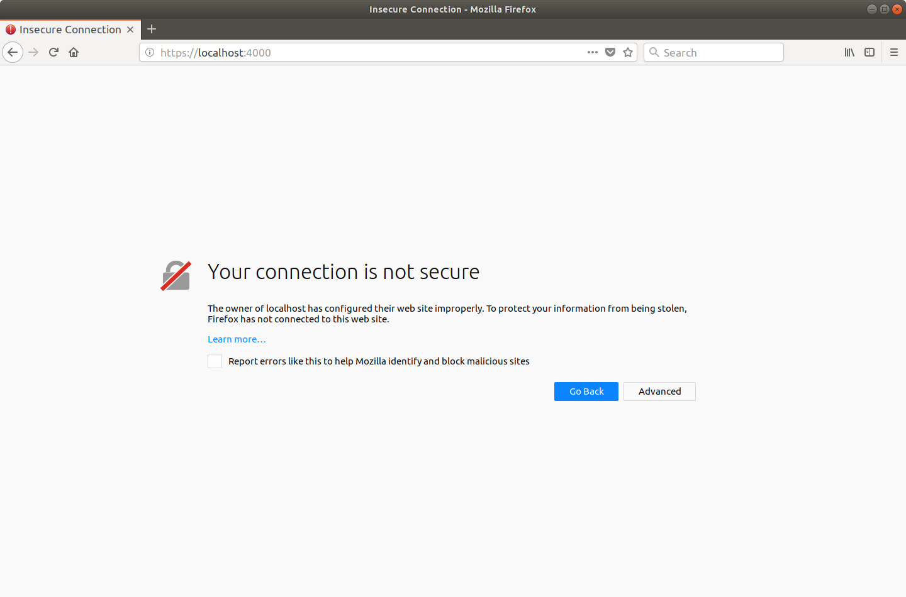
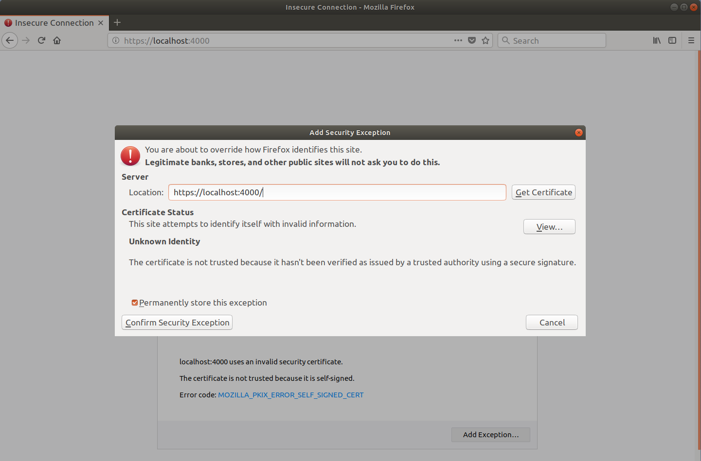
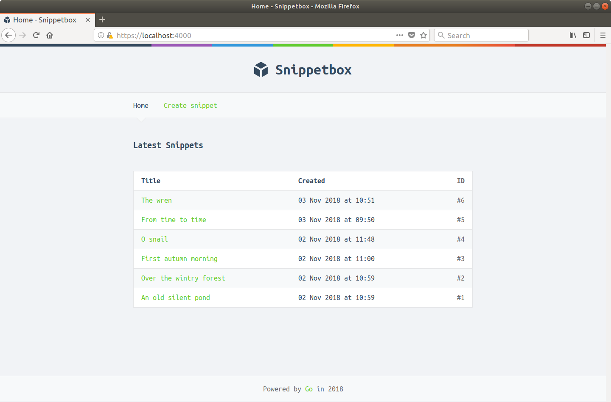
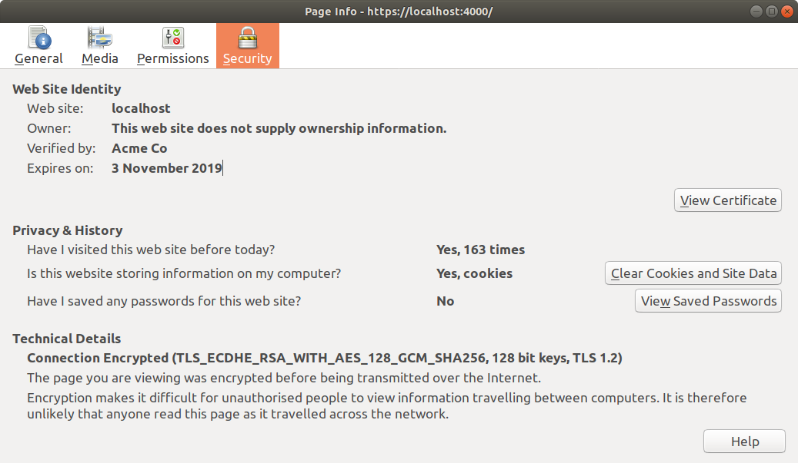
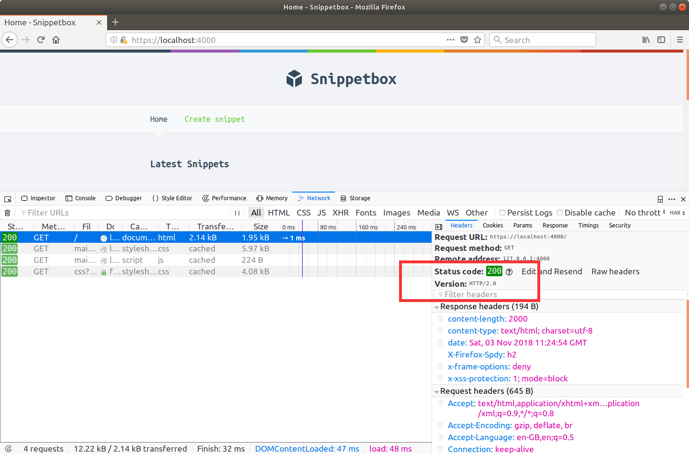

# 安全改进

在本书的这一部分中，我们将对我们的应用程序进行一些改进，以便我们的数据在传输过程中保持安全，并且我们的服务器能够更好地处理一些常见类型的拒绝服务攻击。

你会学到：

- 如何仅使用 Go 快速轻松地创建自签名 TLS 证书。
- 设置应用程序以便所有请求和响应都通过 HTTPS 安全地提供服务的基础知识。
- 对默认 TLS 设置进行了一些合理的调整，以帮助确保用户信息安全和我们的服务器快速运行。
- 如何在我们的服务器上设置连接超时以减轻 Slowloris 和其他慢速客户端攻击。

## 生成自签名 TLS 证书

HTTPS 本质上是通过 TLS（传输层安全）连接发送的 HTTP。因为它是通过 TLS 连接发送的，所以数据经过加密和签名，这有助于确保其在传输过程中的隐私和完整性。

如果你不熟悉这个术语，TLS 本质上是 SSL（安全套接字层）的现代版本。由于安全问题，SSL 现在已被正式弃用，但该名称仍然存在于公众意识中，并且经常与 TLS 互操作。为了清晰和准确，我们将在整本书中坚持使用 TLS 一词。

在我们的服务器开始使用 HTTPS 之前，我们需要生成一个 TLS 证书。

对于生产服务器，我建议使用 Let’s Encrypt 来创建你的 TLS 证书，但出于开发目的，最简单的做法是生成你自己的自签名证书。

自签名证书与普通 TLS 证书相同，不同之处在于它不是由受信任的证书颁发机构以加密方式签名的。这意味着你的 Web 浏览器将在第一次使用时发出警告，但它仍会正确加密 HTTPS 流量，并且适用于开发和测试目的。

方便的是，Go 标准库中的 crypto/tls 包包含一个 generate_cert.go 工具，我们可以使用它轻松创建我们自己的自签名证书。

如果你按照以下步骤操作，请首先在项目存储库的根目录中创建一个新的 tls 目录以保存证书并更改为：

```sh
$ cd $HOME/code/snippetbox
$ mkdir tls
$ cd tls
```

要运行 generate_cert.go 工具，你需要知道 Go 标准库源代码在计算机上的安装位置。如果你使用的是 Linux、macOS 或 FreeBSD 并遵循官方安装说明，那么 generate_cert.go 文件应位于 /usr/local/go/src/crypto/tls 下。

如果你使用 macOS 并使用 Homebrew 安装 Go，则该文件可能位于 /usr/local/Cellar/go/\<version>/libexec/src/crypto/tls/generate_cert.go 或类似路径。

一旦你知道它的位置，你就可以像这样运行 generate_cert.go 工具：

```sh
$ go run /usr/local/go/src/crypto/tls/generate_cert.go --rsa-bits=2048 --host=localhost
2018/10/16 11:50:14 wrote cert.pem
2018/10/16 11:50:14 wrote key.pem
```

后台 generate_cert.go 工具分两个阶段工作：

1. 首先它生成一个 2048 位的 RSA 密钥对，这是一个加密安全的公钥和私钥。
2. 然后它将私钥存储在 key.pem 文件中，并为包含公钥的主机 localhost 生成自签名 TLS 证书 - 它存储在 cert.pem 文件中。私钥和证书都是 PEM 编码的，这是大多数 TLS 实现使用的标准格式。

你的项目存储库现在应如下所示：




就是这样！我们现在有了一个可以在开发过程中使用的自签名 TLS 证书（和相应的私钥）。

## 运行 HTTPS 服务器

现在我们有了一个自签名的 TLS 证书和相应的私钥，启动一个 HTTPS Web 服务器既可爱又简单——我们只需要打开 main.go 文件并将 srv.ListenAndServe() 方法替换为 srv.ListenAndServeTLS() 。

更改你的 main.go 文件以匹配以下代码：

文件：cmd/web/main.go

```go
package main

...

func main() {
    dsn := flag.String("dsn", "web:pass@/snippetbox?parseTime=true", "MySQL data source name")
    addr := flag.String("addr", ":4000", "HTTP network address")
    secret := flag.String("secret", "s6Ndh+pPbnzHbS*+9Pk8qGWhTzbpa@ge", "Secret key")
    flag.Parse()

    infoLog := log.New(os.Stdout, "INFO\t", log.Ldate|log.Ltime)
    errorLog := log.New(os.Stderr, "ERROR\t", log.Ldate|log.Ltime|log.Lshortfile)

    db, err := openDB(*dsn)
    if err != nil {
        errorLog.Fatal(err)
    }
    defer db.Close()

    templateCache, err := newTemplateCache("./ui/html/")
    if err != nil {
        errorLog.Fatal(err)
    }

    session := sessions.New([]byte(*secret))
    session.Lifetime = 12 * time.Hour
    session.Secure = true // Set the Secure flag on our session cookies

    app := &application{
        errorLog:      errorLog,
        infoLog:       infoLog,
        session:       session,
        snippets:      &mysql.SnippetModel{DB: db},
        templateCache: templateCache,
    }

    srv := &http.Server{
        Addr:     *addr,
        ErrorLog: errorLog,
        Handler:  app.routes(),
    }

    infoLog.Printf("Starting server on %s", *addr)
    // Use the ListenAndServeTLS() method to start the HTTPS server. We
    // pass in the paths to the TLS certificate and corresponding private key as
    // the two parameters.
    err = srv.ListenAndServeTLS("./tls/cert.pem", "./tls/key.pem")
    errorLog.Fatal(err)
}

...
```

当我们运行它时，我们的服务器仍将侦听端口 4000 — 唯一的区别是它现在将使用 HTTPS 而不是 HTTP。

继续并正常运行它：

```sh
$ cd $HOME/code/snippetbox
$ go run ./cmd/web
INFO    2018/10/16 12:14:28 Starting server on :4000
```

如果你打开 Web 浏览器并访问 https://localhost:4000/，你可能会收到类似于以下屏幕截图的浏览器警告。



如果你像我一样使用 Firefox，请单击“高级”，然后单击“添加例外”，然后在出现的对话框中单击“确认安全例外”。



如果你使用的是 Chrome 或 Chromium，请单击“高级”，然后单击“继续到本地主机”链接。

之后应该会出现应用程序主页（尽管它仍然会在 URL 栏中带有警告，因为 TLS 证书是自签名的）。

在 Firefox 中，它应该看起来像这样：



如果你使用 Firefox，我建议你按 Ctrl+i 检查主页的页面信息：



此处的“技术详细信息”部分确认我们的连接已加密并按预期工作。

就我而言，我可以看到正在使用 TLS 1.2 版，我的 HTTPS 连接的密码套件是 TLS_ECDHE_RSA_WITH_AES_128_GCM_SHA256。我们将在下一章中更多地讨论密码套件。

> 旁白：如果你想知道“Acme Co”是谁或什么，它只是 generate_cert.go 工具使用的硬编码占位符名称。

### 附加信息

#### HTTP 请求

需要注意的是，我们的 HTTPS 服务器仅支持 HTTPS。如果你尝试向它发出常规 HTTP 请求，它将不起作用。但究竟会发生什么取决于你运行的 Go 版本。

在 Go 1.12 及更新版本中，服务器将向用户发送 400 Bad Request 状态和消息“客户端向 HTTPS 服务器发送了 HTTP 请求”。不会记录任何内容。

在旧版本的 Go 中，服务器会将字节 15 03 01 00 02 02 0A 写入底层 TCP 连接，这本质上是 TLS 表示“我不明白”，你还会看到相应的日志消息在你的终端中与此类似：

```sh
ERROR    2018/10/16 12:36:53 server.go:2977: http: TLS handshake error from [::1]:49544: tls: first record does not look like a TLS handshake
```


#### HTTP/2 连接

使用 HTTPS 的一大优点是——如果客户端支持 HTTP/2 连接——Go 的 HTTPS 服务器将自动升级连接以使用 HTTP/2。

这很好，因为这意味着最终我们的页面将为用户加载得更快。如果你不熟悉 HTTP/2，你可以在 Brad Fitzpatrick 的 GoSF meetup 演讲中简要了解基础知识以及如何在幕后实施。

如果你使用的是最新版本的 Firefox，你应该能够看到这一点。按 Ctrl+Shift+E 打开开发者工具，如果你查看主页的标题，你应该会看到正在使用的协议是 HTTP/2。



#### 证书权限

请务必注意，你用来运行 Go 应用程序的用户必须对 cert.pem 和 key.pem 文件具有读取权限，否则 ListenAndServeTLS() 将返回权限被拒绝错误。

默认情况下， generate_cert.go 工具向所有用户授予 cert.pem 文件的读取权限，但仅向 key.pem 文件的所有者授予读取权限。在我的情况下，权限如下所示：

```sh
$ cd $HOME/code/snippetbox/tls
$ ls -l
total 8
-rw-r--r-- 1 alex alex 1090 Oct 16 11:50 cert.pem
-rw------- 1 alex alex 1679 Oct 16 11:50 key.pem
```

通常，最好将你的私钥的权限保持在尽可能严格的范围内，并只允许所有者或特定组读取它们。

#### 源代码管理

如果你使用的是版本控制系统（如 Git 或 Mercurial），你可能需要添加忽略规则，以便 tls 目录的内容不会被意外提交。以 Git 为例：

```sh
$ cd $HOME/code/snippetbox
$ echo 'tls/' >> .gitignore
```

## 配置 HTTPS 设置

Go 为其 HTTPS 服务器提供了非常好的默认设置，但我们可以进行一些改进和优化。

如果你不熟悉 HTTPS 和 TLS，那么我建议你在开始更改默认设置之前花一些时间了解 TLS 背后的原理。为了提供帮助，我在附录中包含了 TLS 工作原理的高级摘要，我建议你在继续之前阅读该附录。

但是，除了这个警告之外，有一些调整几乎总是一个好主意。

要更改默认的 TLS 设置，我们需要做两件事：

- 首先，我们需要创建一个 tls.Config 结构，其中包含我们要使用的非默认 TLS 设置。
- 其次，我们需要在启动服务器之前将它添加到我们的 http.Server 结构中。

我将演示：

文件：cmd/web/main.go

```go
package main

import (
    "crypto/tls" // New import
    "database/sql"
    "flag"
    "html/template"
    "log"
    "net/http"
    "os"
    "time"

    "alexedwards.net/snippetbox/pkg/models/mysql"

    _ "github.com/go-sql-driver/mysql"
    "github.com/golangcollege/sessions"
)

...

func main() {
    ...

    app := &application{
        errorLog:      errorLog,
        infoLog:       infoLog,
        session:       session,
        snippets:      &mysql.SnippetModel{DB: db},
        templateCache: templateCache,
    }

    // Initialize a tls.Config struct to hold the non-default TLS settings we want
    // the server to use.
    tlsConfig := &tls.Config{
        PreferServerCipherSuites: true,
        CurvePreferences:         []tls.CurveID{tls.X25519, tls.CurveP256},
    }

    // Set the server's TLSConfig field to use the tlsConfig variable we just
    // created.
    srv := &http.Server{
        Addr:     *addr,
        ErrorLog: errorLog,
        Handler:  app.routes(),
        TLSConfig: tlsConfig,
    }

    infoLog.Printf("Starting server on %s", *addr)
    err = srv.ListenAndServeTLS("./tls/cert.pem", "./tls/key.pem")
    errorLog.Fatal(err)
}

...
```

在 tls.Config 结构中，我们使用了两个设置：

- tls.Config.PreferServerCipherSuites 字段控制 HTTPS 连接应该使用 Go 喜欢的密码套件还是用户喜欢的密码套件。通过将其设置为 true - 就像我们上面所做的那样 - 优先考虑 Go 喜欢的密码套件，我们帮助增加使用也支持前向保密的强密码套件的可能性。
- tls.Config.CurvePreferences 字段让我们指定在 TLS 握手期间应优先考虑哪些椭圆曲线。 Go 支持一些椭圆曲线，但从 Go 1.11 开始，只有 tls.CurveP256 和 tls.X25519 具有程序集实现。其他的都是 CPU 密集型的，因此省略它们有助于确保我们的服务器在重负载下保持高性能。

### 附加信息

#### 限制密码套件

Go 支持的所有密码套件都在 crypto/tls 包常量中定义。

对于某些应用程序，可能需要将 HTTPS 服务器限制为仅支持其中一些密码套件。例如，你可能只想支持使用 ECDHE（前向保密）的密码套件，而不支持使用 RC4、3DES 或 CBC 的弱密码套件。你可以通过 tls.Config.CipherSuites 字段执行此操作，如下所示：

```go
tlsConfig := &tls.Config{
    PreferServerCipherSuites: true,
    CipherSuites: []uint16{
        tls.TLS_ECDHE_ECDSA_WITH_AES_256_GCM_SHA384,
        tls.TLS_ECDHE_RSA_WITH_AES_256_GCM_SHA384,
        tls.TLS_ECDHE_ECDSA_WITH_CHACHA20_POLY1305,
        tls.TLS_ECDHE_RSA_WITH_CHACHA20_POLY1305,
        tls.TLS_ECDHE_ECDSA_WITH_AES_128_GCM_SHA256,
        tls.TLS_ECDHE_RSA_WITH_AES_128_GCM_SHA256,
    },
}
```

> 重要提示：将支持的密码套件限制为仅包含强大的现代密码可能意味着使用某些较旧浏览器的用户将无法使用你的网站。在安全性和向后兼容性之间需要取得平衡，你的正确决定将取决于你的用户群通常使用的技术。 Mozilla 为现代、中级和旧浏览器推荐的配置可能会帮助你在此处做出决定。

如果你也将 PreferServerCipherSuites 设置为 true，就像我们在上面的代码中所做的那样，那么 CipherSuites 字段中元素的顺序很重要——首先出现在切片中的密码套件将是首选。

#### TLS 版本

TLS 版本也在 crypto/tls 包中定义为常量，Go 的 HTTPS 服务器支持 TLS 版本 1.0 到 1.3。

你可以通过 tls.Config.MinVersion 和 MaxVersion 字段配置最小和最大 TLS 版本。例如，如果你知道用户群中的所有计算机都支持 TLS 1.2，但不支持 TLS 1.3，那么你可能希望使用如下配置：

```go
tlsConfig := &tls.Config{
    MinVersion: tls.VersionTLS12,
    MaxVersion: tls.VersionTLS12,
}
```

#### TLS 1.3

重要（且有趣）的是，如果协商了 TLS 1.3 连接，则 tls.Config 中的任何 CipherSuites 字段都将被忽略。这样做的原因是 Go 支持的所有 TLS 1.3 连接的密码套件都被认为是安全的，因此提供一种配置它们的机制没有多大意义。相反，密码选择将基于客户端的优先级，或者如果 PreferServerCipherSuites 设置为 true，则密码选择将根据最适合你的服务器硬件的内容进行优先级排序。

## 连接超时

让我们花点时间通过添加一些超时设置来提高我们服务器的弹性，如下所示：

文件：cmd/web/main.go

```go
```


所有这三个超时——IdleTimeout、ReadTimeout 和 WriteTimeout——都是服务器范围的设置，它们作用于底层连接并适用于所有请求，而不管它们的处理程序或 URL。

### 空闲超时

默认情况下，Go 在所有接受的连接上启用 keep-alive。这有助于减少延迟（特别是对于 HTTPS 连接），因为客户端可以为多个请求重用相同的连接而无需重复握手。

同样默认情况下，Go 将在 3 分钟不活动后自动关闭保持活动的连接。这有助于清除用户意外消失的连接（例如，由于客户端断电）。

没有办法将这个截止时间增加到 3 分钟以上（除非你自己设置 net.Listener），但你可以通过 IdleTimeout 设置减少它。在我们的例子中，我们将它设置为 1 分钟，这意味着所有保持活动的连接将在 1 分钟不活动后自动关闭。

### 读取超时

在我们的代码中，我们还将 ReadTimeout 设置为 5 秒。这意味着如果请求Header或正文在第一次接受请求后 5 秒仍在读取，那么 Go 将关闭底层连接。因为这是对连接的“硬”关闭，所以用户不会收到任何 HTTP(S) 响应。

设置较短的 ReadTimeout 时间段有助于降低慢速客户端攻击（例如 Slowloris）的风险，否则这些攻击可能会通过发送部分、不完整的 HTTP(S) 请求来无限期地保持连接打开。

重要提示：如果你设置了 ReadTimeout 但未设置 IdleTimeout，则 IdleTimeout 将默认使用与 ReadTimeout 相同的设置。例如，如果你将 ReadTimeout 设置为 3 秒，则会产生副作用，即所有保持活动的连接也将在 3 秒不活动后关闭。通常，我的建议是避免任何歧义，并始终为你的服务器设置明确的 IdleTimeout 值。

### 写超时

如果我们的服务器在给定时间段（在我们的代码中为 10 秒）后尝试写入连接，则 WriteTimeout 设置将关闭底层连接。但是，这取决于所使用的协议而略有不同。

对于 HTTP 连接，如果在读取请求Header后超过 10 秒有数据写入连接，Go 将关闭底层连接而不是写入数据。

对于 HTTPS 连接，如果在第一次接受请求后超过 10 秒有一些数据写入连接，Go 将关闭底层连接而不是写入数据。这意味着如果你使用 HTTPS（就像我们一样），将 WriteTimeout 设置为大于 ReadTimeout 的值是明智的。

重要的是要记住，处理程序所做的写入会在处理程序返回时被缓冲并作为一个写入连接。所以WriteTimeout的思路一般不是防止handlers长时间运行，而是防止handlers返回的数据写入时间过长。

### 附加信息

#### 读取Header超时

http.Server 对象还提供了一个 ReadHeaderTimeout 设置，我们还没有在我们的应用程序中使用它。这与 ReadTimeout 的工作方式类似，不同之处在于它仅适用于 HTTP(S) 标Header的读取。因此，如果你将 ReadHeaderTimeout 设置为 3 秒，如果在接受请求 3 秒后仍在读取请求标Header，则连接将关闭。但是，在 3 秒后仍然可以读取请求正文，而不会关闭连接。

如果你想对读取请求标Header应用服务器范围的限制，但希望在读取请求正文时在不同的路由上实现不同的超时（可能使用 http.TimeoutHandler() 中间件），这可能很有用。

对于我们的 Snippetbox Web 应用程序，我们没有任何保证每个路由读取超时的操作——读取所有路由的请求标Header和正文应该在 5 秒内轻松完成，因此我们将坚持使用 ReadTimeout。

警告：ReadHeaderTimeout 设置也会影响 IdleTimeout 行为。具体来说，如果你设置了 ReadHeaderTimeout 但没有设置 ReadTimeout 并且没有设置 IdleTimeout，那么 IdleTimeout 将默认使用与 ReadHeaderTimeout 相同的设置。同样，养成设置显式 IdleTimeout 的习惯是最安全的（也是最清晰的）。

#### 最大Header字节数

http.Server 对象还提供了一个 MaxHeaderBytes 字段，你可以使用它来控制服务器在解析请求标Header时将读取的最大字节数。默认情况下，Go 允许的最大标Header长度为 1MB。

例如，如果你想将最大标Header长度限制为 0.5MB，你可以这样写：

```go
srv := &http.Server{
    Addr:           *addr,
    MaxHeaderBytes: 524288,
    ...
}
```

如果超过 MaxHeaderBytes，则用户将自动收到 431 Request Header Fields Too Large 响应。

这里有一个问题需要指出：Go 总是为你设置的数字增加 4096 字节的额外空间。 如果你需要 MaxHeaderBytes 是一个精确的或非常低的数字，则需要将其考虑在内。
