# 用户认证

在本书的这一部分中，我们将向我们的应用程序添加一些用户身份验证功能，以便只有已注册的登录用户才能创建新代码段。未登录的用户仍然可以查看片段，也可以注册一个帐户。

对于我们的应用程序，该过程将如下工作：

- 用户将通过访问 /user/signup 上的表格并输入他们的姓名、电子邮件地址和密码进行注册。我们将把这些信息存储在一个新的用户数据库表中（我们稍后会创建）。
- 用户将通过访问 /user/login 中的表单并输入他们的电子邮件地址和密码来登录。
- 然后我们检查数据库以查看他们输入的电子邮件和密码是否与用户表中的用户之一匹配。如果匹配，则用户已成功通过身份验证，我们使用密钥“authenticatedUserID”将用户的相关 id 值添加到他们的会话数据中。
- 当我们收到任何后续请求时，我们可以检查用户的会话数据中的“authenticatedUserID”值。如果存在，我们就知道用户已经成功登录。我们可以继续检查这个直到会话过期，当用户需要再次登录时。如果会话中没有“authenticatedUserID”，我们就知道用户没有登录。

在很多方面，本节中的很多内容只是以不同的方式将我们已经学到的东西放在一起。因此，这是对你理解的很好的试金石，并提醒你一些关键概念。

你会学到：

- 如何为用户实现基本的注册、登录和注销功能。
- 一种使用 Bcrypt 在数据库中加密和安全存储用户密码的安全方法。
- 使用中间件和会话验证用户是否已登录的可靠而直接的方法。
- 如何防止跨站请求伪造 (CSRF) 攻击。

## 路由设置

让我们通过向我们的应用程序添加五个新路由来开始本节，使其看起来像这样：

| Method | Pattern         | Handler           | Action             |
| ------ | --------------- | ----------------- | ------------------ |
| GET    | /               | home              | 显示主页           |
| GET    | /snippet/:id    | showSnippet       | 显示特定代码段     |
| GET    | /snippet/create | createSnippetForm | 显示新的代码段表单 |
| POST   | /snippet/create | createSnippet     | 创建一个新代码段   |
| GET    | /user/signup    | signupUserForm    | 显示用户注册表单   |
| POST   | /user/signup    | signupUser        | 创建一个新用户     |
| GET    | /user/login     | loginUserForm     | 显示用户登录表单   |
| POST   | /user/login     | loginUser         | 验证并登录用户     |
| POST   | /user/logout    | logoutUser        | 注销用户           |
| GET    | /static/        | http.FileServer   | 提供特定的静态文件 |

请注意新的状态更改操作——signupUser、loginUser 和 logoutUser——都是如何使用 POST 请求而不是 GET 的？

打开你的 handlers.go 文件并为五个新的处理程序函数添加占位符，如下所示：

文件：cmd/web/handlers.go

```go
package main

...

func (app *application) signupUserForm(w http.ResponseWriter, r *http.Request) {
    fmt.Fprintln(w, "Display the user signup form...")
}

func (app *application) signupUser(w http.ResponseWriter, r *http.Request) {
    fmt.Fprintln(w, "Create a new user...")
}

func (app *application) loginUserForm(w http.ResponseWriter, r *http.Request) {
    fmt.Fprintln(w, "Display the user login form...")
}

func (app *application) loginUser(w http.ResponseWriter, r *http.Request) {
    fmt.Fprintln(w, "Authenticate and login the user...")
}

func (app *application) logoutUser(w http.ResponseWriter, r *http.Request) {
    fmt.Fprintln(w, "Logout the user...")
}
```

完成后，让我们在 routes.go 文件中创建相应的路由：

文件：cmd/web/routes.go

```go
package main

...

func (app *application) routes() http.Handler {
    standardMiddleware := alice.New(app.recoverPanic, app.logRequest, secureHeaders)
    dynamicMiddleware := alice.New(app.session.Enable)

    mux := pat.New()
    mux.Get("/", dynamicMiddleware.ThenFunc(app.home))
    mux.Get("/snippet/create", dynamicMiddleware.ThenFunc(app.createSnippetForm))
    mux.Post("/snippet/create", dynamicMiddleware.ThenFunc(app.createSnippet))
    mux.Get("/snippet/:id", dynamicMiddleware.ThenFunc(app.showSnippet))

    // Add the five new routes.
    mux.Get("/user/signup", dynamicMiddleware.ThenFunc(app.signupUserForm))
    mux.Post("/user/signup", dynamicMiddleware.ThenFunc(app.signupUser))
    mux.Get("/user/login", dynamicMiddleware.ThenFunc(app.loginUserForm))
    mux.Post("/user/login", dynamicMiddleware.ThenFunc(app.loginUser))
    mux.Post("/user/logout", dynamicMiddleware.ThenFunc(app.logoutUser))

    fileServer := http.FileServer(http.Dir("./ui/static/"))
    mux.Get("/static/", http.StripPrefix("/static", fileServer))

    return standardMiddleware.Then(mux)
}
```

最后，我们还需要更新 base.layout.tmpl 文件以添加新页面的导航项：

文件：ui/html/base.layout.tmpl

```html
{{define "base"}}
<!doctype html>
<html lang='en'>
    <head>
        <meta charset='utf-8'>
        <title>{{template "title" .}} - Snippetbox</title>
        <link rel='stylesheet' href='/static/css/main.css'>
        <link rel='shortcut icon' href='/static/img/favicon.ico' type='image/x-icon'>
        <link rel='stylesheet' href='https://fonts.googleapis.com/css?family=Ubuntu+Mono:400,700'>
    </head>
    <body>
        <header>
            <h1><a href='/'>Snippetbox</a></h1>
        </header>
        <nav>
            <!-- Update the navigation to include signup, login and logout links -->
            <div>
                <a href='/'>Home</a>
                <a href='/snippet/create'>Create snippet</a>
            </div>
            <div>
                <a href='/user/signup'>Signup</a>
                <a href='/user/login'>Login</a>
                <form action='/user/logout' method='POST'>
                    <button>Logout</button>
                </form>
            </div>
        </nav>
        <main>
            {{with .Flash}}
            <div class='flash '>{{.}}</div>
            {{end}}
            {{template "main" .}}
        </main>
        {{template "footer" .}}
        <script src="/static/js/main.js" type="text/javascript"></script>
    </body>
</html>
{{end}}
```


如果你愿意，此时可以运行该应用程序，你应该会在导航栏中看到如下所示的新项目：

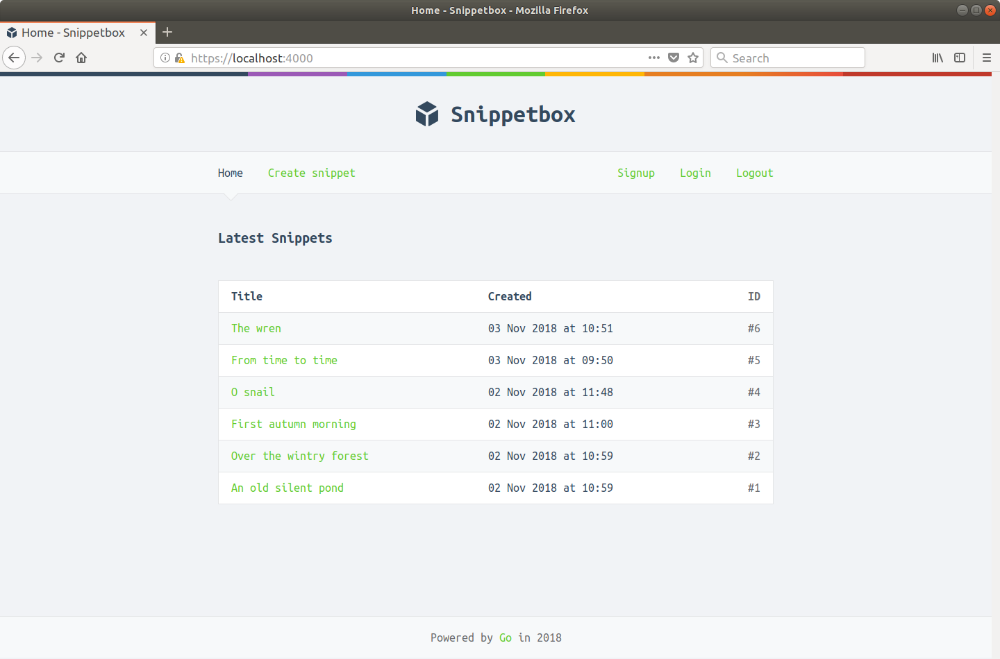

如果你单击新链接，它们应以相关占位符纯文本响应进行响应。 例如，如果你单击“注册”链接，你应该会看到类似于以下内容的响应：


## 创建用户模型

现在路由已经建立，我们需要创建一个新的用户数据库表和一个数据库模型来访问它。

首先以 root 用户身份从终端窗口连接到 MySQL，然后执行以下 SQL 语句来设置用户表：

```sql
USE snippetbox;

CREATE TABLE users (
    id INTEGER NOT NULL PRIMARY KEY AUTO_INCREMENT,
    name VARCHAR(255) NOT NULL,
    email VARCHAR(255) NOT NULL,
    hashed_password CHAR(60) NOT NULL,
    created DATETIME NOT NULL,
    active BOOLEAN NOT NULL DEFAULT TRUE
);

ALTER TABLE users ADD CONSTRAINT users_uc_email UNIQUE (email);
```

关于这张表，有几点值得指出：

- id 字段是一个自动递增的整数字段和表的主键。这意味着用户 ID 值保证是唯一的正整数（1、2、3……等）。
- 我已将 hashed_password 字段的类型设置为 CHAR(60)。这是因为我们将在数据库中存储用户密码的散列值——而不是密码本身——并且散列版本的长度总是正好是 60 个字符。
- 我还在 email 列上添加了一个 UNIQUE 约束并将其命名为 users_uc_email。此约束确保我们最终不会有两个具有相同电子邮件地址的用户。如果我们尝试在此表中插入一条重复电子邮件的记录，MySQL 将抛出 ERROR 1062: ER_DUP_ENTRY 错误。
- 还有一个活动列，我们将使用它来包含用户帐户的状态。当此值为 TRUE 时，用户将能够正常登录并使用该应用程序。当这是 FALSE 时，用户将被视为已停用，他们将无法登录。

### 在 Go 中构建模型

接下来让我们设置一个模型，以便我们可以轻松地处理新的用户表。我们将遵循我们在本书前面使用的相同模式来建模对代码段表的访问，所以希望这应该让人感到熟悉和直接。

首先，打开你之前创建的 pkg/models/model.go 文件并添加一个新的 User 结构来保存每个用户的数据，以及一些新的错误类型：

文件：pkg/models/models.go

```go
package models

import (
    "errors"
    "time"
)
var (
    ErrNoRecord = errors.New("models: no matching record found")
    // Add a new ErrInvalidCredentials error. We'll use this later if a user
    // tries to login with an incorrect email address or password.
    ErrInvalidCredentials = errors.New("models: invalid credentials")
    // Add a new ErrDuplicateEmail error. We'll use this later if a user
    // tries to signup with an email address that's already in use.
    ErrDuplicateEmail = errors.New("models: duplicate email")
)

type Snippet struct {
    ID      int
    Title   string
    Content string
    Created time.Time
    Expires time.Time
}

// Define a new User type. Notice how the field names and types align
// with the columns in the database `users` table?
type User struct {
    ID             int
    Name           string
    Email          string
    HashedPassword []byte
    Created        time.Time
    Active         bool
}
```

现在类型已经设置好了，我们需要制作实际的数据库模型。在 pkg/models/mysql/users.go 中创建一个新文件...

```sh
$ cd $HOME/code/snippetbox
$ touch pkg/models/mysql/users.go
```

…然后使用一些占位符函数创建一个新的 UserModel 类型，如下所示：

文件：pkg/models/mysql/users.go

```go
package mysql

import (
    "database/sql"

    "alexedwards.net/snippetbox/pkg/models"
)

type UserModel struct {
    DB *sql.DB
}

// We'll use the Insert method to add a new record to the users table.
func (m *UserModel) Insert(name, email, password string) error {
    return nil
}

// We'll use the Authenticate method to verify whether a user exists with
// the provided email address and password. This will return the relevant
// user ID if they do.
func (m *UserModel) Authenticate(email, password string) (int, error) {
    return 0, nil
}

// We'll use the Get method to fetch details for a specific user based
// on their user ID.
func (m *UserModel) Get(id int) (*models.User, error) {
    return nil, nil
}
```

最后一个阶段是向我们的应用程序结构添加一个新字段，以便我们可以将此模型提供给我们的处理程序。更新 main.go 文件如下：

文件：cmd/web/main.go

```go
package main

...

// Add a new users field to the application struct.
type application struct {
    errorLog      *log.Logger
    infoLog       *log.Logger
    session       *sessions.Session
    snippets      *mysql.SnippetModel
    templateCache map[string]*template.Template
    users         *mysql.UserModel
}

func main() {
    ...

    session := sessions.New([]byte(*secret))
    session.Lifetime = 12 * time.Hour
    session.Secure = true

    // Initialize a mysql.UserModel instance and add it to the application
    // dependencies.
    app := &application{
        errorLog:      errorLog,
        infoLog:       infoLog,
        session:       session,
        snippets:      &mysql.SnippetModel{DB: db},
        templateCache: templateCache,
        users:         &mysql.UserModel{DB: db},
    }

    tlsConfig := &tls.Config{
        PreferServerCipherSuites: true,
        CurvePreferences:         []tls.CurveID{tls.X25519, tls.CurveP256},
    }

    srv := &http.Server{
        Addr:         *addr,
        ErrorLog:     errorLog,
        Handler:      app.routes(),
        TLSConfig:    tlsConfig,
        IdleTimeout:  time.Minute,
        ReadTimeout:  5 * time.Second,
        WriteTimeout: 10 * time.Second,
    }

    infoLog.Printf("Starting server on %s", *addr)
    err = srv.ListenAndServeTLS("./tls/cert.pem", "./tls/key.pem")
    errorLog.Fatal(err)
}

...
```

确保所有文件都已保存，然后继续尝试运行该应用程序。在这个阶段，你应该会发现它可以正确编译，没有任何问题。

## 用户注册和密码加密

在我们可以让任何用户登录到我们的 Snippetbox 应用程序之前，我们首先需要一种让他们注册帐户的方法。我们将在本章中介绍如何做到这一点。

继续创建一个包含以下标记的新 ui/html/signup.page.tmpl 文件。

```sh
$ cd $HOME/code/snippetbox
$ touch ui/html/signup.page.tmpl
```

文件：ui/html/signup.page.tmpl

```html
{{template "base" .}}

{{define "title"}}Signup{{end}}

{{define "main"}}
<form action='/user/signup' method='POST' novalidate>
    {{with .Form}}
        <div>
            <label>Name:</label>
            {{with .Errors.Get "name"}}
                <label class='error'>{{.}}</label>
            {{end}}
            <input type='text' name='name' value='{{.Get "name"}}'>
        </div>
        <div>
            <label>Email:</label>
            {{with .Errors.Get "email"}}
                <label class='error'>{{.}}</label>
            {{end}}
            <input type='email' name='email' value='{{.Get "email"}}'>
        </div>
        <div>
            <label>Password:</label>
            {{with .Errors.Get "password"}}
                <label class='error'>{{.}}</label>
            {{end}}
            <input type='password' name='password'>
        </div>
        <div>
            <input type='submit' value='Signup'>
        </div>
    {{end}}
</form>
{{end}}
```

希望到目前为止，这应该感觉很熟悉。对于注册表单，我们使用与本书前面使用的完全相同的表单结构，具有三个字段：姓名、电子邮件和密码（使用相关的 HTML5 输入类型）。

> 重要提示：请注意，如果表单验证失败，我们不会重新显示密码？这是因为我们不希望浏览器（或其他中介）缓存用户输入的纯文本密码存在任何风险。

然后让我们将其连接到 signupUserForm 处理程序，如下所示：

文件：cmd/web/handlers.go

```go
package main

...

func (app *application) signupUserForm(w http.ResponseWriter, r *http.Request) {
    app.render(w, r, "signup.page.tmpl", &templateData{
        Form: forms.New(nil),
    })
}

...
```

如果你运行该应用程序并访问 https://localhost:4000/user/signup，你现在应该会看到一个如下所示的页面：

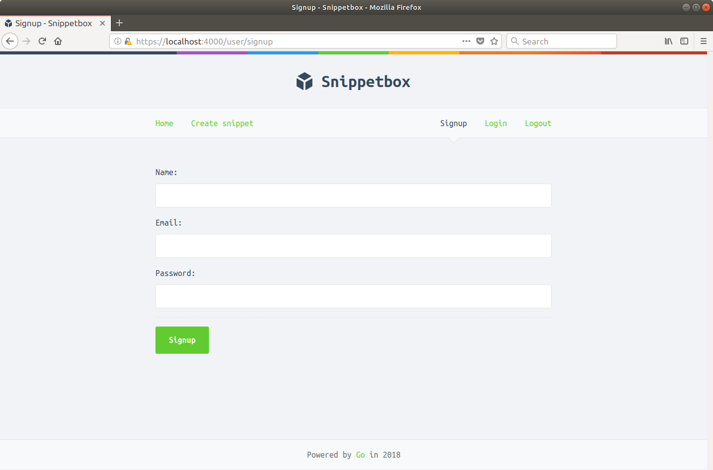

### 验证用户输入

当这个表单被提交时，数据最终会被发送到我们之前创建的 signupUser 处理程序。

这个处理程序的第一个任务是验证数据，并在我们将数据插入数据库之前确保它是合理的。具体来说，我们想做四件事：

1. 检查用户名、电子邮件地址和密码是否为空。
2. 健全性检查电子邮件地址的格式。
3. 确保密码长度至少为 10 个字符。
4. 确保电子邮件地址尚未被使用。

我们可以通过返回到我们的 pkg/forms/form.go 文件并创建两个辅助新方法——MinLength() 和 MatchesPattern()——以及用于检查电子邮件地址的正则表达式来覆盖前三个检查。

文件：pkg/forms/form.go

```go
package forms

import (
    "fmt"
    "net/url"
    "regexp" // New import
    "strings"
    "unicode/utf8"
)

// Use the regexp.MustCompile() function to parse a pattern and compile a
// regular expression for sanity checking the format of an email address.
// This returns a *regexp.Regexp object, or panics in the event of an error.
// Doing this once at runtime, and storing the compiled regular expression
// object in a variable, is more performant than re-compiling the pattern with
// every request.
var EmailRX = regexp.MustCompile("^[a-zA-Z0-9.!#$%&'*+\\/=?^_`{|}~-]+@[a-zA-Z0-9](?:[a-zA-Z0-9-]{0,61}[a-zA-Z0-9])?(?:\\.[a-zA-Z0-9](?:[a-zA-Z0-9-]{0,61}[a-zA-Z0-9])?)*$")

type Form struct {
    url.Values
    Errors errors
}

...

// Implement a MinLength method to check that a specific field in the form
// contains a minimum number of characters. If the check fails then add the
// appropriate message to the form errors.
func (f *Form) MinLength(field string, d int) {
    value := f.Get(field)
    if value == "" {
        return
    }
    if utf8.RuneCountInString(value) < d {
        f.Errors.Add(field, fmt.Sprintf("This field is too short (minimum is %d characters)", d))
    }
}

// Implement a MatchesPattern method to check that a specific field in the form
// matches a regular expression. If the check fails then add the
// appropriate message to the form errors.
func (f *Form) MatchesPattern(field string, pattern *regexp.Regexp) {
    value := f.Get(field)
    if value == "" {
        return
    }
    if !pattern.MatchString(value) {
        f.Errors.Add(field, "This field is invalid")
    }
}

func (f *Form) Valid() bool {
    return len(f.Errors) == 0
}
```

关于 EmailRX 正则表达式模式，我想快速提及以下几点：

- 我们使用的模式是 W3C 和 Web 超文本应用技术工作组当前推荐的模式。如果你以 PDF 格式或在窄设备上阅读本书，并且看不到整行，那么你可以在此处和此处找到完整的模式。但是，如果你更喜欢使用另一种模式进行电子邮件地址完整性检查，那么请随意替换它。
- 因为 EmailRX regexp 模式是作为解释型字符串文字编写的，所以我们需要使用 \\ 对正则表达式中的特殊字符进行双重转义以使其正常工作（我们不能使用原始字符串文字，因为该模式包含反引号字符） .如果你不熟悉字符串文字形式之间的区别，那么 Go 规范的这一部分值得一读。

但无论如何，我离题了。让我们回到手头的任务。

转到你的 handlers.go 文件并添加一些代码来处理表单并运行验证检查，如下所示：

文件：cmd/web/handlers.go

```go
package main

...

func (app *application) signupUser(w http.ResponseWriter, r *http.Request) {
    // Parse the form data.
    err := r.ParseForm()
    if err != nil {
        app.clientError(w, http.StatusBadRequest)
        return
    }

    // Validate the form contents using the form helper we made earlier.
    form := forms.New(r.PostForm)
    form.Required("name", "email", "password")
    form.MaxLength("name", 255)
	form.MaxLength("email", 255)
    form.MatchesPattern("email", forms.EmailRX)
    form.MinLength("password", 10)

    // If there are any errors, redisplay the signup form.
    if !form.Valid() {
        app.render(w, r, "signup.page.tmpl", &templateData{Form: form})
        return
    }

    // Otherwise send a placeholder response (for now!).
    fmt.Fprintln(w, "Create a new user...")
}

...
```

现在尝试运行该应用程序并将一些无效数据放入注册表单中，如下所示：


如果你尝试提交它，你应该会看到相应的验证失败返回，如下所示：

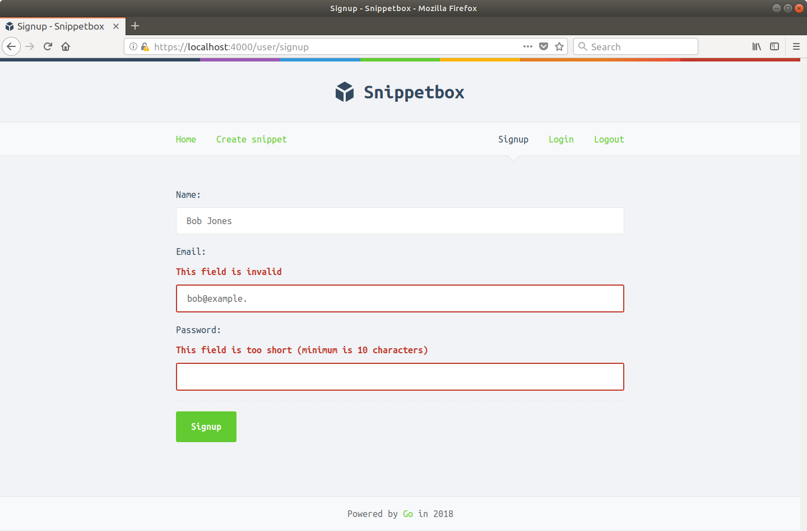

现在剩下的就是第四次验证检查：确保电子邮件地址尚未被使用。这个处理起来有点棘手。

因为我们在 users 表的 email 字段上有一个 UNIQUE 约束，所以已经可以保证我们的数据库中不会有两个具有相同电子邮件地址的用户。所以从业务逻辑和数据完整性的角度来看，我们已经没问题了。但问题仍然是我们如何将任何已在使用的电子邮件问题传达给用户。我们将在本章末尾解决这个问题。

### Bcrypt 简介

如果你的数据库曾经被攻击者入侵过，那么它不包含用户密码的纯文本版本就非常重要。

存储密码的单向散列是一种很好的做法——嗯，非常重要，真的——使用计算成本高的密钥派生函数（如 Argon2、scrypt 或 bcrypt）派生。 Go 对所有 3 种算法都有很好的实现，但是 brcypt 实现的一个优点是它包含一些专门用于散列和检查密码的辅助函数。

> 注意：如果你一直在关注，那么 bcrypt 包应该已经下载到你的计算机上，因为它是更广泛的 golang.org/x/crypto 包的一部分，该包是作为依赖项与 golangcollege/sessions 包一起安装的这本书。

我们将在本书中使用 bcrypt 包中有两个函数。第一个是 bcrypt.GenerateFromPassword() 函数，它让我们创建一个给定的纯文本密码的散列，如下所示：

```go
hash, err := bcrypt.GenerateFromPassword([]byte("my plain text password"), 12)
```

我们这里传入的第二个参数表示cost，用4到31之间的整数表示。 上面的代码使用了cost为12，这意味着4096（2^12）次bcrypt迭代将用于散列密码。我不建议使用少于那个。这个函数将返回一个 60 字符长的哈希，看起来有点像这样：```\$2a\$12\$NuTjWXm3KKntReFwyBVHyuf/to.HEwTy.eS206TNfkGfr6HzGJSWG```。

值得指出的是，bcrypt.GenerateFromPassword() 函数还为密码添加了一个随机盐，以帮助避免彩虹表攻击。

另一方面，我们可以使用 bcrypt.CompareHashAndPassword() 函数检查纯文本密码是否与特定哈希匹配，如下所示：

```go
hash := []byte("$2a$12$NuTjWXm3KKntReFwyBVHyuf/to.HEwTy.eS206TNfkGfr6GzGJSWG")
err := bcrypt.CompareHashAndPassword(hash, []byte("my plain text password"))
```

如果纯文本密码与特定哈希匹配，则 bcrypt.CompareHashAndPassword() 函数将返回 nil，如果不匹配则返回错误。

### 存储用户详细信息

我们构建的下一阶段是更新 UserModel.Insert() 方法，以便它在我们的用户表中创建一个新记录，其中包含经过验证的姓名、电子邮件和散列密码。

这将很有趣有两个原因：首先我们要存储密码的 bcrypt 哈希值（而不是密码本身），其次，我们还需要管理由重复电子邮件导致的潜在错误，该错误违反了我们添加到桌子。

MySQL 返回的所有错误都有一个特定的代码，我们可以使用它来分类导致错误的原因（可以在此处找到 MySQL 错误代码和描述的完整列表）。在重复电子邮件的情况下，使用的错误代码将为 1062 (ER_DUP_ENTRY)。

打开 pkg/models/mysql/users.go 文件并更新它以包含以下代码：

文件：pkg/models/mysql/users.go

```go
package mysql

import (
    "database/sql"
    "errors"  // New import
    "strings" // New import

    "alexedwards.net/snippetbox/pkg/models"

    "github.com/go-sql-driver/mysql" // New import
    "golang.org/x/crypto/bcrypt"     // New import
)

type UserModel struct {
    DB *sql.DB
}

func (m *UserModel) Insert(name, email, password string) error {
     // Create a bcrypt hash of the plain-text password.
    hashedPassword, err := bcrypt.GenerateFromPassword([]byte(password), 12)
    if err != nil {
        return err
    }

    stmt := `INSERT INTO users (name, email, hashed_password, created)
    VALUES(?, ?, ?, UTC_TIMESTAMP())`

    // Use the Exec() method to insert the user details and hashed password
    // into the users table.
    _, err = m.DB.Exec(stmt, name, email, string(hashedPassword))
    if err != nil {
        // If this returns an error, we use the errors.As() function to check
        // whether the error has the type *mysql.MySQLError. If it does, the
        // error will be assigned to the mySQLError variable. We can then check
        // whether or not the error relates to our users_uc_email key by
        // checking the contents of the message string. If it does, we return
        // an ErrDuplicateEmail error.
        var mySQLError *mysql.MySQLError
        if errors.As(err, &mySQLError) {
            if mySQLError.Number == 1062 && strings.Contains(mySQLError.Message, "users_uc_email") {
                return models.ErrDuplicateEmail
            }
        }
        return err
    }

    return nil
}

...
```

然后我们可以通过像这样更新 signupUser 处理程序来完成这一切：

文件：cmd/web/handlers.go

```go
package main

...

func (app *application) signupUser(w http.ResponseWriter, r *http.Request) {
    err := r.ParseForm()
    if err != nil {
        app.clientError(w, http.StatusBadRequest)
        return
    }

    form := forms.New(r.PostForm)
    form.Required("name", "email", "password")
    form.MaxLength("name", 255)
	form.MaxLength("email", 255)
    form.MatchesPattern("email", forms.EmailRX)
    form.MinLength("password", 10)

    if !form.Valid() {
        app.render(w, r, "signup.page.tmpl", &templateData{Form: form})
        return
    }

    // Try to create a new user record in the database. If the email already exists
    // add an error message to the form and re-display it.
    err = app.users.Insert(form.Get("name"), form.Get("email"), form.Get("password"))
    if err != nil {
        if errors.Is(err, models.ErrDuplicateEmail) {
            form.Errors.Add("email", "Address is already in use")
            app.render(w, r, "signup.page.tmpl", &templateData{Form: form})
        } else {
            app.serverError(w, err)
        }
        return
    }

    // Otherwise add a confirmation flash message to the session confirming that
    // their signup worked and asking them to log in.
    app.session.Put(r, "flash", "Your signup was successful. Please log in.")

    // And redirect the user to the login page.
    http.Redirect(w, r, "/user/login", http.StatusSeeOther)
}

...
```

保存文件，重新启动应用程序并尝试注册一个帐户。请务必记住你使用的电子邮件地址和密码……你将在下一章中用到它们！

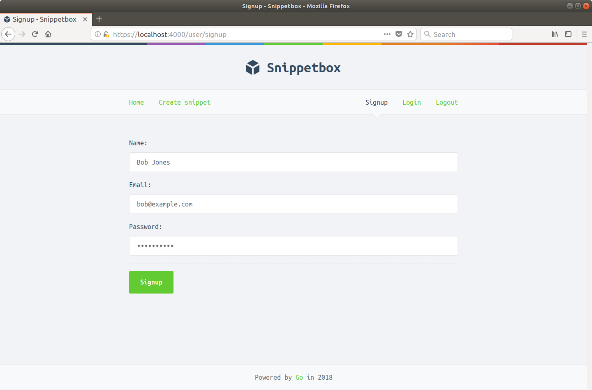

如果一切正常，你应该会发现你的浏览器在你提交表单后将你重定向到 https://localhost:4000/user/login。

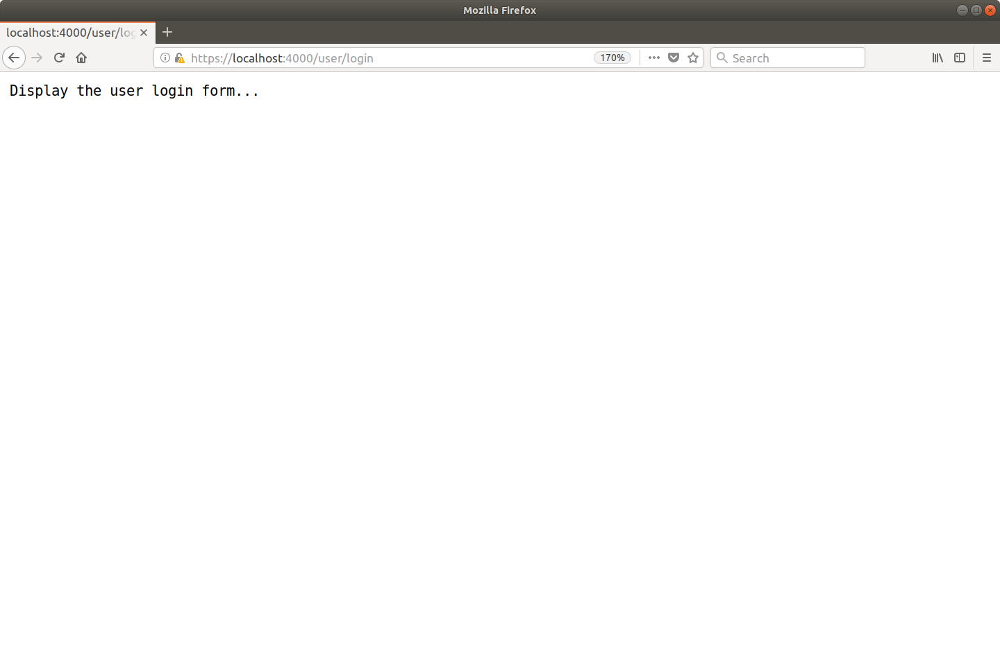

此时值得打开你的 MySQL 数据库并查看 users 表的内容。你应该会看到一个新记录，其中包含你刚刚用于注册的详细信息和密码的 bcrypt 哈希。

```sql
mysql> select * from users;
+----+-----------+-----------------+--------------------------------------------------------------+---------------------+--------+
| id | name      | email           | hashed_password                                              | created             | active |
+----+-----------+-----------------+--------------------------------------------------------------+---------------------+--------+
|  1 | Bob Jones | bob@example.com | $2a$12$mNXQrOwVWp/TqAzCCyDoyegtpV40EXwrzVLnbFpHPpWdvnmIoZ.Q. | 2018-10-19 20:14:15 |      1 |
+----+-----------+-----------------+--------------------------------------------------------------+---------------------+--------+
1 row in set (0.01 sec)
```

如果你愿意，请尝试返回注册表单并使用相同的电子邮件地址添加另一个帐户。你应该得到一个像这样的验证失败：

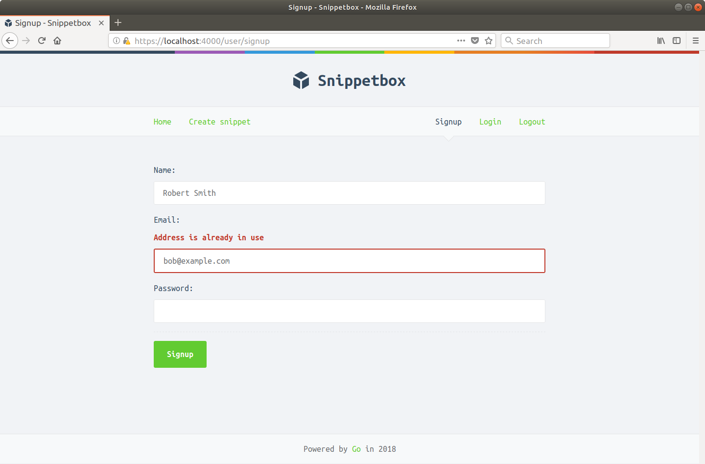

### 附加信息

#### 使用数据库 Bcrypt 实现

一些数据库提供了内置函数，你可以使用这些函数进行密码散列和验证，而不是像我们在上面的代码中那样在 Go 中实现自己的函数。

但出于两个原因，避免使用这些可能是个好主意：

- 由于字符串比较时间不是恒定的，至少在 Postgres 和 MySQL 中，它们往往容易受到侧信道定时攻击。
- 除非你非常小心，否则将纯文本密码发送到你的数据库可能会导致密码被意外记录在你的数据库日志之一中。发生这种情况的几个引人注目的例子是 2018 年的 Github 和 Twitter 事件。

#### 检查电子邮件重复项的替代方法

我知道我们 UserModel.Insert() 方法中的代码不是很漂亮，检查 MySQL 返回的错误感觉有点不稳定。如果未来版本的 MySQL 更改了它们的错误号怎么办？或者他们的错误信息的格式？

另一种（但也是不完美的）选项是将 UserModel.EmailTaken() 方法添加到我们的模型中，该方法检查是否已存在具有特定电子邮件的用户。我们可以在尝试插入新记录之前调用它，并根据需要向表单添加验证错误消息。

但是，这会给我们的应用程序引入竞争条件。如果两个用户同时尝试使用相同的电子邮件地址进行注册，则两次提交都将通过验证检查，但最终只有一个 INSERT 到 MySQL 数据库会成功。另一个将违反我们的 UNIQUE 约束，用户最终会收到 500 Internal Server Error 响应。

这种特殊竞争条件的结果是相当温和的，有些人会建议你不要担心。但我的观点是，批判性地思考你的应用程序逻辑并编写避免竞争条件的代码是一个好习惯，如果有可行的替代方案——就像在这种情况下——最好避免在已知的竞争条件下交付你的代码库。

## 用户登录

创建用户登录页面的过程遵循与用户注册相同的一般模式。首先，让我们创建一个包含以下标记的 ui/html/login.page.tmpl 模板：

```sh
cd $HOME/code/snippetbox
$ touch ui/html/login.page.tmpl
```

文件：ui/html/login.page.tmpl

```html
{{template "base" .}}

{{define "title"}}Login{{end}}

{{define "main"}}
<form action='/user/login' method='POST' novalidate>
    {{with .Form}}
        {{with .Errors.Get "generic"}}
            <div class='error'>{{.}}</div>
        {{end}}
        <div>
            <label>Email:</label>
            <input type='email' name='email' value='{{.Get "email"}}'>
        </div>
        <div>
            <label>Password:</label>
            <input type='password' name='password'>
        </div>
        <div>
            <input type='submit' value='Login'>
        </div>
    {{end}}
</form>
{{end}}
```

请注意我们如何在表单顶部包含一个 {{with .Errors.Get "generic"}} 操作，而不是显示单个字段的错误消息？如果用户登录失败，我们将使用它向用户显示通用的“你的电子邮件地址或密码错误”消息，而不是明确指出哪个字段是错误的。

同样，为了安全起见，如果登录失败，我们不会重新显示用户的密码。

然后我们可以将它连接起来，以便它由我们的 loginUserForm 处理程序呈现，如下所示：

文件：cmd/web/handlers.go

```go
package main

...

func (app *application) loginUserForm(w http.ResponseWriter, r *http.Request) {
    app.render(w, r, "login.page.tmpl", &templateData{
        Form: forms.New(nil),
    })
}

...
```

如果你运行该应用程序并访问 https://localhost:4000/user/login，你应该会看到如下所示的登录页面：

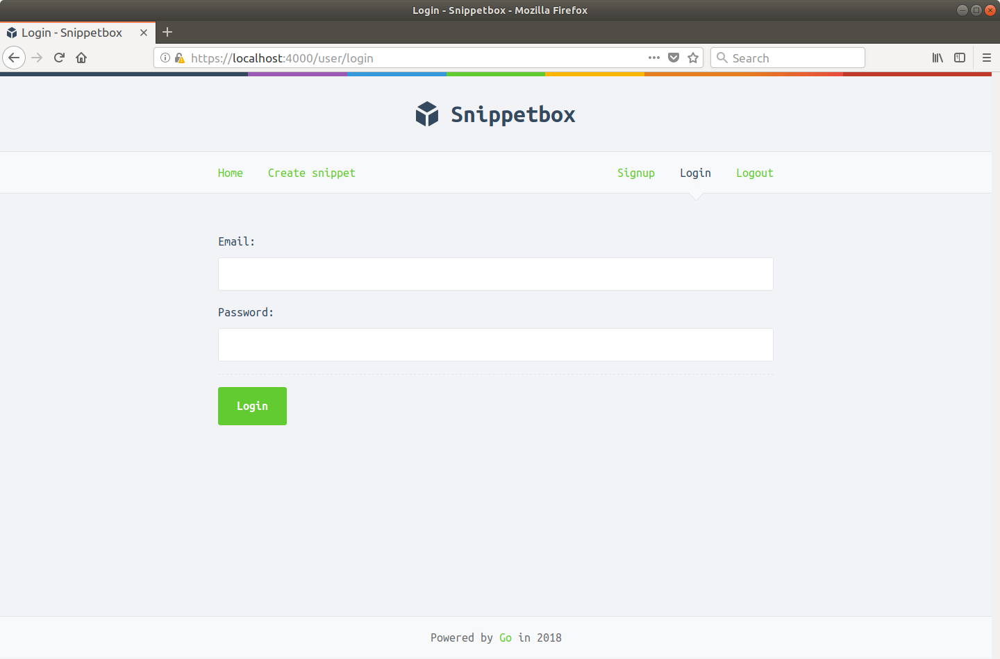

### 验证用户详细信息

下一步是有趣的部分：我们如何验证用户提交的电子邮件和密码是否正确？

此验证逻辑的核心部分将发生在我们用户模型的 UserModel.Authenticate() 方法中。具体来说，我们需要它做两件事：

- 首先，它应该从我们的 MySQL 用户表中检索与电子邮件地址关联的散列密码。如果数据库中不存在电子邮件，或者它是针对已停用的用户，我们将返回我们之前创建的 ErrInvalidCredentials 错误。
- 否则，我们希望将来自 users 表的哈希密码与用户在登录时提供的纯文本密码进行比较。 如果它们不匹配，我们希望再次返回 ErrInvalidCredentials 错误。但是如果它们匹配，我们希望从数据库中返回用户的 id 值。

让我们这样做。继续并将以下代码添加到你的 pkg/models/mysql/users.go 文件中：

文件：pkg/models/mysql/users.go

```go
package mysql

...

type UserModel struct {
    DB *sql.DB
}

...

func (m *UserModel) Authenticate(email, password string) (int, error) {
    // Retrieve the id and hashed password associated with the given email. If no
    // matching email exists, or the user is not active, we return the
    // ErrInvalidCredentials error.
    var id int
    var hashedPassword []byte
    stmt := "SELECT id, hashed_password FROM users WHERE email = ? AND active = TRUE"
    row := m.DB.QueryRow(stmt, email)
    err := row.Scan(&id, &hashedPassword)
    if err != nil {
        if errors.Is(err, sql.ErrNoRows) {
            return 0, models.ErrInvalidCredentials
        } else {
            return 0, err
        }
    }

    // Check whether the hashed password and plain-text password provided match.
    // If they don't, we return the ErrInvalidCredentials error.
    err = bcrypt.CompareHashAndPassword(hashedPassword, []byte(password))
    if err != nil {
        if errors.Is(err, bcrypt.ErrMismatchedHashAndPassword) {
            return 0, models.ErrInvalidCredentials
        } else {
            return 0, err
        }
    }

    // Otherwise, the password is correct. Return the user ID.
    return id, nil
}
```

我们的下一步涉及更新 loginUser 处理程序，以便它解析提交的登录表单数据并调用此 UserModel.Authenticate() 方法。

如果登录详细信息有效，那么我们希望将用户的 id 添加到他们的会话数据中，以便 - 对于未来的请求 - 我们知道他们已成功通过身份验证以及他们是哪个用户。

转到你的 handlers.go 文件并按如下方式更新它：

文件：cmd/web/handlers.go

```go
package main

...

func (app *application) loginUser(w http.ResponseWriter, r *http.Request) {
    err := r.ParseForm()
    if err != nil {
        app.clientError(w, http.StatusBadRequest)
        return
    }

    // Check whether the credentials are valid. If they're not, add a generic error
    // message to the form failures map and re-display the login page.
    form := forms.New(r.PostForm)
    id, err := app.users.Authenticate(form.Get("email"), form.Get("password"))
    if err != nil {
        if errors.Is(err, models.ErrInvalidCredentials) {
            form.Errors.Add("generic", "Email or Password is incorrect")
            app.render(w, r, "login.page.tmpl", &templateData{Form: form})
        } else {
            app.serverError(w, err)
        }
        return
    }

    // Add the ID of the current user to the session, so that they are now 'logged
    // in'.
    app.session.Put(r, "authenticatedUserID", id)

    // Redirect the user to the create snippet page.
    http.Redirect(w, r, "/snippet/create", http.StatusSeeOther)
}

...
```

所以，让我们试试这个。重新启动应用程序并尝试提交一些无效的用户凭据......


你应该得到如下所示的验证失败：

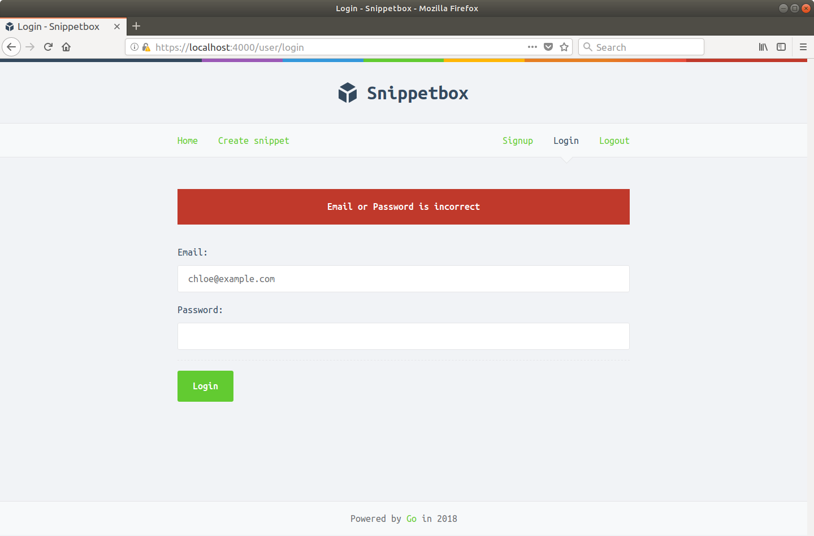

但是当你输入一些正确的凭据（使用你在前一章中创建的用户的电子邮件地址和密码）时，应用程序应该让你登录并将你重定向到创建代码段页面，如下所示：


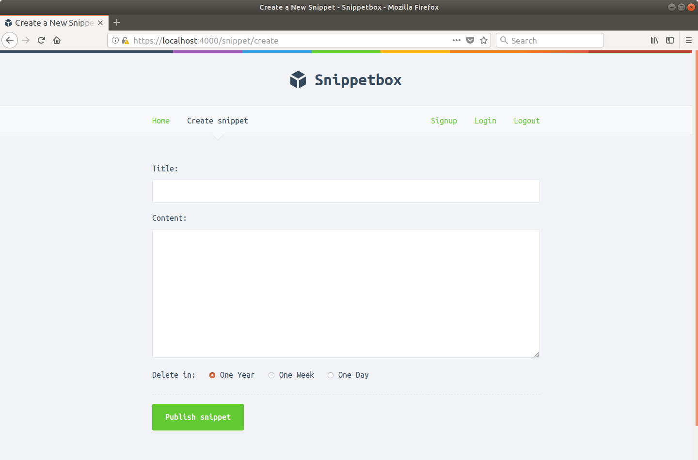

在前两章中我们已经涵盖了很多方面，所以让我们快速评估一下情况。

- 用户现在可以使用 GET /user/signup 表单在网站上注册。我们将注册用户的详细信息（包括其密码的散列版本）存储在我们数据库的用户表中。
- 注册用户然后可以使用 GET /user/login 表单进行身份验证以提供他们的电子邮件地址和密码。如果这些与活动用户的详细信息匹配，我们认为他们已成功通过身份验证并将相关的“authenticatedUserID”值添加到他们的会话数据中。

### 附加信息

#### 会话固定攻击

因为我们使用加密的 cookie 来存储会话数据（并且因为每次底层会话数据更改时加密的 cookie 值都会发生不可预测的变化）我们不需要担心会话固定攻击。

但是，如果你为会话使用服务器端数据存储（会话 ID 存储在 cookie 中），那么为了降低会话固定攻击的风险，在对权限进行任何更改之前更改会话 ID 的值很重要级别（例如登录和注销操作）。

如果你使用 SCS 包来管理服务器端会话，你可以使用 SessionManager.RenewToken() 方法来执行此操作。

如果你使用 Gorilla Sessions 管理服务器端会话，遗憾的是无法在保留会话数据的同时刷新会话 ID，因此你需要接受会话固定攻击的风险或创建新会话并复制手动跨数据。

## 用户注销

这让我们很好地注销了用户。与注册和登录相比，实现用户注销非常简单——我们需要做的就是从他们的会话中删除“authenticatedUserID”值。

让我们更新 logoutUser 处理程序来做到这一点。

文件：cmd/web/handlers.go

```go
package main

...

func (app *application) logoutUser(w http.ResponseWriter, r *http.Request) {
    // Remove the authenticatedUserID from the session data so that the user is
    // 'logged out'.
    app.session.Remove(r, "authenticatedUserID")
    // Add a flash message to the session to confirm to the user that they've been
    // logged out.
    app.session.Put(r, "flash", "You've been logged out successfully!")
    http.Redirect(w, r, "/", http.StatusSeeOther)
}
```

保存文件并重新启动应用程序。如果你现在单击导航栏中的“注销”链接，你应该被注销并重定向到主页，如下所示：

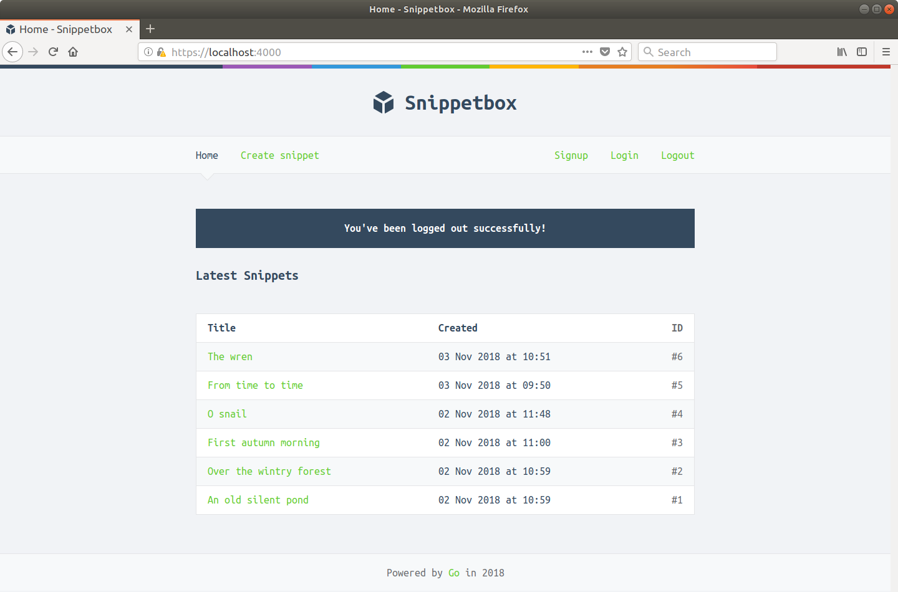

## 用户认证

能够对我们应用程序的用户进行身份验证非常好，但现在我们需要对这些信息做一些有用的事情。在本章中，我们将介绍一些授权检查，以便：

1. 只有经过身份验证（即登录）的用户才能创建新代码段；
2. 导航栏的内容根据用户是否通过身份验证（登录）而变化。经过身份验证的用户应该会看到指向“主页”、“创建代码段”和“注销”的链接。未经身份验证的用户应该看到指向“主页”、“注册”和“登录”的链接。

正如我在前一章中简要提到的，我们可以通过检查会话数据中是否存在“authenticatedUserID”值来检查请求是否由经过身份验证的用户发出。

所以让我们开始吧。打开 cmd/web/helpers.go 文件并添加一个 isAuthenticated() 辅助函数以返回身份验证状态，如下所示：

文件：cmd/web/helpers.go

```go
package main

...

// Return true if the current request is from authenticated user, otherwise return false.
func (app *application) isAuthenticated(r *http.Request) bool {
    return app.session.Exists(r, "authenticatedUserID")
}
```

整洁的。我们现在可以通过简单地调用 isAuthenticated() 帮助程序来检查请求是否来自经过身份验证（登录）的用户。

我们的下一步是找到一种方法将这些信息传递给我们的 HTML 模板，以便我们可以适当地切换导航栏的内容。

这有两个部分。首先，我们需要向 templateData 结构添加一个新的 IsAuthenticated 字段：

文件：cmd/web/templates.go

```go
package main

import (
    "html/template"
    "path/filepath"
    "time"

    "alexedwards.net/snippetbox/pkg/forms"
    "alexedwards.net/snippetbox/pkg/models"
)

// Add a new IsAuthenticated field to the templateData struct.
type templateData struct {
	CurrentYear     int
	Flash           string
	Form            *forms.Form
	IsAuthenticated bool
	Snippet         *models.Snippet
	Snippets        []*models.Snippet
}

...
```


第二步是更新我们的 addDefaultData() 帮助器，以便每次渲染模板时都会将此信息自动添加到 templateData 结构中。像这样：

文件：cmd/web/helpers.go 

```go
package main

...

func (app *application) addDefaultData(td *templateData, r *http.Request) *templateData {
    if td == nil {
        td = &templateData{}
    }

    td.CurrentYear = time.Now().Year()
    td.Flash = app.session.PopString(r, "flash")

    // Add the authentication status to the template data.
    td.IsAuthenticated = app.isAuthenticated(r)
    return td
}


...
```

文件：ui/html/base.layout.tmpl

```html
{{define "base"}}
<!doctype html>
<html lang='en'>
    <head>
        <meta charset='utf-8'>
        <title>{{template "title" .}} - Snippetbox</title>
        <link rel='stylesheet' href='/static/css/main.css'>
        <link rel='shortcut icon' href='/static/img/favicon.ico' type='image/x-icon'>
        <link rel='stylesheet' href='https://fonts.googleapis.com/css?family=Ubuntu+Mono:400,700'>
    </head>
    <body>
        <header>
            <h1><a href='/'>Snippetbox</a></h1>
        </header>
        <nav>
            <div>
                <a href='/'>Home</a>
                <!-- Toggle the navigation link -->
                {{if .IsAuthenticated}}
                    <a href='/snippet/create'>Create snippet</a>
                {{end}}
            </div>
            <div>
                <!-- Toggle the navigation links -->
                {{if .IsAuthenticated}}
                    <form action='/user/logout' method='POST'>
                        <button>Logout</button>
                    </form>
                {{else}}
                    <a href='/user/signup'>Signup</a>
                    <a href='/user/login'>Login</a>
                {{end}}
            </div>
        </nav>
        <main>
            {{with .Flash}}
            <div class='flash '>{{.}}</div>
            {{end}}
            {{template "main" .}}
        </main>
        {{template "footer" .}}
        <script src="/static/js/main.js" type="text/javascript"></script>
    </body>
</html>
{{end}}
```

>记住：{{if ...}} 操作将空值（false、0、任何 nil 指针或接口值，以及任何长度为零的数组、切片、映射或字符串）视为 false。

保存所有文件并立即尝试运行该应用程序。如果你当前尚未登录，你的应用程序主页应如下所示：

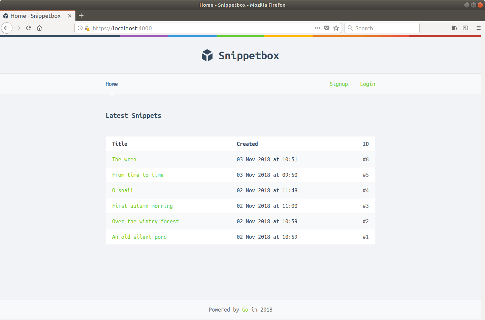

否则——如果你已经登录——你的主页应该是这样的：

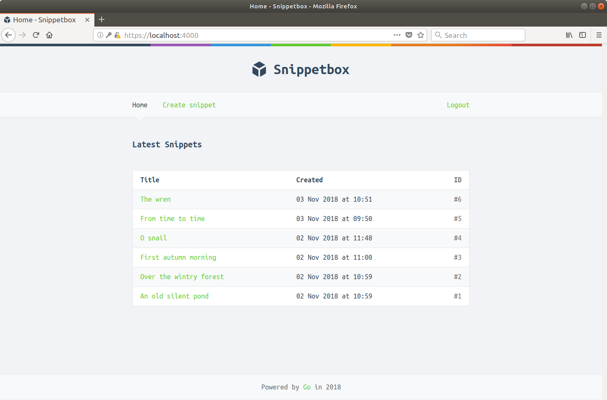

随意尝试一下，并尝试登录和退出，直到你确信导航栏正在按预期进行更改。

### 限制访问

就目前而言，我们正在为任何未登录的用户隐藏“创建代码段”导航链接。但未经身份验证的用户仍然可以通过访问 https://localhost:4000/snippet/create 页面来创建新代码段直接地。

让我们解决这个问题，这样如果未经身份验证的用户尝试访问 URL 路径为 /snippet/create 的任何路由，他们将被重定向到 /user/login。

最简单的方法是通过一些中间件。打开 cmd/web/middleware.go 文件并创建一个新的 requireAuthentication() 中间件函数，遵循我们在本书前面使用的相同模式：

文件：cmd/web/middleware.go

```go
package main

...

func (app *application) requireAuthentication(next http.Handler) http.Handler {
    return http.HandlerFunc(func(w http.ResponseWriter, r *http.Request) {
        // If the user is not authenticated, redirect them to the login page and
        // return from the middleware chain so that no subsequent handlers in
        // the chain are executed.
        if !app.isAuthenticated(r) {
            http.Redirect(w, r, "/user/login", http.StatusSeeOther)
            return
        }

        // Otherwise set the "Cache-Control: no-store" header so that pages
        // require authentication are not stored in the users browser cache (or
        // other intermediary cache).
        w.Header().Add("Cache-Control", "no-store")

        // And call the next handler in the chain.
        next.ServeHTTP(w, r)
    })
}
```

我们现在可以将此中间件添加到我们的 cmd/web/routes.go 文件中以保护特定路由。

在我们的例子中，我们需要保护 GET /snippet/create 和 POST /snippet/create 路由。如果用户未登录，则注销用户没有多大意义，因此在 POST /user/logout 路由上使用它也是有意义的。

如果你使用 justinas/alice 包来管理你的中间件链，你可以使用 Append() 方法在每个路由的基础上将新的 requireAuthentication() 中间件添加到 dynamicMiddleware 链，如下所示：

文件：cmd/web/routes.go

```go
package main

import (
    "net/http"

    "github.com/bmizerany/pat"
    "github.com/justinas/alice"
)

func (app *application) routes() http.Handler {
    standardMiddleware := alice.New(app.recoverPanic, app.logRequest, secureHeaders)
    dynamicMiddleware := alice.New(app.session.Enable)

    mux := pat.New()
    mux.Get("/", dynamicMiddleware.ThenFunc(app.home))
    // Add the requireAuthentication middleware to the chain.
    mux.Get("/snippet/create", dynamicMiddleware.Append(app.requireAuthentication).ThenFunc(app.createSnippetForm))
    // Add the requireAuthentication middleware to the chain.
    mux.Post("/snippet/create", dynamicMiddleware.Append(app.requireAuthentication).ThenFunc(app.createSnippet))
    mux.Get("/snippet/:id", dynamicMiddleware.ThenFunc(app.showSnippet))

    mux.Get("/user/signup", dynamicMiddleware.ThenFunc(app.signupUserForm))
    mux.Post("/user/signup", dynamicMiddleware.ThenFunc(app.signupUser))
    mux.Get("/user/login", dynamicMiddleware.ThenFunc(app.loginUserForm))
    mux.Post("/user/login", dynamicMiddleware.ThenFunc(app.loginUser))
    // Add the requireAuthentication middleware to the chain.
    mux.Post("/user/logout", dynamicMiddleware.Append(app.requireAuthentication).ThenFunc(app.logoutUser))

    fileServer := http.FileServer(http.Dir("./ui/static/"))
    mux.Get("/static/", http.StripPrefix("/static", fileServer))

    return standardMiddleware.Then(mux)
}
```

保存文件，重新启动应用程序并确保你已注销。

然后尝试直接在浏览器中访问 https://localhost:4000/snippet/create。你应该会发现你会立即被重定向到登录表单。

如果你愿意，你还可以使用 curl 确认未经身份验证的用户也被重定向到 POST /snippet/create 路由：

```sh
$ curl -ki -X POST https://localhost:4000/snippet/create
HTTP/2 302
location: /user/login
x-frame-options: deny
x-xss-protection: 1; mode=block
content-length: 0
date: Sun, 21 Oct 2018 11:00:13 GMT
```

### 附加信息

#### 不使用alice

如果你没有使用 justinas/alice 包来管理你的中间件，那也没关系——你可以像这样手动包装你的处理程序：

```go
mux.Get("/snippet/create", app.session.Enable(app.requireAuthentication(http.HandlerFunc(app.createSnippetForm))))
```

## CSRF 保护

在本章中，我们将了解如何保护我们的应用程序免受跨站请求伪造 (CSRF) 攻击。

如果你不熟悉 CSRF 的原理，它是一种跨域攻击形式，恶意第三方网站向你的网站发送状态改变的 HTTP 请求。可以在这里找到对基本 CSRF 攻击的很好的解释。

在我们的应用程序中，主要风险是：

- 用户登录到我们的应用程序。我们的会话 cookie 设置为持续 12 小时，因此即使他们离开应用程序也将保持登录状态。
- 然后，用户访问一个恶意网站，其中包含一些代码，该网站向 POST /snippets/create 发送请求，以将新代码段添加到我们的数据库中。
- 由于用户仍然登录到我们的应用程序，因此请求会以他们的权限进行处理。他们完全不知道，一个新的片段将被添加到我们的数据库中。

除了像上面这样的“传统”CSRF 攻击（专注于处理具有登录用户权限的请求）你的应用程序也可能面临登录和注销 CSRF 攻击的风险。

### 同站点 Cookie

我们可以用来防止 CSRF 攻击的一种缓解措施是确保在我们的会话 cookie 上设置 SameSite 属性。

默认情况下，我们使用的 golangcollege/sessions 包总是在会话 cookie 上设置 SameSite=Lax。这意味着会话 cookie 不会被用户的浏览器发送用于跨站点使用（除了当使用被认为是不改变目标应用程序状态的安全请求时），从而减少CSRF 攻击的风险。

顺便说一句，如果你想将此设置更改为 SameSite=Strict，你可以通过在 main.go 文件中配置这样的会话：

```sh
...
session := sessions.New([]byte(*secret))
session.Lifetime = 12 * time.Hour
session.Secure = true
session.SameSite = http.SameSiteStrictMode
...
```

> 注意：使用 SameSite=Strict 将阻止用户浏览器为所有跨站点使用发送的会话 cookie。这包括当用户单击指向你的应用程序的外部链接时，这意味着在单击该链接后，他们最初将被视为“未登录”，即使他们有一个包含“authenticatedUserID”值的活动会话。

不幸的是，在撰写本文时，全球仅 85% 的浏览器完全支持 SameSite 属性。因此，尽管我们可以（并且应该）将其用作防御措施，但我们不能对所有用户都依赖它。

### 基于令牌的缓解

为了降低所有用户的 CSRF 风险，我们还需要实施某种形式的令牌检查。就像会话管理和密码散列一样，当涉及到这一点时，你可能会出错很多，因此使用久经考验的第三方软件包而不是滚动你自己的实现可能更安全。

在 Go Web 应用程序中阻止 CSRF 攻击的两个最流行的包是 gorilla/csrf 和 justinas/nosurf。他们都做大致相同的事情，使用双重提交 Cookie 模式来防止攻击。在这种模式中，随机生成 CSRF 令牌并在 CSRF cookie 中发送给用户。然后将此 CSRF 令牌添加到易受 CSRF 攻击的每种形式的隐藏字段中。提交表单时，两个包都使用一些中间件来检查隐藏字段值和 cookie 值是否匹配。

在这两个包中，我们将在本书中选择使用 justinas/nosurf。我更喜欢它，主要是因为它是独立的，没有任何额外的依赖。如果你按照以下步骤操作，你可以像这样安装最新版本：

```sh
$ go get github.com/justinas/nosurf@v1
go: downloading github.com/justinas/nosurf v1.1.1
```

### 使用 nosurf 包

打开你的 cmd/web/middleware.go 文件并创建一个新的 noSurf() 函数，如下所示：

文件：cmd/web/middleware.go

```go
package main

import (
    "fmt"
    "net/http"

    "github.com/justinas/nosurf" // New import
)

...

// Create a NoSurf middleware function which uses a customized CSRF cookie with
// the Secure, Path and HttpOnly flags set.
func noSurf(next http.Handler) http.Handler {
    csrfHandler := nosurf.New(next)
    csrfHandler.SetBaseCookie(http.Cookie{
        HttpOnly: true,
        Path:     "/",
        Secure:   true,
    })

    return csrfHandler
}
```

我们需要防止 CSRF 攻击的表单之一是我们的注销表单，它包含在我们的 base.layout.tmpl 文件中，并且可能出现在我们应用程序的任何页面上。因此，因此，我们需要在所有应用程序路由上使用我们的 noSurf() 中间件（除了 /static/）。

因此，让我们更新 cmd/web/routes.go 文件，将这个 noSurf() 中间件添加到我们之前创建的 dynamicMiddleware 链中：

文件：cmd/web/routes.go

```go
package main

...

func (app *application) routes() http.Handler {
    standardMiddleware := alice.New(app.recoverPanic, app.logRequest, secureHeaders)
    // Use the nosurf middleware on all our 'dynamic' routes.
    dynamicMiddleware := alice.New(app.session.Enable, noSurf)

	mux := pat.New()
	mux.Get("/", dynamicMiddleware.ThenFunc(app.home))
	mux.Get("/snippet/create", dynamicMiddleware.Append(app.requireAuthentication).ThenFunc(app.createSnippetForm))
	mux.Post("/snippet/create", dynamicMiddleware.Append(app.requireAuthentication).ThenFunc(app.createSnippet))
	mux.Get("/snippet/:id", dynamicMiddleware.ThenFunc(app.showSnippet))

	mux.Get("/user/signup", dynamicMiddleware.ThenFunc(app.signupUserForm))
	mux.Post("/user/signup", dynamicMiddleware.ThenFunc(app.signupUser))
	mux.Get("/user/login", dynamicMiddleware.ThenFunc(app.loginUserForm))
	mux.Post("/user/login", dynamicMiddleware.ThenFunc(app.loginUser))
	mux.Post("/user/logout", dynamicMiddleware.Append(app.requireAuthentication).ThenFunc(app.logoutUser))

    fileServer := http.FileServer(http.Dir("./ui/static/"))
    mux.Get("/static/", http.StripPrefix("/static", fileServer))

    return standardMiddleware.Then(mux)
}
```

此时，你可能想要启动应用程序并尝试提交其中一个表单。当你这样做时，请求应该被 noSurf() 中间件拦截，你应该收到 400 Bad Request 响应。

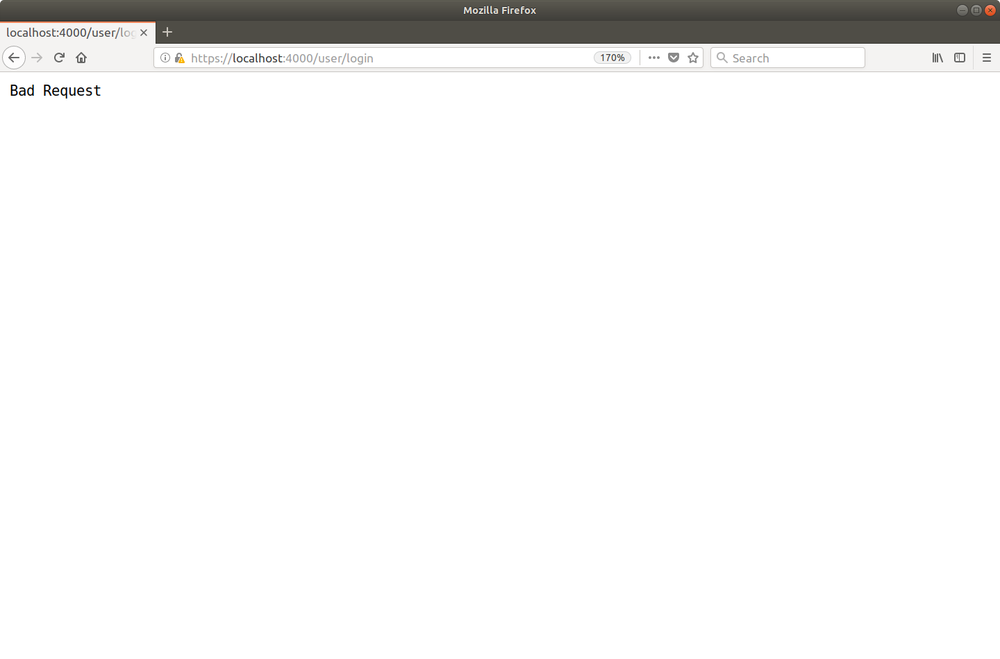

为了使表单提交工作，我们需要使用 nosurf.Token() 函数来获取 CSRF 令牌并将其添加到我们每个表单中的隐藏 csrf_token 字段中。所以下一步是在我们的 templateData 结构中添加一个新的 CSRFToken 字段：

文件：cmd/web/templates.go

```go
package main

import (
    "html/template"
    "path/filepath"
    "time"

    "alexedwards.net/snippetbox/pkg/forms"
    "alexedwards.net/snippetbox/pkg/models"
)

// Add a new CSRFToken field to the templateData.
type templateData struct {
	CSRFToken       string
	CurrentYear     int
	Flash           string
	Form            *forms.Form
	IsAuthenticated bool
	Snippet         *models.Snippet
	Snippets        []*models.Snippet
}

...
```

并且因为注销表单可能会出现在每个页面上，所以通过我们的 addDefaultData() 助手将 CSRF 令牌添加到模板数据中是有意义的。这意味着每次我们渲染页面时，它都会自动对我们的模板可用。更新 cmd/web/helpers.go 文件如下：

文件：cmd/web/helpers.go

```go
package main

import (
    "bytes"
    "fmt"
    "net/http"
    "runtime/debug"
    "time"

    "github.com/justinas/nosurf" // New import
)

func (app *application) addDefaultData(td *templateData, r *http.Request) *templateData {
	if td == nil {
		td = &templateData{}
	}

	// Add the CSRF token to the templateData struct.
	td.CSRFToken = nosurf.Token(r)
	td.CurrentYear = time.Now().Year()
	td.Flash = app.session.PopString(r, "flash")
	td.IsAuthenticated = app.isAuthenticated(r)
	return td
}

...
```

最后，让我们更新应用程序中的所有表单以使用此令牌。

文件：ui/html/base.layout.tmpl

```html
{{define "base"}}
<!doctype html>
<html lang='en'>
    <head>
        <meta charset='utf-8'>
        <title>{{template "title" .}} - Snippetbox</title>
        <link rel='stylesheet' href='/static/css/main.css'>
        <link rel='shortcut icon' href='/static/img/favicon.ico' type='image/x-icon'>
        <link rel='stylesheet' href='https://fonts.googleapis.com/css?family=Ubuntu+Mono:400,700'>
    </head>
    <body>
        <header>
            <h1><a href='/'>Snippetbox</a></h1>
        </header>
        <nav>
            <div>
                <a href='/'>Home</a>
                {{if .IsAuthenticated}}
                    <a href='/snippet/create'>Create snippet</a>
                {{end}}
            </div>
            <div>
                {{if .IsAuthenticated}}
                    <form action='/user/logout' method='POST'>
                        <!-- Include the CSRF token -->
                        <input type='hidden' name='csrf_token' value='{{.CSRFToken}}'>
                        <button>Logout</button>
                    </form>
                {{else}}
                    <a href='/user/signup'>Signup</a>
                    <a href='/user/login'>Login</a>
                {{end}}
            </div>
        </nav>
        <main>
            {{with .Flash}}
            <div class='flash '>{{.}}</div>
            {{end}}
            {{template "main" .}}
        </main>
        {{template "footer" .}}
        <script src="/static/js/main.js" type="text/javascript"></script>
    </body>
</html>
{{end}}
```

文件：ui/html/create.page.tmpl

```html
{{template "base" .}}

{{define "title"}}Create a New Snippet{{end}}

{{define "main"}}
<form action='/snippet/create' method='POST'>
    <!-- Include the CSRF token -->
    <input type='hidden' name='csrf_token' value='{{.CSRFToken}}'>
    {{with .Form}}
        <div>
            <label>Title:</label>
            {{with .Errors.Get "title"}}
                <label class='error'>{{.}}</label>
            {{end}}
            <input type='text' name='title' value='{{.Get "title"}}'>
        </div>
        <div>
            <label>Content:</label>
            {{with .Errors.Get "content"}}
                <label class='error'>{{.}}</label>
            {{end}}
            <textarea name='content'>{{.Get "content"}}</textarea>
        </div>
        <div>
            <label>Delete in:</label>
            {{with .Errors.Get "expires"}}
                <label class='error'>{{.}}</label>
            {{end}}
            {{$exp := or (.Get "expires") "365"}}
            <input type='radio' name='expires' value='365' {{if (eq $exp "365")}}checked{{end}}> One Year
            <input type='radio' name='expires' value='7' {{if (eq $exp "7")}}checked{{end}}> One Week
            <input type='radio' name='expires' value='1' {{if (eq $exp "1")}}checked{{end}}> One Day
        </div>
        <div>
            <input type='submit' value='Publish snippet'>
        </div>
    {{end}}
</form>
{{end}}
```

文件：ui/html/login.page.tmpl

```go
{{template "base" .}}

{{define "title"}}Login{{end}}

{{define "main"}}
<form action='/user/login' method='POST' novalidate>
    <!-- Include the CSRF token -->
    <input type='hidden' name='csrf_token' value='{{.CSRFToken}}'>
    {{with .Form}}
        {{with .Errors.Get "generic"}}
            <div class='error'>{{.}}</div>
        {{end}}
        <div>
            <label>Email:</label>
            <input type='email' name='email' value='{{.Get "email"}}'>
        </div>
        <div>
            <label>Password:</label>
            <input type='password' name='password'>
        </div>
        <div>
            <input type='submit' value='Login'>
        </div>
    {{end}}
</form>
{{end}}
```

文件：ui/html/signup.page.tmpl

```go
{{template "base" .}}

{{define "title"}}Signup{{end}}

{{define "main"}}
<form action='/user/signup' method='POST' novalidate>
    <!-- Include the CSRF token -->
    <input type='hidden' name='csrf_token' value='{{.CSRFToken}}'>
    {{with .Form}}
        <div>
            <label>Name:</label>
            {{with .Errors.Get "name"}}
                <label class='error'>{{.}}</label>
            {{end}}
            <input type='text' name='name' value='{{.Get "name"}}'>
        </div>
        <div>
            <label>Email:</label>
            {{with .Errors.Get "email"}}
                <label class='error'>{{.}}</label>
            {{end}}
            <input type='email' name='email' value='{{.Get "email"}}'>
        </div>
        <div>
            <label>Password:</label>
            {{with .Errors.Get "password"}}
                <label class='error'>{{.}}</label>
            {{end}}
            <input type='password' name='password'>
        </div>
        <div>
            <input type='submit' value='Signup'>
        </div>
    {{end}}
</form>
{{end}}
```

继续并再次运行该应用程序，然后查看其中一个表单的源代码。 你应该看到它现在有一个包含在隐藏字段中的 CSRF 令牌，就像这样。

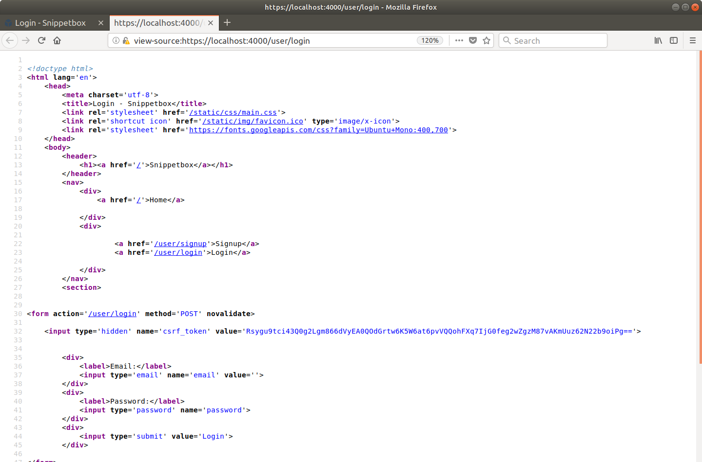

如果你尝试提交表单，它现在应该可以再次正常工作。
