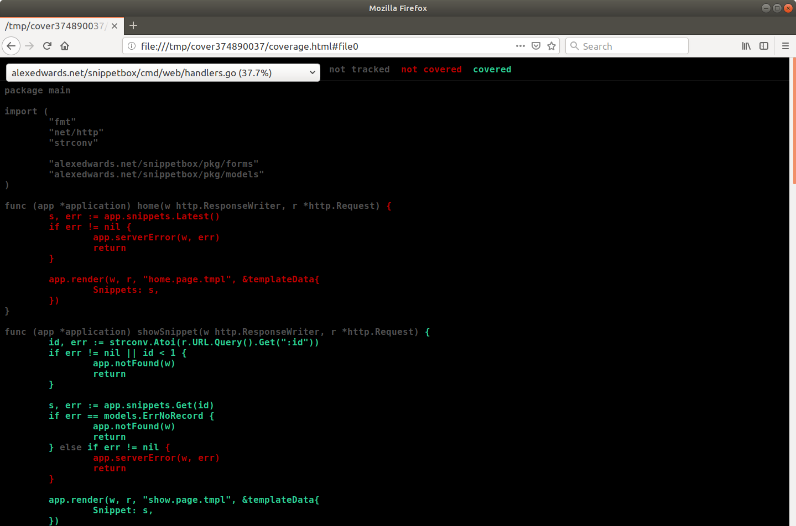
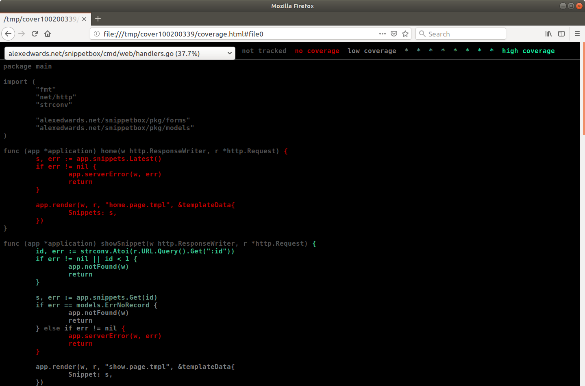

# 测试

所以我们终于来到了测试的话题。

就像构建和组织应用程序代码一样，在 Go 中构建和组织测试没有单一的“正确”方法。但是，你可以遵循一些约定、模式和良好实践。

在本节中，我们将为应用程序中的选定代码添加测试，目的是演示用于创建测试的通用语法并说明可以在各种应用程序中重用的一些模式。

你会学到：

- 如何在 Go 中创建和运行表驱动的单元测试和子测试。
- 如何对 HTTP 处理程序和中间件进行单元测试。
- 如何对你的 Web 应用程序路由、中间件和处理程序执行“端到端”测试。
- 如何创建数据库模型的模拟并在单元测试中使用它们。
- 一种用于测试受 CSRF 保护的 HTML 表单提交的模式。
- 如何使用 MySQL 的测试实例执行集成测试。
- 如何轻松计算和分析测试的代码覆盖率。

## 单元测试和子测试

在本章中，我们将创建一个单元测试，以确保我们的 humanDate() 函数（我们在自定义模板函数一章中重新创建）以我们想要的确切格式输出 time.Time 值。

如果你不记得了，humanDate() 函数看起来像这样：

文件：cmd/web/templates.go

```go
package main

...

func humanDate(t time.Time) string {
    return t.UTC().Format("02 Jan 2006 at 15:04")
}

...
```

我想从测试这个开始的原因是因为它是一个简单的函数。我们可以探索编写测试的基本语法和模式，而不会过于关注我们正在测试的功能。

### 创建单元测试

让我们直接进入并为此函数创建单元测试。

在 Go 中，它的标准做法是在 *_test.go 文件中创建你的测试，这些文件直接与你正在测试的代码一起存在。因此，在这种情况下，我们要做的第一件事是创建一个新的 cmd/web/templates_test.go 文件来保存测试：

```sh
$ touch cmd/web/templates_test.go
```

然后我们可以为 humanDate 函数创建一个新的单元测试，如下所示：

文件：cmd/web/templates_test.go

```go
package main

import (
    "testing"
    "time"
)

func TestHumanDate(t *testing.T) {
    // Initialize a new time.Time object and pass it to the humanDate function.
    tm := time.Date(2020, 12, 17, 10, 0, 0, 0, time.UTC)
    hd := humanDate(tm)

    // Check that the output from the humanDate function is in the format we
    // expect. If it isn't what we expect, use the t.Errorf() function to
    // indicate that the test has failed and log the expected and actual
    // values.
    if hd != "17 Dec 2020 at 10:00" {
        t.Errorf("want %q; got %q", "17 Dec 2020 at 10:00", hd)
    }
}
```

这种模式是你将用于几乎所有用 Go 编写的测试的基本模式。要带走的重要事项是：

- 测试只是普通的 Go 代码，它调用 humanDate 函数并检查结果是否符合我们的预期。
- 你的单元测试包含在带有签名 func(*testing.T) 的普通 Go 函数中。
- 要成为有效的单元测试，此函数的名称必须以单词 Test 开头。通常，这之后是你正在测试的函数、方法或类型的名称，以帮助一目了然地了解正在测试的内容。
- 你可以使用 t.Errorf() 函数将测试标记为失败并记录有关失败的描述性消息。

让我们试试这个。保存文件，然后使用 go test 命令运行我们的 cmd/web 包中的所有测试，如下所示：

```sh
$ go test ./cmd/web
ok      alexedwards.net/snippetbox/cmd/web    0.005s
```

所以，这是个好东西。此输出中的 ok 表示包中的所有测试（目前，只有我们的 TestHumanDate() 测试）都顺利通过。

如果你需要更多详细信息，可以使用 -v 标志获取详细输出，从而准确查看正在运行哪些测试：

```sh
$ go test -v ./cmd/web
=== RUN   TestHumanDate
--- PASS: TestHumanDate (0.00s)
PASS
ok      alexedwards.net/snippetbox/cmd/web    0.007s
```

### 表驱动测试

现在让我们扩展我们的 TestHumanDate() 函数以涵盖一些额外的测试用例。具体来说，我们将更新它以检查：

1. 如果humanDate() 的输入是零时间，则它返回空字符串""。
2. humanDate() 函数的输出始终使用 UTC 时区。

在 Go 中，运行多个测试用例的惯用方法是使用表驱动测试。

本质上，表驱动测试背后的想法是创建一个包含输入和预期输出的测试用例表，然后循环遍历这些，在子测试中运行每个测试用例。有几种方法可以设置它，但一种常见的方法是在匿名结构的切片中定义测试用例。

我将演示：

文件：cmd/web/templates_test.go

```go
package main

import (
    "testing"
    "time"
)

func TestHumanDate(t *testing.T) {
    // Create a slice of anonymous structs containing the test case name,
    // input to our humanDate() function (the tm field), and expected output
    // (the want field).
    tests := []struct {
        name string
        tm   time.Time
        want string
    }{
        {
            name: "UTC",
            tm:   time.Date(2020, 12, 17, 10, 0, 0, 0, time.UTC),
            want: "17 Dec 2020 at 10:00",
        },
        {
            name: "Empty",
            tm:   time.Time{},
            want: "",
        },
        {
            name: "CET",
            tm:   time.Date(2020, 12, 17, 10, 0, 0, 0, time.FixedZone("CET", 1*60*60)),
            want: "17 Dec 2020 at 09:00",
        },
    }

    // Loop over the test cases.
    for _, tt := range tests {
        // Use the t.Run() function to run a sub-test for each test case. The
        // first parameter to this is the name of the test (which is used to
        // identify the sub-test in any log output) and the second parameter is
        // and anonymous function containing the actual test for each case.
        t.Run(tt.name, func(t *testing.T) {
            hd := humanDate(tt.tm)

            if hd != tt.want {
                t.Errorf("want %q; got %q", tt.want, hd)
            }
        })
    }
}
```

> 注意：在第三个测试用例中，我们使用 CET（欧洲中部时间）作为时区，比 UTC 早一小时。因此，我们希望 humanDate()（UTC）的输出是 2020 年 12 月 17 日 09:00，而不是 2020 年 12 月 17 日 10:00。

好的，让我们运行它，看看会发生什么：

```sh
$ go test -v ./cmd/web
=== RUN   TestHumanDate
=== RUN   TestHumanDate/UTC
=== RUN   TestHumanDate/Empty
=== RUN   TestHumanDate/CET
--- FAIL: TestHumanDate (0.00s)
    --- PASS: TestHumanDate/UTC (0.00s)
    --- FAIL: TestHumanDate/Empty (0.00s)
        templates_test.go:44: want ""; got "01 Jan 0001 at 00:00"
    --- FAIL: TestHumanDate/CET (0.00s)
        templates_test.go:44: want "17 Dec 2020 at 09:00"; got "17 Dec 2020 at 10:00"
FAIL
FAIL    alexedwards.net/snippetbox/cmd/web    0.005s
```

我们可以看到我们为每个子测试获得了单独的输出。你可能已经猜到了，我们的第一个测试用例通过了，但 Empty 和 CET 测试都失败了。请注意 - 对于失败的测试用例 - 我们如何在输出中获得相关的失败消息以及文件名和行号？

还值得指出的是，当我们使用 t.Errorf() 函数将测试标记为失败时，并不会导致 go test 立即退出。所有其他测试和子测试将在失败后继续运行。

作为旁注，如果需要，你可以使用 -failfast 标志来停止在第一次失败后运行的测试，如下所示：

```sh
$ go test -failfast -v ./cmd/web
=== RUN   TestHumanDate
=== RUN   TestHumanDate/UTC
=== RUN   TestHumanDate/Empty
--- FAIL: TestHumanDate (0.00s)
    --- PASS: TestHumanDate/UTC (0.00s)
    --- FAIL: TestHumanDate/Empty (0.00s)
        templates_test.go:44: want ""; got "01 Jan 0001 at 00:00"
FAIL
FAIL    alexedwards.net/snippetbox/cmd/web    0.007s
```

无论如何……让我们回到我们的 humanDate() 函数并更新它以解决这两个问题：

文件：cmd/web/templates.go

```go
package main

...

func humanDate(t time.Time) string {
    // Return the empty string if time has the zero value.
    if t.IsZero() {
        return ""
    }

    // Convert the time to UTC before formatting it.
    return t.UTC().Format("02 Jan 2006 at 15:04")
}

...
```

当你重新运行测试时，一切都应该通过了。

```sh
$ go test -v ./cmd/web
=== RUN   TestHumanDate
=== RUN   TestHumanDate/UTC
=== RUN   TestHumanDate/Empty
=== RUN   TestHumanDate/CET
--- PASS: TestHumanDate (0.00s)
    --- PASS: TestHumanDate/UTC (0.00s)
    --- PASS: TestHumanDate/Empty (0.00s)
    --- PASS: TestHumanDate/CET (0.00s)
PASS
ok      alexedwards.net/snippetbox/cmd/web    0.009s
```

### 运行所有测试

要运行项目的所有测试——而不仅仅是特定包中的测试——你可以使用 ./... 通配符模式，如下所示：

```sh
$ go test ./...
ok      alexedwards.net/snippetbox/cmd/web    0.006s
?       alexedwards.net/snippetbox/pkg/forms    [no test files]
?       alexedwards.net/snippetbox/pkg/models    [no test files]
?       alexedwards.net/snippetbox/pkg/models/mysql    [no test files]
```

## 测试 HTTP 处理程序

让我们继续讨论一些用于单元测试 HTTP 处理程序的特定技术。

到目前为止，我们为 Snippetbox 项目编写的所有处理程序测试起来都有些复杂，为了介绍一些我更喜欢从更简单的东西开始的东西。

如果你正在跟进，请转到你的 handlers.go 文件并创建一个新的 ping 处理程序函数，该函数仅返回 200 OK 响应。这是你可能想要实现的用于服务器状态检查或正常运行时间监控的处理程序类型。

文件：cmd/web/handlers.go

```go
package main

...

func ping(w http.ResponseWriter, r *http.Request) {
    w.Write([]byte("OK"))
}
```

在本章中，我们将创建一个新的 TestPing 单元测试，它：

- 检查 ping 处理程序写入的响应状态代码是否为 200。
- 检查 ping 处理程序写入的响应正文是否“正常”。

### 记录回应

为了帮助测试你的 HTTP 处理程序，Go 提供了 net/http/httptest 包，其中包含一套有用的工具。

这些工具之一是 httptest.ResponseRecorder 类型。这本质上是 http.ResponseWriter 的实现，它记录响应状态代码、标头和正文，而不是实际将它们写入 HTTP 连接。

因此，对处理程序进行单元测试的一种简单方法是创建一个新的 httptest.ResponseRecorder 对象，将其传递给处理程序函数，然后在处理程序返回后再次检查它。

让我们尝试这样做来测试 ping 处理程序函数。

首先，遵循 Go 约定并创建一个新的 handlers_test.go 文件来保存测试……

```sh
$ touch cmd/web/handlers_test.go
```

然后添加以下代码：

文件：cmd/web/handlers_test.go

```go
package main

import (
    "io"
    "net/http"
    "net/http/httptest"
    "testing"
)

func TestPing(t *testing.T) {
    // Initialize a new httptest.ResponseRecorder.
    rr := httptest.NewRecorder()

    // Initialize a new dummy http.Request.
    r, err := http.NewRequest(http.MethodGet, "/", nil)
    if err != nil {
        t.Fatal(err)
    }

    // Call the ping handler function, passing in the
    // httptest.ResponseRecorder and http.Request.
    ping(rr, r)

    // Call the Result() method on the http.ResponseRecorder to get the
    // http.Response generated by the ping handler.
    rs := rr.Result()

    // We can then examine the http.Response to check that the status code
    // written by the ping handler was 200.
    if rs.StatusCode != http.StatusOK {
        t.Errorf("want %d; got %d", http.StatusOK, rs.StatusCode)
    }

    // And we can check that the response body written by the ping handler
    // equals "OK".
    defer rs.Body.Close()
    body, err := io.ReadAll(rs.Body)
    if err != nil {
        t.Fatal(err)
    }

    if string(body) != "OK" {
        t.Errorf("want body to equal %q", "OK")
    }
}
```

> 注意：在上面的代码中，我们在几个地方使用了 t.Fatal() 函数来处理测试代码中出现意外错误的情况。调用时，t.Fatal() 会将测试标记为失败，记录错误，然后完全停止执行任何进一步的测试。

保存文件，然后尝试再次运行 go test 并设置详细标志。像这样：

```sh
$ go test -v ./cmd/web/
=== RUN   TestPing
--- PASS: TestPing (0.00s)
=== RUN   TestHumanDate
=== RUN   TestHumanDate/UTC
=== RUN   TestHumanDate/Empty
=== RUN   TestHumanDate/CET
--- PASS: TestHumanDate (0.00s)
    --- PASS: TestHumanDate/UTC (0.00s)
    --- PASS: TestHumanDate/Empty (0.00s)
    --- PASS: TestHumanDate/CET (0.00s)
PASS
ok      alexedwards.net/snippetbox/cmd/web    0.007s
```

所以这看起来不错。我们可以看到我们在 cmd/web 包下编写的所有测试都在运行和通过，没有任何问题。

### 测试中间件

也可以使用相同的通用技术对你的中间件进行单元测试。

我们将通过为本书前面创建的 secureHeaders 中间件创建一个 TestSecureHeaders 测试来演示。作为此测试的一部分，我们要检查：

- 中间件设置 X-Frame-Options: deny 标头。
- 中间件设置X-XSS-Protection：1；模式=块头。
- 中间件正确调用链中的下一个处理程序。

首先，你需要创建一个 cmd/web/middleware_test.go 文件来保存测试：

```sh
$ touch cmd/web/middleware_test.go
```

然后添加以下代码：

文件：cmd/web/middleware_test.go

```go
package main

import (
    "io"
    "net/http"
    "net/http/httptest"
    "testing"
)

func TestSecureHeaders(t *testing.T) {
    // Initialize a new httptest.ResponseRecorder and dummy http.Request.
    rr := httptest.NewRecorder()

    r, err := http.NewRequest(http.MethodGet, "/", nil)
    if err != nil {
        t.Fatal(err)
    }

    // Create a mock HTTP handler that we can pass to our secureHeaders
    // middleware, which writes a 200 status code and "OK" response body.
    next := http.HandlerFunc(func(w http.ResponseWriter, r *http.Request) {
        w.Write([]byte("OK"))
    })

    // Pass the mock HTTP handler to our secureHeaders middleware. Because
    // secureHeaders *returns* a http.Handler we can call its ServeHTTP()
    // method, passing in the http.ResponseRecorder and dummy http.Request to
    // execute it.
    secureHeaders(next).ServeHTTP(rr, r)

    // Call the Result() method on the http.ResponseRecorder to get the results
    // of the test.
    rs := rr.Result()

    // Check that the middleware has correctly set the X-Frame-Options header
    // on the response.
    frameOptions := rs.Header.Get("X-Frame-Options")
    if frameOptions != "deny" {
        t.Errorf("want %q; got %q", "deny", frameOptions)
    }

    // Check that the middleware has correctly set the X-XSS-Protection header
    // on the response.
    xssProtection := rs.Header.Get("X-XSS-Protection")
    if xssProtection != "1; mode=block" {
        t.Errorf("want %q; got %q", "1; mode=block", xssProtection)
    }

    // Check that the middleware has correctly called the next handler in line
    // and the response status code and body are as expected.
    if rs.StatusCode != http.StatusOK {
        t.Errorf("want %d; got %d", http.StatusOK, rs.StatusCode)
    }

    defer rs.Body.Close()
    body, err := io.ReadAll(rs.Body)
    if err != nil {
        t.Fatal(err)
    }

    if string(body) != "OK" {
        t.Errorf("want body to equal %q", "OK")
    }
}
```

如果你现在运行测试，一切都应该通过，没有任何问题。

```sh
$ go test -v ./cmd/web/
=== RUN   TestPing
--- PASS: TestPing (0.00s)
=== RUN   TestSecureHeaders
--- PASS: TestSecureHeaders (0.00s)
=== RUN   TestHumanDate
=== RUN   TestHumanDate/UTC
=== RUN   TestHumanDate/Empty
=== RUN   TestHumanDate/CET
--- PASS: TestHumanDate (0.00s)
    --- PASS: TestHumanDate/UTC (0.00s)
    --- PASS: TestHumanDate/Empty (0.00s)
    --- PASS: TestHumanDate/CET (0.00s)
PASS
ok      alexedwards.net/snippetbox/cmd/web    0.009s
```


因此，总而言之，对 HTTP 处理程序和中间件进行单元测试的一种快速简便的方法是使用 httptest.ResponseRecorder 类型简单地调用它们。然后，你可以检查记录的响应的状态代码、标头和响应正文，以确保它们按预期工作。

### 运行特定测试

可以使用 -run 标志仅运行特定测试。这允许你传入正则表达式——并且只有名称与正则表达式匹配的测试才会运行。

在我们的例子中，我们可以选择只运行 TestPing 测试，如下所示：

```sh
$ go test -v -run="^TestPing$" ./cmd/web/
=== RUN   TestPing
--- PASS: TestPing (0.01s)
PASS
ok      alexedwards.net/snippetbox/cmd/web    0.012s
```

你甚至可以使用 -run 标志将测试限制为某些特定的子测试。例如：

```sh
$ go test -v -run="^TestHumanDate$/^UTC|CET$" ./cmd/web
=== RUN   TestHumanDate
=== RUN   TestHumanDate/UTC
=== RUN   TestHumanDate/CET
--- PASS: TestHumanDate (0.00s)
    --- PASS: TestHumanDate/UTC (0.00s)
    --- PASS: TestHumanDate/CET (0.00s)
PASS
ok      alexedwards.net/snippetbox/cmd/web    0.007s
```

请注意，在运行特定子测试时，-run 标志的值如何包含多个由 / 字符分隔的正则表达式？第一部分需要匹配测试名称，第二部分需要匹配子测试名称。

### 附加信息

#### 并行测试

默认情况下，go test 命令以串行方式执行所有测试，一个接一个。当你有少量测试（就像我们一样）并且运行时间非常快时，这绝对没问题。

但是，如果你有数百或数千个测试，则总运行时间可以开始加起来更有意义。在这种情况下，你可以通过并行运行测试来节省一些时间。

你可以通过在测试开始时调用 t.Parallel() 函数来指示测试可以与其他测试同时运行。例如：

```sh
func TestPing(t *testing.T) {
    t.Parallel()

    ...
}
```

重要的是要注意：

- 使用 t.Parallel() 标记的测试将与 - 并且仅与 - 其他并行测试并行运行。

- 默认情况下，将同时运行的最大测试数是 GOMAXPROCS 的当前值。你可以通过 -parallel 标志设置特定值来覆盖它。例如：
    ```sh
    $ go test -parallel 4 ./...
    ```
- 并非所有测试都适合并行运行。例如，如果你有一个集成测试，它需要一个数据库表处于特定的已知状态，那么你不希望它与操作相同数据库表的其他测试并行运行。

#### 启用竞态检测器

go test 命令包含一个 -race 标志，它在运行测试时启用 Go 的竞争检测器。

如果你正在测试的代码利用并发性，或者你正在并行运行测试，启用它可能是一个好主意，以帮助标记应用程序中存在的竞争条件。 你可以像这样使用它：

```sh
$ go test -race ./cmd/web/
```

需要指出的是，竞态检测器只是一个工具，用于标记数据竞态是否以及何时发生在运行时。 它不会对你的代码库进行静态分析，并且清晰的运行并不能确保你的代码没有竞争条件。

启用竞态检测器还会增加测试的整体运行时间。 因此，如果你在 TDD 工作流程中非常频繁地运行测试，你可能更喜欢仅在预提交测试运行期间使用 -race 标志。

## 端到端测试

在上一章中，我们讨论了如何单独对 HTTP 处理程序进行单元测试的一般模式。

但是——大多数时候——你的 HTTP 处理程序实际上并不是孤立使用的。因此，在本章中，我们将解释如何在包含路由、中间件和处理程序的 Web 应用程序上运行端到端测试。可以说，与孤立的单元测试相比，端到端测试应该让你对应用程序正常工作更有信心。

为了说明这一点，我们将调整我们的 TestPing 函数，以便它对我们的代码运行端到端测试。具体来说，我们希望测试确保对我们的应用程序的 GET /ping 请求调用 ping 处理程序函数并产生 200 OK 状态代码和“OK”响应正文。

本质上，我们想测试我们的应用程序是否有这样的路由：

| Method | Pattern | Handler | Action                   |
| ------ | ------- | ------- | ------------------------ |
| …      | …       | …       | …                        |
| GET    | /ping   | ping    | Return a 200 OK response |

### 使用 httptest.Server

端到端测试我们的应用程序的关键是 httptest.NewTLSServer() 函数，它启动一个 httptest.Server 实例，我们可以向其发出 HTTPS 请求。

整个模式有点复杂，无法预先解释，所以最好先通过编写代码来演示，然后我们再讨论细节。

回到你的 handlers_test.go 文件并更新 TestPing 测试，如下所示：

文件：cmd/web/handlers_test.go

```go
package main

import (
    "io"
    "log"       // New import
    "net/http"
    "net/http/httptest"
    "testing"
)

func TestPing(t *testing.T) {
    // Create a new instance of our application struct. For now, this just
    // contains a couple of mock loggers (which discard anything written to
    // them).
    app := &application{
        errorLog: log.New(io.Discard, "", 0),
        infoLog:  log.New(io.Discard, "", 0),
    }

    // We then use the httptest.NewTLSServer() function to create a new test
    // server, passing in the value returned by our app.routes() method as the
    // handler for the server. This starts up a HTTPS server which listens on a
    // randomly-chosen port of your local machine for the duration of the test.
    // Notice that we defer a call to ts.Close() to shutdown the server when
    // the test finishes.
    ts := httptest.NewTLSServer(app.routes())
    defer ts.Close()

    // The network address that the test server is listening on is contained
    // in the ts.URL field. We can use this along with the ts.Client().Get()
    // method to make a GET /ping request against the test server. This
    // returns a http.Response struct containing the response.
    rs, err := ts.Client().Get(ts.URL + "/ping")
    if err != nil {
        t.Fatal(err)
    }

    // We can then check the value of the response status code and body using
    // the same code as before.
    if rs.StatusCode != http.StatusOK {
        t.Errorf("want %d; got %d", http.StatusOK, rs.StatusCode)
    }

    defer rs.Body.Close()
    body, err := io.ReadAll(rs.Body)
    if err != nil {
        t.Fatal(err)
    }

    if string(body) != "OK" {
        t.Errorf("want body to equal %q", "OK")
    }
}
```

关于这段代码有几点需要指出和讨论。

- httptest.NewTLSServer() 函数接受一个 http.Handler 作为参数，每次测试服务器收到 HTTPS 请求时都会调用这个处理程序。在我们的例子中，我们将 app.routes() 方法的返回值作为处理程序传入。这样做为我们提供了一个完全模仿我们的应用程序路由、中间件和处理程序的测试服务器，并且是我们在本书前面所做的工作的一大优势，即在 app.routes() 方法中隔离我们的所有应用程序路由。
- 如果你正在测试 HTTP（而非 HTTPS）服务器，则应改用 httptest.NewServer() 函数来创建测试服务器。
- 此时你可能想知道为什么我们设置了应用程序结构的 errorLog 和 infoLog 字段，而没有设置其他字段。这样做的原因是 logRequest 和 recoveryPanic 中间件需要记录器，我们的应用程序在每个路由上使用它们。尝试在不设置这两个依赖项的情况下运行此测试将导致恐慌。

不管怎样，让我们试试新的测试：

```sh
$ go test ./cmd/web/
--- FAIL: TestPing (0.00s)
    handlers_test.go:41: want 200; got 404
    handlers_test.go:51: want body to equal "OK"
FAIL
FAIL    alexedwards.net/snippetbox/cmd/web    0.004s
```

如果你继续跟进，此时你应该会失败。

我们可以从测试输出中看到，我们的 GET /ping 请求当前正在接收 404 响应，而不是我们预期的 200。那是因为我们实际上还没有在我们的路由器上注册一个 GET /ping 路由。

现在让我们解决这个问题：

文件：cmd/web/routes.go

```go
package main

import (
    "net/http"

    "github.com/bmizerany/pat"
    "github.com/justinas/alice"
)

func (app *application) routes() http.Handler {
	standardMiddleware := alice.New(app.recoverPanic, app.logRequest, secureHeaders)
	dynamicMiddleware := alice.New(app.session.Enable, noSurf, app.authenticate)

	mux := pat.New()
	mux.Get("/", dynamicMiddleware.ThenFunc(app.home))
	mux.Get("/snippet/create", dynamicMiddleware.Append(app.requireAuthentication).ThenFunc(app.createSnippetForm))
	mux.Post("/snippet/create", dynamicMiddleware.Append(app.requireAuthentication).ThenFunc(app.createSnippet))
	mux.Get("/snippet/:id", dynamicMiddleware.ThenFunc(app.showSnippet))

    mux.Get("/user/signup", dynamicMiddleware.ThenFunc(app.signupUserForm))
	mux.Post("/user/signup", dynamicMiddleware.ThenFunc(app.signupUser))
	mux.Get("/user/login", dynamicMiddleware.ThenFunc(app.loginUserForm))
	mux.Post("/user/login", dynamicMiddleware.ThenFunc(app.loginUser))
	mux.Post("/user/logout", dynamicMiddleware.Append(app.requireAuthentication).ThenFunc(app.logoutUser))

    // Add a new GET /ping route.
	mux.Get("/ping", http.HandlerFunc(ping))

	fileServer := http.FileServer(http.Dir("./ui/static/"))
	mux.Get("/static/", http.StripPrefix("/static", fileServer))

	return standardMiddleware.Then(mux)
}
```

如果你再次运行测试，现在一切都应该通过了。

```sh
$ go test ./cmd/web/
ok      alexedwards.net/snippetbox/cmd/web    0.008s
```

### 使用测试助手

我们的 TestPing 功能现在运行良好。但是有一个很好的机会可以将其中的一些代码分解成一些辅助函数，我们可以在向项目中添加更多端到端测试时重用这些函数。

关于在何处放置用于测试的辅助方法没有硬性规定。如果 helper 仅用于特定的 *_test.go 文件，那么将它与测试一起内联包含在该文件中可能是有意义的。另一方面，如果你打算在跨多个包的测试中使用助手，那么你可能希望将它放在一个名为 pkg/testutils（或类似的）的可重用包中，该包可以由你的测试文件导入。

在我们的例子中，helper 只会在我们的 cmd/web 包中使用，我们会将它们放在一个新的 cmd/web/testutils_test.go 文件中。

继续创建它……

```sh
$ touch cmd/web/testutils_test.go
```

然后添加以下代码：

文件：cmd/web/testutils_test.go

```go
package main

import (
    "io"
    "log"
    "net/http"
    "net/http/httptest"
    "testing"
)

// Create a newTestApplication helper which returns an instance of our
// application struct containing mocked dependencies.
func newTestApplication(t *testing.T) *application {
    return &application{
        errorLog: log.New(io.Discard, "", 0),
        infoLog:  log.New(io.Discard, "", 0),
    }
}

// Define a custom testServer type which anonymously embeds a httptest.Server
// instance.
type testServer struct {
    *httptest.Server
}

// Create a newTestServer helper which initalizes and returns a new instance
// of our custom testServer type.
func newTestServer(t *testing.T, h http.Handler) *testServer {
    ts := httptest.NewTLSServer(h)
    return &testServer{ts}
}

// Implement a get method on our custom testServer type. This makes a GET
// request to a given url path on the test server, and returns the response
// status code, headers and body.
func (ts *testServer) get(t *testing.T, urlPath string) (int, http.Header, []byte) {
    rs, err := ts.Client().Get(ts.URL + urlPath)
    if err != nil {
        t.Fatal(err)
    }

    defer rs.Body.Close()
    body, err := io.ReadAll(rs.Body)
    if err != nil {
        t.Fatal(err)
    }

    return rs.StatusCode, rs.Header, body
}
```


希望很明显，这只是我们在本章中编写的用于启动测试服务器并对其发出 GET 请求的代码的概括。

然后让我们回到我们的 TestPing 处理程序并更新它以使用这些新的帮助程序：

文件：cmd/web/handlers_test.go

```go
package main

import (
    "net/http"
    "testing"
)

func TestPing(t *testing.T) {
    app := newTestApplication(t)
    ts := newTestServer(t, app.routes())
    defer ts.Close()

    code, _, body := ts.get(t, "/ping")

    if code != http.StatusOK {
        t.Errorf("want %d; got %d", http.StatusOK, code)
    }

    if string(body) != "OK" {
        t.Errorf("want body to equal %q", "OK")
    }
}
```


而且，如果你再次运行测试，一切都应该仍然通过。

```sh
$ go test ./cmd/web/
ok      alexedwards.net/snippetbox/cmd/web    0.013s
```


这是很好地塑造。我们现在有一个整洁的模式来启动测试服务器并向它发出请求，包括端到端测试中的路由、中间件和处理程序。我们还将一些代码分解为帮助程序，这将使编写未来的测试变得更快、更容易。

### Cookie 和重定向

在本章中，我们一直在使用 ts.Client().Get() 方法向我们的测试服务器发出请求。此代码的 ts.Client() 部分返回一个可配置的 http.Client，我们可以对其进行更改以使这些请求的工作方式略有不同。

我想对默认的 http.Client 进行一些更改，以便它更适合测试我们的 Web 应用程序。具体来说：

我们不希望客户端自动跟随重定向。相反，我们希望它返回由我们的服务器发送的第一个 HTTPS 响应，以便我们可以测试该特定请求的响应。

我们希望客户端自动存储在 HTTPS 响应中发送的任何 cookie，以便我们可以将它们（如果合适）包含在返回测试服务器的任何后续请求中。当我们需要跨多个请求支持 cookie 以测试我们的反 CSRF 措施时，这将在本书后面派上用场。

为了进行这些更改，让我们回到刚刚创建的 testutils_test.go 文件并更新 newTestServer() 函数，如下所示：

文件：cmd/web/testutils_test.go

```go
package main

import (
    "io"
    "log"
    "net/http"
    "net/http/cookiejar" // New import
    "net/http/httptest"
    "testing"
)

...

func newTestServer(t *testing.T, h http.Handler) *testServer {
    ts := httptest.NewTLSServer(h)

    // Initialize a new cookie jar.
    jar, err := cookiejar.New(nil)
    if err != nil {
        t.Fatal(err)
    }
    // Add the cookie jar to the client, so that response cookies are stored
    // and then sent with subsequent requests.
    ts.Client().Jar = jar

    // Disable redirect-following for the client. Essentially this function
    // is called after a 3xx response is received by the client, and returning
    // the http.ErrUseLastResponse error forces it to immediately return the
    // received response.
    ts.Client().CheckRedirect = func(req *http.Request, via []*http.Request) error {
        return http.ErrUseLastResponse
    }

    return &testServer{ts}
}

...
```

## 模拟依赖

现在我们已经解释了一些用于测试 Web 应用程序的一般模式，在本章中，我们将变得更严肃一些，并为我们的 showSnippet 处理程序和 GET /snippet/:id 路由编写一些测试。

但首先，让我们谈谈依赖。

在整个项目中，我们通过应用程序结构将依赖项注入到我们的处理程序中，目前看起来像这样：

```go
type application struct {
    errorLog      *log.Logger
    infoLog       *log.Logger
    session       *sessions.Session
    snippets      *mysql.SnippetModel
    templateCache map[string]*template.Template
    users         *mysql.UserModel
}
```

测试时，有时模拟这些依赖项而不是使用你在生产应用程序中所做的完全相同的依赖项是有意义的。

例如，在上一章中，我们使用将消息写入 io.Discard 的记录器模拟了 errorLog 和 infoLog 依赖项，而不是像我们在生产应用程序中那样使用 os.Stdout 和 os.Stderr 流：

```go
func newTestApplication(t *testing.T) *application {
    return &application{
        errorLog: log.New(io.Discard, "", 0),
        infoLog:  log.New(io.Discard, "", 0),
    }
}
```

模拟这些并写入 io.Discard 的原因是为了避免在运行 go test -v 时用不必要的日志消息阻塞我们的测试输出。

> 注意：根据你的背景和编程经验，你可能不会将这些记录器视为模拟。你可以完全称它们为假货、存根或其他东西。但名字并不重要——不同的人称它们为不同的东西。重要的是，我们正在使用一些公开与生产对象相同的接口来进行测试的东西。

我们可以模拟的另外两个依赖项是 mysql.SnippetModel 和 mysql.UserModel 数据库模型。通过创建这些模拟，我们可以测试处理程序的行为，而无需设置 MySQL 数据库的整个测试实例。

### 模拟数据库模型

如果你按照以下步骤操作，请创建一个新的 pkg/models/mock 包和两个新的 snippets.go 和 users.go 文件来保存数据库模型模拟，如下所示：

```sh
$ mkdir pkg/models/mock
$ touch pkg/models/mock/snippets.go
$ touch pkg/models/mock/users.go
```

让我们从创建 mysql.SnippetModel 的模拟开始。为此，我们将创建一个简单的结构，它实现与我们的生产 mysql.SnippetModel 相同的方法，但让这些方法返回一些固定的虚拟数据。

文件：pkg/models/mock/snippets.go

```go
package mock

import (
    "time"

    "alexedwards.net/snippetbox/pkg/models"
)

var mockSnippet = &models.Snippet{
    ID:      1,
    Title:   "An old silent pond",
    Content: "An old silent pond...",
    Created: time.Now(),
    Expires: time.Now(),
}

type SnippetModel struct{}

func (m *SnippetModel) Insert(title, content, expires string) (int, error) {
    return 2, nil
}

func (m *SnippetModel) Get(id int) (*models.Snippet, error) {
    switch id {
    case 1:
        return mockSnippet, nil
    default:
        return nil, models.ErrNoRecord
    }
}

func (m *SnippetModel) Latest() ([]*models.Snippet, error) {
    return []*models.Snippet{mockSnippet}, nil
}
```

让我们对我们的 mysql.UserModel 做同样的事情，像这样：

文件：pkg/models/mock/users.go

```go
package mock

import (
    "time"

    "alexedwards.net/snippetbox/pkg/models"
)

var mockUser = &models.User{
    ID:      1,
    Name:    "Alice",
    Email:   "alice@example.com",
    Created: time.Now(),
    Active:  true,
}

type UserModel struct{}

func (m *UserModel) Insert(name, email, password string) error {
    switch email {
    case "dupe@example.com":
        return models.ErrDuplicateEmail
    default:
        return nil
    }
}

func (m *UserModel) Authenticate(email, password string) (int, error) {
    switch email {
    case "alice@example.com":
        return 1, nil
    default:
        return 0, models.ErrInvalidCredentials
    }
}

func (m *UserModel) Get(id int) (*models.User, error) {
    switch id {
    case 1:
        return mockUser, nil
    default:
        return nil, models.ErrNoRecord
    }
}
```

### 初始化模拟

对于我们构建的下一步，让我们回到 testutils_test.go 文件并更新 newTestApplication() 函数，以便它创建一个应用程序结构，其中包含所有必要的测试依赖项。

文件：cmd/web/testutils_test.go

```go
package main

import (
    "io"
    "log"
    "net/http"
    "net/http/cookiejar"
    "net/http/httptest"
    "testing"
    "time" // New import

    "alexedwards.net/snippetbox/pkg/models/mock" // New import

    "github.com/golangcollege/sessions" // New import
)

func newTestApplication(t *testing.T) *application {
    // Create an instance of the template cache.
    templateCache, err := newTemplateCache("./../../ui/html/")
    if err != nil {
        t.Fatal(err)
    }

    // Create a session manager instance, with the same settings as production.
    session := sessions.New([]byte("3dSm5MnygFHh7XidAtbskXrjbwfoJcbJ"))
    session.Lifetime = 12 * time.Hour
    session.Secure = true

    // Initialize the dependencies, using the mocks for the loggers and
    // database models.
    return &application{
        errorLog:      log.New(io.Discard, "", 0),
        infoLog:       log.New(io.Discard, "", 0),
        session:       session,
        snippets:      &mock.SnippetModel{},
        templateCache: templateCache,
        users:         &mock.UserModel{},
    }
}

...
```

> 重要提示：当你使用 go test 运行测试时，当前工作目录将设置为当前正在执行的测试的包目录。因此，如果你正在读取任何文件作为测试的一部分，你需要确保文件路径相对于该特定文件。

如果你现在继续尝试运行测试，它将失败并显示以下消息：

```sh
$ go test ./cmd/web
# alexedwards.net/snippetbox/cmd/web [alexedwards.net/snippetbox/cmd/web.test]
cmd/web/testutils_test.go:28:3: cannot use mock.SnippetModel literal (type *mock.SnippetModel) as type *"alexedwards.net/snippetbox/pkg/models/mysql".SnippetModel in field value
cmd/web/testutils_test.go:30:3: cannot use mock.UserModel literal (type *mock.UserModel) as type *"alexedwards.net/snippetbox/pkg/models/mysql".UserModel in field value
FAIL    alexedwards.net/snippetbox/cmd/web [build failed]
```

发生这种情况是因为我们的应用程序结构需要指向 mysql.SnippetModel 和 mysql.UserModel 对象的指针，但我们正在尝试使用指向 mock.SnippetModel 和 mock.UserModel 对象的指针。

对此的惯用解决方法是更改我们的应用程序结构，以便它使用接口代替，我们的模拟和生产数据库模型都满足这些接口。

> 提示：如果你不熟悉 Go 中接口的概念，那么我推荐阅读这篇博文中的介绍。

一个有助于保持代码简单的好模式是在应用程序结构中定义内联接口，如下所示：

文件：cmd/web/main.go

```go
package main

import (
    "crypto/tls"
    "database/sql"
    "flag"
    "html/template"
    "log"
    "net/http"
    "os"
    "time"

    "alexedwards.net/snippetbox/pkg/models" // New import
    "alexedwards.net/snippetbox/pkg/models/mysql"

    _ "github.com/go-sql-driver/mysql"
    "github.com/golangcollege/sessions"
)

type contextKey string

const contextKeyIsAuthenticated = contextKey("isAuthenticated")

type application struct {
	errorLog *log.Logger
	infoLog  *log.Logger
	session  *sessions.Session
	snippets interface {
		Insert(string, string, string) (int, error)
		Get(int) (*models.Snippet, error)
		Latest() ([]*models.Snippet, error)
	}
	templateCache map[string]*template.Template
	users         interface {
		Insert(string, string, string) error
		Authenticate(string, string) (int, error)
		Get(int) (*models.User, error)
	}
}

...
```

如果你现在再次尝试运行测试，一切都应该正常运行。

```sh
$ go test ./cmd/web/
ok      alexedwards.net/snippetbox/cmd/web    0.027s
```

让我们花点时间停下来思考一下我们刚刚做了什么。

我们已经更新了应用程序结构，因此它们不是具有具体类型 *mysql.SnippetModel 和 *mysql.UserModel 的代码段和用户字段，而是接口。

只要对象具有满足接口的必要方法，我们就可以在应用程序结构中使用它们。我们的“真实”数据库模型（在 pkg/models/mysql 包下）和模拟数据库模型（在 pkg/models/mock 包下）都满足接口，因此我们现在可以互换使用它们。

### 测试 showSnippet 处理程序

一切就绪后，让我们继续为使用这些模拟依赖项的 GET /snippet/:id 路由编写端到端测试。

作为此测试的一部分，我们的 showSnippet 处理程序中的代码将调用 mock.SnippetModel.Get() 方法。提醒你一下，这个模拟模型方法返回一个 models.ErrNoRecord 除非代码段 ID 为 1——当它将返回以下模拟代码段时：

```go
var mockSnippet = &models.Snippet{
    ID:      1,
    Title:   "An old silent pond",
    Content: "An old silent pond...",
    Created: time.Now(),
    Expires: time.Now(),
}
```

所以具体来说，我们想测试一下：

- 对于请求 GET /snippet/1，我们收到 200 OK 响应，在 HTML 响应正文中包含相关的模拟片段。
- 对于 GET /snippet/* 的所有其他请求，我们应该收到 404 Not Found 响应。

打开 cmd/web/handlers_test.go 文件并创建一个新的 TestShowSnippet 测试，如下所示：

文件：cmd/web/handlers_test.go

```go
package main

import (
    "bytes" // New import
    "net/http"
    "testing"
)

...

func TestShowSnippet(t *testing.T) {
    // Create a new instance of our application struct which uses the mocked
    // dependencies.
    app := newTestApplication(t)

    // Establish a new test server for running end-to-end tests.
    ts := newTestServer(t, app.routes())
    defer ts.Close()

    // Set up some table-driven tests to check the responses sent by our
    // application for different URLs.
    tests := []struct {
        name     string
        urlPath  string
        wantCode int
        wantBody []byte
    }{
        {"Valid ID", "/snippet/1", http.StatusOK, []byte("An old silent pond...")},
        {"Non-existent ID", "/snippet/2", http.StatusNotFound, nil},
        {"Negative ID", "/snippet/-1", http.StatusNotFound, nil},
        {"Decimal ID", "/snippet/1.23", http.StatusNotFound, nil},
        {"String ID", "/snippet/foo", http.StatusNotFound, nil},
        {"Empty ID", "/snippet/", http.StatusNotFound, nil},
        {"Trailing slash", "/snippet/1/", http.StatusNotFound, nil},
    }

    for _, tt := range tests {
        t.Run(tt.name, func(t *testing.T) {
            code, _, body := ts.get(t, tt.urlPath)

            if code != tt.wantCode {
                t.Errorf("want %d; got %d", tt.wantCode, code)
            }

            if !bytes.Contains(body, tt.wantBody) {
                t.Errorf("want body to contain %q", tt.wantBody)
            }
        })
    }
}
```

当你再次运行测试时，一切都应该通过，你会看到一些输出，包括新的 TestShowSnippet 测试，看起来有点像这样：

```sh
$ go test -v ./cmd/web/
=== RUN   TestPing
--- PASS: TestPing (0.01s)
=== RUN   TestShowSnippet
=== RUN   TestShowSnippet/Valid_ID
=== RUN   TestShowSnippet/Non-existent_ID
=== RUN   TestShowSnippet/Negative_ID
=== RUN   TestShowSnippet/Decimal_ID
=== RUN   TestShowSnippet/String_ID
=== RUN   TestShowSnippet/Empty_ID
=== RUN   TestShowSnippet/Trailing_slash
--- PASS: TestShowSnippet (0.01s)
    --- PASS: TestShowSnippet/Valid_ID (0.00s)
    --- PASS: TestShowSnippet/Non-existent_ID (0.00s)
    --- PASS: TestShowSnippet/Negative_ID (0.00s)
    --- PASS: TestShowSnippet/Decimal_ID (0.00s)
    --- PASS: TestShowSnippet/String_ID (0.00s)
    --- PASS: TestShowSnippet/Empty_ID (0.00s)
    --- PASS: TestShowSnippet/Trailing_slash (0.00s)
=== RUN   TestSecureHeaders
--- PASS: TestSecureHeaders (0.00s)
=== RUN   TestHumanDate
=== RUN   TestHumanDate/UTC
=== RUN   TestHumanDate/Empty
=== RUN   TestHumanDate/CET
--- PASS: TestHumanDate (0.00s)
    --- PASS: TestHumanDate/UTC (0.00s)
    --- PASS: TestHumanDate/Empty (0.00s)
    --- PASS: TestHumanDate/CET (0.00s)
PASS
ok      alexedwards.net/snippetbox/cmd/web    0.029s
```

这里要指出一件新事情：注意子测试的名称是如何规范化的？ 在测试输出中，子测试名称中的任何空格都已替换为下划线（并且任何不可打印的字符也将被转义）。

## 测试 HTML 表单

在本章中，我们将为 POST /user/signup 路由添加端到端测试，该测试由我们的 signupUser 处理程序处理。

通过我们的应用程序所做的反 CSRF 检查，测试此路由变得更加复杂。我们对 POST /user/signup 发出的任何请求都将始终收到 400 Bad Request 响应，除非该请求包含有效的 CSRF 令牌和 cookie。为了解决这个问题，我们需要模拟真实用户的工作流程作为我们测试的一部分，如下所示：

1. 发出 GET /user/signup 请求。这将返回一个响应，其中包含响应头中的 CSRF cookie 和 HTML 响应正文中的 CSRF 令牌。
2. 从 HTML 响应正文中提取 CSRF 令牌。
3. 发出 POST /user/signup 请求，使用我们在步骤 1 中使用的相同 http.Client（因此它会自动将 CSRF cookie 与 POST 请求一起传递），并将 CSRF 令牌与我们要测试的其他 POST 数据一起包含在内。

让我们开始向我们的 cmd/web/testutils_test.go 文件添加一个新的辅助函数，用于从 HTML 响应正文中提取 CSRF 令牌（如果存在）：

文件：cmd/web/testutils_test.go

```go
package main

import (
    "html" // New import
    "io"
    "log"
    "net/http"
    "net/http/cookiejar"
    "net/http/httptest"
    "regexp" // New import
    "testing"
    "time"

    "alexedwards.net/snippetbox/pkg/models/mock"

    "github.com/golangcollege/sessions"
)

// Define a regular expression which captures the CSRF token value from the
// HTML for our user signup page.
var csrfTokenRX = regexp.MustCompile(`<input type='hidden' name='csrf_token' value='(.+)'>`)

func extractCSRFToken(t *testing.T, body []byte) string {
    // Use the FindSubmatch method to extract the token from the HTML body.
    // Note that this returns an array with the entire matched pattern in the
    // first position, and the values of any captured data in the subsequent
    // positions.
    matches := csrfTokenRX.FindSubmatch(body)
    if len(matches) < 2 {
        t.Fatal("no csrf token found in body")
    }

    return html.UnescapeString(string(matches[1]))
}

...
```

注意：你可能想知道为什么我们在返回 CSRF 令牌之前使用 html.UnescapeString() 函数。这是因为 Go 的 html/template 包会自动转义所有动态渲染的数据……包括我们的 CSRF 令牌。因为 CSRF 令牌是一个 base64 编码的字符串，它可能包含 + 字符，这将被转义为 &#43;。所以在从 HTML 中提取令牌后，我们需要通过 html.UnescapeString() 运行它以获取原始令牌值。

完成后，让我们回到 cmd/web/handlers_test.go 文件并创建一个新的 TestSignupUser 函数。

首先，我们将使其执行 GET /user/signup 请求，然后从 HTML 响应正文中提取并打印 CSRF 令牌，如下所示：

文件：cmd/web/handlers_test.go

```go
package main

...

func TestSignupUser(t *testing.T) {
    // Create the application struct containing our mocked dependencies and set
    // up the test server for running and end-to-end test.
    app := newTestApplication(t)
    ts := newTestServer(t, app.routes())
    defer ts.Close()

    // Make a GET /user/signup request and then extract the CSRF token from the
    // response body.
    _, _, body := ts.get(t, "/user/signup")
    csrfToken := extractCSRFToken(t, body)

    // Log the CSRF token value in our test output. To see the output from the
    // t.Log() command you need to run `go test` with the -v (verbose) flag
    // enabled.
    t.Log(csrfToken)
}
```

如果你运行测试，你应该看到与此类似的输出，来自 HTML 响应的 CSRF 令牌记录在输出中：

```sh
$ go test -v -run="TestSignupUser" ./cmd/web/
=== RUN   TestSignupUser
--- PASS: TestSignupUser (0.01s)
    handlers_test.go:79: pgSoIO8oeTTv5i1XpFHcZpVUU/oEjgUg6etZeZnoHPq+zi8aokP8OPscBB9z0VWXLZRRuSkgq2UlFNCewmcqRA==
PASS
ok      alexedwards.net/snippetbox/cmd/web    0.015s
```

> 注意：如果你之后立即第二次运行此测试，你可能会获得相同的 CSRF 令牌，因为测试结果已被缓存。这是因为 Go 足够聪明，知道自你之前运行测试以来没有任何变化，因此它将返回缓存的测试结果而不是再次运行它。如果需要，你可以使用 -count=1 标志强制测试再次运行，如下所示：
>
> ```sh
> $ go test -v -run="TestSignupUser" -count=1 ./cmd/web/
> ```
>
> 或者，你可以使用 go clean 命令清除所有测试的缓存结果：
>
> ```sh
> $ go clean -testcache

### 测试 POST 请求

现在让我们回到我们的 cmd/web/testutils_test.go 文件并在我们的 testServer 对象上创建一个新的 postForm 方法，我们可以使用它向我们的测试服务器发送 POST 请求和给定的请求正文。

继续添加以下代码（它遵循我们在本书前面用于 get 方法的相同通用模式）：

文件：cmd/web/testutils_test.go

```go
package main

import (
    "html"
    "io"
    "log"
    "net/http"
    "net/http/cookiejar"
    "net/http/httptest"
    "net/url" // New import
    "regexp"
    "testing"
    "time"

    "alexedwards.net/snippetbox/pkg/models/mock"

    "github.com/golangcollege/sessions"
)

...

type testServer struct {
    *httptest.Server
}

...

// Create a postForm method for sending POST requests to the test server.
// The final parameter to this method is a url.Values object which can contain
// any data that you want to send in the request body.
func (ts *testServer) postForm(t *testing.T, urlPath string, form url.Values) (int, http.Header, []byte) {
    rs, err := ts.Client().PostForm(ts.URL+urlPath, form)
    if err != nil {
        t.Fatal(err)
    }

    // Read the response body.
    defer rs.Body.Close()
    body, err := io.ReadAll(rs.Body)
    if err != nil {
        t.Fatal(err)
    }

    // Return the response status, headers and body.
    return rs.StatusCode, rs.Header, body
}
```

现在，最后，我们准备添加一些表驱动的子测试来测试我们应用程序的 POST /user/signup 路由的行为。具体来说，我们要测试：

- 名称、电子邮件或密码字段为空的请求会导致注册表重新显示并显示消息“此字段不能为空”。
- 带有无效电子邮件字段的请求会导致重新显示注册表单并显示“此字段无效”消息。
- 密码字段少于 10 个字符的请求会导致注册表重新显示并显示消息“此字段太短（最少 10 个字符）”。
- 使用已在使用的电子邮件进行注册的请求会导致重新显示带有“地址已在使用中”消息的注册表单。
- 有效的注册会导致 303 See Other 响应。
- 没有有效 CSRF 令牌的表单提交会导致 400 Bad Request 响应。

继续更新 TestSignupUser 函数，如下所示：

文件：cmd/web/handlers_test.go

```go
package main

import (
    "bytes"
    "net/http"
    "net/url" // New import
    "testing"
)

...

func TestSignupUser(t *testing.T) {
    app := newTestApplication(t)
    ts := newTestServer(t, app.routes())
    defer ts.Close()

    _, _, body := ts.get(t, "/user/signup")
    csrfToken := extractCSRFToken(t, body)

    tests := []struct {
        name         string
        userName     string
        userEmail    string
        userPassword string
        csrfToken    string
        wantCode     int
        wantBody     []byte
    }{
        {"Valid submission", "Bob", "bob@example.com", "validPa$$word", csrfToken, http.StatusSeeOther, nil},
        {"Empty name", "", "bob@example.com", "validPa$$word", csrfToken, http.StatusOK, []byte("This field cannot be blank")},
        {"Empty email", "Bob", "", "validPa$$word", csrfToken, http.StatusOK, []byte("This field cannot be blank")},
        {"Empty password", "Bob", "bob@example.com", "", csrfToken, http.StatusOK, []byte("This field cannot be blank")},
        {"Invalid email (incomplete domain)", "Bob", "bob@example.", "validPa$$word", csrfToken, http.StatusOK, []byte("This field is invalid")},
        {"Invalid email (missing @)", "Bob", "bobexample.com", "validPa$$word", csrfToken, http.StatusOK, []byte("This field is invalid")},
        {"Invalid email (missing local part)", "Bob", "@example.com", "validPa$$word", csrfToken, http.StatusOK, []byte("This field is invalid")},
        {"Short password", "Bob", "bob@example.com", "pa$$word", csrfToken, http.StatusOK, []byte("This field is too short (minimum is 10 characters)")},
        {"Duplicate email", "Bob", "dupe@example.com", "validPa$$word", csrfToken, http.StatusOK, []byte("Address is already in use")},
        {"Invalid CSRF Token", "", "", "", "wrongToken", http.StatusBadRequest, nil},
    }

    for _, tt := range tests {
        t.Run(tt.name, func(t *testing.T) {
            form := url.Values{}
            form.Add("name", tt.userName)
            form.Add("email", tt.userEmail)
            form.Add("password", tt.userPassword)
            form.Add("csrf_token", tt.csrfToken)

            code, _, body := ts.postForm(t, "/user/signup", form)

            if code != tt.wantCode {
                t.Errorf("want %d; got %d", tt.wantCode, code)
            }

            if !bytes.Contains(body, tt.wantBody) {
                t.Errorf("want body %s to contain %q", body, tt.wantBody)
            }
        })
    }
}
```

如果你运行测试，你应该得到这样的通过输出：

```sh
$ go test -v -run="TestSignupUser" ./cmd/web/
=== RUN   TestSignupUser
=== RUN   TestSignupUser/Valid_submission
=== RUN   TestSignupUser/Empty_name
=== RUN   TestSignupUser/Empty_email
=== RUN   TestSignupUser/Empty_password
=== RUN   TestSignupUser/Invalid_email_(incomplete_domain)
=== RUN   TestSignupUser/Invalid_email_(missing_@)
=== RUN   TestSignupUser/Invalid_email_(missing_local_part)
=== RUN   TestSignupUser/Short_password
=== RUN   TestSignupUser/Duplicate_email
=== RUN   TestSignupUser/Invalid_CSRF_Token
--- PASS: TestSignupUser (0.01s)
    --- PASS: TestSignupUser/Valid_submission (0.00s)
    --- PASS: TestSignupUser/Empty_name (0.00s)
    --- PASS: TestSignupUser/Empty_email (0.00s)
    --- PASS: TestSignupUser/Empty_password (0.00s)
    --- PASS: TestSignupUser/Invalid_email_(incomplete_host) (0.00s)
    --- PASS: TestSignupUser/Invalid_email_(missing_@) (0.00s)
    --- PASS: TestSignupUser/Invalid_email_(missing_local_part) (0.00s)
    --- PASS: TestSignupUser/Short_password (0.00s)
    --- PASS: TestSignupUser/Duplicate_email (0.00s)
    --- PASS: TestSignupUser/Invalid_CSRF_Token (0.00s)
PASS
ok      alexedwards.net/snippetbox/cmd/web    0.015s

```

## 集成测试

使用模拟依赖项运行端到端测试是一件好事，但如果我们还验证我们的真实 MySQL 数据库模型是否按预期工作，我们可以进一步提高对应用程序的信心。

为此，我们可以针对 MySQL 数据库的测试版本运行集成测试，该版本模仿我们的生产数据库，但仅用于测试目的。

作为演示，在本章中，我们将设置集成测试以确保我们的 mysql.UserModel.Get() 方法正常工作。

### 测试数据库设置和拆卸

第一步是创建我们的 MySQL 数据库的测试版本。

如果你按照以下步骤操作，请以 root 用户身份从终端窗口连接到 MySQL，并执行以下 SQL 语句以创建新的 test_snippetbox 数据库和 test_web 用户：

```mysql
CREATE DATABASE test_snippetbox CHARACTER SET utf8mb4 COLLATE utf8mb4_unicode_ci;
```

```sql
CREATE USER 'test_web'@'localhost';
GRANT CREATE, DROP, ALTER, INDEX, SELECT, INSERT, UPDATE, DELETE ON test_snippetbox.* TO 'test_web'@'localhost';
ALTER USER 'test_web'@'localhost' IDENTIFIED BY 'pass';
```

完成后，让我们制作两个 SQL 脚本：

1. 一个设置脚本，用于创建数据库表（以便它们模仿我们的生产数据库）并插入一组我们可以在测试中使用的已知测试数据。
2. 删除数据库表和任何数据的拆卸脚本。

这个想法是我们将在每个集成测试的开始和结束时调用这些脚本，以便每次都完全重置测试数据库。这有助于确保我们在一次测试中所做的任何更改不会“泄漏”并影响另一次测试的结果。

让我们继续在新的 pkg/models/mysql/testdata 目录中创建这些脚本，如下所示：

```sh
$ mkdir pkg/models/mysql/testdata
$ touch pkg/models/mysql/testdata/setup.sql
$ touch pkg/models/mysql/testdata/teardown.sql
```

文件：pkg/models/mysql/testdata/setup.sql

```sql
CREATE TABLE snippets (
    id INTEGER NOT NULL PRIMARY KEY AUTO_INCREMENT,
    title VARCHAR(100) NOT NULL,
    content TEXT NOT NULL,
    created DATETIME NOT NULL,
    expires DATETIME NOT NULL
);

CREATE INDEX idx_snippets_created ON snippets(created);

CREATE TABLE users (
    id INTEGER NOT NULL PRIMARY KEY AUTO_INCREMENT,
    name VARCHAR(255) NOT NULL,
    email VARCHAR(255) NOT NULL,
    hashed_password CHAR(60) NOT NULL,
    created DATETIME NOT NULL,
    active BOOLEAN NOT NULL DEFAULT TRUE
);

ALTER TABLE users ADD CONSTRAINT users_uc_email UNIQUE (email);

INSERT INTO users (name, email, hashed_password, created) VALUES (
    'Alice Jones',
    'alice@example.com',
    '$2a$12$NuTjWXm3KKntReFwyBVHyuf/to.HEwTy.eS206TNfkGfr6HzGJSWG',
    '2018-12-23 17:25:22'
);
```

文件：pkg/models/mysql/testdata/teardown.sql

```sql
DROP TABLE users;

DROP TABLE snippets;
```

> 注意：Go 工具会忽略任何名为 testdata 的目录，因此在编译应用程序时将忽略这些脚本。有趣的事实：Go 工具还会忽略名称以 _ 或 开头的任何目录或文件。特点。

好的，现在我们已经有了脚本，让我们创建一个新文件来保存我们集成测试的一些帮助函数：

```sh
$ touch pkg/models/mysql/testutils_test.go
```

并添加一个 newTestDB() 辅助函数，它：

- 为测试数据库创建一个新的 *sql.DB 连接池；
- 执行 setup.sql 脚本来创建数据库表和虚拟数据；
- 返回一个执行teardown.sql 脚本并关闭连接池的匿名函数。

文件：pkg/models/mysql/testutils_test.go

```go
package mysql

import (
    "database/sql"
    "os"
    "testing"
)

func newTestDB(t *testing.T) (*sql.DB, func()) {
    // Establish a sql.DB connection pool for our test database. Because our
    // setup and teardown scripts contains multiple SQL statements, we need
    // to use the `multiStatements=true` parameter in our DSN. This instructs
    // our MySQL database driver to support executing multiple SQL statements
    // in one db.Exec() call.
    db, err := sql.Open("mysql", "test_web:pass@/test_snippetbox?parseTime=true&multiStatements=true")
    if err != nil {
        t.Fatal(err)
    }

    // Read the setup SQL script from file and execute the statements.
    script, err := os.ReadFile("./testdata/setup.sql")
    if err != nil {
        t.Fatal(err)
    }
    _, err = db.Exec(string(script))
    if err != nil {
        t.Fatal(err)
    }

    // Return the connection pool and an anonymous function which reads and
    // executes the teardown script, and closes the connection pool. We can
    // assign this anonymous function and call it later once our test has
    // completed.
    return db, func() {
        script, err := os.ReadFile("./testdata/teardown.sql")
        if err != nil {
            t.Fatal(err)
        }
        _, err = db.Exec(string(script))
        if err != nil {
            t.Fatal(err)
        }

        db.Close()
    }
}
```

### 测试 UserModel.Get 方法

现在准备工作已经完成，我们准备为 mysql.UserModel.Get() 方法实际编写集成测试。

我们知道我们的 setup.sql 脚本创建了一个包含一条记录的用户表（它应该有用户 ID 1 和电子邮件地址 alice@example.com）。所以我们想测试一下：

- 调用 mysql.UserModel.Get(1) 会返回一个 models.User 结构，其中包含该用户的详细信息。
- 使用任何其他用户 ID 调用 mysql.UserModel.Get() 会返回 models.ErrNoRecord 错误。

让我们遵循 Go 约定，直接在被测试的代码旁边为这个测试创建一个新文件，如下所示：

```sh
$ touch pkg/models/mysql/users_test.go
```

并添加一个包含以下代码的 TestUserModelGet 函数：

文件：pkg/models/mysql/users_test.go

```go
package mysql

import (
	"reflect"
	"testing"
	"time"

	"alexedwards.net/snippetbox/pkg/models"
)

func TestUserModelGet(t *testing.T) {
	// Skip the test if the `-short` flag is provided when running the test.
	// We'll talk more about this in a moment.
	if testing.Short() {
		t.Skip("mysql: skipping integration test")
	}

	// Set up a suite of table-driven tests and expected results.
	tests := []struct {
		name      string
		userID    int
		wantUser  *models.User
		wantError error
	}{
		{
			name:   "Valid ID",
			userID: 1,
			wantUser: &models.User{
				ID:      1,
				Name:    "Alice Jones",
				Email:   "alice@example.com",
				Created: time.Date(2018, 12, 23, 17, 25, 22, 0, time.UTC),
				Active:  true,
			},
			wantError: nil,
		},
		{
			name:      "Zero ID",
			userID:    0,
			wantUser:  nil,
			wantError: models.ErrNoRecord,
		},
		{
			name:      "Non-existent ID",
			userID:    2,
			wantUser:  nil,
			wantError: models.ErrNoRecord,
		},
	}

	for _, tt := range tests {
		t.Run(tt.name, func(t *testing.T) {
			// Initialize a connection pool to our test database, and defer a
			// call to the teardown function, so it is always run immediately
			// before this sub-test returns.
			db, teardown := newTestDB(t)
			defer teardown()

			// Create a new instance of the UserModel.
			m := UserModel{db}

			// Call the UserModel.Get() method and check that the return value
			// and error match the expected values for the sub-test.
			user, err := m.Get(tt.userID)

			if err != tt.wantError {
				t.Errorf("want %v; got %s", tt.wantError, err)
			}

			if !reflect.DeepEqual(user, tt.wantUser) {
				t.Errorf("want %v; got %v", tt.wantUser, user)
			}
		})
	}
}
```

> 提示：使用reflect.DeepEqual() 函数，就像我们在上面的代码中一样，是检查任意复杂的自定义类型之间是否相等的有效方法。

如果你运行这个测试，那么一切都应该通过，没有任何问题。

```sh
$ go test -v ./pkg/models/mysql
=== RUN   TestUserModelGet
=== RUN   TestUserModelGet/Valid_ID
=== RUN   TestUserModelGet/Zero_ID
=== RUN   TestUserModelGet/Non-existent_ID
--- PASS: TestUserModelGet (0.46s)
    --- PASS: TestUserModelGet/Valid_ID (0.16s)
    --- PASS: TestUserModelGet/Zero_ID (0.16s)
    --- PASS: TestUserModelGet/Non-existent_ID (0.15s)
PASS
ok      alexedwards.net/snippetbox/pkg/models/mysql    0.466s
```

此处测试输出中的最后一行值得一提。这个测试的总运行时间（在我的例子中是 0.466 秒）比我们之前的测试长得多——所有这些都需要几毫秒的时间来运行。此处运行时间的大幅增加主要是由于我们在测试期间对 MySQL 数据库进行了大量往返。

如果你正在对数据库运行数百个集成测试，你最终可能需要等待几分钟而不是几秒钟才能完成测试。

### 跳过长时间运行的测试

当你的测试需要很长时间时，你可能决定在某些情况下跳过特定的长时间运行的测试。例如，你可能决定仅在提交更改之前运行集成测试，而不是在开发期间更频繁地运行。

跳过长时间运行的测试的一种常见且惯用的方法是使用 testing.Short() 函数来检查 -short 标志的存在，就像我们在上面的代码中所做的那样。

当我们使用 -short 标志运行我们的测试时，我们的 TestUserModelGet 测试将被跳过。

```sh
$ go test -v -short ./...
=== RUN   TestPing
--- PASS: TestPing (0.01s)
=== RUN   TestShowSnippet
=== RUN   TestShowSnippet/Valid_ID
=== RUN   TestShowSnippet/Non-existent_ID
=== RUN   TestShowSnippet/Negative_ID
=== RUN   TestShowSnippet/Decimal_ID
=== RUN   TestShowSnippet/String_ID
=== RUN   TestShowSnippet/Empty_ID
=== RUN   TestShowSnippet/Trailing_slash
--- PASS: TestShowSnippet (0.01s)
    --- PASS: TestShowSnippet/Valid_ID (0.00s)
    --- PASS: TestShowSnippet/Non-existent_ID (0.00s)
    --- PASS: TestShowSnippet/Negative_ID (0.00s)
    --- PASS: TestShowSnippet/Decimal_ID (0.00s)
    --- PASS: TestShowSnippet/String_ID (0.00s)
    --- PASS: TestShowSnippet/Empty_ID (0.00s)
    --- PASS: TestShowSnippet/Trailing_slash (0.00s)
=== RUN   TestSignupUser
=== RUN   TestSignupUser/Valid_submission
=== RUN   TestSignupUser/Empty_name
=== RUN   TestSignupUser/Empty_email
=== RUN   TestSignupUser/Empty_password
=== RUN   TestSignupUser/Invalid_email_(incomplete_domain)
=== RUN   TestSignupUser/Invalid_email_(missing_@)
=== RUN   TestSignupUser/Invalid_email_(missing_local_part)
=== RUN   TestSignupUser/Short_password
=== RUN   TestSignupUser/Duplicate_email
=== RUN   TestSignupUser/Invalid_CSRF_Token
--- PASS: TestSignupUser (0.02s)
    --- PASS: TestSignupUser/Valid_submission (0.00s)
    --- PASS: TestSignupUser/Empty_name (0.00s)
    --- PASS: TestSignupUser/Empty_email (0.00s)
    --- PASS: TestSignupUser/Empty_password (0.00s)
    --- PASS: TestSignupUser/Invalid_email_(incomplete_domain) (0.00s)
    --- PASS: TestSignupUser/Invalid_email_(missing_@) (0.00s)
    --- PASS: TestSignupUser/Invalid_email_(missing_local_part) (0.00s)
    --- PASS: TestSignupUser/Short_password (0.00s)
    --- PASS: TestSignupUser/Duplicate_email (0.00s)
    --- PASS: TestSignupUser/Invalid_CSRF_Token (0.00s)
=== RUN   TestSecureHeaders
--- PASS: TestSecureHeaders (0.00s)
=== RUN   TestHumanDate
=== RUN   TestHumanDate/UTC
=== RUN   TestHumanDate/Empty
=== RUN   TestHumanDate/CET
--- PASS: TestHumanDate (0.00s)
    --- PASS: TestHumanDate/UTC (0.00s)
    --- PASS: TestHumanDate/Empty (0.00s)
    --- PASS: TestHumanDate/CET (0.00s)
PASS
ok      alexedwards.net/snippetbox/cmd/web    0.053s
?       alexedwards.net/snippetbox/pkg/forms    [no test files]
?       alexedwards.net/snippetbox/pkg/models    [no test files]
?       alexedwards.net/snippetbox/pkg/models/mock    [no test files]
=== RUN   TestUserModelGet
    users_test.go:15: mysql: skipping integration test
--- SKIP: TestUserModelGet (0.00s)
PASS
ok      alexedwards.net/snippetbox/pkg/models/mysql    0.003s
```

否则，如果你不使用 -short 标志，则测试将照常执行。

## 分析测试覆盖率

go test 工具的一个重要特性是它为测试覆盖率提供的指标和可视化。

继续尝试使用 -cover 标志在我们的项目中运行测试，如下所示：

```sh
$ go test -cover ./...
ok      alexedwards.net/snippetbox/cmd/web      0.028s  coverage: 49.3% of statements
?       alexedwards.net/snippetbox/pkg/forms    [no test files]
?       alexedwards.net/snippetbox/pkg/models   [no test files]
?       alexedwards.net/snippetbox/pkg/models/mock      [no test files]
ok      alexedwards.net/snippetbox/pkg/models/mysql     0.599s  coverage: 10.4% of statements
```

从这里的结果我们可以看到，我们的 cmd/web 包中 49.3% 的语句在我们的测试中被执行，而对于我们的 pkg/models/mysql，这个数字是 10.4%。

> 注意：根据你正在阅读的书籍的确切版本，你的数字可能略有不同。

我们可以通过使用 -coverprofile 标志按方法和功能获得更详细的测试覆盖率细分，如下所示：

```sh
$ go test -coverprofile=/tmp/profile.out ./...
```

这将照常执行你的测试，并且 - 如果你的所有测试都通过了 - 将覆盖配置文件写入特定位置（在我们的示例中为 /tmp/profile.out）。

然后，你可以使用 go tool cover 命令查看覆盖率配置文件，如下所示：

```sh
$ go tool cover -func=/tmp/profile.out
alexedwards.net/snippetbox/cmd/web/handlers.go:12:              home                    0.0%
alexedwards.net/snippetbox/cmd/web/handlers.go:24:              showSnippet             83.3%
alexedwards.net/snippetbox/cmd/web/handlers.go:45:              createSnippetForm       0.0%
alexedwards.net/snippetbox/cmd/web/handlers.go:51:              createSnippet           0.0%
alexedwards.net/snippetbox/cmd/web/handlers.go:79:              signupUserForm          100.0%
alexedwards.net/snippetbox/cmd/web/handlers.go:85:              signupUser              81.0%
alexedwards.net/snippetbox/cmd/web/handlers.go:116:             loginUserForm           0.0%
alexedwards.net/snippetbox/cmd/web/handlers.go:122:             loginUser               0.0%
alexedwards.net/snippetbox/cmd/web/handlers.go:144:             logoutUser              0.0%
alexedwards.net/snippetbox/cmd/web/handlers.go:150:             ping                    100.0%
alexedwards.net/snippetbox/cmd/web/helpers.go:13:               serverError             0.0%
alexedwards.net/snippetbox/cmd/web/helpers.go:20:               clientError             100.0%
alexedwards.net/snippetbox/cmd/web/helpers.go:24:               notFound                100.0%
alexedwards.net/snippetbox/cmd/web/helpers.go:28:               addDefaultData          85.7%
alexedwards.net/snippetbox/cmd/web/helpers.go:40:               render                  60.0%
alexedwards.net/snippetbox/cmd/web/helpers.go:58:               isAuthenticated         75.0%
alexedwards.net/snippetbox/cmd/web/main.go:41:                  main                    0.0%
alexedwards.net/snippetbox/cmd/web/main.go:94:                  openDB                  0.0%
alexedwards.net/snippetbox/cmd/web/middleware.go:13:            secureHeaders           100.0%
alexedwards.net/snippetbox/cmd/web/middleware.go:22:            logRequest              100.0%
alexedwards.net/snippetbox/cmd/web/middleware.go:30:            recoverPanic            66.7%
alexedwards.net/snippetbox/cmd/web/middleware.go:43:            requireAuthentication   20.0%
alexedwards.net/snippetbox/cmd/web/middleware.go:54:            noSurf                  100.0%
alexedwards.net/snippetbox/cmd/web/middleware.go:65:            authenticate            33.3%
alexedwards.net/snippetbox/cmd/web/routes.go:10:                routes                  100.0%
alexedwards.net/snippetbox/cmd/web/templates.go:22:             humanDate               100.0%
alexedwards.net/snippetbox/cmd/web/templates.go:34:             newTemplateCache        76.5%
alexedwards.net/snippetbox/pkg/models/mysql/snippets.go:13:     Insert                  0.0%
alexedwards.net/snippetbox/pkg/models/mysql/snippets.go:30:     Get                     0.0%
alexedwards.net/snippetbox/pkg/models/mysql/snippets.go:47:     Latest                  0.0%
alexedwards.net/snippetbox/pkg/models/mysql/users.go:17:        Insert                  0.0%
alexedwards.net/snippetbox/pkg/models/mysql/users.go:37:        Authenticate            0.0%
alexedwards.net/snippetbox/pkg/models/mysql/users.go:59:        Get                     87.5%
total:                                                          (statements)            39.2%
```

查看覆盖率配置文件的另一种更直观的方法是使用 -html 标志而不是 -func。

```sh
$ go tool cover -html=/tmp/profile.out
```

这将打开一个浏览器窗口，其中包含代码的可导航和突出显示的表示，类似于：



很容易看出在测试期间哪些语句被执行（绿色），哪些没有（红色突出显示）。

你可以更进一步，并在运行 go test 时使用 -covermode=count 选项，如下所示：

```sh
$ go test -covermode=count -coverprofile=/tmp/profile.out ./...
$ go tool cover -html=/tmp/profile.out
```

不是仅仅用绿色和红色突出显示语句，而是使用 -covermode=count 使覆盖率配置文件记录每个语句在测试期间执行的确切次数。

在浏览器中查看时，执行频率更高的语句会以更饱和的绿色阴影显示，类似于：



> 注意：如果你并行运行某些测试，则应改用 -covermode=atomic 标志以确保准确计数。
