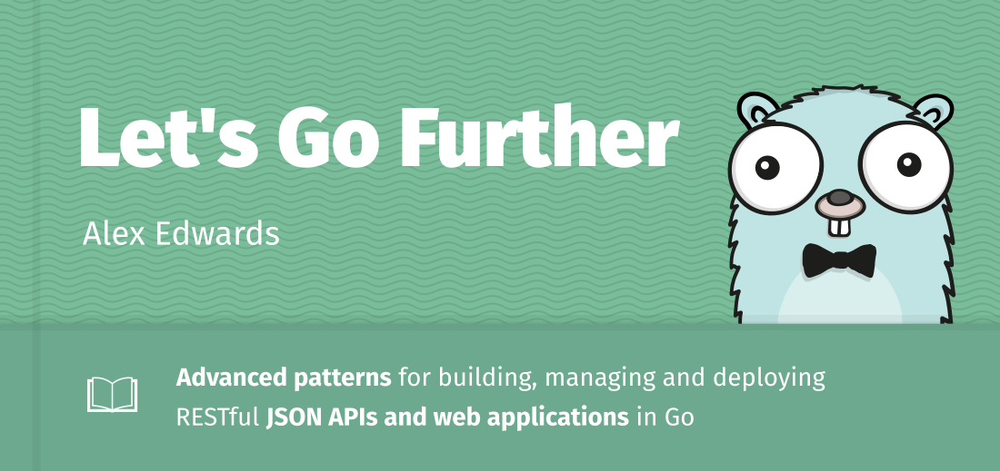

# 结论

在本书的过程中，我们明确地涵盖了很多主题，包括路由、模板、使用数据库、身份验证/授权、使用 HTTPS、使用 Go 的测试包等等。

但也有一些其他的，更默契的教训。我们用来实现功能的模式——以及我们项目代码的组织和链接方式——是你应该能够在未来工作中采用和应用的东西。

重要的是，我还希望这本书传达出在 Go 中构建 Web 应用程序不需要框架。 Go 的标准库几乎包含了你需要的所有工具……即使是一个中等复杂的应用程序。在你确实需要特定任务帮助的时候——比如会话管理、路由或密码散列——你可以使用轻量级和专注的第三方包。

在这一点上，如果你已经和本书一起编码了，我建议你花点时间回顾一下你到目前为止编写的代码。当你完成它时，确保你清楚代码库的每个部分的作用，以及它如何与整个项目相适应。

你可能还想回到本书中你第一次发现难以理解的任何部分。例如，现在你更熟悉 Go，http.Handler 接口章节可能更容易理解。或者，既然你已经了解了在我们的应用程序中如何处理测试，我们在设计数据库模型章节时所做的决定可能会适得其反。

如果你购买了本书的 Professional Package 版本，那么我强烈建议你完成第 16 章（就在最后）中的指导练习。它们应该有助于巩固你所学的知识，并且半独立地学习它们会给你一些额外的练习，以便在你自己的项目中使用这些模式和技术之前。

## 让我们走得更远

如果你想继续学习更多，那么你可能需要查看让我们走得更远。它是本书的后续内容，涵盖了用于开发、管理和部署 API 和 Web 应用程序的更高级模式。

它指导你完成 RESTful JSON API 从头到尾的构建和部署，包括以下主题：

- 发送和接收 JSON
- 使用 SQL 迁移
- 管理后台任务
- 执行部分更新并使用乐观锁定
- 基于权限的授权
- 控制 CORS 请求
- 优雅关机
- 公开应用程序指标
- 自动化构建和部署步骤

你可以查看这本书的样本，并在 https://lets-go-further.alexedwards.net 上获取更多信息和常见问题解答。

> 作为给现有读者的小礼物，你还可以在结账时使用折扣代码 FURTHER15 获得 15% 的折扣。
