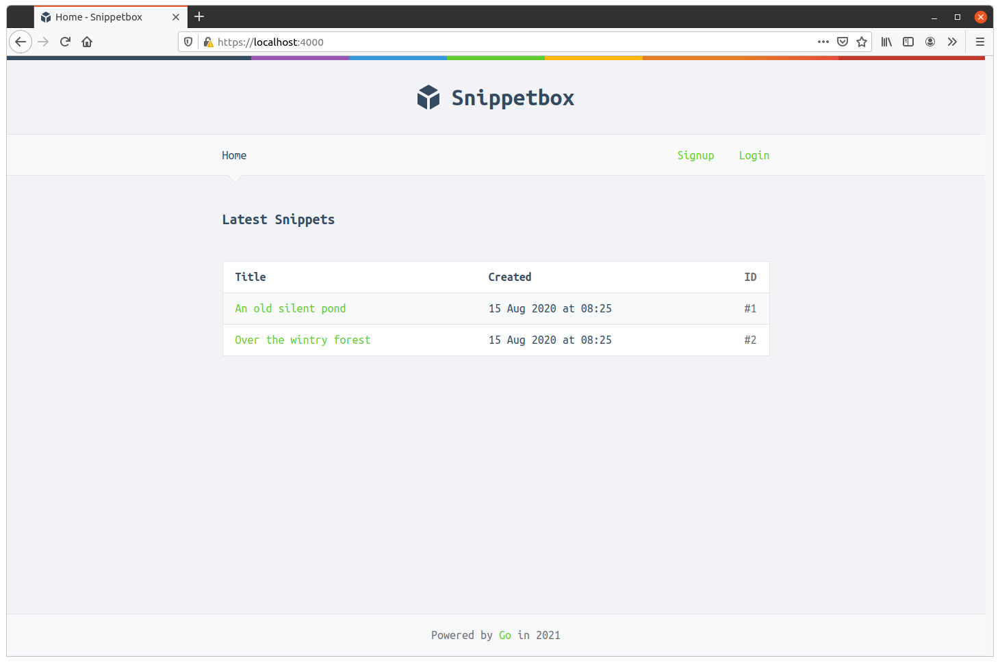
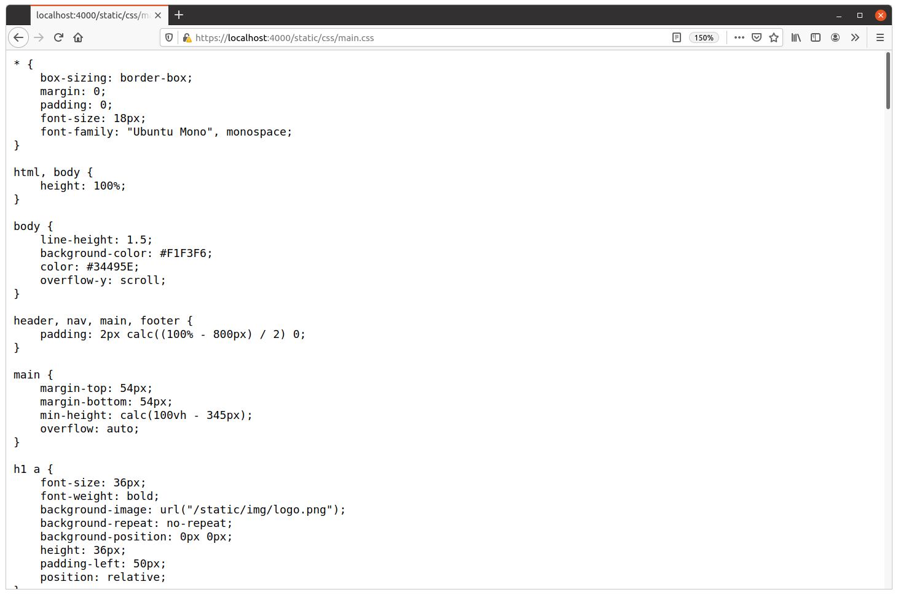

# 附录

- 嵌入文件
- HTTPS 的工作原理
- 进一步阅读和有用的链接

## 嵌入文件

Go 1.16 版本的主要功能之一是新的 embed 包，它可以将外部文件嵌入到 Go 程序本身中。

这个特性非常好，因为它可以创建（并随后分发）完全独立的 Go 程序，并且具有作为二进制可执行文件的一部分运行所需的一切。

为了说明如何使用 embed 包，我们将更新我们的应用程序以嵌入和使用我们现有 ui 目录中的文件（当前这包含我们的静态 CSS/JavaScript/图像文件和 HTML 模板）。

如果你想继续，首先创建一个新的 ui/ui.go 文件：

```sh
$ touch ui/ui.go
```

然后添加以下代码：

文件：ui/ui.go

```go
package ui

import (
	"embed"
)

//go:embed "html" "static"
var Files embed.FS
```

这里重要的一行是 //go:embed "html" "static"。

这看起来像一个注释，但它实际上是一个特殊的注释指令。当我们的应用程序被编译时，这个注释指令指示 Go 将我们 ui/html 和 ui/static 文件夹中的文件存储在全局变量 Files 引用的 embed.FS 嵌入式文件系统中。

关于这一点，我们需要解释一些重要的细节：

- 注释指令必须紧邻要存储嵌入文件的变量上方。
- 该指令具有通用格式 go:embed <paths>，并且可以在一个指令中指定多个路径（就像我们在上面的代码中那样）。路径应该相对于包含指令的源代码文件。所以在我们的例子中， go:embed "static" "html" 将目录 ui/static 和 ui/html 嵌入到我们的项目文件夹中。
- 你只能在包级别对全局变量使用 go:embed 指令，而不能在函数或方法中使用。如果你尝试在函数或方法中使用它，则会在编译时收到错误“go:embed 无法应用于 func 内的 var”。
- 路径不能不包含 .或 .. 元素，也不能以 / 开头或结尾。这实质上限制了你只能嵌入包含在与具有 go:embed 指令的源代码相同的目录（或子目录）中的文件。
- 如果路径指向一个目录，则该目录中的所有文件都将递归嵌入，但名称以 .或者 _。如果你想包含这些文件，你应该在路径中使用 * 通配符，例如 go:embed "static/*"。路径分隔符应始终为正斜杠，即使在 Windows 机器上也是如此。
- 嵌入式文件系统始终位于包含 go:embed 指令的目录中。

### 使用静态文件

让我们切换我们的应用程序，让它为我们的静态 CSS、JavaScript 和来自嵌入式文件系统的图像文件提供服务——而不是在运行时从磁盘读取它们。

打开你的 cmd/web/routes.go 文件并按如下方式更新它：

文件：cmd/web/routes.go

```go
package main

import (
	"net/http"

	"alexedwards.net/snippetbox/ui" // New import

	"github.com/bmizerany/pat"
	"github.com/justinas/alice"
)

func (app *application) routes() http.Handler {
    standardMiddleware := alice.New(app.recoverPanic, app.logRequest, secureHeaders)
    dynamicMiddleware := alice.New(app.session.Enable, noSurf, app.authenticate)

    mux := pat.New()
    mux.Get("/", dynamicMiddleware.ThenFunc(app.home))
    mux.Get("/snippet/create", dynamicMiddleware.Append(app.requireAuthentication).ThenFunc(app.createSnippetForm))
    mux.Post("/snippet/create", dynamicMiddleware.Append(app.requireAuthentication).ThenFunc(app.createSnippet))
    mux.Get("/snippet/:id", dynamicMiddleware.ThenFunc(app.showSnippet))

    mux.Get("/user/signup", dynamicMiddleware.ThenFunc(app.signupUserForm))
    mux.Post("/user/signup", dynamicMiddleware.ThenFunc(app.signupUser))
    mux.Get("/user/login", dynamicMiddleware.ThenFunc(app.loginUserForm))
    mux.Post("/user/login", dynamicMiddleware.ThenFunc(app.loginUser))
    mux.Post("/user/logout", dynamicMiddleware.Append(app.requireAuthentication).ThenFunc(app.logoutUser))

    mux.Get("/ping", http.HandlerFunc(ping))

	// Take the ui.Files embedded filesystem and convert it to a http.FS type so that 
	// it satisfies the http.FileSystem interface. We then pass that to the 
	// http.FileServer() function to create the file server handler.
	fileServer := http.FileServer(http.FS(ui.Files))

	// Our static files are contained in the "static" folder of the ui.Files embedded 
	// filesystem. So, for example, our CSS stylesheet is located at 
	// "static/css/main.css". This means that we now longer need to strip the prefix 
	// from the request URL -- any requests that start with /static/ can just be passed 
	// directly to the file server and the corresponding static file will be served 
	// (so long as it exists).
	mux.Get("/static/", fileServer)

	return standardMiddleware.Then(mux)
}
```

如果你保存文件然后重新启动应用程序，你应该会发现一切都可以正确编译和运行。当你在浏览器中访问 https://localhost:4000 时，应该从嵌入式文件系统提供静态文件，并且一切看起来都正常。



如果需要，你还可以直接导航到静态文件以检查它们是否仍然可用。例如，访问 https://localhost:4000/static/css/main.css 应显示来自嵌入式文件系统的网页的 CSS 样式表。



### 嵌入 HTML 模板

接下来让我们更新 cmd/web/templates.go 文件，以便我们的模板缓存使用来自 ui.Files 的嵌入 HTML 模板文件，而不是磁盘上的文件。

这有点复杂，我们必须利用 Go 1.16 为处理文件系统而引入的一些新的特殊功能。

文件：cmd/web/templates.go

```go
package main

import (
	"html/template"
	"io/fs" // New import
	"path/filepath"
	"time"

	"alexedwards.net/snippetbox/pkg/forms"
	"alexedwards.net/snippetbox/pkg/models"
	"alexedwards.net/snippetbox/ui" // New import
)

...

// Change the function signature so that it does not accept the template directory 
// location as a parameter anymore.
func newTemplateCache() (map[string]*template.Template, error) {
	cache := map[string]*template.Template{}

	// Use fs.Glob() to get a slice of all filepaths in the ui.Files embedded filesystem 
	// which match the pattern 'html/*.page.tmpl'. This essentially gives us a slice of 
	// all the 'page' templates for the application, just like before.
	pages, err := fs.Glob(ui.Files, "html/*.page.tmpl")
	if err != nil {
		return nil, err
	}

	for _, page := range pages {
		name := filepath.Base(page)

		// Use the ParseFS() method to parse a specific page template from the ui.Files
		// embedded filesystem.
		ts, err := template.New(name).Funcs(functions).ParseFS(ui.Files, page)
		if err != nil {
			return nil, err
		}

		// Use ParseFS() again to add any 'layout' templates to the template set.
		ts, err = ts.ParseFS(ui.Files, "html/*.layout.tmpl")
		if err != nil {
			return nil, err
		}

		// Likewise use ParseFS() to add any 'partial' templates to the template set.
		ts, err = ts.ParseFS(ui.Files, "html/*.partial.tmpl")
		if err != nil {
			return nil, err
		}

		cache[name] = ts
	}

	return cache, nil
}
```

现在我们已经进行了这个更改，我们不再需要将模板目录位置作为参数从 main() 函数中传递。

因此，如果你正在跟进，请继续更新 cmd/web/main.go 文件，如下所示：

文件：cmd/web/main.go

```go
package main

...

func main() {
	addr := flag.String("addr", ":4000", "HTTP network address")
	debug := flag.Bool("debug", false, "Enable debug mode")
	dsn := flag.String("dsn", "web:pass@/snippetbox?parseTime=true", "MySQL data source name")
	secret := flag.String("secret", "s6Ndh+pPbnzHbS*+9Pk8qGWhTzbpa@ge", "Secret key")
	flag.Parse()

	infoLog := log.New(os.Stdout, "INFO\t", log.Ldate|log.Ltime)
	errorLog := log.New(os.Stderr, "ERROR\t", log.Ldate|log.Ltime|log.Lshortfile)

	db, err := openDB(*dsn)
	if err != nil {
		errorLog.Fatal(err)
	}
	defer db.Close()

	// Remove the template directory location parameter.
	templateCache, err := newTemplateCache()
	if err != nil {
		errorLog.Fatal(err)
	}

    ...
}

...
```

最后，我们需要更新 cmd/web/testutils_test.go 文件中的 newTestApplication() 函数以删除模板目录参数：

文件：cmd/web/testutils_test.go

```go
package main

...

func newTestApplication(t *testing.T) *application {
	// Remove the template directory location parameter.
	templateCache, err := newTemplateCache()
	if err != nil {
		t.Fatal(err)
	}

	session := sessions.New([]byte("3dSm5MnygFHh7XidAtbskXrjbwfoJcbJ"))
	session.Lifetime = 12 * time.Hour
	session.Secure = true

	return &application{
		errorLog:      log.New(io.Discard, "", 0),
		infoLog:       log.New(io.Discard, "", 0),
		session:       session,
		snippets:      &mock.SnippetModel{},
		templateCache: templateCache,
		users:         &mock.UserModel{},
	}
}

...
```

现在完成了，当我们的应用程序被构建到一个二进制文件中时，它将包含它运行所需的所有 UI 文件。

你可以通过在 /tmp 目录中构建可执行二进制文件、复制 TLS 证书并运行二进制文件来快速尝试这一点。像这样：

```sh
$ go build -o /tmp/web ./cmd/web/
$ cp -r ./tls /tmp/
$ cd /tmp/
$ ./web 
INFO    2021/05/15 12:43:12 Starting server on :4000
```

同样，你应该能够在浏览器中访问 https://localhost:4000 并且一切都应该正常工作——尽管二进制文件位于它无法访问磁盘上原始 UI 文件的位置。


注意：如果你想了解有关构建二进制文件和部署应用程序的知识，可以在让我们走得更远中找到更多信息和详细说明。

## HTTPS 的工作原理

你可以认为 TLS 连接发生在两个阶段。第一阶段是握手，客户端验证服务器是否可信并生成一些 TLS 会话密钥。第二阶段是数据的实际传输，其中使用握手期间生成的 TLS 会话密钥对数据进行加密和签名。

总之，它是这样工作的：

1. 建立 TCP 连接并开始 TLS 握手。客户端向 Web 服务器发送它支持的 TLS 版本和密码套件的列表（密码套件本质上是一个标识符，描述了连接应该使用的不同加密算法）。
2. Web 服务器发送客户端确认的 TLS 版本和它选择的密码套件。从这里开始，精确的过程取决于选择的密码套件。但是为了这个解释，我假设使用了密码套件 TLS_RSA_WITH_AES_128_GCM_SHA256。
3. 密码套件的第一部分指示要使用的密钥交换算法（在本例中为 RSA）。 Web 服务器发送其 TLS 证书（其中包含其 RSA 公钥）。然后，客户端验证 TLS 证书未过期且可信。 Web 浏览器安装了所有主要证书颁发机构的公钥，它们可以用来验证 Web 服务器的证书确实是由受信任的证书颁发机构签署的。客户端还确认 TLS 证书中指定的主机是它具有开放连接的主机。
4. 客户端生成秘密会话密钥。它使用服务器的 RSA 公钥（来自 TLS 证书）对它们进行加密，并将它们发送到使用 RSA 私钥解密的 Web 服务器。这称为密钥交换。客户端和 Web 服务器现在都可以访问相同的会话密钥，其他方都不应该知道它们。这是 TLS 握手的结束。
5. 现在可以开始传输实际数据了。数据被分解为记录（通常最大为 16KB）。客户端使用其中一个会话密钥和密码套件（在我们的示例中为 SHA256）指示的消息身份验证代码算法计算每条记录的 HMAC，并将其附加到记录中。然后，客户端使用另一个会话密钥和密码套件指示的批量加密算法（在我们的示例中为 AES_128_GCM — 在 Galois/Counter 模式下为 AES-128）对记录进行加密。
6. 加密的签名记录被发送到服务器。然后，使用会话密钥，服务器可以解密记录并验证签名是否正确。

在这个过程中使用了两种不同类型的加密。该过程的 TLS 握手部分使用非对称加密 (RSA) 来安全地共享会话密钥，而数据的实际传输使用对称加密/解密 (AES)，这要快得多。

你可能还想观看 Johannes Bickel 的精彩视频，该视频直观地说明了 TLS 握手过程，并可能有助于阐明其工作原理。

### 前向保密 / ECDHE

上述过程的一个显着例外是所选密码套件在握手期间使用临时椭圆曲线 Diffie-Hellman (ECDHE) 密钥交换。

例如，如果选择密码套件 TLS_ECDHE_RSA_WITH_AES_128_GCM_SHA256，则将使用 ECDHE。注意到开头的 ECDHE_RSA 了吗？

在密钥交换算法中使用 ECDHE 稍微改变了上述总结中的步骤 3 和 4。除了在握手过程中发送 TLS 证书外，服务器还会动态生成 ECDHE 密钥对并将 ECDHE 公钥发送给客户端。它使用自己的 RSA 私钥对发送的内容进行签名。

在步骤 4 中，客户端然后使用 ECDHE 公钥加密会话密钥，而不是包含在 Web 服务器的 TLS 证书中的 RSA 公钥。

使用 ECDHE 变体进行密钥交换的优势在于，在每次握手中使用不同的公钥对秘密会话密钥进行加密，而不是每次使用来自 TLS 证书的相同公钥。如果有人正在记录流量（例如政府大规模监视），它有助于保护未来的隐私。没有它，任何在未来（例如通过获得授权）访问 Web 服务器的 RSA 私钥的人都可以解密流量。

通过使用动态生成的 ECDHE 密钥，不再仅通过获取 Web 服务器的私钥就可以破解会话密钥。这意味着属于每个单独连接的会话密钥必须单独泄露。

通常，最好选择 ECDHE 密码套件变体，除非你明确需要其他设备来读取你的流量（例如网络监视器）。

## 进一步阅读和有用的链接

### 编码风格指南

- [Effective Go](https://go.dev/doc/effective_go) — 编写清晰、惯用的 Go 代码的技巧。
- [清晰胜于聪明](https://dave.cheney.net/practical-go/presentations/qcon-china.html) [视频] — 来自 GopherCon 新加坡 2019 的戴夫·切尼 (Dave Cheney) 的演讲
- [Go Code Review Comments](https://github.com/golang/go/wiki/CodeReviewComments) — 风格指南以及要避免的常见错误。
- [Practical Go](https://dave.cheney.net/practical-go/presentations/qcon-china.html)——现实世界中关于编写可维护 Go 程序的建议。
- [名字里有什么？](https://talks.golang.org/2014/names.slide#1) — 在 Go 中命名事物的指南。

### 推荐教程

- [国际化和本地化分步指南](https://phrase.com/blog/posts/internationalization-i18n-go/)
- [Go 工具概述](https://www.alexedwards.net/blog/an-overview-of-go-tooling)
- [数据竞争与竞争条件](https://cronokirby.github.io/posts/data-races-vs-race-conditions/)
- [错误值常见问题](https://github.com/golang/go/wiki/ErrorValueFAQ)
- [生成安全随机数](https://blog.questionable.services/article/generating-secure-random-numbers-crypto-rand/)
- [Go 1.11 模块](https://github.com/golang/go/wiki/Modules)
- [如何在 Go 中编写基准测试](https://dave.cheney.net/2013/06/30/how-to-write-benchmarks-in-go)
- [HTTP/2 服务器推送](https://rakyll.org/http2push/)
- [接口解释](https://www.alexedwards.net/blog/interfaces-explained)
- [通过插图学习 Go 的并发性](https://medium.com/@trevor4e/learning-gos-concurrency-through-illustrations-8c4aff603b3)
- [新 Golang 开发人员的陷阱、陷阱和常见错误](http://devs.cloudimmunity.com/gotchas-and-common-mistakes-in-go-golang/)
- [了解 Mutexes](https://www.alexedwards.net/blog/understanding-mutexes)
- [使用用户定义的标志类型](http://blog.ralch.com/tutorial/golang-custom-flags/)

### 第三方包列表

- [Awesome Go](https://github.com/avelino/awesome-go) — 大量流行的第三方 Go 软件包列表。
- [Go Projects](https://github.com/golang/go/wiki/Projects) — 另一个第三方 Go 包列表。
