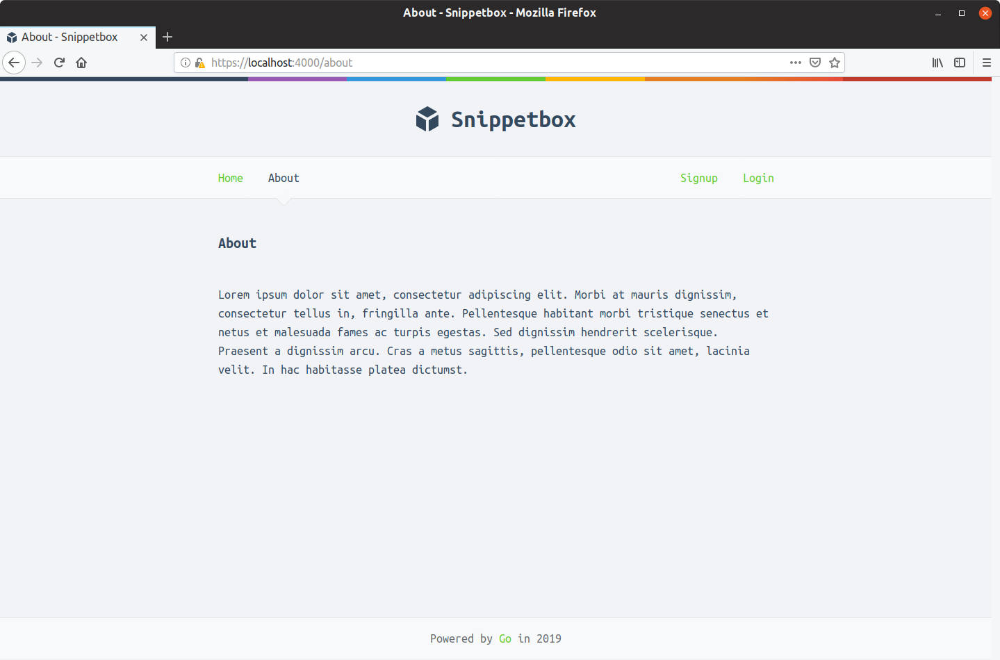
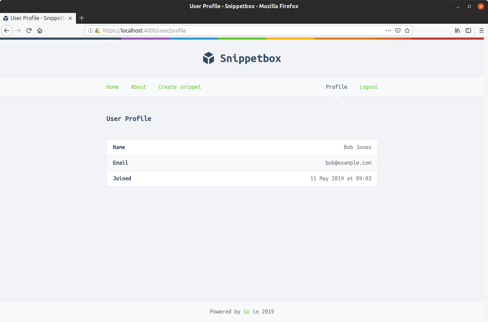
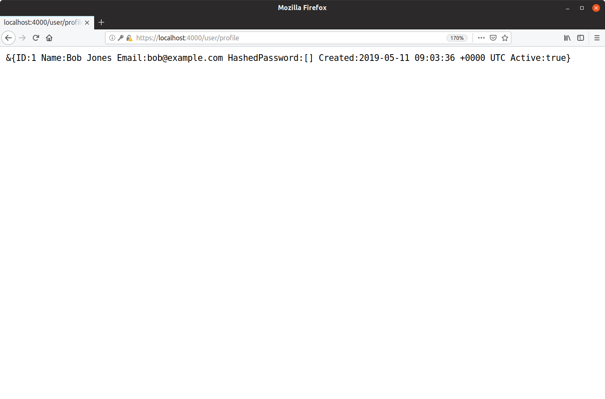
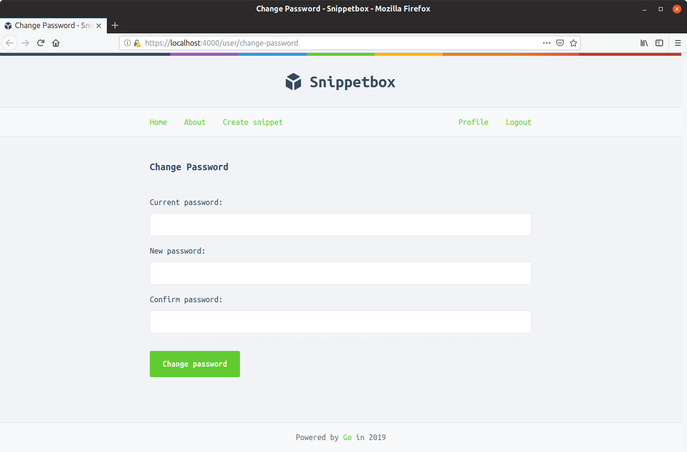
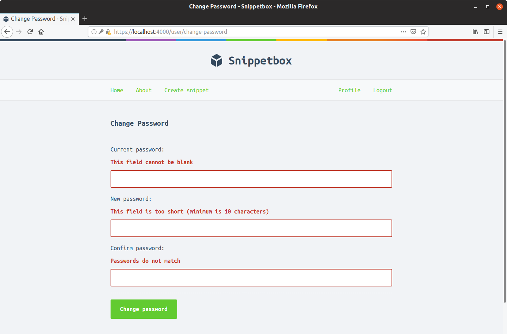
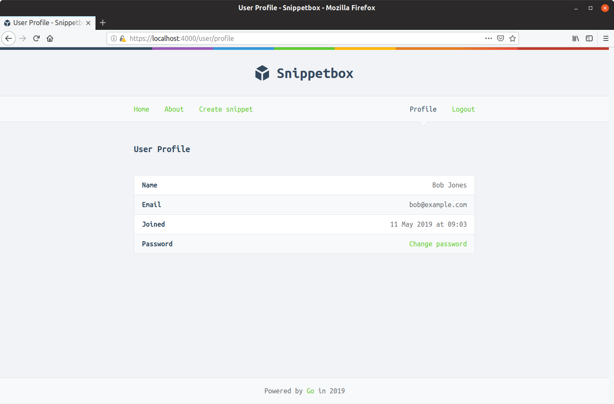
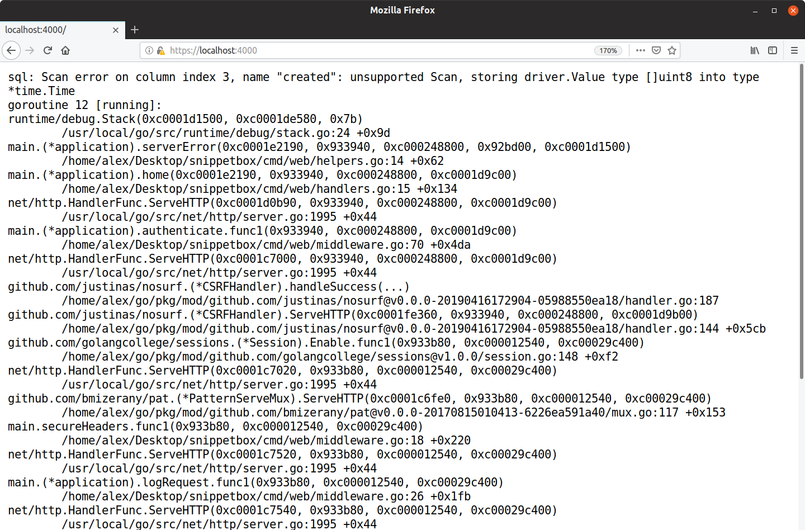

# 指导练习

在本节中有六个指导练习供你尝试，所有这些练习都扩展了我们一直在创建的当前 Snippetbox 应用程序，以包含一些附加功能。

这些练习利用了我们在本书中已经涵盖的代码模式和技术，只是应用于稍微不同的上下文。因此，通过它们是测试你对所学知识的理解的好机会，并练习自己将其付诸实践。

每个练习都被分解成几个小的步骤。对于每一步，我都链接到一个包含一些“建议代码”的答案，如果遇到困难，你可能希望查看这些代码。你可能还会发现将建议的代码与你的代码进行比较和对比会很有趣——无论是在练习结束时还是进行时。如果你的代码看起来略有不同，不用担心。实现同一目标的方法不止一种。

在我们开始之前的最后一点：本节中的几个练习是相互建立的，因此我建议你尽可能按顺序完成它们。

## 向应用程序添加关于页面

本练习的目标是向应用程序添加一个新的“关于”页面。它应该映射到 GET /about 路由，对经过身份验证和未经身份验证的用户都可用，看起来类似于：



#### 第1步

创建一个映射到新的 about 处理程序的 GET /about 路由。考虑哪个中间件堆栈适合使用的路由。

#### 第2步

创建一个新的 ui/html/about.page.tmpl 文件，遵循我们用于应用程序其他页面的相同模板模式。包括“关于”页面的标题、标题和一些占位符副本。

#### 第 3 步

更新应用程序的主导航栏以包含指向新“关于”页面的链接（该链接应该对所有用户可见）。

#### 第四步

更新 about 处理程序，使其呈现你刚刚创建的 about.page.tmpl 文件。然后通过在浏览器中访问 https://localhost:4000/about 来检查新页面和导航是否有效。

### 建议代码

#### 步骤 1 的建议代码

文件：cmd/web/handlers.go

```go
package main

...

func (app *application) about(w http.ResponseWriter, r *http.Request) {
    // Some code will go here later...
}
```

文件：cmd/web/routes.go

```go
package main

...

func (app *application) routes() http.Handler {
    standardMiddleware := alice.New(app.recoverPanic, app.logRequest, secureHeaders)
    dynamicMiddleware := alice.New(app.session.Enable, noSurf, app.authenticate)

    mux := pat.New()
    mux.Get("/", dynamicMiddleware.ThenFunc(app.home))
    // Add the about route.
    mux.Get("/about", dynamicMiddleware.ThenFunc(app.about))
    mux.Get("/snippet/create", dynamicMiddleware.Append(app.requireAuthentication).ThenFunc(app.createSnippetForm))
    mux.Post("/snippet/create", dynamicMiddleware.Append(app.requireAuthentication).ThenFunc(app.createSnippet))
    mux.Get("/snippet/:id", dynamicMiddleware.ThenFunc(app.showSnippet))

    mux.Get("/user/signup", dynamicMiddleware.ThenFunc(app.signupUserForm))
    mux.Post("/user/signup", dynamicMiddleware.ThenFunc(app.signupUser))
    mux.Get("/user/login", dynamicMiddleware.ThenFunc(app.loginUserForm))
    mux.Post("/user/login", dynamicMiddleware.ThenFunc(app.loginUser))
    mux.Post("/user/logout", dynamicMiddleware.Append(app.requireAuthentication).ThenFunc(app.logoutUser))

    mux.Get("/ping", http.HandlerFunc(ping))

    fileServer := http.FileServer(http.Dir("./ui/static/"))
    mux.Get("/static/", http.StripPrefix("/static", fileServer))

    return standardMiddleware.Then(mux)
}
```

#### 步骤 2 的建议代码

文件：ui/html/about.page.tmpl

```html
{{template "base" .}}

{{define "title"}}About{{end}}

{{define "main"}}
    <h2>About</h2>
    <p>Lorem ipsum dolor sit amet, consectetur adipiscing elit. Morbi at mauris dignissim,
    consectetur tellus in, fringilla ante. Pellentesque habitant morbi tristique senectus
    et netus et malesuada fames ac turpis egestas. Sed dignissim hendrerit scelerisque.</p>
    <p>Praesent a dignissim arcu. Cras a metus sagittis, pellentesque odio sit amet,
    lacinia velit. In hac habitasse platea dictumst. </p>
{{end}}
```

#### 步骤 3 的建议代码

文件：ui/html/base.layout.tmpl

```html
{{define "base"}}
<!doctype html>
<html lang='en'>
    <head>
        <meta charset='utf-8'>
        <title>{{template "title" .}} - Snippetbox</title>
        <link rel='stylesheet' href='/static/css/main.css'>
        <link rel='shortcut icon' href='/static/img/favicon.ico' type='image/x-icon'>
        <link rel='stylesheet' href='https://fonts.googleapis.com/css?family=Ubuntu+Mono:400,700'>
    </head>
    <body>
        <header>
            <h1><a href='/'>Snippetbox</a></h1>
        </header>
        <nav>
            <div>
                <a href='/'>Home</a>
                <!-- Include a new link, visible to all users -->
                <a href='/about'>About</a>
                {{if .IsAuthenticated}}
                    <a href='/snippet/create'>Create snippet</a>
                {{end}}
            </div>
            <div>
                {{if .IsAuthenticated}}
                    <form action='/user/logout' method='POST'>
                        <input type='hidden' name='csrf_token' value='{{.CSRFToken}}'>
                        <button>Logout</button>
                    </form>
                {{else}}
                    <a href='/user/signup'>Signup</a>
                    <a href='/user/login'>Login</a>
                {{end}}
            </div>
        </nav>
        <main>
            {{with .Flash}}
            <div class='flash '>{{.}}</div>
            {{end}}
            {{template "main" .}}
        </main>
        {{template "footer" .}}
        <script src="/static/js/main.js" type="text/javascript"></script>
    </body>
</html>
{{end}}
```

#### 步骤 4 的建议代码

文件：cmd/web/handlers.go

```go
package main

...

func (app *application) about(w http.ResponseWriter, r *http.Request) {
	app.render(w, r, "about.page.tmpl", nil)
}
```

## 测试 CreateSnippetForm 处理程序

你在本练习中的目标是为 GET /snippet/create 路由创建端到端测试。具体来说，你要测试：

未经身份验证的用户被重定向到登录表单。
向经过身份验证的用户显示用于创建新代码段的表单。

#### 第1步

在你的 cmd/web/handlers_test.go 文件中创建一个新的 TestCreateSnippetForm 测试。在此测试中，使用端到端测试章节中的模式和帮助程序使用应用程序路由和模拟依赖项初始化新的测试服务器。

#### 第2步

创建一个名为“Unauthenticated”的子测试。在此子测试中，以未经身份验证的用户身份对测试服务器发出 GET /snippet/create 请求。验证响应是否具有状态代码 302 和 Location: /user/login 标头。再次重用我们在端到端测试章节中创建的助手。

#### 第 3 步

创建另一个名为“Authenticated”的子测试。在这个子测试中，模拟以用户身份登录进行身份验证的工作流程。具体来说，你需要发出 GET /user/login 请求，提取 CSRF 令牌从响应正文，然后使用模拟用户模型中的凭据（“alice@example.com”的电子邮件，密码“”）发出 POST /user/login 请求。

然后，一旦你通过身份验证，发出 GET /snippet/create 请求并验证你是否收到状态代码 200 和包含文本 \<form action='/snippet/create' method='POST'\> 的 HTML 正文。

### 建议代码

文件：cmd/web/handlers_test.go

```go
...

func TestCreateSnippetForm(t *testing.T) {
	app := newTestApplication(t)
	ts := newTestServer(t, app.routes())
	defer ts.Close()
}
```

#### 步骤 2 的建议代码

文件：cmd/web/handlers_test.go

```go
...

func TestCreateSnippetForm(t *testing.T) {
	app := newTestApplication(t)
	ts := newTestServer(t, app.routes())
	defer ts.Close()

	t.Run("Unauthenticated", func(t *testing.T) {
		code, headers, _ := ts.get(t, "/snippet/create")
		if code != http.StatusSeeOther {
			t.Errorf("want %d; got %d", http.StatusSeeOther, code)
		}
		if headers.Get("Location") != "/user/login" {
			t.Errorf("want %s; got %s", "/user/login", headers.Get("Location"))
		}
	})
}
```

```sh
$ go test -v -run=TestCreateSnippetForm ./cmd/web/
=== RUN   TestCreateSnippetForm
=== RUN   TestCreateSnippetForm/Unauthenticated
--- PASS: TestCreateSnippetForm (0.00s)
    --- PASS: TestCreateSnippetForm/Unauthenticated (0.00s)
PASS
ok  	alexedwards.net/snippetbox/cmd/web	0.006s
```

#### 步骤 3 的建议代码

文件：cmd/web/handlers_test.go

```go
...

func TestCreateSnippetForm(t *testing.T) {
	app := newTestApplication(t)
	ts := newTestServer(t, app.routes())
	defer ts.Close()

	t.Run("Unauthenticated", func(t *testing.T) {
		code, headers, _ := ts.get(t, "/snippet/create")
		if code != http.StatusSeeOther {
			t.Errorf("want %d; got %d", http.StatusSeeOther, code)
		}
		if headers.Get("Location") != "/user/login" {
			t.Errorf("want %s; got %s", "/user/login", headers.Get("Location"))
		}
	})

	t.Run("Authenticated", func(t *testing.T) {
		// Authenticate the user...
		_, _, body := ts.get(t, "/user/login")
		csrfToken := extractCSRFToken(t, body)

		form := url.Values{}
		form.Add("email", "alice@example.com")
		form.Add("password", "")
		form.Add("csrf_token", csrfToken)
		ts.postForm(t, "/user/login", form)

		// Then check that the authenticated user is shown the create snippet form.
		code, _, body := ts.get(t, "/snippet/create")
		if code != 200 {
			t.Errorf("want %d; got %d", 200, code)
		}

		formTag := "<form action='/snippet/create' method='POST'>"
		if !bytes.Contains(body, []byte(formTag)) {
			t.Errorf("want body %s to contain %q", body, formTag)
		}
	})
}
```

```sh
$ go test -v -run=TestCreateSnippetForm ./cmd/web/
=== RUN   TestCreateSnippetForm
=== RUN   TestCreateSnippetForm/Unauthenticated
=== RUN   TestCreateSnippetForm/Authenticated
--- PASS: TestCreateSnippetForm (0.00s)
    --- PASS: TestCreateSnippetForm/Unauthenticated (0.00s)
    --- PASS: TestCreateSnippetForm/Authenticated (0.00s)
PASS
ok      alexedwards.net/snippetbox/cmd/web      0.008s
```

### 将用户配置文件页面添加到应用程序

本练习的目标是向应用程序添加一个新的“用户配置文件”页面。它应该映射到 GET /user/profile 路由并显示当前已验证用户的姓名、电子邮件地址和注册日期，类似于：



#### 第1步

创建一个映射到新 userProfile 处理程序的 GET /user/profile 路由。该路由应仅限于经过身份验证的用户。

#### 第2步

更新 userProfile 处理程序以从会话中获取“authenticatedUserID”，从数据库中获取相关用户的详细信息，并将它们转储到纯文本 HTTP 响应中。当你以经过身份验证的用户身份在浏览器中访问 https://localhost:4000/user/profile 时，你应该得到类似于以下内容的响应：



#### 第 3 步

创建一个新的 ui/html/profile.page.tmpl 文件，该文件在表格中显示用户信息。然后更新 userProfile 处理程序以呈现这个新模板，通过 templateData 结构传递用户的详细信息。

#### 第四步

此外，更新站点的主导航栏以包含指向个人资料页面的链接（仅对经过身份验证的用户可见）。然后通过在登录时在浏览器中访问 https://localhost:4000/user/profile 来检查新页面和导航是否按预期工作。

### 建议代码

#### 步骤 1 的建议代码

文件：cmd/web/handlers.go

```go
...

func (app *application) userProfile(w http.ResponseWriter, r *http.Request) {
	// Some code will go here later...
}
```

文件：cmd/web/routes.go

```go
...


func (app *application) routes() http.Handler {
	standardMiddleware := alice.New(app.recoverPanic, app.logRequest, secureHeaders)
	dynamicMiddleware := alice.New(app.session.Enable, noSurf, app.authenticate)

	mux := pat.New()
	mux.Get("/", dynamicMiddleware.ThenFunc(app.home))
	mux.Get("/about", dynamicMiddleware.ThenFunc(app.about))
	mux.Get("/snippet/create", dynamicMiddleware.Append(app.requireAuthentication).ThenFunc(app.createSnippetForm))
	mux.Post("/snippet/create", dynamicMiddleware.Append(app.requireAuthentication).ThenFunc(app.createSnippet))
	mux.Get("/snippet/:id", dynamicMiddleware.ThenFunc(app.showSnippet))

	mux.Get("/user/signup", dynamicMiddleware.ThenFunc(app.signupUserForm))
	mux.Post("/user/signup", dynamicMiddleware.ThenFunc(app.signupUser))
	mux.Get("/user/login", dynamicMiddleware.ThenFunc(app.loginUserForm))
	mux.Post("/user/login", dynamicMiddleware.ThenFunc(app.loginUser))
    mux.Post("/user/logout", dynamicMiddleware.Append(app.requireAuthentication).ThenFunc(app.logoutUser))
    // Add the user profile route. Use the requireAuthentication middleware to
    // restrict access to authenticated users only.
	mux.Get("/user/profile", dynamicMiddleware.Append(app.requireAuthentication).ThenFunc(app.userProfile))

	mux.Get("/ping", http.HandlerFunc(ping))

	fileServer := http.FileServer(http.Dir("./ui/static/"))
	mux.Get("/static/", http.StripPrefix("/static", fileServer))

	return standardMiddleware.Then(mux)
}
```

#### 步骤 2 的建议代码

文件：cmd/web/handlers.go

```go
...

func (app *application) userProfile(w http.ResponseWriter, r *http.Request) {
	userID := app.session.GetInt(r, "authenticatedUserID")

	user, err := app.users.Get(userID)
	if err != nil {
		app.serverError(w, err)
		return
	}

	fmt.Fprintf(w, "%+v", user)
}
```

#### 步骤 3 的建议代码

文件：cmd/web/templates.go

```go
...

type templateData struct {
	CSRFToken       string
	CurrentYear     int
	Flash           string
	Form            *forms.Form
	IsAuthenticated bool
	Snippet         *models.Snippet
	Snippets        []*models.Snippet
	User            *models.User // Add a User field.
}
```

文件：ui/html/profile.page.tmpl

```html
{{template "base" .}}

{{define "title"}}User Profile{{end}}

{{define "main"}}
    <h2>User Profile</h2>
    {{with .User}}
     <table>
        <tr>
            <th>Name</th>
            <td>{{.Name}}</td>
        </tr>
        <tr>
            <th>Email</th>
            <td>{{.Email}}</td>
        </tr>
        <tr>
            <th>Joined</th>
            <td>{{humanDate .Created}}</td>
        </tr>
    </table>
    {{end }}
{{end}}
```

文件：cmd/web/handlers.go

```go
...

func (app *application) userProfile(w http.ResponseWriter, r *http.Request) {
	userID := app.session.GetInt(r, "authenticatedUserID")

	user, err := app.users.Get(userID)
	if err != nil {
		app.serverError(w, err)
		return
	}

	app.render(w, r, "profile.page.tmpl", &templateData{
		User: user,
	})
}
```

#### 步骤 4 的建议代码

文件：ui/html/base.layout.tmpl

```html
{{define "base"}}
<!doctype html>
<html lang='en'>
    <head>
        <meta charset='utf-8'>
        <title>{{template "title" .}} - Snippetbox</title>
        <link rel='stylesheet' href='/static/css/main.css'>
        <link rel='shortcut icon' href='/static/img/favicon.ico' type='image/x-icon'>
        <link rel='stylesheet' href='https://fonts.googleapis.com/css?family=Ubuntu+Mono:400,700'>
    </head>
    <body>
        <header>
            <h1><a href='/'>Snippetbox</a></h1>
        </header>
        <nav>
            <div>
                <a href='/'>Home</a>
                <a href='/about'>About</a>
                {{if .IsAuthenticated}}
                    <a href='/snippet/create'>Create snippet</a>
                {{end}}
            </div>
            <div>
                {{if .IsAuthenticated}}
                    <!-- Add the user profile link for authenticated users -->
                    <a href='/user/profile'>Profile</a>
                    <form action='/user/logout' method='POST'>
                        <input type='hidden' name='csrf_token' value='{{.CSRFToken}}'>
                        <button>Logout</button>
                    </form>
                {{else}}
                    <a href='/user/signup'>Signup</a>
                    <a href='/user/login'>Login</a>
                {{end}}
            </div>
        </nav>
        <main>
            {{with .Flash}}
            <div class='flash '>{{.}}</div>
            {{end}}
            {{template "main" .}}
        </main>
        {{template "footer" .}}
        <script src="/static/js/main.js" type="text/javascript"></script>
    </body>
</html>
{{end}}
```

## 实施更改密码功能

你在本练习中的目标是为经过身份验证的用户添加更改其密码的工具，使用的表单类似于以下内容：



你应该确保：

- 向用户询问他们当前的密码并验证它是否与用户表中的散列密码匹配（以确认实际上是他们提出请求）。
- 在更新用户表之前散列他们的新密码。

#### 第1步

创建两个新的路由和处理程序：

- GET /user/change-password 映射到新的 changePasswordForm 处理程序。
- POST /user/change-password 映射到新的 changePassword 处理程序。

两条路由都应仅限于经过身份验证的用户。

#### 第2步

创建一个新的 ui/html/password.page.tmpl 文件，其中包含更改密码表单。该表格应：

- 拥有三个字段：currentPassword、newPassword 和 newPasswordConfirmation。
- 提交时将表单数据 POST 到 /user/change-password。
- 出现验证错误时显示每个字段的错误。
- 出现验证错误时不会重新显示密码。

提示：你可能希望使用我们在用户注册表单上所做的工作作为此处的指南。

然后更新 changePasswordForm 处理程序以显示此表单。当你以经过身份验证的用户身份访问 https://localhost:4000/user/change-password 时，它应该类似于：


#### 第 3 步

更新 changePassword 处理程序以执行以下表单验证检查，并在出现任何故障时重新显示带有相关错误消息的表单。

- 所有三个字段都是必需的。
- newPassword 值的长度必须至少为 10 个字符。
- newPassword 和 newPasswordConfirmation 值必须匹配。



#### 第四步

在你的 pkg/models/mysql/users.go 文件中，使用以下签名创建一个新的 UserModel.ChangePassword() 方法：

```go
func (m *UserModel) ChangePassword(id int, currentPassword, newPassword string) error
```

在这个方法中：

1. 使用 id 参数给定的 ID 检索用户的用户详细信息。
2. 检查 currentPassword 值是否与用户的散列密码匹配。如果不匹配，则返回一个 models.ErrInvalidCredentials 错误。
3. 否则，散列 newPassword 值并更新相关用户的用户表中的 hashed_password 列。

#### 第 5 步

在你的 cmd/web/main.go 文件中，更新应用程序结构以包含你刚刚在用户字段界面中创建的 ChangePassword() 方法。

#### 第 6 步

更新 changePassword 处理程序，以便在表单有效时调用 UserModel.ChangePassword() 方法（请记住，用户 ID 应在会话数据中）。

如果出现 models.ErrInvalidCredentials 错误，请通知用户他们在 currentPassword 表单字段中输入了错误的值。否则，在用户会话中添加一条提示信息，说明他们的密码已成功更改，并将其重定向到用户个人资料页面。

#### 第 7 步

更新用户配置文件页面以包含指向更改密码表单的链接，类似于：



#### 第 8 步

尝试运行应用程序的测试。你应该会失败，因为 mock.UserModel 类型不再满足应用程序结构中指定的接口。通过向模拟添加适当的 ChangePassword() 方法来解决此问题，并确保测试通过。

### 建议代码

#### 步骤 1 的建议代码

文件：cmd/web/handlers.go

```go
...

func (app *application) changePasswordForm(w http.ResponseWriter, r *http.Request) {
	// Some code will go here later...
}

func (app *application) changePassword(w http.ResponseWriter, r *http.Request) {
	// Some code will go here later...
}
```

文件：cmd/web/routes.go

```go
...

func (app *application) routes() http.Handler {
	standardMiddleware := alice.New(app.recoverPanic, app.logRequest, secureHeaders)
	dynamicMiddleware := alice.New(app.session.Enable, noSurf, app.authenticate)

	mux := pat.New()
	mux.Get("/", dynamicMiddleware.ThenFunc(app.home))
	mux.Get("/about", dynamicMiddleware.ThenFunc(app.about))
	mux.Get("/snippet/create", dynamicMiddleware.Append(app.requireAuthentication).ThenFunc(app.createSnippetForm))
	mux.Post("/snippet/create", dynamicMiddleware.Append(app.requireAuthentication).ThenFunc(app.createSnippet))
	mux.Get("/snippet/:id", dynamicMiddleware.ThenFunc(app.showSnippet))

	mux.Get("/user/signup", dynamicMiddleware.ThenFunc(app.signupUserForm))
	mux.Post("/user/signup", dynamicMiddleware.ThenFunc(app.signupUser))
	mux.Get("/user/login", dynamicMiddleware.ThenFunc(app.loginUserForm))
	mux.Post("/user/login", dynamicMiddleware.ThenFunc(app.loginUser))
	mux.Post("/user/logout", dynamicMiddleware.Append(app.requireAuthentication).ThenFunc(app.logoutUser))
    mux.Get("/user/profile", dynamicMiddleware.Append(app.requireAuthentication).ThenFunc(app.userProfile))
	// Add the two new routes. Use the requireAuthentication middleware to
	// restrict access to authenticated users only.
	mux.Get("/user/change-password", dynamicMiddleware.Append(app.requireAuthentication).ThenFunc(app.changePasswordForm))
	mux.Post("/user/change-password", dynamicMiddleware.Append(app.requireAuthentication).ThenFunc(app.changePassword))

	mux.Get("/ping", http.HandlerFunc(ping))

	fileServer := http.FileServer(http.Dir("./ui/static/"))
	mux.Get("/static/", http.StripPrefix("/static", fileServer))

	return standardMiddleware.Then(mux)
}
```

#### 步骤 2 的建议代码

文件：ui/html/password.page.tmpl

```html
{{template "base" .}}

{{define "title"}}Change Password{{end}}

{{define "main"}}
<h2>Change Password</h2>
<form action='/user/change-password' method='POST' novalidate>
    <input type='hidden' name='csrf_token' value='{{.CSRFToken}}'>
    {{with .Form}}
        <div>
            <label>Current password:</label>
            {{with .Errors.Get "currentPassword"}}
                <label class='error'>{{.}}</label>
            {{end}}
            <input type='password' name='currentPassword'>
        </div>
        <div>
            <label>New password:</label>
            {{with .Errors.Get "newPassword"}}
                <label class='error'>{{.}}</label>
            {{end}}
            <input type='password' name='newPassword'>
        </div>
        <div>
            <label>Confirm password:</label>
            {{with .Errors.Get "newPasswordConfirmation"}}
                <label class='error'>{{.}}</label>
            {{end}}
            <input type='password' name='newPasswordConfirmation'>
        </div>
        <div>
            <input type='submit' value='Change password'>
        </div>
    {{end}}
</form>
{{end}}
```

文件：cmd/web/handlers.go

```go
...

func (app *application) changePasswordForm(w http.ResponseWriter, r *http.Request) {
	app.render(w, r, "password.page.tmpl", &templateData{
		Form: forms.New(nil),
	})
}

...
```

#### 步骤 3 的建议代码

文件：cmd/web/handlers.go

```go
...


func (app *application) changePassword(w http.ResponseWriter, r *http.Request) {
	err := r.ParseForm()
	if err != nil {
		app.clientError(w, http.StatusBadRequest)
		return
	}

	form := forms.New(r.PostForm)
	form.Required("currentPassword", "newPassword", "newPasswordConfirmation")
	form.MinLength("newPassword", 10)
	if form.Get("newPassword") != form.Get("newPasswordConfirmation") {
		form.Errors.Add("newPasswordConfirmation", "Passwords do not match")
	}

	if !form.Valid() {
		app.render(w, r, "password.page.tmpl", &templateData{Form: form})
		return
	}
}
```

#### 步骤 4 的建议代码

文件：pkg/models/mysql/users.go

```go
...

func (m *UserModel) ChangePassword(id int, currentPassword, newPassword string) error {
	var currentHashedPassword []byte
	row := m.DB.QueryRow("SELECT hashed_password FROM users WHERE id = ?", id)
	err := row.Scan(&currentHashedPassword)
	if err != nil {
		return err
	}

	err = bcrypt.CompareHashAndPassword(currentHashedPassword, []byte(currentPassword))
	if err != nil {
		if errors.Is(err, bcrypt.ErrMismatchedHashAndPassword) {
			return models.ErrInvalidCredentials
		} else {
			return err
		}
	}


	newHashedPassword, err := bcrypt.GenerateFromPassword([]byte(newPassword), 12)
	if err != nil {
		return err
	}

	stmt := "UPDATE users SET hashed_password = ? WHERE id = ?"
	_, err = m.DB.Exec(stmt, string(newHashedPassword), id)
	return err
}
```

#### 步骤 5 的建议代码

文件：cmd/web/main.go

```go
...

type application struct {
	errorLog *log.Logger
	infoLog  *log.Logger
	session  *sessions.Session
	snippets interface {
		Insert(string, string, string) (int, error)
		Get(int) (*models.Snippet, error)
		Latest() ([]*models.Snippet, error)
	}
	templateCache map[string]*template.Template
	users         interface {
		Insert(string, string, string) error
		Authenticate(string, string) (int, error)
		Get(int) (*models.User, error)
		ChangePassword(int, string, string) error // Add the new method.
	}
}

...
```

#### 步骤 6 的建议代码

文件：cmd/web/handlers.go

```go
...

func (app *application) changePassword(w http.ResponseWriter, r *http.Request) {
	err := r.ParseForm()
	if err != nil {
		app.clientError(w, http.StatusBadRequest)
		return
	}

	form := forms.New(r.PostForm)
	form.Required("currentPassword", "newPassword", "newPasswordConfirmation")
	form.MinLength("newPassword", 10)
	if form.Get("newPassword") != form.Get("newPasswordConfirmation") {
		form.Errors.Add("newPasswordConfirmation", "Passwords do not match")
	}

	if !form.Valid() {
		app.render(w, r, "password.page.tmpl", &templateData{Form: form})
		return
	}

	userID := app.session.GetInt(r, "authenticatedUserID")

	err = app.users.ChangePassword(userID, form.Get("currentPassword"), form.Get("newPassword"))
	if err != nil {
		if errors.Is(err, models.ErrInvalidCredentials) {
			form.Errors.Add("currentPassword", "Current password is incorrect")
			app.render(w, r, "password.page.tmpl", &templateData{Form: form})
		} else if err != nil {
			app.serverError(w, err)
		}
		return
	}

	app.session.Put(r, "flash", "Your password has been updated!")
	http.Redirect(w, r, "/user/profile", http.StatusSeeOther)
}
```

####步骤 7 的建议代码

文件：ui/html/profile.page.tmpl

```html
{{template "base" .}}

{{define "title"}}User Profile{{end}}

{{define "main"}}
    <h2>User Profile</h2>
    {{with .User}}
     <table>
        <tr>
            <th>Name</th>
            <td>{{.Name}}</td>
        </tr>
        <tr>
            <th>Email</th>
            <td>{{.Email}}</td>
        </tr>
        <tr>
            <th>Joined</th>
            <td>{{humanDate .Created}}</td>
        </tr>
        <tr>
			<!-- Add a link to the change password form -->
            <th>Password</th>
            <td><a href="/user/change-password">Change password</a></td>
        </tr>
    </table>
    {{end }}
{{end}}
```

步骤 8 的建议代码

```sh
$ go test ./...
# alexedwards.net/snippetbox/cmd/web [alexedwards.net/snippetbox/cmd/web.test]
cmd/web/testutils_test.go:36:3: cannot use &mock.UserModel literal (type *mock.UserModel) as type interface { Authenticate(string, string) (int, error); ChangePassword(int, string, string) error; Get(int) (*models.User, error); Insert(string, string, string) error } in field value:
        *mock.UserModel does not implement interface { Authenticate(string, string) (int, error); ChangePassword(int, string, string) error; Get(int) (*models.User, error); Insert(string, string, string) error } (missing ChangePassword method)
FAIL    alexedwards.net/snippetbox/cmd/web [build failed]
?       alexedwards.net/snippetbox/pkg/forms    [no test files]
?       alexedwards.net/snippetbox/pkg/models   [no test files]
?       alexedwards.net/snippetbox/pkg/models/mock      [no test files]
ok      alexedwards.net/snippetbox/pkg/models/mysql     (cached)
```

文件：pkg/models/mock/users.go

```go
...

func (m *UserModel) ChangePassword(int, string, string) error {
	return nil
}
```

```go
$ go test ./...
ok      alexedwards.net/snippetbox/cmd/web      0.050s
?       alexedwards.net/snippetbox/pkg/forms    [no test files]
?       alexedwards.net/snippetbox/pkg/models   [no test files]
?       alexedwards.net/snippetbox/pkg/models/mock      [no test files]
ok      alexedwards.net/snippetbox/pkg/models/mysql     (cached)
```

## 登录后正确重定向用户

如果未经身份验证的用户尝试访问 GET /user/profile，他们将被重定向到登录页面。然后在登录成功后，他们将被重定向到 GET /snippet/create 表单。这对用户来说既尴尬又令人困惑，因为他们最终会在与他们最初想去的地方不同的页面上。

你在本练习中的目标是更新应用程序，以便用户在登录后被重定向到他们最初尝试访问的页面。

#### 第1步

更新 requireAuthentication() 中间件，以便在未经身份验证的用户重定向到登录页面之前，将他们尝试访问的 URL 路径添加到他们的会话数据中。

#### 第2步

更新 userLogin() 处理程序以在用户成功登录后检查用户会话的 URL 路径。如果存在，则将其从会话数据中删除并将用户重定向到该 URL 路径。否则，默认将用户重定向到 /snippet/create。

### 建议代码

#### 步骤 1 的建议代码

文件：cmd/web/middleware.go

```go
...


func (app *application) requireAuthentication(next http.Handler) http.Handler {
	return http.HandlerFunc(func(w http.ResponseWriter, r *http.Request) {
		if !app.isAuthenticated(r) {
			// Add the path that the user is trying to access to their session
			// data.
			app.session.Put(r, "redirectPathAfterLogin", r.URL.Path)
			http.Redirect(w, r, "/user/login", http.StatusSeeOther)
			return
		}

		w.Header().Add("Cache-Control", "no-store")
		next.ServeHTTP(w, r)
	})
}

...
```

步骤 2 的建议代码

文件：cmd/web/handlers.go

```go
...

func (app *application) loginUser(w http.ResponseWriter, r *http.Request) {
	err := r.ParseForm()
	if err != nil {
		app.clientError(w, http.StatusBadRequest)
		return
	}

	form := forms.New(r.PostForm)
	id, err := app.users.Authenticate(form.Get("email"), form.Get("password"))
	if err != nil {
		if errors.Is(err, models.ErrInvalidCredentials) {
			form.Errors.Add("generic", "Email or Password is incorrect")
			app.render(w, r, "login.page.tmpl", &templateData{Form: form})
		} else {
			app.serverError(w, err)
		}
		return
	}

	app.session.Put(r, "authenticatedUserID", id)

	// Use the PopString method to retrieve and remove a value from the session
	// data in one step. If no matching key exists this will return the empty
	// string.
	path := app.session.PopString(r, "redirectPathAfterLogin")
	if path != "" {
		http.Redirect(w, r, path, http.StatusSeeOther)
		return
	}
	http.Redirect(w, r, "/snippet/create", http.StatusSeeOther)
}

...
```

## 添加调试模式

如果你使用过其他语言的 web 框架，比如 Django 或 Laravel，那么你可能熟悉“调试”模式的想法，在这种模式下，详细的错误会在 HTTP 响应中显示给用户，而不是一般的“内部服务器错误” “ 信息。

在本练习中，你的目标是为我们的应用程序设置一个类似的“调试模式”，可以通过使用 -debug 标志来启用该模式，如下所示：

```sh
$ go run ./cmd/web -debug
```

在调试模式下运行时，任何详细的错误和堆栈跟踪都应显示在浏览器中，类似于：



#### 第1步

创建一个名为 debug 且默认值为 false 的新命令行标志。然后通过应用程序结构使你的处理程序可以使用此命令行标志中的值。

提示：flag.Bool() 函数最适合此任务。

#### 第2步

转到 cmd/web/helpers.go 文件并更新 serverError() 帮助程序，以便当且仅当设置了调试标志时，它才会在 HTTP 响应中呈现详细的错误消息和堆栈跟踪。否则，照常发送一般错误消息。

#### 第 3 步

尝试更改。使用不带 parseTime=true 参数的 DSN 运行应用程序并强制执行运行时错误：

```sh
$ go run ./cmd/web/ -debug -dsn=web:pass@/snippetbox
```

访问 https://localhost:4000/ 应该会得到如下响应：


在没有 -debug 标志的情况下再次运行应用程序应该会导致一般的“内部服务器错误”消息。

### 建议代码

#### 步骤 1 的建议代码

文件：cmd/web/main.go

```go
package main

...

type application struct {
	debug    bool  // Add a new debug field.
	errorLog *log.Logger
	infoLog  *log.Logger
	session  *sessions.Session
	snippets interface {
		Insert(string, string, string) (int, error)
		Get(int) (*models.Snippet, error)
		Latest() ([]*models.Snippet, error)
	}
	templateCache map[string]*template.Template
	users         interface {
		Insert(string, string, string) error
		Authenticate(string, string) (int, error)
		Get(int) (*models.User, error)
		ChangePassword(int, string, string) error
	}
}

func main() {
	addr := flag.String("addr", ":4000", "HTTP network address")
    // Create a new debug flag with the default value of false.
	debug := flag.Bool("debug", false, "Enable debug mode")
	dsn := flag.String("dsn", "web:pass@/snippetbox?parseTime=true", "MySQL data source name")
	secret := flag.String("secret", "s6Ndh+pPbnzHbS*+9Pk8qGWhTzbpa@ge", "Secret key")
	flag.Parse()

	infoLog := log.New(os.Stdout, "INFO\t", log.Ldate|log.Ltime)
	errorLog := log.New(os.Stderr, "ERROR\t", log.Ldate|log.Ltime|log.Lshortfile)

	db, err := openDB(*dsn)
	if err != nil {
		errorLog.Fatal(err)
	}
	defer db.Close()

	templateCache, err := newTemplateCache("./ui/html/")
	if err != nil {
		errorLog.Fatal(err)
	}

	session := sessions.New([]byte(*secret))
	session.Lifetime = 12 * time.Hour
	session.Secure = true

	app := &application{
		debug:         *debug, // Add the debug flag value to the application struct.
		errorLog:      errorLog,
		infoLog:       infoLog,
		session:       session,
		snippets:      &mysql.SnippetModel{DB: db},
		templateCache: templateCache,
		users:         &mysql.UserModel{DB: db},
	}

	tlsConfig := &tls.Config{
		PreferServerCipherSuites: true,
		CurvePreferences:         []tls.CurveID{tls.X25519, tls.CurveP256},
	}

	srv := &http.Server{
		Addr:         *addr,
		ErrorLog:     errorLog,
		Handler:      app.routes(),
		TLSConfig:    tlsConfig,
		IdleTimeout:  time.Minute,
		ReadTimeout:  5 * time.Second,
		WriteTimeout: 10 * time.Second,
	}

	infoLog.Printf("Starting server on %s", *addr)
	err = srv.ListenAndServeTLS("./tls/cert.pem", "./tls/key.pem")
	errorLog.Fatal(err)
}

...
```

#### 步骤 2 的建议代码

文件：cmd/web/helpers.go

```go
...

func (app *application) serverError(w http.ResponseWriter, err error) {
	trace := fmt.Sprintf("%s\n%s", err.Error(), debug.Stack())
	app.errorLog.Output(2, trace)

	if app.debug {
		http.Error(w, trace, http.StatusInternalServerError)
		return
	}

	http.Error(w, http.StatusText(http.StatusInternalServerError), http.StatusInternalServerError)
}

...
