# 基础

好的，让我们开始吧！ 在本书的第一部分中，我们将为我们的项目奠定基础，并解释你在构建应用程序的其余部分时需要了解的主要原则。

你将学习如何：

- 设置一个遵循 Go 约定的项目目录。
- 启动 Web 服务器并侦听传入的 HTTP 请求。
- 根据请求路径将请求路由到不同的处理程序。
- 向用户发送不同的 HTTP 响应、标头和状态代码。
- 从 URL 查询字符串参数中获取和验证不受信任的用户输入。
- 以合理且可扩展的方式构建你的项目。
- 呈现 HTML 页面并使用模板继承使你的标记免于重复的样板代码。
- 从你的应用程序提供静态文件，如图像、CSS 和 JavaScript。

## 安装 Go

本书中的信息对于最新版本的 Go（1.16 版）是正确的，如果你愿意，我建议你安装它。

如果你已经安装了 Go，则可以使用 go version 命令从终端检查你的版本。 输出应该类似于：

```sh
$ go version
go version go1.16 linux/amd64
```

如果你需要升级你的 Go 版本——或者从头开始安装 Go——那么请现在就去做。 可以在此处找到不同操作系统的详细说明：

- [删除旧版本的 Go](https://go.dev/doc/manage-install#uninstalling)
- [在 Mac OS X 上安装 Go](https://go.dev/doc/install#tarball)
- [在 Windows 上安装 Go](https://go.dev/doc/install#windows)
- [在 Linux 上安装 Go](https://go.dev/doc/install#tarball)

## 项目设置和启用模块

在我们编写任何代码之前，你需要在你的计算机上创建一个代码段目录作为这个项目的顶级“家”。 我们在整本书中编写的所有 Go 代码以及其他特定于项目的资产（如 HTML 模板和 CSS 文件）都将保存在这里。

因此，如果你按照以下步骤操作，请打开终端并在计算机上的任何位置创建一个名为 snippetbox 的新项目目录。 我将在 $HOME/code 下找到我的项目目录，但你可以根据需要选择其他位置。

```sh
$ mkdir -p $HOME/code/snippetbox
```

在此过程中，让我们还将一个空的 main.go 文件添加到项目目录中：

```sh
$ cd $HOME/code/snippetbox
$ touch main.go
```

### 启用模块

我们需要做的下一件事是让 Go 知道我们想要使用模块功能来帮助管理（和版本控制）我们项目导入的任何第三方包。

但在我们这样做之前，我们需要决定我们项目的模块路径应该是什么。

如果你还不熟悉 Go 的模块功能，那么模块路径本质上只是你项目的规范名称或标识符。尽管你（几乎）可以使用任何东西作为模块路径，但重要的是唯一性。为了避免将来与其他人的包或标准库发生潜在的导入冲突，你希望选择一个全局唯一且不太可能被其他任何东西使用的模块路径。在 Go 社区中，一个常见的约定是通过基于你拥有的 URL 来命名你的模块路径。

在我的例子中，这个项目的一个清晰、简洁且不太可能被其他任何东西使用的模块路径是 alexedwards.net/snippetbox，我们将在本书的其余部分使用它。如果可能，你应该将其换成你独有的东西。

现在我们已经决定了一个独特的模块路径，让我们为项目启用模块。

为此，请确保你位于项目目录的根目录中，然后运行 go mod init 命令——将你的模块路径作为参数传入，如下所示：

```sh
$ cd $HOME/code/snippetbox
$ go mod init alexedwards.net/snippetbox
go: creating new go.mod: module alexedwards.net/snippetbox
```

此时你的项目目录应该看起来有点像下面的屏幕截图。 注意到已经创建的 go.mod 文件了吗？

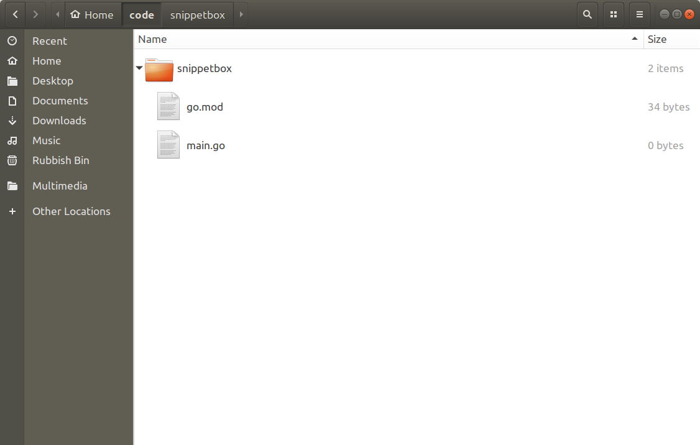

目前此文件中没有太多内容，如果你在文本编辑器中打开它，它应该如下所示（但最好使用你自己的唯一模块路径）：

文件：go.mod

```go
module alexedwards.net/snippetbox

go 1.16
```

稍后在我们的构建中，我们将看到如何使用此文件来定义我们的项目所需的第三方包（及其版本）。

现在我们还需要检查一件事。 打开终端窗口并运行 go env 命令以获取有关当前 Go 安装和环境的信息。 输出应如下所示：

```sh
$ go env
GO111MODULE=""
GOARCH="amd64"
GOBIN=""
GOCACHE="/home/alex/.cache/go-build"
GOENV="/home/alex/.config/go/env"
GOEXE=""
GOFLAGS=""
GOHOSTARCH="amd64"
GOHOSTOS="linux"
GOINSECURE=""
GOMODCACHE="/home/alex/go/pkg/mod"
GONOPROXY=""
GONOSUMDB=""
GOOS="linux"
GOPATH="/home/alex/go"
GOPRIVATE=""
GOPROXY="https://proxy.golang.org,direct"
GOROOT="/usr/local/go"
GOSUMDB="sum.golang.org"
GOTMPDIR=""
GOTOOLDIR="/usr/local/go/pkg/tool/linux_amd64"
GCCGO="gccgo"
AR="ar"
CC="gcc"
CXX="g++"
CGO_ENABLED="1"
GOMOD="/home/alex/Work/Golang College/Code/golangcollege.com/go.mod"
CGO_CFLAGS="-g -O2"
CGO_CPPFLAGS=""
CGO_CXXFLAGS="-g -O2"
CGO_FFLAGS="-g -O2"
CGO_LDFLAGS="-g -O2"
PKG_CONFIG="pkg-config"
GOGCCFLAGS="-fPIC -m64 -pthread -fmessage-length=0 -fdebug-prefix-map=/tmp/go-build733636700=/tmp/go-build -gno-record-gcc-switches"
```

这里要注意的重要一点是 GO111MODULE 环境变量的值——在我的例子中是空字符串“”。 为了让 Go 使用模块，它必须具有值 On、Auto 或空字符串“”。 如果设置为关闭，请在继续之前更改此环境变量。 如果你有兴趣了解这些不同值的确切含义，那么这里有更多信息。

### 附加信息

#### 可下载包的模块路径

如果你正在创建一个可以被其他人和程序下载和使用的包或应用程序，那么你的模块路径最好等于可以下载代码的位置。

例如，如果你的包托管在 https://github.com/foo/bar，那么项目的模块路径应该是 github.com/foo/bar。

## Web 应用程序基础

现在一切都已正确设置，让我们对 Web 应用程序进行第一次迭代。我们将从三个绝对要素开始：

我们需要的第一件事是处理程序。如果你来自 MVC 背景，你可以将处理程序视为有点像控制器。他们负责执行你的应用程序逻辑并编写 HTTP 响应标头和正文。

第二个组件是路由器（或 Go 术语中的 servermux）。这存储了应用程序的 URL 模式与相应处理程序之间的映射。通常，你的应用程序有一个 servermux，其中包含你的所有路由。

我们最后需要的是一个网络服务器。 Go 的一大优点是你可以建立一个 Web 服务器并作为应用程序本身的一部分侦听传入的请求。你不需要像 Nginx 或 Apache 这样的外部第三方服务器。

让我们将这些组件放在 main.go 文件中以创建一个可运行的应用程序。

文件：main.go

```go
package main

import (
    "log"
    "net/http"
)

// Define a home handler function which writes a byte slice containing
// "Hello from Snippetbox" as the response body.
func home(w http.ResponseWriter, r *http.Request) {
    w.Write([]byte("Hello from Snippetbox"))
}

func main() {
    // Use the http.NewServeMux() function to initialize a new servemux, then
    // register the home function as the handler for the "/" URL pattern.
    mux := http.NewServeMux()
    mux.HandleFunc("/", home)

    // Use the http.ListenAndServe() function to start a new web server. We pass in
    // two parameters: the TCP network address to listen on (in this case ":4000")
    // and the servemux we just created. If http.ListenAndServe() returns an error
    // we use the log.Fatal() function to log the error message and exit. Note
    // that any error returned by http.ListenAndServe() is always non-nil.
    log.Println("Starting server on :4000")
    err := http.ListenAndServe(":4000", mux)
    log.Fatal(err)
}
```

> 注意：home 处理函数只是一个带有两个参数的常规 Go 函数。 http.ResponseWriter 参数提供了组合 HTTP 响应并将其发送给用户的方法，*http.Request 参数是一个指向结构的指针，该结构包含有关当前请求的信息（如 HTTP 方法和被请求的 URL） . 我们将更多地讨论这些参数，并在我们阅读本书的过程中演示如何使用它们。

运行此代码时，它应该启动一个 Web 服务器，侦听本地计算机的 4000 端口。 每次服务器收到一个新的 HTTP 请求时，它都会将请求传递给 servemux，然后，servemux 将检查 URL 路径并将请求分派给匹配的处理程序。

让我们试一试。 保存你的 main.go 文件，然后尝试使用 go run 命令从终端运行它。

```sh
$ cd $HOME/code/snippetbox
$ go run main.go
2018/08/02 10:08:07 Starting server on :4000
```

在服务器运行时，打开 Web 浏览器并尝试访问 http://localhost:4000。 如果一切都按计划进行，你应该会看到一个看起来像这样的页面：


> 重要提示：在我们继续之前，我应该解释一下 Go 的 servemux 将 URL 模式“/”视为一个包罗万象的东西。因此，目前所有对我们服务器的 HTTP 请求都将由 home 函数处理，而不管它们的 URL 路径如何。例如，你可以访问不同的 URL 路径，如 http://localhost:4000/foo，你将收到完全相同的响应。

如果你返回终端窗口，你可以通过按键盘上的 Ctrl+c 来停止服务器。

### 附加信息

#### 网络地址

你传递给 http.ListenAndServe() 的 TCP 网络地址应采用“host:port”格式。如果你省略主机（就像我们对“:4000”所做的那样），那么服务器将侦听你计算机的所有可用网络接口。通常，如果你的计算机有多个网络接口并且你只想监听其中一个，则只需在地址中指定一个主机。

在其他 Go 项目或文档中，你有时可能会看到使用命名端口（如“:http”或“:http-alt”而不是数字）编写的网络地址。如果你使用命名端口，那么 Go 将在启动服务器时尝试从你的 /etc/services 文件中查找相关端口号，如果找不到匹配项，则将返回错误。

### 使用运行

在开发过程中， go run 命令是一种测试代码的便捷方式。它本质上是一种编译代码的快捷方式，在 /tmp 目录中创建一个可执行的二进制文件，然后一步运行这个二进制文件。

它接受以空格分隔的 .go 文件列表、特定包的路径（其中 . 字符代表你的当前目录）或完整的模块路径。对于我们目前的应用程序，以下三个命令都是等效的：

```sh
$ go run main.go
$ go run .
$ go run alexedwards.net/snippetbox
```

## 路由请求

拥有一个只有一个路由的 Web 应用程序并不是很令人兴奋……或者很有用！ 让我们再添加几条路由，以便应用程序开始形成如下所示：

| URL Pattern     | Handler       | Action                     |
| --------------- | ------------- | -------------------------- |
| /               | home          | Display the home page      |
| /snippet        | showSnippet   | Display a specific snippet |
| /snippet/create | createSnippet | Create a new snippet       |

重新打开 main.go 文件并更新如下：

```go
package main

import (
    "log"
    "net/http"
)

func home(w http.ResponseWriter, r *http.Request) {
    w.Write([]byte("Hello from Snippetbox"))
}

// Add a showSnippet handler function.
func showSnippet(w http.ResponseWriter, r *http.Request) {
    w.Write([]byte("Display a specific snippet..."))
}

// Add a createSnippet handler function.
func createSnippet(w http.ResponseWriter, r *http.Request) {
    w.Write([]byte("Create a new snippet..."))
}

func main() {
    // Register the two new handler functions and corresponding URL patterns with
    // the servemux, in exactly the same way that we did before.
    mux := http.NewServeMux()
    mux.HandleFunc("/", home)
    mux.HandleFunc("/snippet", showSnippet)
    mux.HandleFunc("/snippet/create", createSnippet)

    log.Println("Starting server on :4000")
    err := http.ListenAndServe(":4000", mux)
    log.Fatal(err)
}
```

确保保存这些更改，然后重新启动 Web 应用程序：

```sh
$ cd $HOME/code/snippetbox
$ go run main.go
2018/08/02 11:36:25 Starting server on :4000
```

如果你在 Web 浏览器中访问以下链接，你现在应该会获得每条路线的相应响应：

http://localhost:4000/snippet

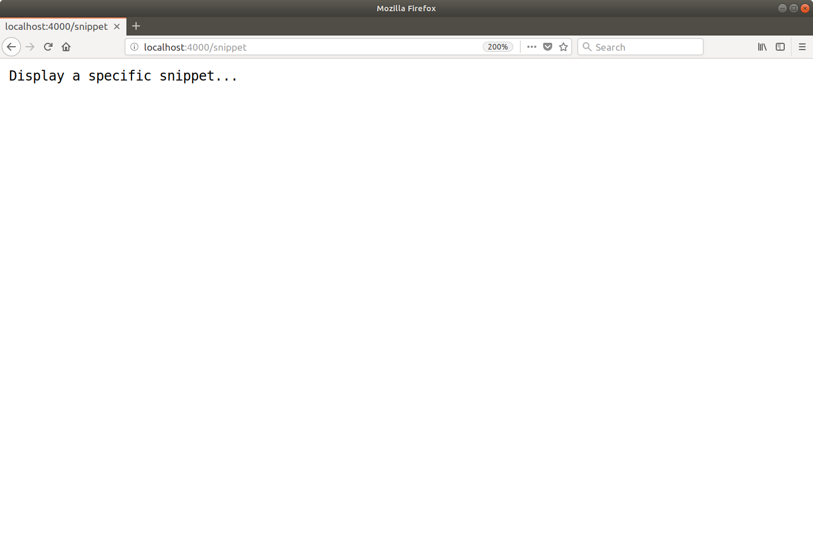

http://localhost:4000/snippet/create

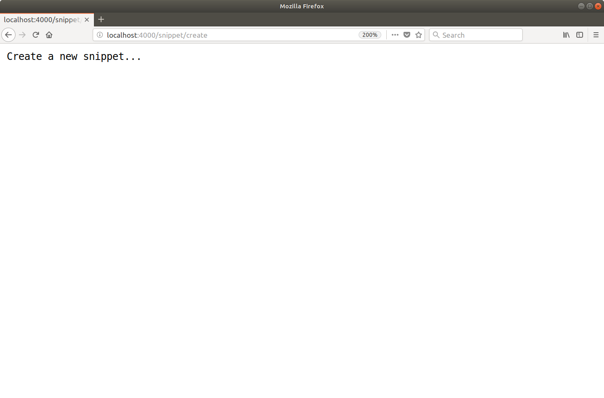

### 固定路径和子树模式

既然两条新路线已经建立并运行，让我们谈谈一些理论。

Go 的 servemux 支持两种不同类型的 URL 模式：固定路径和子树路径。固定路径不以斜杠结尾，而子树路径以斜杠结尾。

我们的两个新模式——“/snippet”和“/snippet/create”——都是固定路径的例子。在 Go 的 servemux 中，只有当请求 URL 路径与固定路径完全匹配时，才会匹配（和调用相应的处理程序）这样的固定路径模式。

相比之下，我们的模式“/”是子树路径的一个示例（因为它以尾部斜杠结尾）。另一个例子是类似“/static/”的东西。每当请求 URL 路径的开头与子树路径匹配时，就会匹配子树路径模式（并调用相应的处理程序）。如果它有助于你的理解，你可以认为子树路径的行为有点像它们末尾有一个通配符，例如“/**”或“/static/**”。

这有助于解释为什么“/”模式表现得像一个包罗万象的东西。该模式本质上意味着匹配单个斜杠，后跟任何内容（或根本不匹配）。

### 限制根 URL 模式

那么，如果你不希望“/”模式表现得像一个包罗万象的东西呢？

例如，在我们正在构建的应用程序中，我们希望当且仅当请求 URL 路径与“/”完全匹配时才显示主页。否则，我们希望用户收到 404 页面未找到响应。

改变 Go 的 servemux 的行为来做到这一点是不可能的，但你可以在 home 处理程序中包含一个简单的检查，最终具有相同的效果：

文件：main.go

```go
package main

...

func home(w http.ResponseWriter, r *http.Request) {
    // Check if the current request URL path exactly matches "/". If it doesn't, use
    // the http.NotFound() function to send a 404 response to the client.
    // Importantly, we then return from the handler. If we don't return the handler
    // would keep executing and also write the "Hello from SnippetBox" message.
    if r.URL.Path != "/" {
        http.NotFound(w, r)
        return
    }

    w.Write([]byte("Hello from Snippetbox"))
}

...
```

继续进行更改，然后重新启动服务器并请求未注册的 URL 路径，例如 http://localhost:4000/missing。你应该得到一个 404 响应，看起来有点像这样：

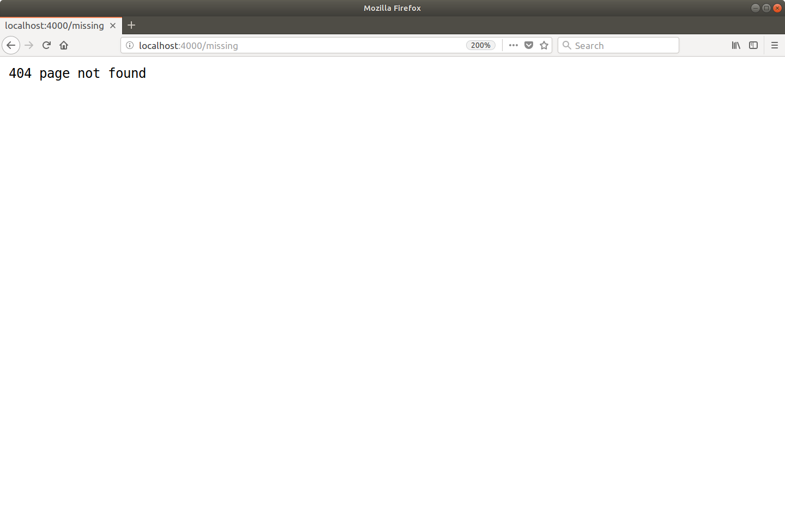

### DefaultServeMux

如果你使用 Go 有一段时间了，你可能会遇到 http.Handle() 和 http.HandleFunc() 函数。这些允许你在不声明服务复用器的情况下注册路由，如下所示：

```go
func main() {
    http.HandleFunc("/", home)
    http.HandleFunc("/snippet", showSnippet)
    http.HandleFunc("/snippet/create", createSnippet)

    log.Println("Starting server on :4000")
    err := http.ListenAndServe(":4000", nil)
    log.Fatal(err)
}
```

在幕后，这些函数使用称为 DefaultServeMux 的东西注册它们的路由。这没有什么特别之处——它只是我们已经使用过的常规服务复用器，但它默认初始化并存储在 net/http 全局变量中。这是 Go 源代码中的相关行：

```go
var DefaultServeMux = NewServeMux()
```

尽管这种方法可以使你的代码稍微短一些，但我不建议将其用于生产应用程序。

因为 DefaultServeMux 是一个全局变量，任何包都可以访问它并注册一个路由——包括你的应用程序导入的任何第三方包。如果这些第三方软件包之一受到威胁，他们可以使用 DefaultServeMux 向网络公开恶意处理程序。

因此，为了安全起见，避免使用 DefaultServeMux 和相应的辅助函数通常是一个好主意。改用你自己的本地范围的 servemux，就像我们迄今为止在这个项目中所做的那样。

### 附加信息

#### Seremux 功能和怪癖

- 在 Go 的 servemux 中，较长的 URL 模式总是优先于较短的模式。因此，如果一个 servemux 包含多个匹配请求的模式，它将始终将请求分派给与最长模式对应的处理程序。这有一个很好的副作用，你可以按任何顺序注册模式，并且不会改变 servemux 的行为方式。
- 请求 URL 路径会自动清理。如果请求路径包含任何 .或 .. 元素或重复的斜杠，用户将自动重定向到等效的干净 URL。例如，如果用户向 /foo/bar/..//baz 发出请求，他们将自动被发送到 /foo/baz 的 301 永久重定向。
- 如果已经注册了子树路径并且收到了对该子树路径的请求而没有尾部斜杠，那么用户将自动发送一个 301 永久重定向到添加了斜杠的子树路径。例如，如果你已经注册了子树路径 /foo/，那么对 /foo 的任何请求都将被重定向到 /foo/。

#### 主机名匹配

可以在 URL 模式中包含主机名。当你想将所有 HTTP 请求重定向到规范 URL 时，或者你的应用程序充当多个站点或服务的后端时，这会很有用。例如：

```go
mux := http.NewServeMux()
mux.HandleFunc("foo.example.org/", fooHandler)
mux.HandleFunc("bar.example.org/", barHandler)
mux.HandleFunc("/baz", bazHandler)
```

当涉及到模式匹配时，将首先检查任何特定于主机的模式，如果匹配，请求将被分派到相应的处理程序。只有当没有找到特定于主机的匹配项时，才会检查非特定于主机的模式。

#### RESTful 路由呢？

重要的是要承认 Go 的 servemux 提供的路由功能非常轻量级。它不支持基于请求方法的路由，不支持包含变量的语义 URL，也不支持基于正则表达式的模式。如果你有使用 Rails、Django 或 Laravel 等框架的背景，你可能会发现这有点限制……而且令人惊讶！

但不要让它让你失望。现实情况是 Go 的 servemux 仍然可以让你走得很远，而且对于许多应用程序来说已经足够了。在你需要更多的时候，你可以使用大量的第三方路由器来代替 Go 的 servemux。我们将在本书后面介绍一些流行的选项。

## 自定义 HTTP 标头

现在让我们更新我们的应用程序，以便 /snippet/create 路由只响应使用 POST 方法的 HTTP 请求，如下所示：

| Method | Pattern         | Handler       | Action                     |
| ------ | --------------- | ------------- | -------------------------- |
| ANY    | /               | home          | Display the home page      |
| ANY    | /snippet        | showSnippet   | Display a specific snippet |
| POST   | /snippet/create | createSnippet | Create a new snippet       |

进行此更改很重要，因为稍后在我们的应用程序构建中，对 /snippet/create 路由的请求将导致在数据库中创建一个新的片段。在数据库中创建一个新的代码片段是一个非幂等的操作，它会改变我们服务器的状态，所以我们应该遵循 HTTP 的良好实践并限制这条路由只对 POST 请求进行操作。

但我现在想讨论这个的主要原因是因为这是讨论 HTTP 响应标头并解释如何自定义它们的一个很好的借口。

### HTTP 状态代码

让我们首先更新我们的 createSnippet() 处理程序函数，以便它发送 405（不允许的方法）HTTP 状态代码，除非请求方法是 POST。为此，我们需要像这样使用 w.WriteHeader() 方法：

文件：main.go

```go
package main

...

func createSnippet(w http.ResponseWriter, r *http.Request) {
    // Use r.Method to check whether the request is using POST or not. Note that
    // http.MethodPost is a constant equal to the string "POST".
    if r.Method != http.MethodPost {
        // If it's not, use the w.WriteHeader() method to send a 405 status
        // code and the w.Write() method to write a "Method Not Allowed"
        // response body. We then return from the function so that the
        // subsequent code is not executed.
        w.WriteHeader(405)
        w.Write([]byte("Method Not Allowed"))
        return
    }

    w.Write([]byte("Create a new snippet..."))
}

...
```

虽然这种变化看起来很简单，但我应该解释一些细微差别：

- 每个响应只能调用一次 w.WriteHeader() ，并且在写入状态码后无法更改。如果你尝试第二次调用 w.WriteHeader()，Go 将记录一条警告消息。
- 如果不显式调用 w.WriteHeader()，那么第一次调用 w.Write() 将自动向用户发送 200 OK 状态代码。所以，如果你想发送一个非 200 的状态代码，你必须在调用 w.Write() 之前调用 w.WriteHeader()。

让我们来看看它的实际效果。

重新启动服务器，然后打开第二个终端窗口并使用 curl 向 http://localhost:4000/snippet/create 发出 POST 请求。你应该会收到一个带有 200 OK 状态代码的 HTTP 响应，类似于：

```sh
$ curl -i -X POST http://localhost:4000/snippet/create
HTTP/1.1 200 OK
Date: Thu, 02 Aug 2018 12:58:54 GMT
Content-Length: 23
Content-Type: text/plain; charset=utf-8

Create a new snippet...
```

但是如果你使用不同的请求方法——比如 GET、PUT 或 DELETE——你现在应该得到带有 405 Method Not Allowed 状态代码的响应。例如：

```sh
$ curl -i -X PUT http://localhost:4000/snippet/create
HTTP/1.1 405 Method Not Allowed
Date: Thu, 02 Aug 2018 12:59:16 GMT
Content-Length: 18
Content-Type: text/plain; charset=utf-8

Method Not Allowed
```

### 自定义标题

我们可以做的另一个改进是在每个 405 Method Not Allowed 响应中包含一个 Allow: POST 标头，让用户知道该特定 URL 支持哪些请求方法。

我们可以通过使用 w.Header().Set() 方法向响应标头映射添加一个新标头，如下所示：

文件：main.go

```go
package main

...

func createSnippet(w http.ResponseWriter, r *http.Request) {
    if r.Method != http.MethodPost {
        // Use the Header().Set() method to add an 'Allow: POST' header to the
        // response header map. The first parameter is the header name, and
        // the second parameter is the header value.
        w.Header().Set("Allow", http.MethodPost)
        w.WriteHeader(405)
        w.Write([]byte("Method Not Allowed"))
        return
    }

    w.Write([]byte("Create a new snippet..."))
}

...
```

> 重要提示：在调用 w.WriteHeader() 或 w.Write() 后更改响应标头映射对用户接收的标头没有影响。在调用这些方法之前，你需要确保你的响应标头映射包含你想要的所有标头。

让我们通过向我们的 /snippet/create URL 发送一个非 POST 请求来再次看看这个操作，如下所示：

```sh
$ curl -i -X PUT http://localhost:4000/snippet/create
HTTP/1.1 405 Method Not Allowed
Allow: POST
Date: Thu, 02 Aug 2018 13:01:16 GMT
Content-Length: 18
Content-Type: text/plain; charset=utf-8

Method Not Allowed
```

请注意响应现在如何包含 Allow: POST 标头？

### http.Error 快捷方式

如果你想发送一个非 200 的状态码和一个纯文本的响应体（就像我们在上面的代码中），那么这是使用 http.Error() 快捷方式的好机会。这是一个轻量级的辅助函数，它接受给定的消息和状态代码，然后在幕后为我们调用 w.WriteHeader() 和 w.Write() 方法。

让我们更新代码以使用它。

文件：main.go

```go
package main

...

func createSnippet(w http.ResponseWriter, r *http.Request) {
    if r.Method != http.MethodPost {
        w.Header().Set("Allow", http.MethodPost)
        // Use the http.Error() function to send a 405 status code and "Method Not
        // Allowed" string as the response body.
        http.Error(w, "Method Not Allowed", 405)
        return
    }

    w.Write([]byte("Create a new snippet..."))
}

...
```

在功能方面，这几乎完全相同。最大的区别是我们现在将 http.ResponseWriter 传递给另一个函数，该函数为我们向用户发送响应。

将 http.ResponseWriter 传递给其他函数的模式在 Go 中非常常见，我们将在本书中做很多事情。在实践中，像我们目前所做的那样直接使用 w.Write() 和 w.WriteHeader() 方法是非常罕见的。但我想提前介绍它们，因为它们支持更高级（和有趣！）的发送响应方式。

### 附加信息

#### 操作标题映射

在上面的代码中，我们使用 w.Header().Set() 向响应标头映射添加一个新标头。但是也可以使用 Add()、Del() 和 Get() 方法来读取和操作标头映射。

```go
// Set a new cache-control header. If an existing "Cache-Control" header exists
// it will be overwritten.
w.Header().Set("Cache-Control", "public, max-age=31536000")

// In contrast, the Add() method appends a new "Cache-Control" header and can
// be called multiple times.
w.Header().Add("Cache-Control", "public")
w.Header().Add("Cache-Control", "max-age=31536000")

// Delete all values for the "Cache-Control" header.
w.Header().Del("Cache-Control")

// Retrieve the first value for the "Cache-Control" header.
w.Header().Get("Cache-Control")
```

#### 系统生成的标头和内容嗅探

发送响应时，Go 会自动为你设置三个系统生成的标头：Date 和 Content-Length 以及 Content-Type。

Content-Type 标头特别有趣。 Go 将尝试通过使用 http.DetectContentType() 函数内容嗅探响应正文来为你设置正确的。如果此函数无法猜测内容类型，Go 将回退到设置标题 Content-Type: application/octet-stream。

http.DetectContentType() 函数通常工作得很好，但是对于刚接触 Go 的 Web 开发人员来说，一个常见的问题是它无法区分 JSON 和纯文本。因此，默认情况下，JSON 响应将使用 Content-Type: text/plain;字符集=utf-8 标头。你可以通过手动设置正确的标题来防止这种情况发生，如下所示：

```go
w.Header().Set("Content-Type", "application/json")
w.Write([]byte(`{"name":"Alex"}`))
```

#### 标头规范化

当你在标头映射上使用 Add()、Get()、Set() 和 Del() 方法时，标头名称将始终使用 textproto.CanonicalMIMEHeaderKey() 函数进行规范化。这会将第一个字母和连字符后面的任何字母转换为大写，并将其余字母转换为小写。这具有实际含义，即在调用这些方法时，标头名称不区分大小写。

如果你需要避免这种规范化行为，你可以直接编辑底层标题映射（它的类型为 map[string][]string）。例如：

```go
w.Header()["X-XSS-Protection"] = []string{"1; mode=block"}
```

> 注意：如果正在使用 HTTP/2 连接，Go 将始终根据 HTTP/2 规范自动将标头名称和值转换为小写。

#### 抑制系统生成的标头

Del() 方法不会删除系统生成的标头。要抑制这些，你需要直接访问底层标头映射并将值设置为 nil。例如，如果要取消 Date 标头，则需要编写：

```go
w.Header()["Date"] = nil
```

## URL 查询字符串

当我们讨论路由时，让我们更新 showSnippet 处理程序，使其接受来自用户的 id 查询字符串参数，如下所示：

| Method | Pattern         | Handler       | Action                     |
| ------ | --------------- | ------------- | -------------------------- |
| ANY    | /               | home          | Display the home page      |
| ANY    | /snippet?id=1   | showSnippet   | Display a specific snippet |
| POST   | /snippet/create | createSnippet | Create a new snippet       |

稍后我们将使用此 id 参数从数据库中选择特定片段并将其显示给用户。但是现在，我们将只读取 id 参数的值并用占位符响应插入它。

为了完成这项工作，我们需要更新 showSnippet 处理函数来做两件事：

它需要从 URL 查询字符串中检索 id 参数的值，我们可以使用 r.URL.Query().Get() 方法来完成。这将始终返回参数的字符串值，如果不存在匹配的参数，则返回空字符串 ""。

因为 id 参数是不受信任的用户输入，我们应该验证它以确保它是理智和合理的。出于我们的 Snippetbox 应用程序的目的，我们要检查它是否包含一个正整数值。为此，我们可以尝试使用 strconv.Atoi() 函数将字符串值转换为整数，然后检查该值是否大于零。

就是这样：

文件：main.go

```go
package main

import (
    "fmt" // New import
    "log"
    "net/http"
    "strconv" // New import
)

...

func showSnippet(w http.ResponseWriter, r *http.Request) {
    // Extract the value of the id parameter from the query string and try to
    // convert it to an integer using the strconv.Atoi() function. If it can't
    // be converted to an integer, or the value is less than 1, we return a 404 page
    // not found response.
    id, err := strconv.Atoi(r.URL.Query().Get("id"))
    if err != nil || id < 1 {
        http.NotFound(w, r)
        return
    }

    // Use the fmt.Fprintf() function to interpolate the id value with our response
    // and write it to the http.ResponseWriter.
    fmt.Fprintf(w, "Display a specific snippet with ID %d...", id)
}

...
```

让我们试试这个。

重新启动应用程序，并尝试访问类似 http://localhost:4000/snippet?id=123 的 URL。你应该会看到如下所示的响应：

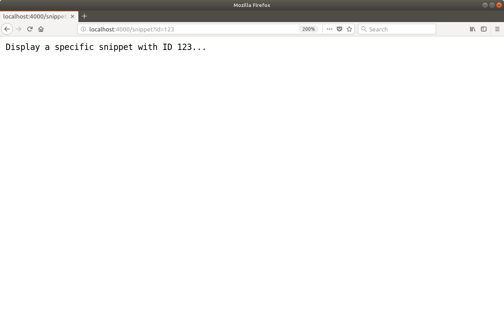

你可能还想尝试访问某些 id 参数值无效或根本没有参数值的 URL。例如：

- http://localhost:4000/snippet
- http://localhost:4000/snippet?id=-1
- http://localhost:4000/snippet?id=foo

对于所有这些请求，你应该得到 404 页面未找到响应。

### io.Writer 接口

上面的代码在幕后引入了另一个新事物。如果你查看 fmt.Fprintf() 函数的文档，你会注意到它以 io.Writer 作为第一个参数......

```go
func Fprintf(w io.Writer, format string, a ...interface{}) (n int, err error)
```

…但我们将它传递给了我们的 http.ResponseWriter 对象 - 它工作正常。

我们能够这样做是因为 io.Writer 类型是一个接口，而 http.ResponseWriter 对象满足该接口是因为它有一个 w.Write() 方法。

如果你是 Go 的新手，那么接口的概念可能会有点混乱，我现在不想太纠结它。知道 - 在实践中 - 在任何你看到 io.Writer 参数的地方都可以传递你的 http.ResponseWriter 对象就足够了。写入的内容随后将作为 HTTP 响应的正文发送。

## 项目结构和组织

在我们向 main.go 文件添加更多代码之前，是时候考虑如何组织和构建这个项目了。

重要的是要预先说明，在 Go 中构建 Web 应用程序没有单一的正确（甚至推荐）方法。这有好有坏。这意味着你可以自由灵活地组织代码，但在尝试确定最佳结构时，也很容易陷入不确定的兔子洞。

随着你获得 Go 的经验，你将了解哪些模式在不同情况下适合你。但作为起点，我能给你的最好建议是不要让事情过于复杂。只有在明显需要时才努力添加结构和复杂性。

对于这个项目，我们将实现一个大纲结构，它遵循一种流行且久经考验的方法。这是一个坚实的起点，你应该能够在各种项目中重用通用结构。

如果你按照以下步骤操作，请确保你位于项目存储库的根目录中并运行以下命令：

```sh
$ cd $HOME/code/snippetbox
$ rm main.go
$ mkdir -p cmd/web pkg ui/html ui/static
$ touch cmd/web/main.go
$ touch cmd/web/handlers.go
```

你的项目存储库的结构现在应如下所示：


让我们花点时间讨论一下每个目录的用途。

- cmd 目录将包含项目中可执行应用程序的特定于应用程序的代码。现在我们只有一个可执行的应用程序——web 应用程序——它将位于 cmd/web 目录下。
- pkg 目录将包含项目中使用的辅助非应用程序特定代码。我们将使用它来保存潜在的可重用代码，例如验证助手和项目的 SQL 数据库模型。
- ui 目录将包含 Web 应用程序使用的用户界面资产。具体来说，ui/html 目录将包含 HTML 模板，而 ui/static 目录将包含静态文件（如 CSS 和图像）。

那么我们为什么要使用这种结构呢？

有两大好处：

- 它明确区分了 Go 和非 Go 资产。我们编写的所有 Go 代码都将单独存在于 cmd 和 pkg 目录下，让项目根目录可以自由保存非 Go 资产，如 UI 文件、makefile 和模块定义（包括我们的 go.mod 文件）。这可以使将来在构建和部署应用程序时更易于管理。
- 如果你想将另一个可执行应用程序添加到你的项目中，它的扩展性非常好。例如，你可能希望添加 CLI（命令行界面）以在将来自动执行某些管理任务。使用此结构，你可以在 cmd/cli 下创建此 CLI 应用程序，它将能够导入和重用你在 pkg 目录下编写的所有代码。

### 重构现有代码

让我们快速移植我们已经编写的代码以使用这个新结构。

文件：cmd/web/main.go

```go
package main

import (
    "log"
    "net/http"
)

func main() {
    mux := http.NewServeMux()
    mux.HandleFunc("/", home)
    mux.HandleFunc("/snippet", showSnippet)
    mux.HandleFunc("/snippet/create", createSnippet)

    log.Println("Starting server on :4000")
    err := http.ListenAndServe(":4000", mux)
    log.Fatal(err)
}
```

文件：cmd/web/handlers.go

```go
package main

import (
    "fmt"
    "net/http"
    "strconv"
)

func home(w http.ResponseWriter, r *http.Request) {
    if r.URL.Path != "/" {
        http.NotFound(w, r)
        return
    }

    w.Write([]byte("Hello from Snippetbox"))
}

func showSnippet(w http.ResponseWriter, r *http.Request) {
    id, err := strconv.Atoi(r.URL.Query().Get("id"))
    if err != nil || id < 1 {
        http.NotFound(w, r)
        return
    }

    fmt.Fprintf(w, "Display a specific snippet with ID %d...", id)
}

func createSnippet(w http.ResponseWriter, r *http.Request) {
    if r.Method != http.MethodPost {
        w.Header().Set("Allow", http.MethodPost)
        http.Error(w, "Method Not Allowed", 405)
        return
    }

    w.Write([]byte("Create a new snippet..."))
}
```

所以现在我们的 web 应用程序由 cmd/web 目录下的多个 Go 源代码文件组成。要运行这些，我们可以像这样使用 go run 命令：

```sh
$ cd $HOME/code/snippetbox
$ go run ./cmd/web
2018/08/02 17:24:28 Starting server on :4000
```

## HTML 模板和继承

让我们为项目注入一些活力，并为我们的 Snippetbox Web 应用程序开发一个合适的主页。在接下来的几章中，我们将努力创建一个如下所示的页面：

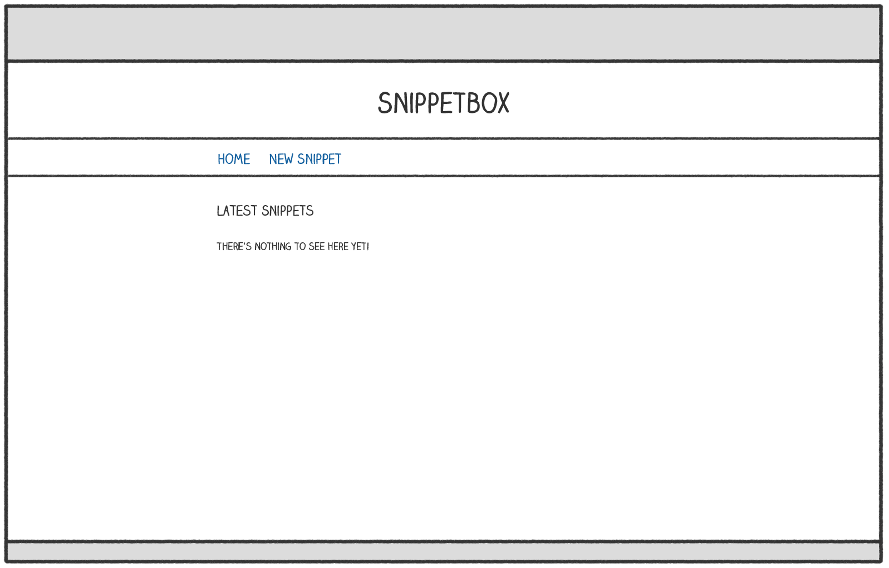

为此，让我们首先在 ui/html 目录中创建一个新的模板文件……

```sh
$ cd $HOME/code/snippetbox
$ touch ui/html/home.page.tmpl
```

...然后将主页的以下 HTML 标记添加到其中：

文件：ui/html/home.page.tmpl

```html
<!doctype html>
<html lang='en'>
    <head>
        <meta charset='utf-8'>
        <title>Home - Snippetbox</title>
    </head>
    <body>
        <header>
            <h1><a href='/'>Snippetbox</a></h1>
        </header>
        <nav>
            <a href="/">Home</a>
        </nav>
        <main>
            <h2>Latest Snippets</h2>
            <p>There's nothing to see here yet!</p>
        </main>
    </body>
</html>
```

> 注意：在本书中，我们将使用命名约定 \<name>.\<role>.tmpl 作为模板文件，其中 \<role> 是页面、部分或布局。能够从文件名中确定模板的角色将有助于我们在本书后面创建模板缓存。

现在我们已经为主页创建了一个带有 HTML 标记的模板文件，下一个问题是我们如何让我们的主页处理程序来呈现它？

为此，我们需要导入 Go 的 html/template 包，它提供了一系列用于安全解析和呈现 HTML 模板的函数。我们可以使用这个包中的函数来解析模板文件，然后执行模板。

我来示范。打开 cmd/web/handlers.go 文件并添加以下代码：

文件：cmd/web/handlers.go

```go
package main

import (
    "fmt"
    "html/template" // New import
    "log"           // New import
    "net/http"
    "strconv"
)

func home(w http.ResponseWriter, r *http.Request) {
    if r.URL.Path != "/" {
        http.NotFound(w, r)
        return
    }

    // Use the template.ParseFiles() function to read the template file into a
    // template set. If there's an error, we log the detailed error message and use
    // the http.Error() function to send a generic 500 Internal Server Error
    // response to the user.
    ts, err := template.ParseFiles("./ui/html/home.page.tmpl")
    if err != nil {
        log.Println(err.Error())
        http.Error(w, "Internal Server Error", 500)
        return
    }

    // We then use the Execute() method on the template set to write the template
    // content as the response body. The last parameter to Execute() represents any
    // dynamic data that we want to pass in, which for now we'll leave as nil.
    err = ts.Execute(w, nil)
    if err != nil {
        log.Println(err.Error())
        http.Error(w, "Internal Server Error", 500)
    }
}

...
```

需要指出的是，你传递给 template.ParseFiles() 函数的文件路径必须相对于你当前的工作目录，或者是绝对路径。在上面的代码中，我创建了相对于项目目录根目录的路径。

因此，话虽如此，请确保你位于项目目录的根目录中并重新启动应用程序：

```sh
$ cd $HOME/code/snippetbox
$ go run ./cmd/web
2018/08/02 17:49:24 Starting server on :4000
```

然后在 Web 浏览器中打开 http://localhost:4000。你应该会发现 HTML 主页的形状很好。

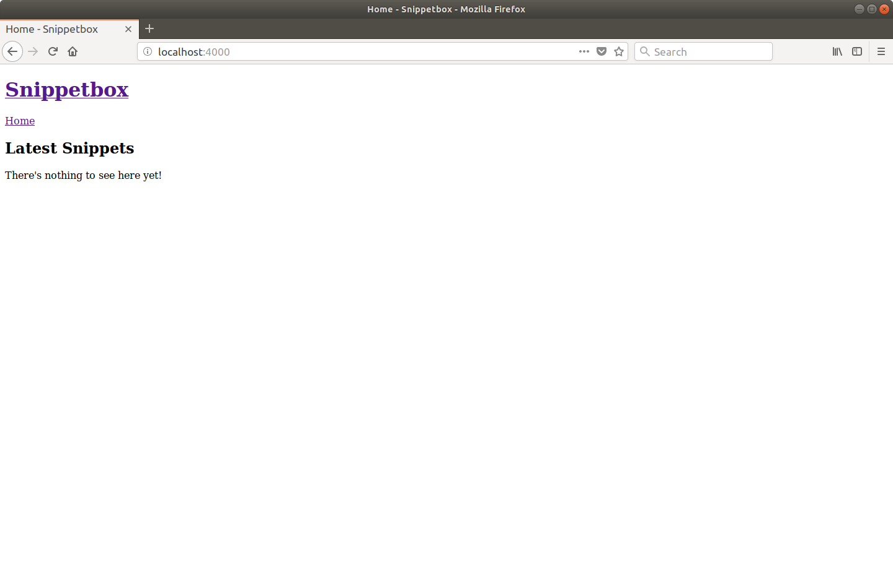

### 模板组合

当我们向这个 Web 应用程序添加更多页面时，将会有一些共享的、样板的、HTML 标记，我们希望包含在每个页面上——比如 \<head> HTML 元素中的标题、导航和元数据。

为了节省我们的输入并防止重复，最好创建一个包含此共享内容的布局（或主）模板，然后我们可以将其与各个页面的特定于页面的标记组合在一起。

继续创建一个新的 ui/html/base.layout.tmpl 文件...

```sh
$ touch ui/html/base.layout.tmpl
```

并添加以下标记（我们希望出现在每个页面上）：

```html
{{define "base"}}
<!doctype html>
<html lang='en'>
    <head>
        <meta charset='utf-8'>
        <title>{{template "title" .}} - Snippetbox</title>
    </head>
    <body>
        <header>
            <h1><a href='/'>Snippetbox</a></h1>
        </header>
        <nav>
            <a href='/'>Home</a>
        </nav>
        <main>
            {{template "main" .}}
        </main>
    </body>
</html>
{{end}}
```

如果你以前使用过其他语言的模板，希望这感觉很熟悉。它本质上只是普通的 HTML，在双花括号中包含一些额外的操作。

在这里，我们使用 {{define "base"}}...{{end}} 操作来定义一个名为 base 的不同命名模板，其中包含我们希望出现在每个页面上的内容。

在这个内部，我们使用 {{template "title" .}} 和 {{template "main" .}} 动作来表示我们想要在 HTML 中的特定点调用其他命名模板（称为 title 和 main）。

> 注意：如果你想知道，{{template "title" .}} 操作末尾的点表示你要传递给调用模板的任何动态数据。我们将在本书后面详细讨论这一点。

现在让我们回到 ui/html/home.page.tmpl 并更新它以定义包含主页特定内容的标题和主要命名模板：

文件：ui/html/home.page.tmpl

```html
{{template "base" .}}

{{define "title"}}Home{{end}}

{{define "main"}}
<h2>Latest Snippets</h2>
<p>There's nothing to see here yet!</p>
{{end}}
```


这个文件的顶部可以说是最重要的部分 - {{template "base" .}} 操作。这告诉 Go，当 home.page.tmpl 文件被执行时，我们要调用命名模板库。

反过来，基本模板包含调用标题和主要命名模板的指令。我知道这开始时可能会感觉有点循环，但请坚持下去……在实践中，这种模式非常有效。

完成后，下一步是更新主处理程序中的代码，以便它解析两个模板文件，如下所示：

文件：cmd/web/handlers.go

```go
package main

...

func home(w http.ResponseWriter, r *http.Request) {
    if r.URL.Path != "/" {
        http.NotFound(w, r)
        return
    }

    // Initialize a slice containing the paths to the two files. Note that the
    // home.page.tmpl file must be the *first* file in the slice.
    files := []string{
        "./ui/html/home.page.tmpl",
        "./ui/html/base.layout.tmpl",
    }

    // Use the template.ParseFiles() function to read the files and store the
    // templates in a template set. Notice that we can pass the slice of file paths
    // as a variadic parameter?
    ts, err := template.ParseFiles(files...)
    if err != nil {
        log.Println(err.Error())
        http.Error(w, "Internal Server Error", 500)
        return
    }

    err = ts.Execute(w, nil)
    if err != nil {
        log.Println(err.Error())
        http.Error(w, "Internal Server Error", 500)
    }
}

...
```

所以现在，我们的模板集不再直接包含 HTML，而是包含 3 个命名模板（base、title 和 main）和一条调用基本模板的指令（依次调用标题和主模板）。

随意重新启动服务器并尝试一下。你应该会发现它呈现与以前相同的输出（尽管 HTML 源代码中操作所在的位置会有一些额外的空格）。

使用这种模式来编写模板的最大好处是，你可以在磁盘上的各个文件中清晰地定义特定于页面的内容，并且在这些文件中还可以控制页面使用的布局模板。这对于较大的应用程序特别有用，其中应用程序的不同页面可能需要使用不同的布局。

### 嵌入部分

对于某些应用程序，你可能希望将 HTML 的某些部分分解为可以在不同页面或布局中重复使用的部分。为了说明这一点，让我们为我们的 Web 应用程序创建一个包含一些页脚内容的部分。

创建一个新的 ui/html/footer.partial.tmpl 文件并添加一个名为 footer 的命名模板，如下所示：

```sh
$ touch ui/html/footer.partial.tmpl
```

文件：ui/html/footer.partial.tmpl

```html
{{define "footer"}}
<footer>Powered by <a href='https://golang.org/'>Go</a></footer>
{{end}}
```

然后更新基本模板，使其使用 {{template "footer" .}} 操作调用页脚：

文件：ui/html/base.layout.tmpl

```html
{{define "base"}}
<!doctype html>
<html lang='en'>
    <head>
        <meta charset='utf-8'>
        <title>{{template "title" .}} - Snippetbox</title>
    </head>
    <body>
        <header>
            <h1><a href='/'>Snippetbox</a></h1>
        </header>
        <nav>
            <a href='/'>Home</a>
        </nav>
        <main>
            {{template "main" .}}
        </main>
        <!-- Invoke the footer template -->
        {{template "footer" .}}
    </body>
</html>
{{end}}
```

最后，我们需要在解析模板文件时更新 home 处理程序以包含新的 ui/html/footer.partial.tmpl 文件：

文件：cmd/web/handlers.go

```go
package main

...

func home(w http.ResponseWriter, r *http.Request) {
    if r.URL.Path != "/" {
        http.NotFound(w, r)
        return
    }

    // Include the footer partial in the template files.
    files := []string{
        "./ui/html/home.page.tmpl",
        "./ui/html/base.layout.tmpl",
        "./ui/html/footer.partial.tmpl",
    }

    ts, err := template.ParseFiles(files...)
    if err != nil {
        log.Println(err.Error())
        http.Error(w, "Internal Server Error", 500)
        return
    }

    err = ts.Execute(w, nil)
    if err != nil {
        log.Println(err.Error())
        http.Error(w, "Internal Server Error", 500)
    }
}

...
```

重新启动服务器后，你的基本模板现在应该调用页脚模板，你的主页应该如下所示：


### 附加信息

#### 块操作

在上面的代码中，我们使用 {{template}} 操作从另一个模板调用一个模板。但是 Go 还提供了一个 {{block}}...{{end}} 操作，你可以使用它来代替。这与 {{template}} 操作类似，但它允许你在当前模板集中不存在正在调用的模板时指定一些默认内容。

在 Web 应用程序的上下文中，当你想要提供一些默认内容（例如侧边栏）时，这很有用，如果需要，单个页面可以根据具体情况覆盖这些内容。

从语法上讲，你可以这样使用它：

```html
{{define "base"}}
    <h1>An example template</h1>
    {{block "sidebar" .}}
        <p>My default sidebar content</p>
    {{end}}
{{end}}
```

但是——如果你愿意——你不需要在 {{block}} 和 {{end}} 操作之间包含任何默认内容。在这种情况下，被调用的模板就像是“可选的”。如果模板存在于模板集中，那么它将被渲染。但如果没有，则不会显示任何内容。

## 提供静态文件

现在让我们通过向我们的项目添加一些静态 CSS 和图像文件以及一点点 JavaScript 来突出显示活动导航项来改善主页的外观和感觉。

如果你正在跟进，你可以获取必要的文件并将它们解压缩到我们之前使用以下命令创建的 ui/static 文件夹中：

```sh
$ cd $HOME/code/snippetbox
$ curl https://www.alexedwards.net/static/sb.v130.tar.gz | tar -xvz -C ./ui/static/
```

你的 ui/static 目录的内容现在应该是这样的：

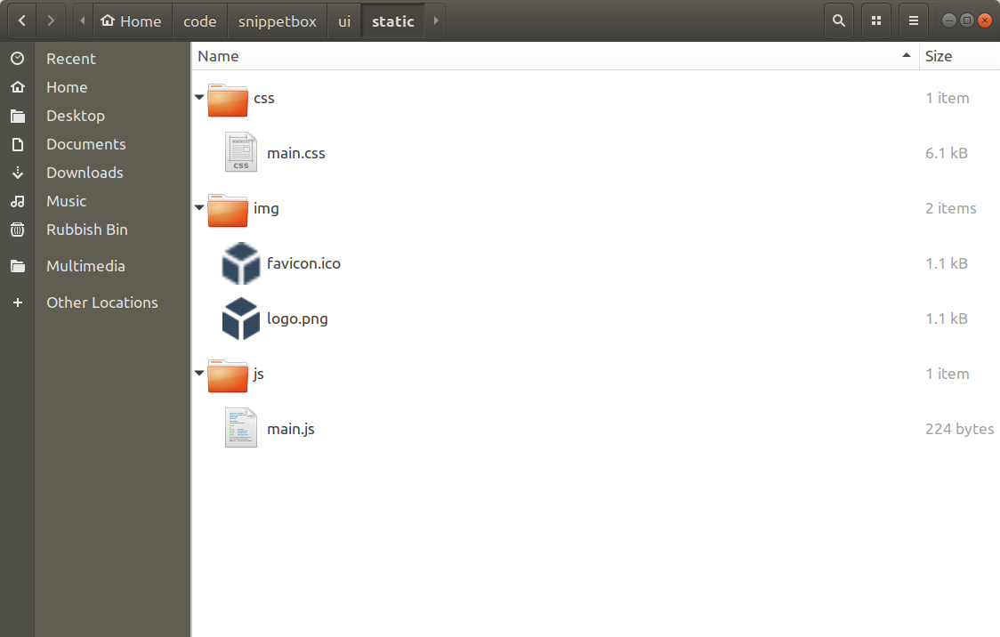

### http.FileServer 处理程序

Go 的 net/http 包附带一个内置的 http.FileServer 处理程序，你可以使用它从特定目录通过 HTTP 提供文件。让我们向我们的应用程序添加一个新路由，以便使用它处理所有以“/static/”开头的请求，如下所示：

| Method | Pattern         | Handler         | Action                       |
| ------ | --------------- | --------------- | ---------------------------- |
| ANY    | /               | home            | Display the home page        |
| ANY    | /snippet?id=1   | showSnippet     | Display a specific snippet   |
| POST   | /snippet/create | createSnippet   | Create a new snippet         |
| ANY    | /static/        | http.FileServer | Serve a specific static file |

> 记住：模式“/static/”是一个子树路径模式，所以它的作用有点像末尾有一个通配符。

要创建一个新的 http.FileServer 处理程序，我们需要像这样使用 http.FileServer() 函数：

```go
fileServer := http.FileServer(http.Dir("./ui/static/"))
```

当这个处理程序收到请求时，它会从 URL 路径中删除前导斜杠，然后在 ./ui/static 目录中搜索相应的文件发送给用户。

因此，为了使其正常工作，我们必须在将 URL 路径传递给 http.FileServer 之前从 URL 路径中去除前导“/static”。否则它将寻找一个不存在的文件，用户将收到 404 页面未找到响应。幸运的是，Go 包含一个专门用于此任务的 http.StripPrefix() 助手。

打开你的 main.go 文件并添加以下代码，使文件最终看起来像这样：

文件：cmd/web/main.go

```go
package main

import (
    "log"
    "net/http"
)

func main() {
    mux := http.NewServeMux()
    mux.HandleFunc("/", home)
    mux.HandleFunc("/snippet", showSnippet)
    mux.HandleFunc("/snippet/create", createSnippet)

    // Create a file server which serves files out of the "./ui/static" directory.
    // Note that the path given to the http.Dir function is relative to the project
    // directory root.
    fileServer := http.FileServer(http.Dir("./ui/static/"))

    // Use the mux.Handle() function to register the file server as the handler for
    // all URL paths that start with "/static/". For matching paths, we strip the
    // "/static" prefix before the request reaches the file server.
    mux.Handle("/static/", http.StripPrefix("/static", fileServer))

    log.Println("Starting server on :4000")
    err := http.ListenAndServe(":4000", mux)
    log.Fatal(err)
}
```

完成后，重新启动应用程序并在浏览器中打开 http://localhost:4000/static/。你应该会看到 ui/static 文件夹的可导航目录列表，如下所示：

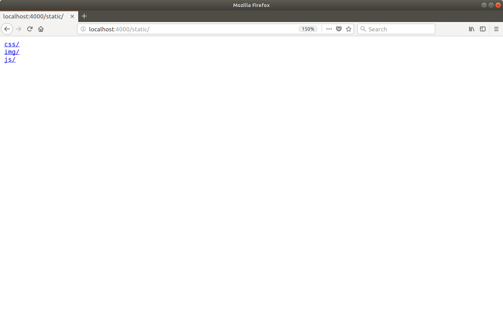

随意玩玩并浏览目录列表以查看单个文件。例如，如果你导航到 http://localhost:4000/static/css/main.css，你应该会看到 CSS 文件出现在你的浏览器中，如下所示：

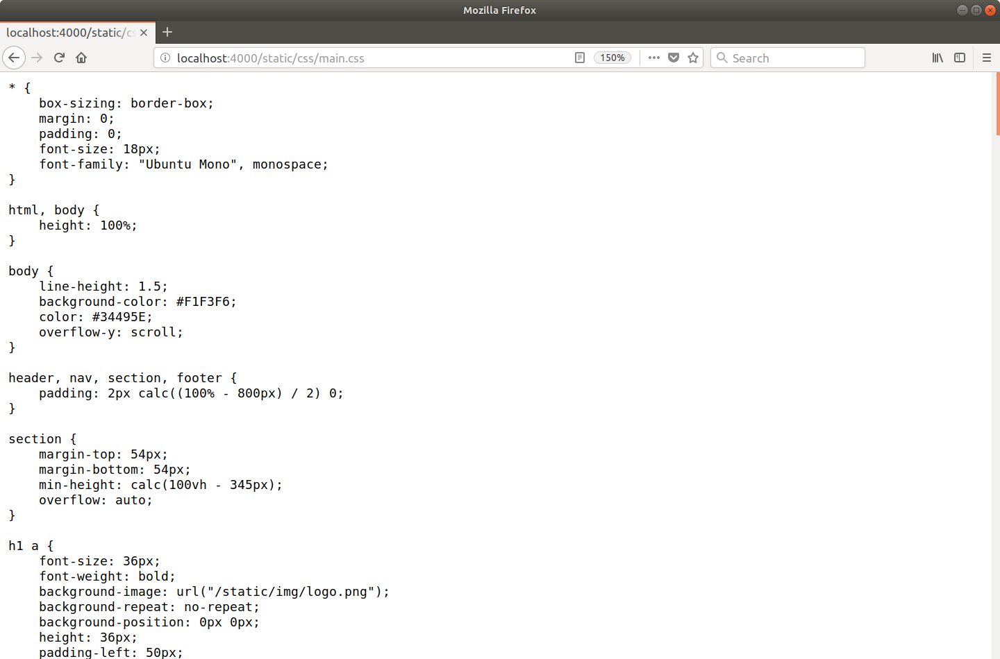

### 使用静态文件

文件服务器正常工作后，我们现在可以更新 ui/html/base.layout.tmpl 文件以使用静态文件：

文件：ui/html/base.layout.tmpl

```html
{{define "base"}}
<!doctype html>
<html lang='en'>
    <head>
        <meta charset='utf-8'>
        <title>{{template "title" .}} - Snippetbox</title>
        <!-- Link to the CSS stylesheet and favicon -->
        <link rel='stylesheet' href='/static/css/main.css'>
        <link rel='shortcut icon' href='/static/img/favicon.ico' type='image/x-icon'>
        <!-- Also link to some fonts hosted by Google -->
        <link rel='stylesheet' href='https://fonts.googleapis.com/css?family=Ubuntu+Mono:400,700'>
    </head>
    <body>
        <header>
            <h1><a href='/'>Snippetbox</a></h1>
        </header>
        <nav>
            <a href='/'>Home</a>
        </nav>
        <main>
            {{template "main" .}}
        </main>
        {{template "footer" .}}
        <!-- And include the JavaScript file -->
        <script src="/static/js/main.js" type="text/javascript"></script>
    </body>
</html>
{{end}}
```

确保保存更改，然后访问 http://localhost:4000。你的主页现在应如下所示：

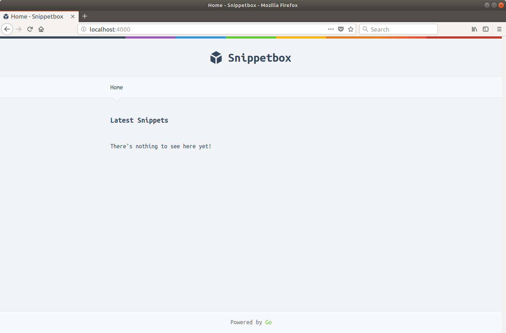

### 附加信息

#### 特点和功能

Go 的文件服务器有一些非常好的特性值得一提：

- 它通过在搜索文件之前通过 path.Clean() 函数运行它们来清理所有请求路径。这将删除任何 .和 .. 来自 URL 路径的元素，这有助于阻止目录遍历攻击。如果你将文件服务器与不会自动清理 URL 路径的路由器结合使用，则此功能特别有用。

- 完全支持范围请求。如果你的应用程序正在提供大文件并且你希望支持可恢复下载，这非常棒。如果你使用 curl 请求 logo.png 文件的 100-199 字节，你可以看到此功能正在运行，如下所示：
```sh
    $ curl -i -H "Range: bytes=100-199" --output - http://localhost:4000/static/img/logo.png
    HTTP/1.1 206 Partial Content
    Accept-Ranges: bytes
    Content-Length: 100
    Content-Range: bytes 100-199/1075
    Content-Type: image/png
    Last-Modified: Thu, 04 May 2017 13:07:52 GMT
    Date: Wed, 08 Aug 2018 16:21:16 GMT
    [binary data]
```
- 透明地支持 Last-Modified 和 If-Modified-Since 标头。如果文件自用户上次请求后没有更改，则 http.FileServer 将发送 304 Not Modified 状态代码而不是文件本身。这有助于减少客户端和服务器的延迟和处理开销。

- Content-Type 是使用 mime.TypeByExtension() 函数从文件扩展名自动设置的。如有必要，你可以使用 mime.AddExtensionType() 函数添加你自己的自定义扩展和内容类型。

#### 表现

在上面的代码中，我们设置了我们的文件服务器，以便它提供硬盘上 ./ui/static 目录之外的文件。

但需要注意的是，一旦应用程序启动并运行，http.FileServer 可能不会从磁盘读取这些文件。 Windows 和基于 Unix 的操作系统都将最近使用的文件缓存在 RAM 中，因此（至少对于频繁提供的文件）很可能 http.FileServer 将从 RAM 中提供它们，而不是相对较慢地往返于你的硬盘盘。

#### 提供单个文件

有时你可能希望从处理程序中提供单个文件。为此，有 http.ServeFile() 函数，你可以像这样使用它：

```go
func downloadHandler(w http.ResponseWriter, r *http.Request) {
    http.ServeFile(w, r, "./ui/static/file.zip")
}
```

> 警告：http.ServeFile() 不会自动清理文件路径。如果你从不受信任的用户输入构建文件路径，为了避免目录遍历攻击，你必须在使用之前使用 filepath.Clean() 清理输入。

#### 禁用目录列表

如果你想禁用目录列表，你可以采用几种不同的方法。最简单的方法？将一个空白的 index.html 文件添加到要为其禁用列表的特定目录。然后将提供它而不是目录列表，并且用户将得到一个没有正文的 200 OK 响应。如果要对 ./ui/static 下的所有目录执行此操作，可以使用以下命令：

```sh
$ find ./ui/static -type d -exec touch {}/index.html \;
```

#### 嵌入文件

Go 1.16 版本引入了新的 embed 包，它可以将静态文件嵌入到 Go 程序本身中。 我们将在稍后的附录 15.01：嵌入文件中解释如何使用这个新功能。

## http.Handler 接口

在我们进一步讨论之前，我们应该介绍一些理论。这有点复杂，所以如果你觉得这一章很难，请不要担心。继续构建应用程序，稍后在你对 Go 更加熟悉后返回。

在前面的章节中，我一直在讨论处理程序这个术语，但没有解释它的真正含义。严格来说，我们所说的 handler 是一个满足 http.Handler 接口的对象：

```go
type Handler interface {
    ServeHTTP(ResponseWriter, *Request)
}
```

简单来说，这基本上意味着要成为一个处理程序，一个对象必须有一个带有确切签名的 ServeHTTP() 方法：

```go
ServeHTTP(http.ResponseWriter, *http.Request)
```

因此，以最简单的形式，处理程序可能如下所示：

```go
type home struct {}

func (h *home) ServeHTTP(w http.ResponseWriter, r *http.Request) {
    w.Write([]byte("This is my home page"))
}
```

这里我们有一个对象（在这种情况下它是一个 home 结构，但它同样可以是一个字符串或函数或其他任何东西），并且我们已经实现了一个带有签名的方法 ServeHTTP(http.ResponseWriter, *http.Request) on它。这就是我们制作处理程序所需的全部内容。

然后，你可以使用 Handle 方法将其注册到 servemux，如下所示：

```go
mux := http.NewServeMux()
mux.Handle("/", &home{})
```

### 处理函数

现在，创建一个对象只是为了在它上面实现 ServeHTTP() 方法是冗长的，而且有点令人困惑。这就是为什么在实践中将处理程序编写为普通函数更为常见的原因（就像我们迄今为止所做的那样）。例如：

```go
func home(w http.ResponseWriter, r *http.Request) {
    w.Write([]byte("This is my home page"))
}
```


但是这个home函数只是一个普通的函数；它没有 ServeHTTP() 方法。所以它本身不是一个处理程序。

相反，我们需要使用 http.HandlerFunc() 适配器将其转换为处理程序，如下所示：

```go
mux := http.NewServeMux()
mux.Handle("/", http.HandlerFunc(home))
```

http.HandlerFunc() 适配器通过自动向 home 函数添加 ServeHTTP() 方法来工作。当执行时，这个 ServeHTTP() 方法然后简单地调用原始 home 函数的内容。这是强制普通函数满足 http.Handler 接口的一种迂回但方便的方法。

到目前为止，在整个项目中，我们一直在使用 HandleFunc() 方法向 servemux 注册我们的处理程序函数。这只是一些语法糖，可以将函数转换为处理程序并一步完成注册，而不必手动完成。上面的代码与此功能等效：

```go
mux := http.NewServeMux()
mux.HandleFunc("/", home)
```

### 链接处理程序

眼尖的你可能在这个项目开始时就注意到了一些有趣的事情。 http.ListenAndServe() 函数将 http.Handler 对象作为第二个参数......

```go
func ListenAndServe(addr string, handler Handler) error
```

......但我们一直在传递一个servemux。

我们能够这样做是因为 servemux 也有一个 ServeHTTP() 方法，这意味着它也满足 http.Handler 接口。

对我来说，它简化了将 servemux 视为一种特殊类型的处理程序的事情，它本身不会提供响应，而是将请求传递给第二个处理程序。这并不像乍听之下那么大的飞跃。将处理程序链接在一起是 Go 中一个非常常见的习惯用法，我们将在本项目的后面做很多事情。

事实上，到底发生了什么：当我们的服务器收到一个新的 HTTP 请求时，它调用了 servemux 的 ServeHTTP() 方法。这会根据请求 URL 路径查找相关处理程序，然后调用该处理程序的 ServeHTTP() 方法。你可以将 Go Web 应用程序视为一系列被一个接一个调用的 ServeHTTP() 方法。

### 请求被并发处理

还有一件非常重要的事情需要指出：所有传入的 HTTP 请求都在它们自己的 goroutine 中提供服务。对于繁忙的服务器，这意味着你的处理程序中或由你的处理程序调用的代码很可能同时运行。虽然这有助于使 Go 飞快地运行，但缺点是在从处理程序访问共享资源时需要注意（并防止）竞争条件。
