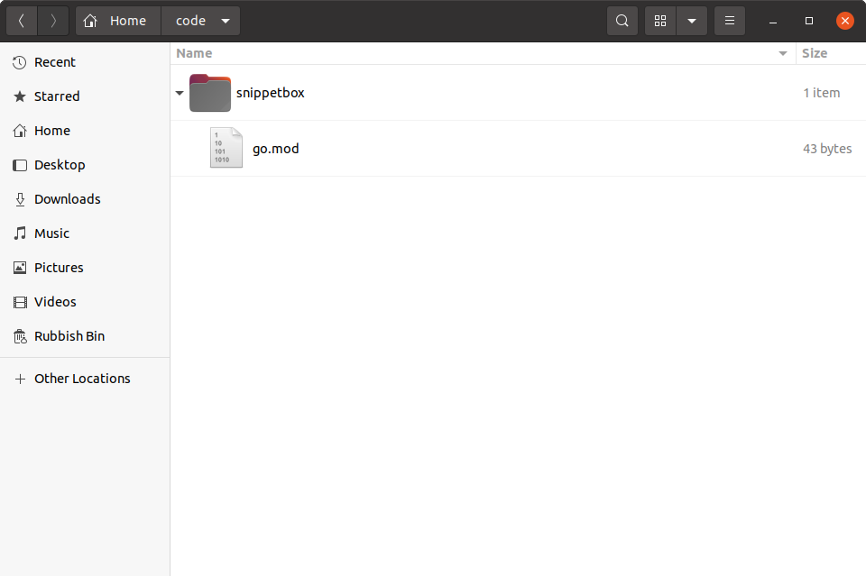

## 项目设置和创建模块

在编写任何代码之前，你需要`snippetbox`在计算机上创建一个目录，作为此项目的顶级“主页”。我们在本书中编写的所有 Go 代码都将存放在此处，以及其他特定于项目的资源（如 HTML 模板和 CSS 文件）。

因此，如果你按照以下步骤操作，请打开终端并`snippetbox`在计算机上的任意位置创建一个名为 的新项目目录。我将把我的项目目录放在 下`$HOME/code`，但如果你愿意，也可以选择其他位置。

```sh
$ mkdir -p $HOME/code/snippetbox
```

### 创建模块

接下来你需要做的是决定项目的模块路径。

如果你还不熟悉[Go 模块](https://github.com/golang/go/wiki/Modules)，你可以将模块路径视为项目的规范名称或*标识符。*

你可以选择[几乎任何字符串](https://golang.org/ref/mod#go-mod-file-ident)作为模块路径，但重点是要关注*唯一性*。为了避免将来与其他人的项目或标准库发生潜在的导入冲突，你需要选择一个全局唯一且不太可能被其他任何东西使用的模块路径。在 Go 社区中，一个常见的惯例是将模块路径基于你拥有的 URL。

就我而言，这个项目的一个清晰、简洁且*不太可能被其他任何东西使用的*模块路径是`snippetbox.alexedwards.net`，我将在本书的其余部分使用它。如果可能的话，你应该用你自己独有的东西来代替它。

一旦你决定了唯一的模块路径，接下来需要做的就是将你的项目目录转变为一个模块。

确保你位于项目目录的根目录中，然后运行命令`go mod init`- 将你选择的模块路径作为参数传递，如下所示：

```sh
$ cd $HOME/code/snippetbox
$ go mod init snippetbox.alexedwards.net
go: creating new go.mod: module snippetbox.alexedwards.net
```

此时，你的项目目录应该看起来有点像下面的屏幕截图。注意到`go.mod`已经创建的文件了吗？



目前这个文件中没有太多内容，如果你在文本编辑器中打开它，它应该看起来像这样（但最好使用你自己独特的模块路径）：

文件：go.mod

```go
module snippetbox.alexedwards.net

go 1.23.0
```

我们将在本书后面更详细地讨论模块，但现在只需知道，当`go.mod`项目目录的根目录中有一个有效文件时，你的项目*就是一个模块*。将项目设置为模块有许多优点——包括更容易管理第三方依赖项、[避免供应链攻击](https://go.dev/blog/supply-chain)，并确保将来可重现应用程序的构建。

### 你好世界！

在继续之前，让我们快速检查一下一切是否设置正确。继续 `main.go`在项目目录中创建一个包含以下代码的新目录：

```sh
$ touch main.go
```

文件：main.go

```go
package main

import "fmt"

func main() {
    fmt.Println("Hello world!")
}
```

保存此文件，然后使用`go run .`终端中的命令编译并执行当前目录中的代码。一切顺利的话，你将看到以下输出：

```sh
$ go run .
Hello world!
```

----------------

### 附加信息

#### 可下载包的模块路径

如果你正在创建一个可供其他人和程序下载和使用的项目，那么最好让你的模块路径等于可以从中下载代码的位置。

例如，如果你的包托管在，`https://github.com/foo/bar`那么项目的模块路径应该是`github.com/foo/bar`。