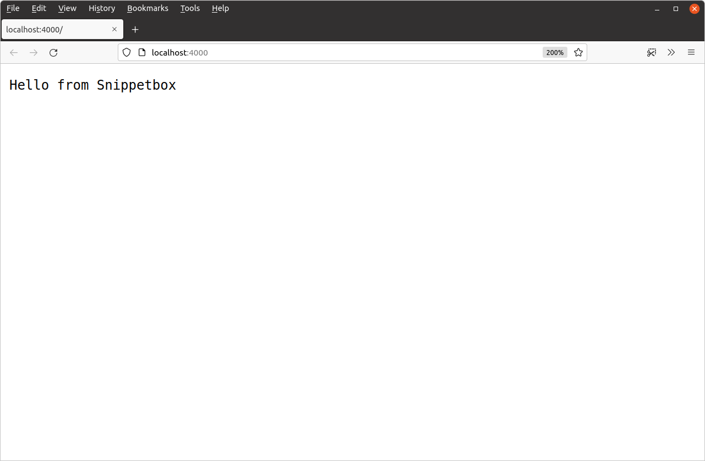

# Web 应用程序基础知识

现在一切都已正确设置，让我们开始第一次迭代我们的 Web 应用程序。我们将从三个绝对必要的内容开始：

- 我们首先需要的是处理程序。如果你以前使用 MVC 模式构建过 Web 应用程序，那么你可以将处理程序视为有点像控制器。它们负责执行应用程序逻辑并编写 HTTP 响应标头和主体。
- 第二个组件是路由器（Go 术语中为servemux）。它存储应用程序的 URL 路由模式与相应处理程序之间的映射。通常，你的应用程序有一个 servemux，其中包含所有路由。
- 我们最后需要的是一个Web 服务器。Go 的一大优点是，你可以建立一个 Web 服务器，并*在应用程序本身中*监听传入的请求。你不需要像 Nginx、Apache 或 Caddy 这样的外部第三方服务器。

我们将这些组件放在一起放在`main.go`文件中，以制作一个可运行的应用程序。

文件：main.go

```go
package main

import (
    "log"
    "net/http"
)

// 定义一个 home 处理函数，该函数写入一个包含以下内容的字节切片
// “Hello from Snippetbox” 作为响应主体。
func home(w http.ResponseWriter, r *http.Request) {
    w.Write([]byte("Hello from Snippetbox"))
}

func main() {
    // 使用 http.NewServeMux() 函数初始化一个新的 servemux，然后
    // 将 home 函数注册为“/”URL 模式的处理程序。
    mux := http.NewServeMux()
    mux.HandleFunc("/", home)

    // 打印一条日志消息表明服务器正在启动。
    log.Print("starting server on :4000")

    // 使用 http.ListenAndServe() 函数启动新的 Web 服务器。我们传入
    // 两个参数：要监听的 TCP 网络地址（在本例中为“:4000”）
    // 以及我们刚刚创建的 servemux。如果 http.ListenAndServe() 返回错误
    // 我们使用 log.Fatal() 函数记录错误消息并退出。注意
    // http.ListenAndServe() 返回的任何错误始终是非零的。
    err := http.ListenAndServe(":4000", mux)
    log.Fatal(err)
}
```

> **注意：**处理`home`函数只是一个带有两个参数的常规 Go 函数。该`http.ResponseWriter`参数提供组装 HTTP 响应并将其发送给用户的方法，参数`*http.Request`是指向结构体的指针，该结构体包含有关当前请求的信息（如 HTTP 方法和正在请求的 URL）。我们将在本书中进一步讨论这些参数并演示如何使用它们。

运行此代码时，它将启动一个 Web 服务器，监听本地计算机的 4000 端口。每次服务器收到新的 HTTP 请求时，它都会将请求传递给 servemux，反过来，servemux 将检查 URL 路径并将请求分派给匹配的处理程序。

让我们尝试一下。保存文件`main.go`，然后尝试使用命令从终端运行它`go run`。

```sh
$ cd $HOME/code/snippetbox
$ go run .
2024/03/18 11:29:23 starting server on :4000
```

当服务器运行时，打开 Web 浏览器并尝试访问[`http://localhost:4000`](http://localhost:4000/)。如果一切顺利，你应该会看到类似这样的页面：



> **重要提示：**在继续之前，我应该解释一下 Go 的 servemux 将路由模式`"/"`视为万能模式。因此，目前对我们服务器的*所有*HTTP 请求都将由该函数处理`home`，无论其 URL 路径如何。例如，你可以访问不同的 URL 路径[`http://localhost:4000/foo/bar`](http://localhost:4000/foo/bar)，你将收到完全相同的响应。

如果你返回到终端窗口，你可以按下`Ctrl+C`键盘上的按钮来停止服务器。


## 附加信息

### 网络地址

你传递给的 TCP 网络地址`http.ListenAndServe()`应采用 格式`"host:port"`。如果你省略主机（就像我们对 所做的那样`":4000"`），则服务器将监听你计算机上的所有可用网络接口。通常，如果你的计算机有多个网络接口并且你只想监听其中一个，则只需在地址中指定主机。

在其他 Go 项目或文档中，你有时可能会看到使用命名端口（如`":http"`或`":http-alt"`而不是数字）编写的网络地址。如果你使用命名端口，则该`http.ListenAndServe()`函数将在启动服务器时尝试从你的文件中查找相关端口号`/etc/services`，如果找不到匹配项，则返回错误。

### 使用 go run

在开发过程中，该`go run`命令是测试代码的便捷方式。它本质上是一种快捷方式，可以编译代码、在目录中创建可执行二进制文件`/tmp`，然后一步运行此二进制文件。

它接受以空格分隔的`.go`文件列表、特定包的路径（其中字符`.`代表当前目录）或完整模块路径。对于我们目前的应用程序，以下三个命令都是等效的：

```go
$ go run .
$ go run main.go
$ go run snippetbox.alexedwards.net
```

