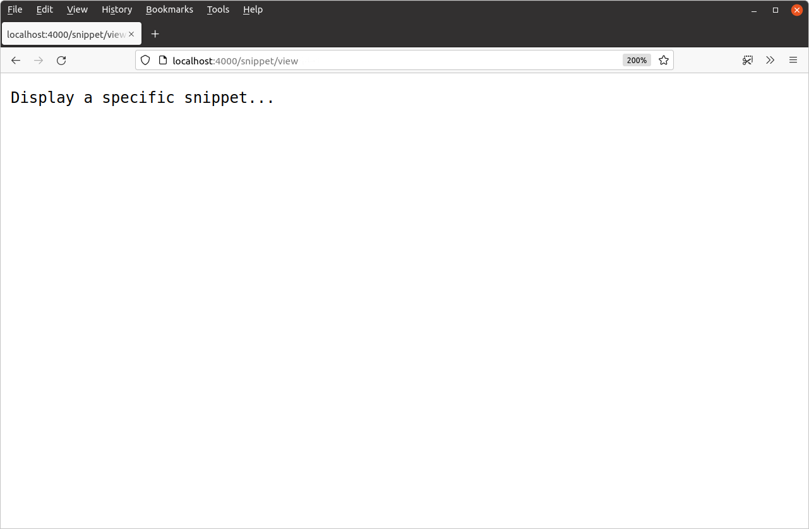
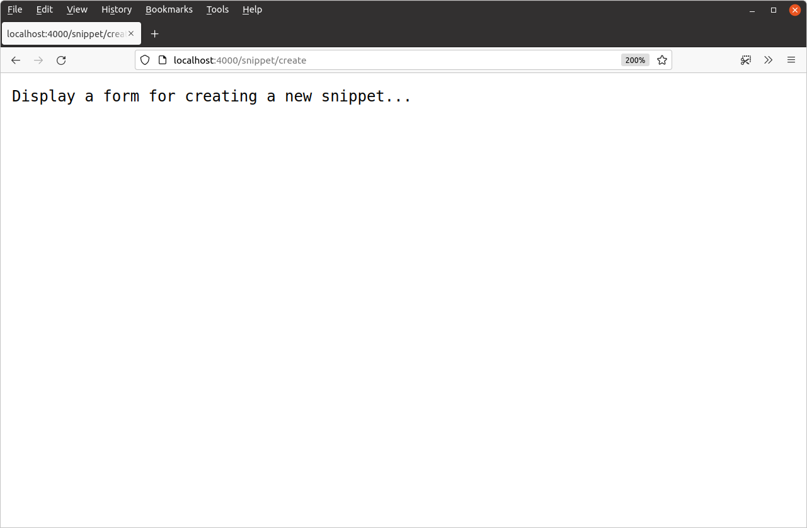
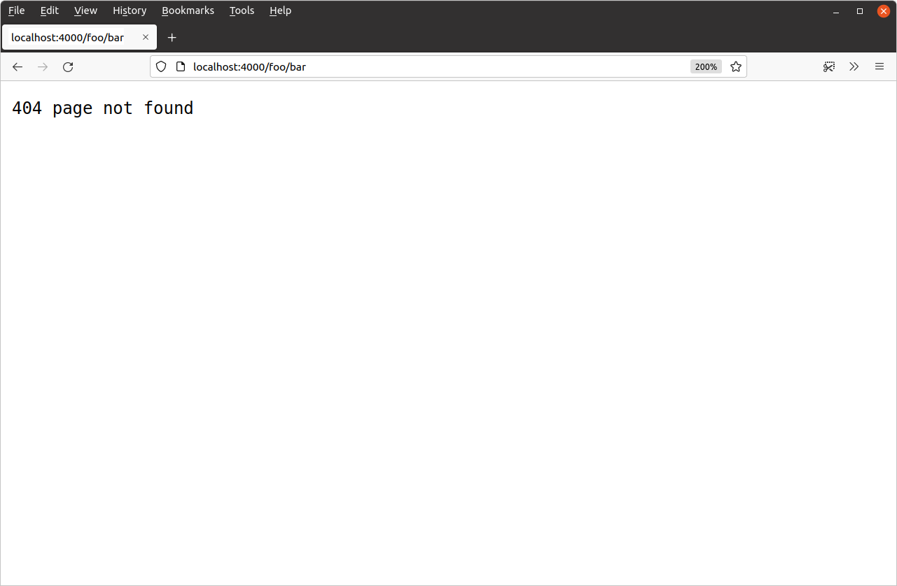

# 路由请求

只有一个路由的 Web 应用程序并不令人兴奋……或者说没什么用！让我们添加更多路由，以便应用程序开始像这样成形：

| **路由模式**    | Handler       | 动作                         |
| :-------------- | :------------ | :--------------------------- |
| /               | home          | 显示主页                     |
| /snippet/view   | snippetView   | 显示特定片段                 |
| /snippet/create | snippetCreate | 显示用于创建新代码片段的表单 |

重新打开`main.go`文件并进行如下更新：

文件：main.go

```go
package main

import (
    "log"
    "net/http"
)

func home(w http.ResponseWriter, r *http.Request) {
    w.Write([]byte("Hello from Snippetbox"))
}

// 添加 snippetView 处理函数。
func snippetView(w http.ResponseWriter, r *http.Request) {
    w.Write([]byte("Display a specific snippet..."))
}

// 添加 snippetCreate 处理函数。
func snippetCreate(w http.ResponseWriter, r *http.Request) {
    w.Write([]byte("Display a form for creating a new snippet..."))
}

func main() {
    // 注册两个新的处理函数和相应的路由模式
    // servemux，与我们之前做的完全相同。
    mux := http.NewServeMux()
    mux.HandleFunc("/", home)
    mux.HandleFunc("/snippet/view", snippetView)
    mux.HandleFunc("/snippet/create", snippetCreate)

    log.Print("starting server on :4000")

    err := http.ListenAndServe(":4000", mux)
    log.Fatal(err)
}
```

确保这些更改已保存，然后重新启动 Web 应用程序：

```sh
$ cd $HOME/code/snippetbox
$ go run .
2024/03/18 11:29:23 starting server on :4000
```

如果你在网络浏览器中访问以下链接，你现在应该会获得每条路线的适当响应：

- [`http://localhost:4000/snippet/view`](http://localhost:4000/snippet/view)
- 

- [`http://localhost:4000/snippet/create`](http://localhost:4000/snippet/create)
- 

## 路由模式中的尾部斜杠

现在两条新路由已经添加，我们来谈谈一些理论。

重要的是要知道，Go 的 servemux 具有不同的匹配规则，具体取决于路由模式是否以尾随斜杠结尾。

我们的两个新路由模式 —`"/snippet/view"`和`"/snippet/create"`— 不以尾部斜杠结尾。当模式没有尾部斜杠时，只有当请求 URL 路径完全匹配该模式时，才会匹配该模式（并调用相应的处理程序）。

当路由模式以斜杠结尾时（如`"/"`或`"/static/"`），它被称为*子树路径模式*。每当请求 URL 路径的*开头*与子树路径匹配时，就会匹配子树路径模式（并调用相应的处理程序）。如果这有助于你的理解，你可以将子树路径想象成在末尾有一个通配符，如`"/**"`或`"/static/**"`。

这有助于解释为什么`"/"`路由模式的作用就像一个万能的模式。该模式本质上意味着*匹配一个斜杠，后面跟着任何东西（或者什么都没有）*。

## 限制子树路径

为了防止子树路径模式末尾出现通配符，你可以将特殊字符序列附加`{$}`到模式末尾 — 如`"/{$}"`或`"/static/{$}"`。

因此，如果你有路由模式`"/{$}"`，它实际上意味着*匹配单个斜杠，后面没有其他内容*。它只会匹配 URL 路径完全匹配的请求`/`。

让我们在我们的应用程序中使用它来停止我们的`home`处理程序充当全部捕获的功能，如下所示：

文件：main.go

```go
package main

...

func main() {
    mux := http.NewServeMux()
    mux.HandleFunc("/{$}", home) 	// 将此路由限制为仅在 / 上的精确匹配。
    mux.HandleFunc("/snippet/view", snippetView) 
    mux.HandleFunc("/snippet/create", snippetCreate)

    log.Print("starting server on :4000")

    err := http.ListenAndServe(":4000", mux)
    log.Fatal(err)
}
```

> **注意：**它仅允许在子树路径模式的末尾使用`{$}`（即以尾部斜杠结尾的模式）。没有尾部斜杠的路由模式无论如何都需要匹配整个请求路径，因此`{$}`在末尾包含它是没有意义的，尝试这样做会导致运行时恐慌。

完成更改后，重新启动服务器并请求未注册的 URL 路径，如[`http://localhost:4000/foo/bar`](http://localhost:4000/foo/bar)。你现在应该会得到`404`类似这样的响应：



## 附加信息

### 附加的servemux功能

还有一些其他的servemux功能值得指出：

- 请求 URL 路径会自动清理。如果请求路径包含任何`.`或`..`元素或重复斜杠，用户将自动重定向到等效的干净 URL。例如，如果用户向 发出请求，则将自动向其`/foo/bar/..//baz`发送请求。`301 Permanent Redirect``/foo/baz`
- 如果已注册子树路径，并且收到对该子树路径的请求，*但未*添加尾部斜杠，则系统会自动向用户发送一个`301 Permanent Redirect`到添加了斜杠的子树路径的请求。例如，如果你已注册子树路径`/foo/`，则任何到的请求`/foo`都将被重定向到`/foo/`。

### 主机名匹配

你可以在路由模式中包含主机名。当你想要将所有 HTTP 请求重定向到规范 URL 时，或者当你的应用程序充当多个站点或服务的后端时，这会很有用。例如：

```go
mux := http.NewServeMux()
mux.HandleFunc("foo.example.org/", fooHandler)
mux.HandleFunc("bar.example.org/", barHandler)
mux.HandleFunc("/baz", bazHandler)
```

当进行模式匹配时，将首先检查任何特定于主机的模式，如果匹配，则请求将被分派到相应的处理程序。只有当未*找到*特定于主机的匹配时，才会检查非特定于主机的模式。

### 默认的 servemux

如果你已经使用 Go 一段时间了，你可能已经遇到过[`http.Handle()`](https://pkg.go.dev/net/http/#Handle)和[`http.HandleFunc()`](https://pkg.go.dev/net/http/#HandleFunc)函数。这些函数允许你注册路由*而无需*明确声明 servemux，如下所示：

```go
func main() {
    http.HandleFunc("/", home)
    http.HandleFunc("/snippet/view", snippetView)
    http.HandleFunc("/snippet/create", snippetCreate)

    log.Print("starting server on :4000")
    
    err := http.ListenAndServe(":4000", nil)
    log.Fatal(err)
}
```

在幕后，这些函数使用默认的 servemux注册它们的路由。这只是我们已经使用的常规 servemux，但它由 Go 自动初始化并存储在[`http.DefaultServeMux`](https://pkg.go.dev/net/http#pkg-variables)全局变量中。

如果将其`nil`作为第二个参数传递给`http.ListenAndServe()`，服务器将使用`http.DefaultServeMux`其进行路由。

虽然这种方法可以使你的代码稍微短一些，但我不推荐它，原因有二：

- 与声明和使用你自己的本地范围的 servemux 相比，它不那么明确并且感觉更“神奇”。

- 由于`http.DefaultServeMux`是标准库中的全局变量，这意味着项目中的*任何*Go 代码都可以访问它并可能注册路由。如果你的项目代码库很大（尤其是由许多人共同开发的项目），那么确保应用程序的所有路由声明都可Ï在一个中心位置轻松找到会变得更加困难。

  这也意味着*你的应用程序导入的任何第三方包*也可以注册路由`http.DefaultServeMux`。如果其中一个第三方包被破解，他们可能会利用它`http.DefaultServeMux`向网络公开恶意处理程序。只需不使用 即可轻松避免这种风险`http.DefaultServeMux`。

因此，为了清晰、可维护性和安全性，通常最好避免`http.DefaultServeMux`使用相应的辅助函数。而是使用你自己的本地范围的 servemux，就像我们迄今为止在本项目中所做的那样。