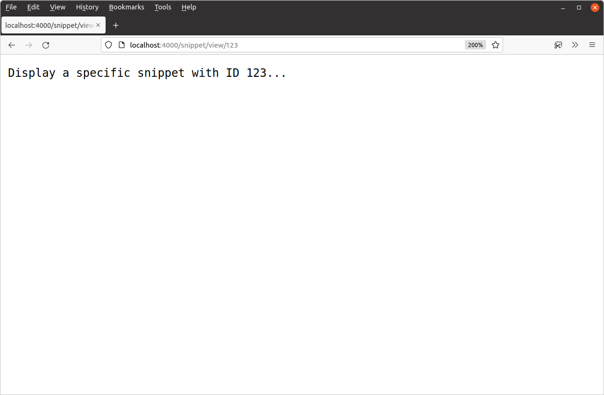

# 通配符路由模式

还可以定义包含*通配符段*的路由模式。你可以使用它们来创建更灵活的路由规则，也可以通过请求 URL 将变量传递给你的 Go 应用程序。如果你以前使用其他语言的框架构建过 Web 应用程序，那么本章中的概念对你来说可能很熟悉。

让我们暂时离开应用程序构建来解释一下它是如何工作的。

路由模式中的通配符段由括号内的通配符*标识符*表示`{}`。如下所示：

```go
mux.HandleFunc("/products/{category}/item/{itemID}", exampleHandler)
```

在此示例中，路由模式包含两个通配符段。第一个段具有标识符`category`，第二个段具有标识符`itemID`。

包含通配符段的路由模式的匹配规则与我们在上一章中看到的相同，但附加规则是请求路径可以包含通配符段的*任何*非空值。因此，例如，以下请求都将匹配我们上面定义的路由：

```
/products/hammocks/item/sku123456789
/products/seasonal-plants/item/pdt-1234-wxyz
/products/experimental_foods/item/quantum%20bananas
```

> **重要提示：**定义路由模式时，每个路径段（正斜杠字符之间的位）只能包含一个通配符，并且通配符需要填满整个*路径*段。诸如`"/products/c_{category}"`、`/date/{y}-{m}-{d}`或 之类的模式`/{slug}.html`无效。

在处理程序中，你可以使用其标识符和方法检索通配符段的相应值[`r.PathValue()`](https://pkg.go.dev/net/http#Request.PathValue)。例如：

```go
func exampleHandler(w http.ResponseWriter, r *http.Request) {
    category := r.PathValue("category")
    itemID := r.PathValue("itemID")

    ...
}
```

该`r.PathValue()`方法总是返回一个`string`值，重要的是要记住，这可以是用户在 URL 中包含的*任何值- 因此你应该在对其进行任何重要操作之前验证或健全性检查该值。*

## 在实践中使用通配符段

好的，让我们回到我们的应用程序并更新它以`{id}`在路线中包含一个新的通配符段`/snippet/view`，以便我们的路线看起来像这样：

| **路由模式**           | Handler         | Action                       |
| :--------------------- | :-------------- | :--------------------------- |
| /{$}                   | home            | 显示主页                     |
| **/snippet/view/{id}** | **snippetView** | **显示特定片段**             |
| /snippet/create        | snippetCreate   | 显示用于创建新代码片段的表单 |

打开你的`main.go`文件并进行如下更改：

文件：main.go

```go
package main

...

func main() {
    mux := http.NewServeMux()
    mux.HandleFunc("/{$}", home)
    mux.HandleFunc("/snippet/view/{id}", snippetView)  // 添加 {id} 通配符段
    mux.HandleFunc("/snippet/create", snippetCreate)

    log.Print("starting server on :4000")

    err := http.ListenAndServe(":4000", mux)
    log.Fatal(err)
}
```

现在让我们转到我们的`snippetView`处理程序并更新它以`id`从请求 URL 路径中检索值。在本书的后面部分，我们将使用此`id`值从数据库中选择特定的代码段，但现在我们只会将其`id`作为 HTTP 响应的一部分回显给用户。

由于该`id`值是不受信任的用户输入，因此在使用它之前，我们应该对其进行验证，以确保它是合理且合理的。出于应用程序的目的，我们希望检查该`id`值是否包含正整数，我们可以尝试使用函数将字符串值转换为整数[`strconv.Atoi()`](https://pkg.go.dev/strconv/#Atoi)，然后检查该值是否大于零。

方法如下：

文件：main.go

```go
package main

import (
    "fmt" // New import
    "log"
    "net/http"
    "strconv" // New import
)

...

func snippetView(w http.ResponseWriter, r *http.Request) {
    // Extract the value of the id wildcard from the request using r.PathValue()
    // and try to convert it to an integer using the strconv.Atoi() function. If
    // it can't be converted to an integer, or the value is less than 1, we
    // return a 404 page not found response.
    id, err := strconv.Atoi(r.PathValue("id"))
    if err != nil || id < 1 {
        http.NotFound(w, r)
        return
    }

    // Use the fmt.Sprintf() function to interpolate the id value with a
    // message, then write it as the HTTP response.
    msg := fmt.Sprintf("Display a specific snippet with ID %d...", id)
    w.Write([]byte(msg))
}

...
```

保存更改，重新启动应用程序，然后打开浏览器并尝试访问类似 的 URL [`http://localhost:4000/snippet/view/123`](http://localhost:4000/snippet/view/123)。你应该看到一个响应，其中包含`id`来自请求 URL 的回显通配符值，类似于：



你可能还想尝试访问一些通配符值无效`id`或根本没有通配符值的 URL。例如：

- [`http://localhost:4000/snippet/view/`](http://localhost:4000/snippet/view/)
- [`http://localhost:4000/snippet/view/-1`](http://localhost:4000/snippet/view/-1)
- [`http://localhost:4000/snippet/view/foo`](http://localhost:4000/snippet/view/foo)

对于所有这些请求你都应该得到`404 page not found`答复。

## 附加信息

### 优先顺序和冲突

使用通配符段定义路由模式时，某些模式可能会“重叠”。例如，如果你使用模式定义路由，`"/post/edit"`并且`"/post/{id}"`它们重叠，因为传入的 HTTP 请求的路径与这*两个*`/post/edit`模式都有效匹配。

当路由模式重叠时，Go 的 servemux 需要决定哪种模式优先，以便它可以将请求分发到适当的处理程序。

规则非常简洁明了：*最具体的路由模式获胜*。正式地，如果一个模式仅匹配另一个模式匹配的请求子集，则 Go 会将一个模式定义为比另一个模式更具体。

继续上面的示例，路由模式`"/post/edit"` *仅*匹配具有精确路径的请求`/post/edit`，而模式`"/post/{id}"`匹配具有路径、等等的请求`/post/edit`。`/post/123`因此`/post/abc`是`"/post/edit"`更具体的路由模式，将优先考虑。

在我们讨论这个话题时，还有其他几件事值得一提：

- *最具体的模式获胜*规则的一个很好的副作用是，你可以按任何顺序注册模式*，而它不会改变 servemux 的行为方式*。
- 有一种潜在的极端情况，即你有两个重叠的路由模式，但没有一个明显比另一个更具体。例如，模式`"/post/new/{id}"`和`"/post/{author}/latest"`重叠，因为它们都与请求路径匹配`/post/new/latest`，但不清楚哪一个应该优先。在这种情况下，Go 的 servemux 认为模式冲突*，*并且在初始化路由时会在运行时崩溃。
- 仅仅因为 Go 的 servemux 支持重叠路由，并不意味着你应该使用它们！重叠路由模式会增加应用程序中出现错误和意外行为的风险，如果你可以自由设计应用程序的 URL 结构，通常最好将重叠保持在最低限度或完全避免重叠。

### 带通配符的子路径模式

重要的是要理解，即使使用通配符段，我们在上一章中描述的路由规则仍然适用。特别是，如果你的路由模式以尾部斜杠结尾，并且`{$}`末尾没有，则它将被视为*子路径模式*，并且只需要匹配请求 URL 路径的*开头。*

因此，如果你的路线中有一个子树路径模式`"/user/{id}/"`（请注意尾随斜杠），则该模式将匹配诸如`/user/1/`、`/user/2/a`等请求`/user/2/a/b/c`。

再次提醒，如果你不想要这种行为，请`{$}`在末尾粘贴 a — 例如`"/user/{id}/{$}"`。

### 剩余通配符

路由模式中的通配符通常仅匹配请求路径中的单个非空部分。但有一种特殊情况。

如果路由模式以通配符结尾，并且该最终通配符标识符以 结尾`...`，则通配符将匹配请求路径的任何和所有剩余段。

例如，如果你声明路由模式为 ，`"/post/{path...}"`它将匹配 、 等请求`/post/a`—`/post/a/b`非常`/post/a/b/c`类似于子树路径模式。但不同之处在于，你可以通过处理程序中的方法访问整个通配符部分。在此示例中，你可以通过调用 来`r.PathValue()`获取 的通配符值。`{path...}``r.PathValue("path")`
