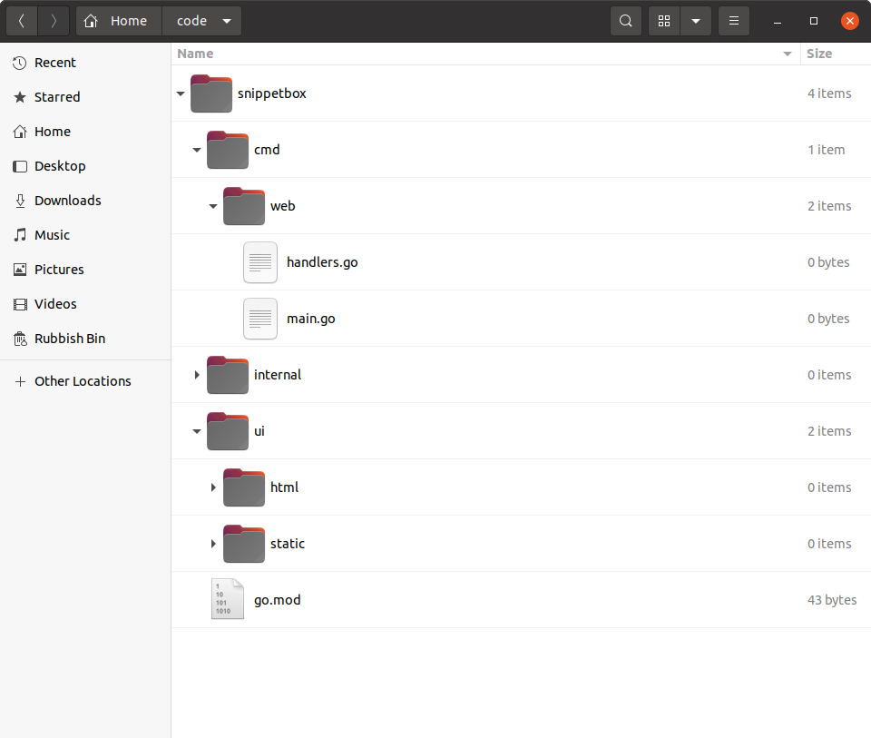

# 项目结构和组织

在我们向文件中添加更多代码之前`main.go`，这是一个思考如何组织和构建这个项目的好时机。

需要提前说明的是，在 Go 中，没有一种正确（甚至推荐）的方式来构建 Web 应用程序。这有好有坏。这意味着你可以自由灵活地组织代码，但在尝试确定最佳结构时也很容易陷入不确定的境地。

随着你对 Go 的了解越来越多，你会逐渐了解哪些模式在不同情况下对你有用。但作为起点，我能给你的最好建议是*不要把事情搞得太复杂*。只有在明显需要时才努力增加结构和复杂性。

[对于这个项目，我们将实施一个遵循流行且久经考验的](https://go.dev/doc/modules/layout#server-project)方法的大纲结构。这是一个可靠的起点，你应该能够在各种项目中重复使用通用结构。

如果你正在按照以下步骤操作，请确保你位于项目存储库的根目录中并运行以下命令：

```sh
$ cd $HOME/code/snippetbox
$ rm main.go
$ mkdir -p cmd/web internal ui/html ui/static
$ touch cmd/web/main.go
$ touch cmd/web/handlers.go
```

你的项目存储库的结构现在应如下所示：



让我们花点时间来讨论一下每个目录的用途。

- 该`cmd`目录将包含项目中可执行应用程序的*特定*于应用程序的代码。目前，我们的项目只有一个可执行应用程序 — Web 应用程序 — 它将位于该`cmd/web`目录下。
- 该`internal`目录将包含项目中使用的辅助*非应用程序特定*代码。我们将使用它来保存可能可重复使用的代码，例如验证助手和项目的 SQL 数据库模型。
- 该`ui`目录将包含Web 应用程序使用的*用户界面资产*`ui/html`。具体来说，该目录将包含 HTML 模板，而该`ui/static`目录将包含静态文件（如 CSS 和图像）。

*那么我们为什么要使用这种结构呢？*

有两大好处：

1. 它明确区分了 Go 和非 Go 资产。我们编写的所有 Go 代码都将专门位于和`cmd`目录下`internal`，而项目根目录则可以自由保存非 Go 资产，例如 UI 文件、makefile 和模块定义（包括我们的`go.mod`文件）。
2. 如果你想在项目中添加另一个可执行应用程序，它可以很好地扩展。例如，你可能想添加 CLI（命令行界面）以便将来自动执行某些管理任务。使用此结构，你可以在下创建此 CLI 应用程序，`cmd/cli`它将能够导入和重用你在`internal`目录下编写的所有代码。

## 重构现有代码

让我们快速将已经编写的代码移植到这个新结构。

文件：cmd/web/main.go

```go
package main

import (
    "log"
    "net/http"
)

func main() {
    mux := http.NewServeMux()
    mux.HandleFunc("GET /{$}", home)
    mux.HandleFunc("GET /snippet/view/{id}", snippetView)
    mux.HandleFunc("GET /snippet/create", snippetCreate)
    mux.HandleFunc("POST /snippet/create", snippetCreatePost)

    log.Print("starting server on :4000")
    
    err := http.ListenAndServe(":4000", mux)
    log.Fatal(err)
}
```

文件：cmd/web/handlers.go

```go
package main

import (
    "fmt"
    "net/http"
    "strconv"
)

func home(w http.ResponseWriter, r *http.Request) {
    w.Header().Add("Server", "Go")
    w.Write([]byte("Hello from Snippetbox"))
}

func snippetView(w http.ResponseWriter, r *http.Request) {
    id, err := strconv.Atoi(r.PathValue("id"))
    if err != nil || id < 1 {
        http.NotFound(w, r)
        return
    }

    fmt.Fprintf(w, "Display a specific snippet with ID %d...", id)
}

func snippetCreate(w http.ResponseWriter, r *http.Request) {
    w.Write([]byte("Display a form for creating a new snippet..."))
}

func snippetCreatePost(w http.ResponseWriter, r *http.Request) {
    w.WriteHeader(http.StatusCreated)
    w.Write([]byte("Save a new snippet..."))
}
```

现在我们的 Web 应用程序由目录`.go`下的多个文件组成`cmd/web`。要运行这些文件，我们可以使用`go run`如下命令：

```sh
$ cd $HOME/code/snippetbox
$ go run ./cmd/web
2024/03/18 11:29:23 starting server on :4000
```

## 附加信息

### 内部目录

需要指出的是，目录名`internal`在 Go 中具有特殊含义和行为：此目录下的任何包只能由*目录**父级内的`internal`*代码导入。在我们的例子中，这意味着任何位于的包`internal`只能由我们项目目录中的代码导入`snippetbox`。

或者，从另一个角度来看，这意味着 下的任何包`internal` *都不能被我们项目之外的代码导入*。

这很有用，因为它可以防止其他代码库导入和依赖我们目录中（可能未版本控制和不受支持的）包`internal`- 即使项目代码在 GitHub 等地方公开可用。