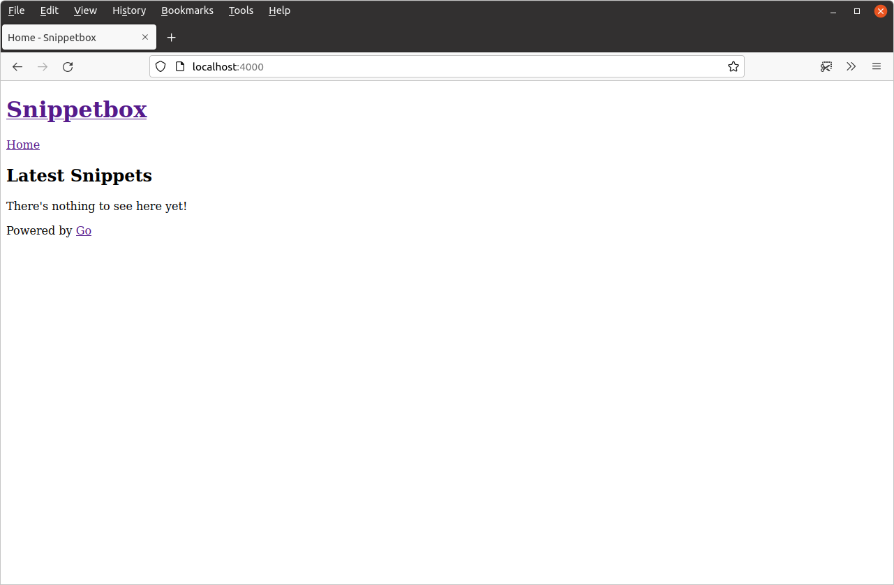

## HTML 模板和继承

让我们为项目注入一点活力，并为我们的 Snippetbox Web 应用程序开发一个合适的主页。在接下来的几章中，我们将努力创建一个如下所示的页面：


让我们首先创建一个模板文件来`ui/html/pages/home.tmpl`包含主页的 HTML 内容。如下所示：

```sh
$ mkdir ui/html/pages
$ touch ui/html/pages/home.tmpl
```

并添加以下 HTML 标记：

文件：ui/html/pages/home.tmpl

```html
<!doctype html>
<html lang='en'>
    <head>
        <meta charset='utf-8'>
        <title>Home - Snippetbox</title>
    </head>
    <body>
        <header>
            <h1><a href='/'>Snippetbox</a></h1>
        </header>
        <main>
            <h2>Latest Snippets</h2>
            <p>There's nothing to see here yet!</p>
        </main>
        <footer>Powered by <a href='https://golang.org/'>Go</a></footer>
    </body>
</html>
```

> **注意：**扩展`.tmpl`名在这里不传达任何特殊含义或行为。我之所以选择这个扩展名，只是因为它是一种很好的方式，可以在你浏览文件列表时清楚地表明该文件包含 Go 模板。但是，如果你愿意，也可以使用扩展名`.html`（这可能会让你的文本编辑器将文件识别为 HTML，以便语法突出显示或自动完成）——或者你甚至可以使用像这样的“双扩展名” 。选择权在你手中，但在本书中， `.tmpl.html`我们将坚持使用作为模板。`.tmpl`

现在我们已经创建了一个包含主页 HTML 标记的模板文件，下一个问题是*我们如何让我们的`home`处理程序来呈现它？*

为此我们需要使用 Go 的[`html/template`](https://pkg.go.dev/html/template/)包，它提供了一组用于安全解析和渲染 HTML 模板的函数。我们可以使用此包中的函数来解析模板文件，然后执行模板。

我来演示一下。打开`cmd/web/handlers.go`文件并添加以下代码：

文件：cmd/web/handlers.go

```go
package main

import (
    "fmt"
    "html/template" // New import
    "log"           // New import
    "net/http"
    "strconv"
)

func home(w http.ResponseWriter, r *http.Request) {
    w.Header().Add("Server", "Go")

    // Use the template.ParseFiles() function to read the template file into a
    // template set. If there's an error, we log the detailed error message, use
    // the http.Error() function to send an Internal Server Error response to the
    // user, and then return from the handler so no subsequent code is executed.
    ts, err := template.ParseFiles("./ui/html/pages/home.tmpl")
    if err != nil {
        log.Print(err.Error())
        http.Error(w, "Internal Server Error", http.StatusInternalServerError)
        return
    }

    // Then we use the Execute() method on the template set to write the
    // template content as the response body. The last parameter to Execute()
    // represents any dynamic data that we want to pass in, which for now we'll
    // leave as nil.
    err = ts.Execute(w, nil)
    if err != nil {
        log.Print(err.Error())
        http.Error(w, "Internal Server Error", http.StatusInternalServerError)
    }
}

...
```

关于此代码，有几点重要的事情需要指出：

- 传递给`template.ParseFiles()`函数的文件路径必须是相对于当前工作目录的路径，或者是绝对路径。在上面的代码中，我已将路径设置为相对于项目目录的根目录的路径。
- 如果`template.ParseFiles()`或`ts.Execute()`函数返回错误，我们将记录详细的错误消息，然后使用函数[`http.Error()`](https://pkg.go.dev/net/http#Error)向用户发送响应。`http.Error()`是一个轻量级辅助函数，它向用户发送纯文本错误消息和特定的 HTTP 状态代码（在我们的代码中，我们发送消息`"Internal Server Error"`和状态代码`500`，由常量表示`http.StatusInternalServerError`）。实际上，这意味着如果发生错误，用户将`Internal Server Error`在其浏览器中看到该消息，但详细的错误消息将记录在应用程序日志消息中。

因此，请确保你位于项目目录的根目录中，然后重新启动应用程序：

```sh
$ cd $HOME/code/snippetbox
$ go run ./cmd/web
2024/03/18 11:29:23 starting server on :4000
```

然后在浏览器中打开[`http://localhost:4000`](http://localhost:4000/)。你会发现 HTML 主页看起来很不错。


### 模板组成

当我们向 Web 应用程序添加更多页面时，我们会希望在每个页面上包含一些共享的、样板的 HTML 标记 - 例如`<head>`HTML 元素内的标题、导航和元数据。

为了防止重复和节省输入，最好创建一个包含此共享内容的*基本*（或*主*）模板，然后我们可以将其与各个页面的特定于页面的标记组合在一起。

继续创建一个新`ui/html/base.tmpl`文件...

```sh
$ touch ui/html/base.tmpl
```

并添加以下标记（我们希望它出现在每个页面上）：

文件：ui/html/base.tmpl

```html
{{define "base"}}
<!doctype html>
<html lang='en'>
    <head>
        <meta charset='utf-8'>
        <title>{{template "title" .}} - Snippetbox</title>
    </head>
    <body>
        <header>
            <h1><a href='/'>Snippetbox</a></h1>
        </header>
        <main>
            {{template "main" .}}
        </main>
        <footer>Powered by <a href='https://golang.org/'>Go</a></footer>
    </body>
</html>
{{end}}
```

如果你以前使用过其他语言的模板，希望你对此感到熟悉。它本质上只是常规 HTML，在双花括号中有一些额外的*操作。*

我们使用`{{define "base"}}...{{end}}`动作作为包装器来定义一个名为的不同命名的模板`base`，其中包含我们希望在每个页面上显示的内容。

其中，我们使用`{{template "title" .}}`和`{{template "main" .}}`操作来表示我们想要在 HTML 中的特定位置调用其他命名模板（称为`title`和）。`main`

> **注意：**如果你想知道，操作末尾的点`{{template "title" .}}`表示你想要传递给调用的模板的任何动态数据。我们将在本书后面详细讨论这一点。

现在让我们回到该`ui/html/pages/home.tmpl`文件并更新它以定义`title`和`main`命名包含主页特定内容的模板。

文件：ui/html/pages/home.tmpl

```html
{{define "title"}}Home{{end}}

{{define "main"}}
    <h2>Latest Snippets</h2>
    <p>There's nothing to see here yet!</p>
{{end}}
```

完成后，下一步是更新`home`处理程序中的代码，以便它解析*两个*模板文件，如下所示：

文件：cmd/web/handlers.go

```go
package main

...

func home(w http.ResponseWriter, r *http.Request) {
    w.Header().Add("Server", "Go")

    // Initialize a slice containing the paths to the two files. It's important
    // to note that the file containing our base template must be the *first*
    // file in the slice.
    files := []string{
        "./ui/html/base.tmpl",
        "./ui/html/pages/home.tmpl",
    }

    // Use the template.ParseFiles() function to read the files and store the
    // templates in a template set. Notice that we use ... to pass the contents 
    // of the files slice as variadic arguments.
    ts, err := template.ParseFiles(files...)
    if err != nil {
        log.Print(err.Error())
        http.Error(w, "Internal Server Error", http.StatusInternalServerError)
        return
    }

    // Use the ExecuteTemplate() method to write the content of the "base" 
    // template as the response body.
    err = ts.ExecuteTemplate(w, "base", nil)
    if err != nil {
        log.Print(err.Error())
        http.Error(w, "Internal Server Error", http.StatusInternalServerError)
    }
}

...
```

因此现在，我们的模板集不再直接包含 HTML，而是包含 3 个命名模板—— `base`、`title`和`main`。我们使用`ExecuteTemplate()`方法告诉 Go，我们特别想使用模板的内容进行响应`base`（这反过来又调用我们的`title`和`main`模板）。

你可以随时重启服务器并尝试一下。你会发现它呈现的输出与之前相同（尽管 HTML 源代码中操作所在的位置会有一些额外的空格）。

### 嵌入部分

对于某些应用程序，你可能希望将某些 HTML 片段拆分为可在不同页面或布局中重复使用的部分。为了说明这一点，让我们创建一个包含 Web 应用程序主导航栏的部分。

创建一个`ui/html/partials/nav.tmpl`包含名为 的命名模板的新文件`"nav"`，如下所示：

```sh
$ mkdir ui/html/partials
$ touch ui/html/partials/nav.tmpl
```

文件：ui/html/partials/nav.tmpl

```html
{{define "nav"}}
 <nav>
    <a href='/'>Home</a>
</nav>
{{end}}
```

然后更新`base`模板，以便它使用操作调用导航部分`{{template "nav" .}}`：

文件：ui/html/base.tmpl

```html
{{define "base"}}
<!doctype html>
<html lang='en'>
    <head>
        <meta charset='utf-8'>
        <title>{{template "title" .}} - Snippetbox</title>
    </head>
    <body>
        <header>
            <h1><a href='/'>Snippetbox</a></h1>
        </header>
        <!-- Invoke the navigation template -->
        {{template "nav" .}}
        <main>
            {{template "main" .}}
        </main>
        <footer>Powered by <a href='https://golang.org/'>Go</a></footer>
    </body>
</html>
{{end}}
```

最后，我们需要更新处理程序以在解析模板文件时`home`包含新文件：`ui/html/partials/nav.tmpl`

文件：cmd/web/handlers.go

```go
package main

...

func home(w http.ResponseWriter, r *http.Request) {
    w.Header().Add("Server", "Go")

    // Include the navigation partial in the template files.
    files := []string{
        "./ui/html/base.tmpl",
        "./ui/html/partials/nav.tmpl",
        "./ui/html/pages/home.tmpl",
    }

    ts, err := template.ParseFiles(files...)
    if err != nil {
        log.Print(err.Error())
        http.Error(w, "Internal Server Error", http.StatusInternalServerError)
        return
    }

    err = ts.ExecuteTemplate(w, "base", nil)
    if err != nil {
        log.Print(err.Error())
        http.Error(w, "Internal Server Error", http.StatusInternalServerError)
    }
}

...
```

重新启动服务器后，`base`模板现在应该调用`nav`模板，并且你的主页应该如下所示：



### 附加信息

#### 阻拦行动

在上面的代码中，我们使用了`{{template}}`操作来从一个模板调用另一个模板。但是 Go 还提供了一个`{{block}}...{{end}}`可以替代的操作。它的作用类似于操作，但它允许你*在当前模板集中不存在*`{{template}}`被调用的模板时指定一些默认内容。

在 Web 应用程序的上下文中，当你想要提供一些默认内容（例如侧边栏）时，这很有用，如果需要，各个页面可以根据具体情况进行覆盖。

从语法上来说，你可以像这样使用它：

```html
{{define "base"}}
    <h1>An example template</h1>
    {{block "sidebar" .}}
        <p>My default sidebar content</p>
    {{end}}
{{end}}
```

但是 — 如果你愿意 — 你不需要*在*`{{block}}`和操作之间包含任何默认内容`{{end}}`。在这种情况下，调用的模板就像是“可选的”。如果模板存在于模板集中，则会呈现它。但如果不存在，则不会显示任何内容。