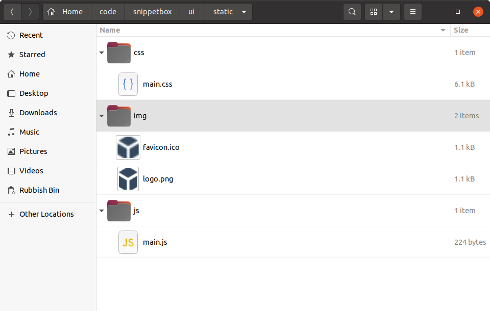

# 提供静态文件

现在，让我们通过向我们的项目添加一些静态 CSS 和图像文件以及一点点 JavaScript 来突出显示活动导航项，从而改善主页的外观。

如果你按照以下步骤操作，你可以获取必要的文件并将其提取到`ui/static`我们之前使用以下命令创建的文件夹中：

```sh
$ cd $HOME/code/snippetbox
$ curl https://www.alexedwards.net/static/sb-v2.tar.gz | tar -xvz -C ./ui/static/
```

你的目录内容`ui/static`现在看起来应该像这样：



## http.Fileserver 处理程序

Go 的`net/http`软件包附带一个内置[`http.FileServer`](https://pkg.go.dev/net/http/#FileServer)处理程序，你可以使用它从特定目录通过 HTTP 提供文件。让我们为我们的应用程序添加一条新路由，以便所有`GET`以 开头的请求都`"/static/"`使用它来处理，如下所示：

| 路由模式               | Handler             | Action                       |
| :--------------------- | :------------------ | :--------------------------- |
| GET /                  | home                | 显示主页                     |
| GET /snippet/view/{id} | snippetView         | 显示特定片段                 |
| GET /snippet/create    | snippetCreate       | 显示用于创建新代码片段的表单 |
| POST /snippet/create   | snippetCreatePost   | 保存新片段                   |
| **GET /static/**       | **http.FileServer** | **提供特定的静态文件**       |

> **请记住：**该模式`"GET /static/"`是一个子树路径模式，因此它的作用有点像在末尾有一个通配符。

要创建一个新的`http.FileServer`处理程序，我们需要使用[`http.FileServer()`](https://pkg.go.dev/net/http/#FileServer)如下函数：

```go
fileServer := http.FileServer(http.Dir("./ui/static/"))
```

当此处理程序收到文件请求时，它将从请求 URL 路径中删除前导斜杠，然后在`./ui/static`目录中搜索相应的文件以发送给用户。

因此，为了使其正常工作，我们必须在将`"/static"`URL 路径传递给*之前将*`http.FileServer`其中的前导部分去掉。否则，它将查找不存在的文件，并且用户将收到响应`404 page not found`。幸运的是，Go 包含一个[`http.StripPrefix()`](https://pkg.go.dev/net/http/#StripPrefix)专门用于此任务的助手。

打开`main.go`文件并添加以下代码，以使文件最终看起来像这样：

文件：cmd/web/main.go

```go
package main

import (
    "log"
    "net/http"
)

func main() {
    mux := http.NewServeMux()

    // Create a file server which serves files out of the "./ui/static" directory.
    // Note that the path given to the http.Dir function is relative to the project
    // directory root.
    fileServer := http.FileServer(http.Dir("./ui/static/"))

    // Use the mux.Handle() function to register the file server as the handler for
    // all URL paths that start with "/static/". For matching paths, we strip the
    // "/static" prefix before the request reaches the file server.
    mux.Handle("GET /static/", http.StripPrefix("/static", fileServer))

    // Register the other application routes as normal..
    mux.HandleFunc("GET /{$}", home)
    mux.HandleFunc("GET /snippet/view/{id}", snippetView)
    mux.HandleFunc("GET /snippet/create", snippetCreate)
    mux.HandleFunc("POST /snippet/create", snippetCreatePost)

    log.Print("starting server on :4000")
    
    err := http.ListenAndServe(":4000", mux)
    log.Fatal(err)
}
```

完成后，重新启动应用程序并[`http://localhost:4000/static/`](http://localhost:4000/static/)在浏览器中打开。你应该看到`ui/static`文件夹的可导航目录列表，如下所示：


你可以随意尝试并浏览目录列表以查看单个文件。例如，如果你导航到，[`http://localhost:4000/static/css/main.css`](http://localhost:4000/static/css/main.css)你应该会看到 CSS 文件出现在浏览器中，如下所示：


## 使用静态文件

在文件服务器正常工作的情况下，我们现在可以更新文件`ui/html/base.tmpl`以使用静态文件：

文件：ui/html/base.tmpl

```html
{{define "base"}}
<!doctype html>
<html lang='en'>
    <head>
        <meta charset='utf-8'>
        <title>{{template "title" .}} - Snippetbox</title>
         <!-- Link to the CSS stylesheet and favicon -->
        <link rel='stylesheet' href='/static/css/main.css'>
        <link rel='shortcut icon' href='/static/img/favicon.ico' type='image/x-icon'>
        <!-- Also link to some fonts hosted by Google -->
        <link rel='stylesheet' href='https://fonts.googleapis.com/css?family=Ubuntu+Mono:400,700'>
    </head>
    <body>
        <header>
            <h1><a href='/'>Snippetbox</a></h1>
        </header>
        {{template "nav" .}}
        <main>
            {{template "main" .}}
        </main>
        <footer>Powered by <a href='https://golang.org/'>Go</a></footer>
         <!-- And include the JavaScript file -->
        <script src='/static/js/main.js' type='text/javascript'></script>
    </body>
</html>
{{end}}
```

确保保存更改，然后重新启动服务器并访问[`http://localhost:4000`](http://localhost:4000/)。你的主页现在应如下所示：


## 附加信息

### 文件服务器的特性和功能

Go 的`http.FileServer`处理程序有几个非常好的功能值得一提：

- [`path.Clean()`](https://pkg.go.dev/path/#Clean)它会在搜索文件之前通过该函数对所有请求路径进行清理。这会从 URL 路径中删除任何`.`和`..`元素，从而有助于阻止目录遍历攻击。如果你将文件服务器与不会自动清理 URL 路径的路由器结合使用，则此功能特别有用。
- [完全支持范围请求](https://benramsey.com/blog/2008/05/206-partial-content-and-range-requests)。如果你的应用程序正在处理大型文件并且你希望支持可续传下载，那么此功能非常有用。如果你使用 curl 请求文件的 100-199 字节，则可以看到此功能的实际效果`logo.png`，如下所示：

```sh
$ curl -i -H "Range: bytes=100-199" --output - http://localhost:4000/static/img/logo.png
HTTP/1.1 206 Partial Content
Accept-Ranges: bytes
Content-Length: 100
Content-Range: bytes 100-199/1075
Content-Type: image/png
Last-Modified: Wed, 18 Mar 2024 11:29:23 GMT
Date: Wed, 18 Mar 2024 11:29:23 GMT
[binary data]
```

- `Last-Modified`和标头`If-Modified-Since`均透明支持。如果文件自用户上次请求以来没有更改，`http.FileServer`则将发送`304 Not Modified`状态代码而不是文件本身。这有助于减少客户端和服务器的延迟和处理开销。
- 使用该函数会`Content-Type`自动从文件扩展名中设置。如有必要，[`mime.TypeByExtension()`](https://pkg.go.dev/mime/#TypeByExtension)你可以使用该函数添加自己的自定义扩展名和内容类型。[`mime.AddExtensionType()`](https://pkg.go.dev/mime/#AddExtensionType)

### 表现

在本章中，我们设置了文件服务器，以便它提供`./ui/static`硬盘目录中的文件。

但需要注意的是，`http.FileServer`一旦应用程序启动并运行，它可能不会从磁盘读取这些文件。Windows[和](https://docs.microsoft.com/en-us/windows/desktop/fileio/file-caching)基于[Unix 的](https://www.tldp.org/LDP/sag/html/buffer-cache.html)操作系统都会将最近使用的文件缓存在 RAM 中，因此（至少对于经常使用的文件而言）它很可能`http.FileServer`会从 RAM 中为它们提供服务，而不是相对[较慢地](https://gist.github.com/jboner/2841832)往返硬盘。

### 提供单个文件

有时你可能希望在处理程序中提供单个文件。为此，有一个函数[`http.ServeFile()`](https://pkg.go.dev/net/http/#ServeFile)，你可以像这样使用它：

```go
func downloadHandler(w http.ResponseWriter, r *http.Request) {
    http.ServeFile(w, r, "./ui/static/file.zip")
}
```

> **警告：** `http.ServeFile()`不会自动清理文件路径。如果你要从不受信任的用户输入构建文件路径，则*必须先*清理输入，然后[`filepath.Clean()`](https://pkg.go.dev/path/filepath/#Clean)再使用它，以避免目录遍历攻击。

### 禁用目录列表

如果你想禁用目录列表，可以采取几种不同的方法。

最简单的方法是什么？将一个空白`index.html`文件添加到你想要禁用列表的特定目录。然后，将提供此文件而不是目录列表，并且用户将收到`200 OK`没有正文的响应。如果你想对所有目录执行此操作，`./ui/static`可以使用以下命令：

```sh
$ find ./ui/static -type d -exec touch {}/index.html \;
```

一个更复杂（但可能更好）的解决方案是创建一个自定义实现[`http.FileSystem`](https://pkg.go.dev/net/http/#FileSystem)，并让它`os.ErrNotExist`对任何目录返回错误。完整的解释和示例代码可以在[这篇博客文章](https://www.alexedwards.net/blog/disable-http-fileserver-directory-listings)中找到。