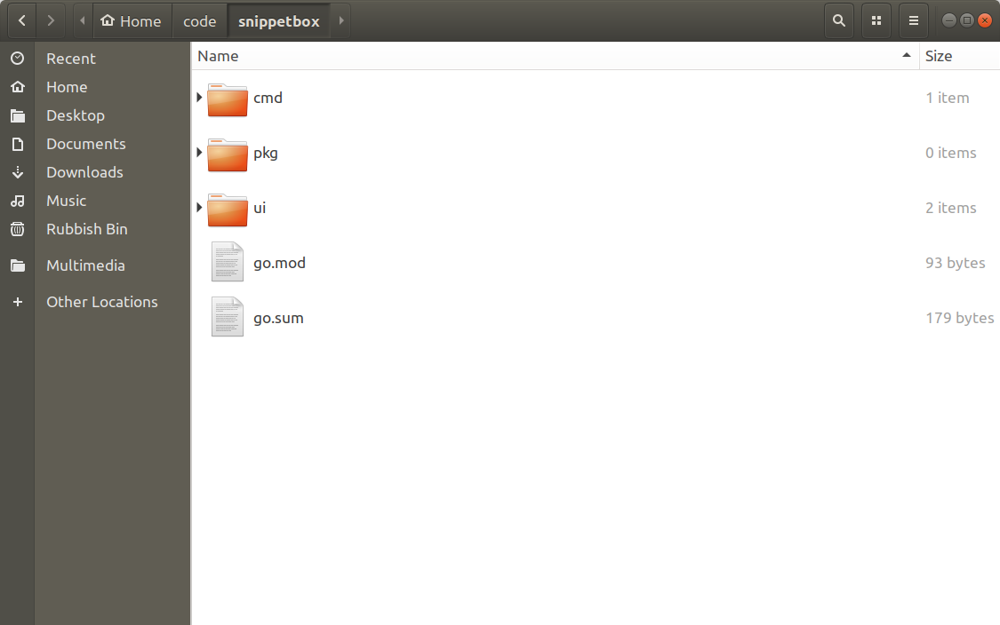
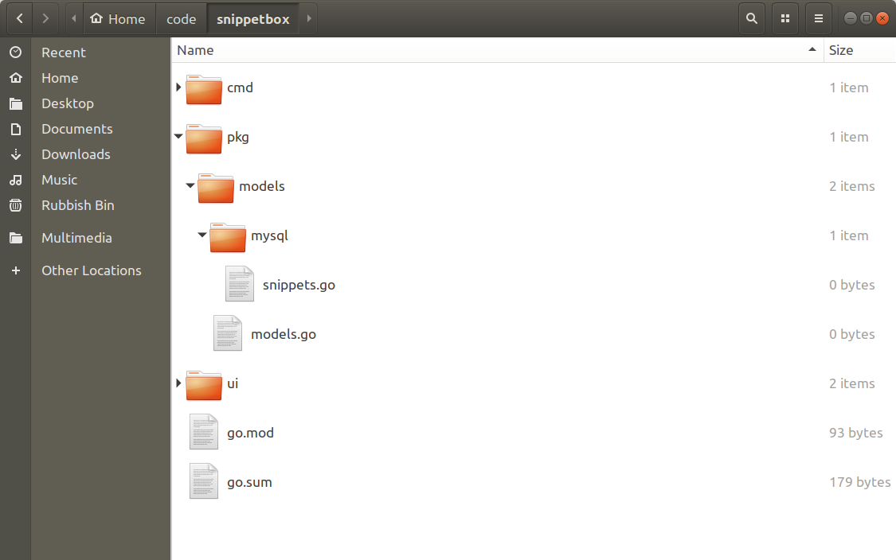
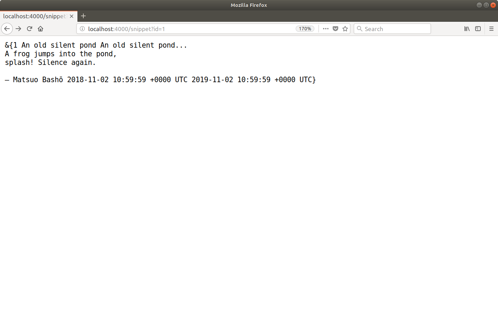
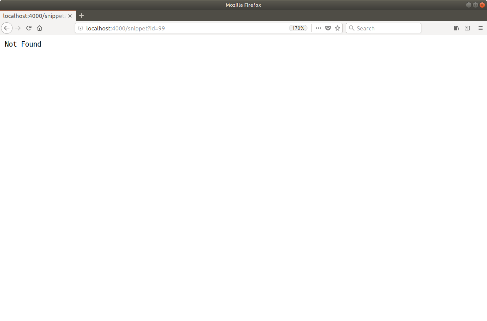
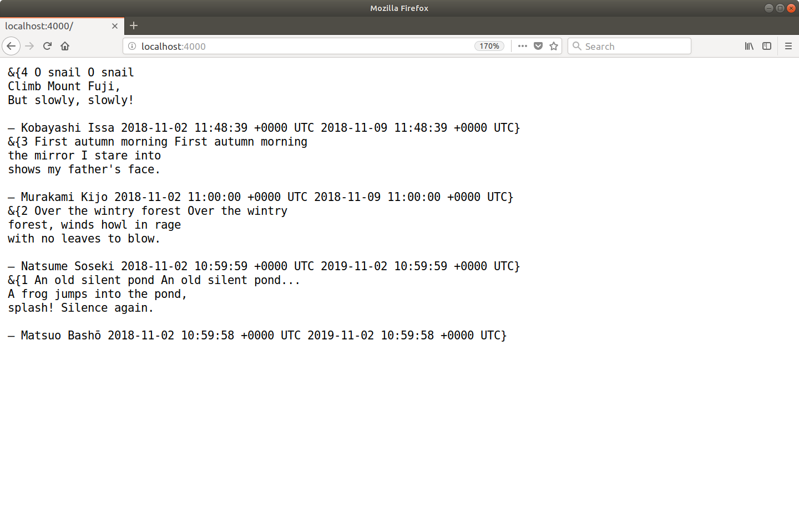

# 数据库驱动的响应

为了让我们的 Snippetbox Web 应用程序真正有用，我们需要在某个地方存储（或持久化）用户输入的数据，以及在运行时动态查询此数据存储的能力。

我们可以为我们的应用程序使用许多不同的数据存储——每种都有不同的优缺点——但我们会选择流行的关系数据库 MySQL。

在本节中，你将学习如何：

- 从你的 Web 应用程序连接到 MySQL（具体来说，你将学习如何建立可重用连接池）。
- 创建一个独立的模型包，以便你的数据库逻辑可重用并与你的 Web 应用程序分离。
- 使用 Go 的 database/sql 包中的相应函数来执行不同类型的 SQL 语句，以及如何避免可能导致服务器资源耗尽的常见错误。
- 通过正确使用占位符参数来防止 SQL 注入攻击。
- 使用事务，这样你就可以在一个原子操作中执行多个 SQL 语句。

## 设置 MySQL

如果你按照以下步骤操作，此时你需要在你的计算机上安装 MySQL。 MySQL 官方文档包含所有类型操作系统的全面安装说明，但如果你使用的是 Mac OS，你应该能够安装它：

```sh
$ brew install mysql
```

或者，如果你使用的是支持 apt 的 Linux 发行版（如 Debian 和 Ubuntu），你可以使用以下命令安装它：

```sh
$ sudo apt install mysql-server
```

在安装 MySQL 时，可能会要求你为 root 用户设置密码。如果你是，请记住记住这一点；你将在下一步中需要它。

### 搭建数据库

安装 MySQL 后，你应该能够以 root 用户身份从终端连接到它。执行此操作的命令将根据你安装的 MySQL 版本而有所不同。对于 MySQL 5.7，你应该能够通过键入以下内容进行连接：

```sh
$ sudo mysql
mysql>
```

但如果这不起作用，请尝试以下命令，输入你在安装过程中设置的密码。

```sh
$ mysql -u root -p
Enter password:
mysql>
```

一旦连接，我们需要做的第一件事就是在 MySQL 中建立一个数据库来存储我们项目的所有数据。将以下命令复制并粘贴到 mysql 提示符中，以使用 UTF8 编码创建新的代码段框数据库。

```sql
-- Create a new UTF-8 `snippetbox` database.
CREATE DATABASE snippetbox CHARACTER SET utf8mb4 COLLATE utf8mb4_unicode_ci;

-- Switch to using the `snippetbox` database.
USE snippetbox;
```

然后复制并粘贴以下 SQL 语句以创建一个新的片段表来保存我们应用程序的文本片段：

```sql
-- Create a `snippets` table.
CREATE TABLE snippets (
    id INTEGER NOT NULL PRIMARY KEY AUTO_INCREMENT,
    title VARCHAR(100) NOT NULL,
    content TEXT NOT NULL,
    created DATETIME NOT NULL,
    expires DATETIME NOT NULL
);

-- Add an index on the created column.
CREATE INDEX idx_snippets_created ON snippets(created);
```


该表中的每条记录都有一个整数 id 字段，它将作为文本片段的唯一标识符。它还将有一个简短的文本标题，并且片段内容本身将存储在内容字段中。我们还将保留一些有关片段创建时间和到期时间的元数据。

我们还将一些占位符条目添加到片段表（我们将在接下来的几章中使用）。我将使用一些简短的俳句作为文本片段的内容，但它们包含什么并不重要。

```sql
-- Add some dummy records (which we'll use in the next couple of chapters).
INSERT INTO snippets (title, content, created, expires) VALUES (
    'An old silent pond',
    'An old silent pond...\nA frog jumps into the pond,\nsplash! Silence again.\n\n– Matsuo Bashō',
    UTC_TIMESTAMP(),
    DATE_ADD(UTC_TIMESTAMP(), INTERVAL 365 DAY)
);

INSERT INTO snippets (title, content, created, expires) VALUES (
    'Over the wintry forest',
    'Over the wintry\nforest, winds howl in rage\nwith no leaves to blow.\n\n– Natsume Soseki',
    UTC_TIMESTAMP(),
    DATE_ADD(UTC_TIMESTAMP(), INTERVAL 365 DAY)
);

INSERT INTO snippets (title, content, created, expires) VALUES (
    'First autumn morning',
    'First autumn morning\nthe mirror I stare into\nshows my father''s face.\n\n– Murakami Kijo',
    UTC_TIMESTAMP(),
    DATE_ADD(UTC_TIMESTAMP(), INTERVAL 7 DAY)
);
```

### 创建新用户

从安全的角度来看，以 root 用户身份从 Web 应用程序连接到 MySQL 不是一个好主意。相反，最好创建一个对数据库具有受限权限的数据库用户。

因此，当你仍然连接到 MySQL 提示符时，运行以下命令以创建一个仅对数据库具有 SELECT 和 INSERT 权限的新 Web 用户。

```sql
CREATE USER 'web'@'localhost';
GRANT SELECT, INSERT, UPDATE ON snippetbox.* TO 'web'@'localhost';
-- Important: Make sure to swap 'pass' with a password of your own choosing.
ALTER USER 'web'@'localhost' IDENTIFIED BY 'pass';
```

完成后，键入 exit 以离开 MySQL 提示符。

### 测试新用户

你现在应该能够使用以下命令以 Web 用户身份连接到 snippetbox 数据库。出现提示时，输入你刚刚设置的密码。

```sql
$ mysql -D snippetbox -u web -p
Enter password:
mysql>
```

如果权限正常工作，你应该会发现你能够对数据库正确执行 SELECT 和 INSERT 操作，但其他命令如 DROP TABLE 和 GRANT 将失败。

```sql
mysql> SELECT id, title, expires FROM snippets;
+----+------------------------+---------------------+
| id | title                  | expires             |
+----+------------------------+---------------------+
|  1 | An old silent pond     | 2019-09-07 11:46:10 |
|  2 | Over the wintry forest | 2019-09-07 11:46:10 |
|  3 | First autumn morning   | 2018-09-14 11:46:11 |
+----+------------------------+---------------------+

mysql> DROP TABLE snippets;
ERROR 1142 (42000): DROP command denied to user 'web'@'localhost' for table 'snippets'
```

## 安装数据库驱动程序

要从我们的 Go Web 应用程序中使用 MySQL，我们需要安装一个数据库驱动程序。这本质上充当中间人，在 Go 和 MySQL 数据库本身之间翻译命令。

你可以在 Go wiki 上找到可用驱动程序的完整列表，但对于我们的应用程序，我们将使用流行的 go-sql-driver/mysql 驱动程序。

要下载它，请转到你的项目目录并运行 go get 命令，如下所示：

```sh
$ cd $HOME/code/snippetbox
$ go get github.com/go-sql-driver/mysql@v1
go: downloading github.com/go-sql-driver/mysql v1.6.0
```

请注意，我们使用 @v1 对包路径进行了后缀，以表明我们要下载主要版本号为 1 的包的最新可用版本。

在撰写本文时，这是 v1.6.0，但你下载的版本可能是 v1.6.1、v1.7.0 或类似版本 — 没关系。由于 go-sql-driver/mysql 包对其发行版使用语义版本控制，因此任何 v1.x.x 版本都应该与本书中的其余代码兼容。

顺便说一句，如果你想下载最新版本，无论版本号如何，你都可以简单地省略@version 后缀，如下所示：

```sh
$ go get github.com/go-sql-driver/mysql
```

或者，如果你想下载特定版本的软件包，你可以使用完整版本号。例如：

```sh
$ go get github.com/go-sql-driver/mysql@v1.0.3
```

安装驱动程序后，查看你的 go.mod 文件（我们在本书开头创建的）。你应该会看到一个新的 require 行，其中包含下载的包路径和确切版本：

文件：go.mod

```
module alexedwards.net/snippetbox

go 1.16

require github.com/go-sql-driver/mysql v1.6.0
```

你还将看到在项目目录的根目录中创建了一个名为 go.sum 的新文件。



这个 go.sum 文件包含代表所需包内容的加密校验和。如果你打开它，你应该看到这样的东西：

文件：go.sum

```
github.com/go-sql-driver/mysql v1.6.0 h1:BCTh4TKNUYmOmMUcQ3IipzF5prigylS7XXjEkfCHuOE=
github.com/go-sql-driver/mysql v1.6.0/go.mod h1:DCzpHaOWr8IXmIStZouvnhqoel9Qv2LBy8hT2VhHyBg=
```

与 go.mod 文件不同，go.sum 并非设计为可人工编辑的，通常你不需要打开它。但它有两个有用的功能：

如果你从终端运行 go mod verify 命令，这将验证你机器上下载的软件包的校验和是否与 go.sum 中的条目匹配，因此你可以确信它们没有被更改。

如果其他人需要下载项目的所有依赖项（他们可以通过运行 go mod download 来完成），如果他们正在下载的依赖项与文件中的校验和之间存在任何不匹配，他们将收到错误消息。

### 附加信息

#### 升级包

一旦一个包被下载并添加到你的 go.mod 文件中，包和版本就“固定”了。但是，你可能希望升级以在将来使用更新版本的软件包的原因有很多。

要升级到软件包的最新可用次要或补丁版本，你可以简单地运行带有 -u 标志的 go get，如下所示：

```sh
$ go get -u github.com/foo/bar
```

或者，如果你想升级到特定版本，那么你应该运行相同的命令，但带有适当的 @version 后缀。例如：

```sh
$ go get -u github.com/foo/bar@v2.0.0
```

#### 删除未使用的包

有时你可能会去获取一个包，但后来在构建中意识到你不再需要它了。发生这种情况时，你有两个选择。

你可以运行 go get 并使用@none 后缀包路径，如下所示：

```sh
$ go get github.com/foo/bar@none
```

或者，如果你在代码中删除了对包的所有引用，则可以运行 go mod tidy，它会自动从 go.mod 和 go.sum 文件中删除所有未使用的包。

```sh
$ go mod tidy -v
```

## 创建数据库连接池

现在 MySQL 数据库已经全部设置好并且我们已经安装了驱动程序，下一步自然是从我们的 Web 应用程序连接到数据库。

为此，我们需要 Go 的 sql.Open() 函数，你可以像这样使用它：

```go
// The sql.Open() function initializes a new sql.DB object, which is essentially a
// pool of database connections.
db, err := sql.Open("mysql", "web:pass@/snippetbox?parseTime=true")
if err != nil {
    ...
}
```

这段代码有几点需要解释和强调：

- sql.Open() 的第一个参数是驱动程序名称，第二个参数是描述如何连接到数据库的数据源名称（有时也称为连接字符串或 DSN）。
- 数据源名称的格式取决于你使用的数据库和驱动程序。通常，你可以在特定驱动程序的文档中找到信息和示例。对于我们正在使用的驱动程序，你可以在此处找到该文档。
- 上面 DSN 的 parseTime=true 部分是一个特定于驱动程序的参数，它指示我们的驱动程序将 SQL TIME 和 DATE 字段转换为 Go time.Time 对象。
- sql.Open() 函数返回一个 sql.DB 对象。这不是数据库连接——它是许多连接的池。这是一个需要理解的重要区别。 Go 根据需要管理这些连接，通过驱动程序自动打开和关闭与数据库的连接。
- 连接池对于并发访问是安全的，因此你可以从 Web 应用程序处理程序安全地使用它。
- 连接池旨在长期存在。在 Web 应用程序中，通常在 main() 函数中初始化连接池，然后将连接池传递给处理程序。你不应该在短期处理程序本身中调用 sql.Open() - 这会浪费内存和网络资源。

### 在我们的 Web 应用程序中的使用

让我们看看如何在实践中使用 sql.Open()。打开你的 main.go 文件并添加以下代码：

文件：cmd/web/main.go

```go
package main

import (
    "database/sql" // New import
    "flag"
    "log"
    "net/http"
    "os"

    _ "github.com/go-sql-driver/mysql" // New import
)

...

func main() {
    addr := flag.String("addr", ":4000", "HTTP network address")
    // Define a new command-line flag for the MySQL DSN string.
    dsn := flag.String("dsn", "web:pass@/snippetbox?parseTime=true", "MySQL data source name")
    flag.Parse()

    infoLog := log.New(os.Stdout, "INFO\t", log.Ldate|log.Ltime)
    errorLog := log.New(os.Stderr, "ERROR\t", log.Ldate|log.Ltime|log.Lshortfile)

    // To keep the main() function tidy I've put the code for creating a connection
    // pool into the separate openDB() function below. We pass openDB() the DSN
    // from the command-line flag.
    db, err := openDB(*dsn)
    if err != nil {
        errorLog.Fatal(err)
    }

    // We also defer a call to db.Close(), so that the connection pool is closed
    // before the main() function exits.
    defer db.Close()

    app := &application{
        errorLog: errorLog,
        infoLog:  infoLog,
    }

    srv := &http.Server{
        Addr:     *addr,
        ErrorLog: errorLog,
        Handler:  app.routes(),
    }

    infoLog.Printf("Starting server on %s", *addr)
    // Because the err variable is now already declared in the code above, we need
    // to use the assignment operator = here, instead of the := 'declare and assign'
    // operator.
    err = srv.ListenAndServe()
    errorLog.Fatal(err)
}

// The openDB() function wraps sql.Open() and returns a sql.DB connection pool
// for a given DSN.
func openDB(dsn string) (*sql.DB, error) {
    db, err := sql.Open("mysql", dsn)
    if err != nil {
        return nil, err
    }
    if err = db.Ping(); err != nil {
        return nil, err
    }
    return db, nil
}
```


这段代码有一些有趣的地方：

- 请注意我们的驱动程序的导入路径是如何以下划线为前缀的？这是因为我们的 main.go 文件实际上并没有使用 mysql 包中的任何东西。因此，如果我们尝试正常导入它，Go 编译器将引发错误。但是，我们需要驱动程序的 init() 函数运行，以便它可以向 database/sql 包注册自己。解决这个问题的技巧是将包名称别名为空白标识符。这是大多数 Go 的 SQL 驱动程序的标准做法。
- sql.Open() 函数实际上并不创建任何连接，它所做的只是初始化池以备将来使用。与数据库的实际连接是在第一次需要时延迟建立的。因此，为了验证一切设置是否正确，我们需要使用 db.Ping() 方法来创建连接并检查是否有任何错误。
- 此时此刻，调用 defer db.Close() 有点多余。我们的应用程序只会被信号中断（即 Ctrl+c）或 errorLog.Fatal() 终止。在这两种情况下，程序都会立即退出，并且永远不会运行延迟的函数。但是包含 db.Close() 是一个很好的习惯，如果你为应用程序添加一个优雅的关闭，它可能会在以后受益。

### 测试连接

确保文件已保存，然后尝试运行该应用程序。如果一切都按计划进行，则应该建立连接池并且 db.Ping() 方法应该能够创建一个没有任何错误的连接。一切顺利，你应该会看到正常的启动服务器...日志消息，如下所示：

```sh
$ go run ./cmd/web
INFO    2018/09/07 13:54:19 Starting server on :4000
```

如果应用程序无法启动并且你收到如下所示的“拒绝访问...”错误消息，则问题可能出在你的 DSN 上。仔细检查用户名和密码是否正确，你的数据库用户是否具有正确的权限，以及你的 MySQL 实例是否使用标准设置。

```sh
$ go run ./cmd/web
ERROR    2018/09/07 13:55:51 main.go:44: Error 1045: Access denied for user 'web'@'localhost' (using password: YES)
exit status 1
```

## 设计数据库模型

在本章中，我们将为我们的项目勾画一个数据库模型。

如果你不喜欢术语模型，你可能希望将其视为服务层或数据访问层。不管你喜欢怎么称呼它，我们的想法是我们将使用 MySQL 的代码封装在一个单独的包中，以供我们应用程序的其余部分使用。

现在，我们将创建一个骨架数据库模型并让它返回一些虚拟数据。它不会做太多事情，但我想在我们进入 SQL 查询的本质之前解释该模式。

听起来好吗？然后让我们继续在 pkg 目录下创建几个新文件夹和文件：

```
$ cd $HOME/code/snippetbox
$ mkdir -p pkg/models/mysql
$ touch pkg/models/models.go
$ touch pkg/models/mysql/snippets.go
```



> 请记住：pkg 目录用于保存辅助的非特定于应用程序的代码，这些代码可能会被重用。将来可以由其他应用程序（如命令行界面应用程序）使用的数据库模型适合这里的要求。

我们将首先使用 pkg/models/models.go 文件来定义我们的数据库模型将使用和返回的顶级数据类型。打开它并添加以下代码：

文件：pkg/models/models.go

```go
package models

import (
    "errors"
    "time"
)

var ErrNoRecord = errors.New("models: no matching record found")

type Snippet struct {
    ID      int
    Title   string
    Content string
    Created time.Time
    Expires time.Time
}
```

请注意 Snippet 结构体的字段如何对应于我们的 MySQL 代码段表中的字段？

现在让我们转到 pkg/models/mysql/snippets.go 文件，该文件将包含专门用于处理 MySQL 数据库中的片段的代码。在这个文件中，我们将定义一个新的 SnippetModel 类型并在它上面实现一些方法来访问和操作数据库。像这样：
文件：pkg/models/mysql/snippets.go

```go
package mysql

import (
    "database/sql"

    // Import the models package that we just created. You need to prefix this with 
    // whatever module path you set up back in chapter 02.02 (Project Setup and Enabling 
    // Modules) so that the import statement looks like this:
    // "{your-module-path}/pkg/models".
    "alexedwards.net/snippetbox/pkg/models"
)

// Define a SnippetModel type which wraps a sql.DB connection pool.
type SnippetModel struct {
    DB *sql.DB
}

// This will insert a new snippet into the database.
func (m *SnippetModel) Insert(title, content, expires string) (int, error) {
    return 0, nil
}

// This will return a specific snippet based on its id.
func (m *SnippetModel) Get(id int) (*models.Snippet, error) {
    return nil, nil
}

// This will return the 10 most recently created snippets.
func (m *SnippetModel) Latest() ([]*models.Snippet, error) {
    return nil, nil
}
```

这里要指出的另一件重要事情是 alexedwards.net/snippetbox/pkg/models 的导入语句。请注意我们内部包的导入路径是如何以我在本书开头选择的模块路径作为前缀的？

### 使用 SnippetModel

要在我们的处理程序中使用这个模型，我们需要在 main() 中建立一个新的 SnippetModel 结构，然后通过应用程序结构将它作为依赖注入——就像我们使用其他依赖一样。

就是这样：

文件：cmd/web/main.go

```go
package main

import (
    "database/sql"
    "flag"
    "log"
    "net/http"
    "os"

    "alexedwards.net/snippetbox/pkg/models/mysql" // New import

    _ "github.com/go-sql-driver/mysql"
)

...

// Add a snippets field to the application struct. This will allow us to
// make the SnippetModel object available to our handlers.
type application struct {
    errorLog *log.Logger
    infoLog  *log.Logger
    snippets *mysql.SnippetModel
}

func main() {
    dsn := flag.String("dsn", "web:pass@/snippetbox?parseTime=true", "MySQL data source name")
    addr := flag.String("addr", ":4000", "HTTP network address")
    flag.Parse()

    infoLog := log.New(os.Stdout, "INFO\t", log.Ldate|log.Ltime)
    errorLog := log.New(os.Stderr, "ERROR\t", log.Ldate|log.Ltime|log.Lshortfile)

    db, err := openDB(*dsn)
    if err != nil {
        errorLog.Fatal(err)
    }
    defer db.Close()

    // Initialize a mysql.SnippetModel instance and add it to the application
    // dependencies.
    app := &application{
        errorLog: errorLog,
        infoLog:  infoLog,
        snippets: &mysql.SnippetModel{DB: db},
    }

    srv := &http.Server{
        Addr:     *addr,
        ErrorLog: errorLog,
        Handler:  app.routes(),
    }

    infoLog.Printf("Starting server on %s", *addr)
    err = srv.ListenAndServe()
    errorLog.Fatal(err)
}

...
```

### 附加信息

#### 这种结构的好处

以这种方式设置你的模型可能看起来有点复杂和令人费解，特别是如果你是 Go 的新手，但是随着我们的应用程序的不断增长，它应该开始变得更加清晰，为什么我们要以这种方式构建事物。

如果你退后一步，你可能会看到一些好处：

- 有一个干净的关注点分离。我们的数据库逻辑与我们的处理程序无关，这意味着处理程序的职责仅限于 HTTP 内容（即验证请求和写入响应）。这将使将来更容易编写紧凑、集中的单元测试。
- 通过创建一个自定义的 SnippetModel 类型并在其上实现方法，我们已经能够使我们的模型成为一个单一的、整齐封装的对象，我们可以轻松地对其进行初始化，然后将其作为依赖项传递给我们的处理程序。同样，这使得更易于维护、可测试的代码。
- 因为模型动作被定义为对象上的方法——在我们的例子中是 SnippetModel——所以有机会创建一个接口并模拟它以进行单元测试。
- 我们可以完全控制在运行时使用哪个数据库，只需使用命令行标志。
- 最后，如果你的项目有多个后端，则目录结构可以很好地扩展。例如，如果你的某些数据保存在 Redis 中，你可以将其所有模型放在 pkg/models/redis 包中。

## 执行 SQL 语句

现在让我们更新我们刚刚创建的 SnippetModel.Insert() 方法，以便它在我们的片段表中创建一个新记录，然后返回新记录的整数 id。

为此，我们需要在我们的数据库上执行以下 SQL 查询：

```sql
INSERT INTO snippets (title, content, created, expires)
VALUES(?, ?, UTC_TIMESTAMP(), DATE_ADD(UTC_TIMESTAMP(), INTERVAL ? DAY))
```

注意在这个查询中我们如何使用 ?字符来指示我们要插入数据库的数据的占位符参数？因为我们将使用的数据最终将是来自表单的不受信任的用户输入，所以最好使用占位符参数而不是在 SQL 查询中插入数据。

### 执行查询

Go 提供了三种不同的方法来执行数据库查询：

- DB.Query() 用于返回多行的 SELECT 查询。
- DB.QueryRow() 用于返回单行的 SELECT 查询。
- DB.Exec() 用于不返回行的语句（如 INSERT 和 DELETE）。

因此，在我们的例子中，最适合这项工作的工具是 DB.Exec()。让我们深入了解并演示如何在我们的 SnippetModel.Insert() 方法中使用它。我们稍后再讨论细节。

打开你的 pkg/models/mysql/snippets.go 文件并像这样更新它：

文件：pkg/models/mysql/snippets.go

```go
package mysql

...

type SnippetModel struct {
    DB *sql.DB
}

func (m *SnippetModel) Insert(title, content, expires string) (int, error) {
    // Write the SQL statement we want to execute. I've split it over two lines
    // for readability (which is why it's surrounded with backquotes instead
    // of normal double quotes).
    stmt := `INSERT INTO snippets (title, content, created, expires)
    VALUES(?, ?, UTC_TIMESTAMP(), DATE_ADD(UTC_TIMESTAMP(), INTERVAL ? DAY))`

    // Use the Exec() method on the embedded connection pool to execute the
    // statement. The first parameter is the SQL statement, followed by the
    // title, content and expiry values for the placeholder parameters. This
    // method returns a sql.Result object, which contains some basic
    // information about what happened when the statement was executed.
    result, err := m.DB.Exec(stmt, title, content, expires)
    if err != nil {
        return 0, err
    }

    // Use the LastInsertId() method on the result object to get the ID of our
    // newly inserted record in the snippets table.
    id, err := result.LastInsertId()
    if err != nil {
        return 0, err
    }

    // The ID returned has the type int64, so we convert it to an int type
    // before returning.
    return int(id), nil
}

...
```

让我们快速讨论 DB.Exec() 返回的 sql.Result 接口。这提供了两种方法：

- LastInsertId() — 返回数据库为响应命令而生成的整数（int64）。通常，这将来自插入新行时的“自动增量”列，这正是我们案例中发生的情况。
- RowsAffected() — 返回受语句影响的行数（作为 int64）。

> 重要提示：并非所有驱动程序和数据库都支持 LastInsertId() 和 RowsAffected() 方法。例如，PostgreSQL 不支持 LastInsertId()。因此，如果你打算使用这些方法，请务必先查看特定驱动程序的文档。

此外，如果你不需要它，忽略 sql.Result 返回值是完全可以接受的（并且很常见）。像这样：

```go
_, err := m.DB.Exec("INSERT INTO ...", ...)
```

### 在我们的处理程序中使用模型

让我们回到更具体的事情上，并演示如何从我们的处理程序中调用这个新代码。打开你的 cmd/web/handlers.go 文件并更新 createSnippet 处理程序，如下所示：

文件：cmd/web/handlers.go

```go
package main

...

func (app *application) createSnippet(w http.ResponseWriter, r *http.Request) {
    if r.Method != http.MethodPost {
        w.Header().Set("Allow", http.MethodPost)
        app.clientError(w, http.StatusMethodNotAllowed)
        return
    }

    // Create some variables holding dummy data. We'll remove these later on
    // during the build.
    title := "O snail"
    content := "O snail\nClimb Mount Fuji,\nBut slowly, slowly!\n\n– Kobayashi Issa"
    expires := "7"

    // Pass the data to the SnippetModel.Insert() method, receiving the
    // ID of the new record back.
    id, err := app.snippets.Insert(title, content, expires)
    if err != nil {
        app.serverError(w, err)
        return
    }

    // Redirect the user to the relevant page for the snippet.
    http.Redirect(w, r, fmt.Sprintf("/snippet?id=%d", id), http.StatusSeeOther)
}
```

启动应用程序，然后打开第二个终端窗口并使用 curl 发出 POST /snippet/create 请求，如下所示（注意 -L 标志指示 curl 自动跟随重定向）：

```sh
$ curl -iL -X POST http://localhost:4000/snippet/create
HTTP/1.1 303 See Other
Location: /snippet?id=4
Date: Fri, 07 Sep 2018 15:04:57 GMT
Content-Length: 0

HTTP/1.1 200 OK
Date: Fri, 07 Sep 2018 15:04:57 GMT
Content-Length: 39
Content-Type: text/plain; charset=utf-8

Display a specific snippet with ID 4...
```

所以这工作得很好。我们刚刚发送了一个 HTTP 请求，它触发了我们的 createSnippet 处理程序，后者又调用了我们的 SnippetModel.Insert() 方法。这在数据库中插入了一条新记录并返回了这条新记录的 ID。然后，我们的处理程序使用 ID 作为查询字符串参数重定向到另一个 URL。

请随意查看 MySQL 数据库的片段表。你应该会看到 ID 为 4 的新记录，类似于：

```sql
mysql> SELECT id, title, expires FROM snippets;
+----+------------------------+---------------------+
| id | title                  | expires             |
+----+------------------------+---------------------+
|  1 | An old silent pond     | 2019-09-07 11:46:10 |
|  2 | Over the wintry forest | 2019-09-07 11:46:10 |
|  3 | First autumn morning   | 2018-09-14 11:46:11 |
|  4 | O snail                | 2018-09-14 15:04:57 |
+----+------------------------+---------------------+
4 rows in set (0.00 sec)
```

### 附加信息

#### 占位符参数

在上面的代码中，我们使用占位符参数构造了我们的 SQL 语句，其中 ?充当我们要插入的数据的占位符。

使用占位符参数来构造我们的查询（而不是字符串插值）的原因是为了帮助避免来自任何不受信任的用户提供的输入的 SQL 注入攻击。

在幕后，DB.Exec() 方法分三步工作：

1. 它使用提供的 SQL 语句在数据库上创建一个新的准备好的语句。数据库解析并编译语句，然后将其存储以备执行。
2. 在第二个单独的步骤中，Exec() 将参数值传递给数据库。然后数据库使用这些参数执行准备好的语句。因为参数是后传的，所以在语句编译完成后，数据库将其作为纯数据处理。他们无法改变声明的意图。只要原始语句不是来自不受信任的数据，就不会发生注入。
3. 然后关闭（或取消分配）数据库上的准备好的语句。

占位符参数语法因你的数据库而异。 MySQL、SQL Server 和 SQLite 使用 ?表示法，但 PostgreSQL 使用 $N 表示法。例如，如果你使用的是 PostgreSQL，你可以这样写：

```go
_, err := m.DB.Exec("INSERT INTO ... VALUES ($1, $2, $3)", ...)
```

## 单记录 SQL 查询

从数据库中选择单个记录的模式稍微复杂一些。让我们通过更新我们的 SnippetModel.Get() 方法来解释如何做到这一点，以便它根据其 ID 返回一个特定的片段。

为此，我们需要对数据库运行以下 SQL 查询：

```sql
SELECT id, title, content, created, expires FROM snippets WHERE expires > UTC_TIMESTAMP() AND id = ?
```


因为我们的snippets 表使用id 列作为它的主键，这个查询只会返回一个数据库行（或者根本不返回）。该查询还包括对过期时间的检查，以便我们不会返回任何已过期的片段。

请注意，我们再次为 id 值使用了占位符参数？

打开 pkg/models/mysql/snippets.go 文件并添加以下代码：

文件：pkg/models/mysql/snippets.go

```go
package mysql

import (
    "database/sql"
    "errors" // New import

    "alexedwards.net/snippetbox/pkg/models"
)

type SnippetModel struct {
    DB *sql.DB
}

...

func (m *SnippetModel) Get(id int) (*models.Snippet, error) {
    // Write the SQL statement we want to execute. Again, I've split it over two
    // lines for readability.
    stmt := `SELECT id, title, content, created, expires FROM snippets
    WHERE expires > UTC_TIMESTAMP() AND id = ?`

    // Use the QueryRow() method on the connection pool to execute our
    // SQL statement, passing in the untrusted id variable as the value for the
    // placeholder parameter. This returns a pointer to a sql.Row object which
    // holds the result from the database.
    row := m.DB.QueryRow(stmt, id)

    // Initialize a pointer to a new zeroed Snippet struct.
    s := &models.Snippet{}

    // Use row.Scan() to copy the values from each field in sql.Row to the
    // corresponding field in the Snippet struct. Notice that the arguments
    // to row.Scan are *pointers* to the place you want to copy the data into,
    // and the number of arguments must be exactly the same as the number of
    // columns returned by your statement.
    err := row.Scan(&s.ID, &s.Title, &s.Content, &s.Created, &s.Expires)
    if err != nil {
        // If the query returns no rows, then row.Scan() will return a
        // sql.ErrNoRows error. We use the errors.Is() function check for that
        // error specifically, and return our own models.ErrNoRecord error
        // instead.
        if errors.Is(err, sql.ErrNoRows) {
            return nil, models.ErrNoRecord
        } else {
             return nil, err
        }
    }

    // If everything went OK then return the Snippet object.
    return s, nil
}

...
```

> 旁白：你可能想知道为什么我们要直接返回 models.ErrNoRecord 错误而不是 sql.ErrNoRows。原因是为了帮助完全封装模型，以便我们的应用程序不关心底层数据存储或依赖于其行为的特定于数据存储的错误。

### 检查

#### 类型转换

在rows.Scan() 的幕后，你的驱动程序将自动将来自SQL 数据库的原始输出转换为所需的本机Go 类型。只要你对在 SQL 和 Go 之间映射的类型很敏感，这些转换通常应该可以正常工作。通常：

- CHAR、VARCHAR 和 TEXT 映射到字符串。
- BOOLEAN 映射到 bool。
- INT 映射到 int； BIGINT 映射到 int64。
- DECIMAL 和 NUMERIC 映射到浮动。
- TIME、DATE 和 TIMESTAMP 映射到 time.Time。

我们的 MySQL 驱动程序的一个怪癖是我们需要在我们的 DSN 中使用 parseTime=true 参数来强制它将 TIME 和 DATE 字段转换为 time.Time。否则，它会将这些作为 []byte 对象返回。这是它提供的许多特定于驱动程序的参数之一。

### 在我们的处理程序中使用模型

好的，让我们将 SnippetModel.Get() 方法付诸实践。

打开你的 cmd/web/handlers.go 文件并更新 showSnippet 处理程序，以便它将特定记录的数据作为 HTTP 响应返回：

文件：cmd/web/handlers.go

```go
package main

import (
    "errors" // New import
    "fmt"
    "html/template"
    "net/http"
    "strconv"

    "alexedwards.net/snippetbox/pkg/models" // New import
)

...

func (app *application) showSnippet(w http.ResponseWriter, r *http.Request) {
    id, err := strconv.Atoi(r.URL.Query().Get("id"))
    if err != nil || id < 1 {
        app.notFound(w)
        return
    }

    // Use the SnippetModel object's Get method to retrieve the data for a
    // specific record based on its ID. If no matching record is found,
    // return a 404 Not Found response.
    s, err := app.snippets.Get(id)
    if err != nil {
        if errors.Is(err, models.ErrNoRecord) {
            app.notFound(w)
        } else {
            app.serverError(w, err)
        }
        return
    }

    // Write the snippet data as a plain-text HTTP response body.
    fmt.Fprintf(w, "%v", s)
}

...
```

让我们试一试。转到你的 Web 浏览器并访问 http://localhost:4000/snippet?id=1。你应该会看到类似于以下内容的 HTTP 响应：



你可能还想尝试对其他已过期或尚不存在的片段（如 id=99）发出一些请求，以验证它们是否返回 404 Not Found 响应：



### 附加信息

#### 哨兵错误和errors.Is()

在上面的代码中，我们使用了在 Go 1.13 中引入的 errors.Is() 函数来检查错误是否与特定值匹配（在我们的例子中，我们想检查错误是否与 sql.ErrNoRows 匹配）。

有几件事我想再谈一谈。

首先是 sql.ErrNoRows 是所谓的哨兵错误的一个例子——我们可以粗略地将其定义为存储在全局变量中的错误对象。通常，你使用 errors.New() 函数创建它们。标准库中的几个哨兵错误示例是 io.ErrUnexpectedEOF 和 bytes.ErrTooLarge，而我们刚刚创建的我们自己的 models.ErrNoRecord 错误也是哨兵错误的一个示例。

在旧版本的 Go（1.13 之前）中，检查错误是否与特定哨兵错误匹配的惯用方法如下：

```go
if err == sql.ErrNoRows {
    // Do something
} else {
    // Do something else
}
```

但是从 Go 1.13 开始，最好使用 errors.Is() 函数，如下所示：

```go
if errors.Is(err, sql.ErrNoRows) {
    // Do something
} else {
    // Do something else
}
```

这样做的原因是 Go 1.13 引入了包装错误以添加附加信息的能力。并且，如果标记错误被包装，那么旧的匹配检查方式将停止工作，因为被包装的错误不等于原始标记错误。

相比之下，errors.Is() 函数通过在检查匹配之前解开错误（如有必要）来工作。

所以基本上，如果你运行的是 Go 1.13 或更新版本，更喜欢使用 errors.Is()。这是一种明智的方法，可以使你的代码面向未来并防止你（或你的代码导入的任何包）在未来包装错误引起的问题。

还有另一个函数，errors.As()，你可以使用它来检查（可能被包装的）错误是否具有特定类型。我们稍后将在本书中使用它。

有关 Go 1.13 错误更改的更多信息，你可能需要阅读官方常见问题解答。

#### 速记单记录查询

我故意使 SnippetModel.Get() 中的代码稍微冗长，以帮助澄清和强调代码的幕后情况。

在实践中，你可以利用 DB.QueryRow() 中的错误被推迟到 Scan() 被调用这一事实来缩短代码（或至少是行数！）。它在功能上没有区别，但如果你想重新编写代码看起来像这样是完全可以的：

```go
func (m *SnippetModel) Get(id int) (*models.Snippet, error) {
    s := &models.Snippet{}
    err := m.DB.QueryRow("SELECT ...", id).Scan(&s.ID, &s.Title, &s.Content, &s.Created, &s.Expires)
    if err != nil {
        if errors.Is(err, sql.ErrNoRows) {
            return nil, models.ErrNoRecord
        } else {
             return nil, err
        }
    }

    return s, nil
}
```

## 多记录 SQL 查询

最后让我们看看执行返回多行的 SQL 语句的模式。我将通过使用以下 SQL 查询更新 SnippetModel.Latest() 方法以返回最近创建的十个片段（只要它们没有过期）来演示：

```sql
SELECT id, title, content, created, expires FROM snippets WHERE expires > UTC_TIMESTAMP() ORDER BY created DESC LIMIT 10
```

打开 pkg/models/mysql/snippets.go 文件并添加以下代码：

文件：pkg/models/mysql/snippets.go

```go
package mysql

import (
	"database/sql"
	"errors"

	"alexedwards.net/snippetbox/pkg/models"
)

type SnippetModel struct {
    DB *sql.DB
}

...

func (m *SnippetModel) Latest() ([]*models.Snippet, error) {
    // Write the SQL statement we want to execute.
    stmt := `SELECT id, title, content, created, expires FROM snippets
    WHERE expires > UTC_TIMESTAMP() ORDER BY created DESC LIMIT 10`

    // Use the Query() method on the connection pool to execute our
    // SQL statement. This returns a sql.Rows resultset containing the result of
    // our query.
    rows, err := m.DB.Query(stmt)
    if err != nil {
        return nil, err
    }

    // We defer rows.Close() to ensure the sql.Rows resultset is
    // always properly closed before the Latest() method returns. This defer
    // statement should come *after* you check for an error from the Query()
    // method. Otherwise, if Query() returns an error, you'll get a panic
    // trying to close a nil resultset.
    defer rows.Close()

    // Initialize an empty slice to hold the models.Snippets objects.
    snippets := []*models.Snippet{}

    // Use rows.Next to iterate through the rows in the resultset. This
    // prepares the first (and then each subsequent) row to be acted on by the
    // rows.Scan() method. If iteration over all the rows completes then the
    // resultset automatically closes itself and frees-up the underlying
    // database connection.
    for rows.Next() {
        // Create a pointer to a new zeroed Snippet struct.
        s := &models.Snippet{}
        // Use rows.Scan() to copy the values from each field in the row to the
        // new Snippet object that we created. Again, the arguments to row.Scan()
        // must be pointers to the place you want to copy the data into, and the
        // number of arguments must be exactly the same as the number of
        // columns returned by your statement.
        err = rows.Scan(&s.ID, &s.Title, &s.Content, &s.Created, &s.Expires)
        if err != nil {
            return nil, err
        }
        // Append it to the slice of snippets.
        snippets = append(snippets, s)
    }

    // When the rows.Next() loop has finished we call rows.Err() to retrieve any
    // error that was encountered during the iteration. It's important to
    // call this - don't assume that a successful iteration was completed
    // over the whole resultset.
    if err = rows.Err(); err != nil {
        return nil, err
    }

    // If everything went OK then return the Snippets slice.
    return snippets, nil
}
```

> 重要提示：使用 defer rows.Close() 关闭结果集在这里很重要。只要结果集是打开的，它就会保持底层数据库连接打开……所以如果这个方法出现问题并且结果集没有关闭，它会迅速导致池中的所有连接被用完。

### 在我们的处理程序中使用模型

返回你的 cmd/web/handlers.go 文件并更新主处理程序以使用 SnippetModel.Latest() 方法，将代码片段内容转储到 HTTP 响应。现在只需注释掉与模板渲染相关的代码，如下所示：

文件：cmd/web/handlers.go

```go
package main

import (
	"errors"
    "fmt"
    // "html/template"
    "net/http"
    "strconv"

    "alexedwards.net/snippetbox/pkg/models"
)

func (app *application) home(w http.ResponseWriter, r *http.Request) {
    if r.URL.Path != "/" {
        app.notFound(w)
        return
    }

    s, err := app.snippets.Latest()
    if err != nil {
        app.serverError(w, err)
        return
    }

    for _, snippet := range s {
        fmt.Fprintf(w, "%v\n", snippet)
    }

    // files := []string{
    //     "./ui/html/home.page.tmpl",
    //     "./ui/html/base.layout.tmpl",
    //     "./ui/html/footer.partial.tmpl",
    // }

    // ts, err := template.ParseFiles(files...)
    // if err != nil {
    //     app.serverError(w, err)
    //     return
    // }

    // err = ts.Execute(w, nil)
    // if err != nil {
    //     app.serverError(w, err)
    // }
}

...
```


如果你现在运行该应用程序并在浏览器中访问 http://localhost:4000，你应该会得到类似于以下内容的响应：



## 事务和其他细节

### 数据库/sql包

你可能已经开始意识到，database/sql 包本质上提供了 Go 应用程序和 SQL 数据库世界之间的标准接口。

只要你使用 database/sql 包，你编写的 Go 代码通常是可移植的，并且可以与任何类型的 SQL 数据库一起使用——无论是 MySQL、PostgreSQL、SQLite 还是其他东西。这意味着你的应用程序与你当前使用的数据库没有那么紧密的耦合，理论上你可以在未来交换数据库而无需重新编写所有代码（除了特定于驱动程序的怪癖和 SQL 实现） ）。

需要注意的是，虽然 database/sql 通常在提供用于处理 SQL 数据库的标准接口方面做得很好，但在不同的驱动程序和数据库的运行方式上存在一些特殊性。在开始使用新驱动程序之前，阅读新驱动程序的文档以了解任何怪癖和边缘情况总是一个好主意。

### 冗长

如果你来自 Ruby、Python 或 PHP，查询 SQL 数据库的代码可能会感觉有点冗长，尤其是当你习惯于处理抽象层或 ORM 时。

但冗长的好处是我们的代码并不神奇；我们可以准确地了解和控制正在发生的事情。一段时间后，你会发现进行 SQL 查询的模式变得熟悉，并且你可以从以前的工作中复制和粘贴。

如果冗长真的开始让你感到厌烦，你可能需要考虑尝试 jmoiron/sqlx 包。它设计精良，并提供了一些很好的扩展，可以更快、更轻松地处理 SQL 查询。

### 管理 NULL 值

Go 做得不好的一件事是管理数据库记录中的 NULL 值。

让我们假设片段表中的标题列在特定行中包含一个 NULL 值。如果我们查询该行，则 rows.Scan() 将返回错误，因为它无法将 NULL 转换为字符串：

```go
sql: Scan error on column index 1: unsupported Scan, storing driver.Value type &lt;nil&gt; into type *string
```

粗略地说，解决此问题的方法是将你要扫描的字段从字符串更改为 sql.NullString 类型。有关工作示例，请参阅此要点。

但是，作为一项规则，最简单的方法就是完全避免 NULL 值。像我们在本书中所做的那样，对所有数据库列设置 NOT NULL 约束，并根据需要设置合理的 DEFAULT 值。

### 处理事务

重要的是要意识到对 Exec()、Query() 和 QueryRow() 的调用可以使用 sql.DB 池中的任何连接。即使你的代码中有两个紧邻的 Exec() 调用，也不能保证它们将使用相同的数据库连接。

有时这是不可接受的。例如，如果你使用 MySQL 的 LOCK TABLES 命令锁定表，则必须在完全相同的连接上调用 UNLOCK TABLES 以避免死锁。

为了保证使用相同的连接，你可以在一个事务中包装多个语句。这是基本模式：

```go
type ExampleModel struct {
    DB *sql.DB
}

func (m *ExampleModel) ExampleTransaction() error {
    // Calling the Begin() method on the connection pool creates a new sql.Tx
    // object, which represents the in-progress database transaction.
    tx, err := m.DB.Begin()
    if err != nil {
        return err
    }

    // Call Exec() on the transaction, passing in your statement and any
    // parameters. It's important to notice that tx.Exec() is called on the
    // transaction object just created, NOT the connection pool. Although we're
    // using tx.Exec() here you can also use tx.Query() and tx.QueryRow() in
    // exactly the same way.
    _, err = tx.Exec("INSERT INTO ...")
    if err != nil {
        // If there is any error, we call the tx.Rollback() method on the
        // transaction. This will abort the transaction and no changes will be
        // made to the database.
        tx.Rollback()
        return err
    }

    // Carry out another transaction in exactly the same way.
    _, err = tx.Exec("UPDATE ...")
    if err != nil {
        tx.Rollback()
        return err
    }

    // If there are no errors, the statements in the transaction can be committed
    // to the database with the tx.Commit() method. It's really important to ALWAYS
    // call either Rollback() or Commit() before your function returns. If you
    // don't the connection will stay open and not be returned to the connection
    // pool. This can lead to hitting your maximum connection limit/running out of
    // resources.
    err = tx.Commit()
    return err
}
```


如果你想将多个 SQL 语句作为单个原子操作执行，事务也非常有用。只要你在发生任何错误时使用 tx.Rollback() 方法，事务就会确保：

- 所有语句执行成功；或者
- 不执行任何语句，数据库保持不变。

### 管理连接

sql.DB 连接池由空闲或使用中的连接组成。默认情况下，一次打开连接的最大数量（空闲 + 正在使用）没有限制，但池中空闲连接的默认最大数量为 2。你可以使用 SetMaxOpenConns() 和SetMaxIdleConns() 方法。例如：

```go
db, err := sql.Open("mysql", *dsn)
if err != nil {
    log.Fatal(err)
}

// Set the maximum number of concurrently open (idle + in-use) connections. Setting this 
// to less than or equal to 0 will mean there is no maximum limit. If the maximum
// number of open connections is reached and all are in-use when a new connection is 
// needed, Go will wait until one of the connections is freed and becomes idle. From a
// user perspective, this means their HTTP request will hang until a connection
// is freed.
db.SetMaxOpenConns(100)

// Set the maximum number of idle connections in the pool. Setting this
// to less than or equal to 0 will mean that no idle connections are retained.
db.SetMaxIdleConns(5)
```

使用这些方法有一个警告：你的数据库本身可能对最大连接数有硬性限制。

例如，MySQL 的默认限制是 151。因此，让 SetMaxOpenConns() 完全不受限制或将其设置为大于 151 可能会导致你的数据库在高负载下返回“连接过多”错误。为防止发生此错误，你需要将最大打开连接值设置为低于 151。

但这反过来又产生了另一个问题。当达到 SetMaxOpenConns() 限制时，你的应用程序需要执行的任何新数据库任务都将被迫等待，直到连接空闲。

对于某些应用程序，这种行为可能没问题，但在 Web 应用程序中，最好立即记录“连接过多”错误消息并向用户发送 500 内部服务器错误，而不是让他们的 HTTP 请求挂起并可能超时等待免费连接。

这就是为什么我没有在我们的应用程序中使用 SetMaxOpenConns() 和 SetMaxIdleConns() 方法，并将 sql.DB 的行为保留为默认设置。

### 准备好的报表

正如我之前提到的，Exec()、Query() 和 QueryRow() 方法都在幕后使用准备好的语句来帮助防止 SQL 注入攻击。他们在数据库连接上设置了准备好的语句，使用提供的参数运行它，然后关闭准备好的语句。

这可能会感觉效率很低，因为我们每次都在创建和重新创建相同的准备好的语句。

理论上，更好的方法是使用 DB.Prepare() 方法创建我们自己的准备好的语句一次，然后重用它。对于复杂的 SQL 语句（例如那些具有多个 JOINS 的语句）并且经常重复（例如，批量插入数万条记录）尤其如此。在这些情况下，重新准备语句的成本可能会对运行时间产生显着影响。

以下是在 Web 应用程序中使用你自己的准备好的语句的基本模式：

```go
// We need somewhere to store the prepared statement for the lifetime of our
// web application. A neat way is to embed it alongside the connection pool.
type ExampleModel struct {
    DB         *sql.DB
    InsertStmt *sql.Stmt
}

// Create a constructor for the model, in which we set up the prepared
// statement.
func NewExampleModel(db *sql.DB) (*ExampleModel, error) {
    // Use the Prepare method to create a new prepared statement for the
    // current connection pool. This returns a sql.Stmt object which represents
    // the prepared statement.
    insertStmt, err := db.Prepare("INSERT INTO ...")
    if err != nil {
        return nil, err
    }

    // Store it in our ExampleModel object, alongside the connection pool.
    return &ExampleModel{db, insertStmt}, nil


// Any methods implemented against the ExampleModel object will have access to
// the prepared statement.
func (m *ExampleModel) Insert(args...) error {
    // Notice how we call Exec directly against the prepared statement, rather
    // than against the connection pool? Prepared statements also support the
    // Query and QueryRow methods.
    _, err := m.InsertStmt.Exec(args...)

    return err
}

// In the web application's main function we will need to initialize a new
// ExampleModel struct using the constructor function.
func main() {
    db, err := sql.Open(...)
    if err != nil {
        errorLog.Fatal(err)
    }
    defer db.Close()

    // Create a new ExampleModel object, which includes the prepared statement.
    exampleModel, err := NewExampleModel(db)
    if err != nil {
       errorLog.Fatal(err)
    }

    // Defer a call to Close on the prepared statement to ensure that it is
    // properly closed before our main function terminates.
    defer exampleModel.InsertStmt.Close()
}
```

不过，有几件事需要警惕。

数据库连接上存在准备好的语句。因此，因为 Go 使用了许多数据库连接的池，所以实际发生的是第一次使用准备好的语句（即 sql.Stmt 对象）时，它会在特定的数据库连接上创建。 sql.Stmt 对象然后记住池中的哪个连接被使用。下一次，sql.Stmt 对象将再次尝试使用相同的数据库连接。如果该连接已关闭或正在使用（即未空闲），该语句将在另一个连接上重新准备。

在重负载下，可能会在多个连接上创建大量准备好的语句。这可能导致语句准备和重新准备的频率比你预期的要高——甚至会遇到服务器端语句数量的限制（在 MySQL 中，默认的最大值是 16,382 个准备好的语句）。

代码也比不使用准备好的语句更复杂。

因此，需要在性能和复杂性之间进行权衡。与任何事情一样，你应该衡量实现自己准备好的语句的实际性能优势，以确定是否值得这样做。对于大多数情况，我建议使用常规的 Query()、QueryRow() 和 Exec() 方法——无需自己准备语句——是一个合理的起点。
