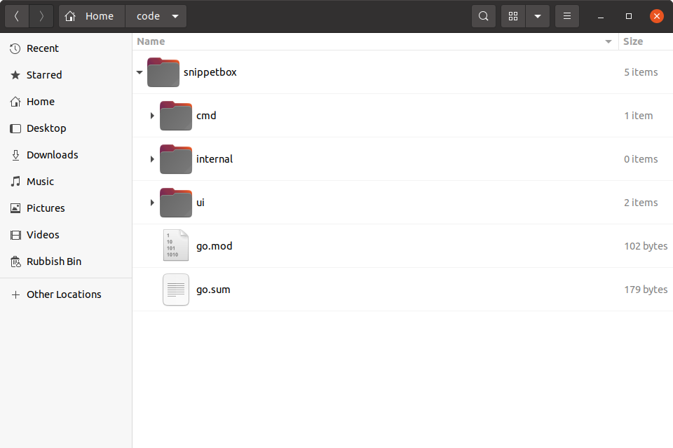

# 模块和可重现的构建

现在 MySQL 驱动程序已安装完毕，让我们看一下该`go.mod`文件（我们在本书开始时创建的文件）。你应该看到一个`require`包含两行的块，其中包含你下载的软件包的路径和确切版本号：

文件：go.mod

```go
module snippetbox.alexedwards.net

go 1.23.0

require (
    filippo.io/edwards25519 v1.1.0 // indirect
    github.com/go-sql-driver/mysql v1.8.1 // indirect
)
```

go.mod 中的这些行基本上告诉 Go 命令当你从项目目录运行诸如 `go run`、`go test` 或 `go build` 之类的命令时应该使用哪个版本的包。

这样，在同一台机器上轻松创建多个使用*同一软件包不同版本的*项目。例如，此项目使用`v1.8.1`MySQL 驱动程序，但你的计算机上可以有另一个使用该驱动程序的代码库，`v1.5.0`这样就没问题了。

**注意：**注释`// indirect`表示包不会直接出现在`import`代码库中的任何语句中。目前，我们还没有编写任何实际使用或`github.com/go-sql-driver/mysql`包的代码`filippo.io/edwards25519`，这就是为什么它们都被标记为间接依赖项。我们将在下一章中解决这个问题。

你还会看到在项目目录的根目录中创建了一个名为 的新文件`go.sum`。



此`go.sum`文件包含代表所需包内容的加密校验和。如果你打开它，你会看到类似这样的内容：

文件：go.sum

```go
filippo.io/edwards25519 v1.1.0 h1:FNf4tywRC1HmFuKW5xopWpigGjJKiJSV0Cqo0cJWDaA=
filippo.io/edwards25519 v1.1.0/go.mod h1:BxyFTGdWcka3PhytdK4V28tE5sGfRvvvRV7EaN4VDT4=
github.com/go-sql-driver/mysql v1.8.1 h1:LedoTUt/eveggdHS9qUFC1EFSa8bU2+1pZjSRpvNJ1Y=
github.com/go-sql-driver/mysql v1.8.1/go.mod h1:wEBSXgmK//2ZFJyE+qWnIsVGmvmEKlqwuVSjsCm7DZg=
```

该`go.sum`文件并非设计为可人工编辑的，通常你不需要打开它。但它有两个有用的功能：

- 如果你`go mod verify`从终端运行该命令，这将验证你机器上下载的包的校验和是否与中的条目匹配`go.sum`，因此你可以确信它们没有被更改。

```sh
$ go mod verify
all modules verified
```

- 如果其他人需要下载项目的所有依赖项（他们可以通过运行来完成`go mod download`），如果他们下载的包与文件中的校验和不匹配，他们将收到错误。

总结一下：

- 你（或将来的其他人）可以运行`go mod download`下载你的项目所需的所有软件包的精确版本。
- 你可以运行`go mod verify`以确保下载的包中没有任何内容被意外更改。
- 无论何时运行`go run`或`go test`，将始终使用`go build`中列出的精确软件包版本。`go.mod`

这些东西结合在一起使得可靠地创建可重现的 Go 应用程序[版本变得更加容易。](https://en.wikipedia.org/wiki/Reproducible_builds)

## 附加信息

### 升级软件包

一旦下载了软件包并将其添加到你的`go.mod`文件中，该软件包和版本就“固定”了。但是，出于许多原因，你可能希望在将来升级以使用较新版本的软件包。

要升级到软件包的最新可用*次要版本或补丁版本*`go get`，你只需使用`-u`如下标志运行即可：

```sh
$ go get -u github.com/foo/bar
```

或者，如果你想升级到特定版本，则应运行相同的命令，但使用适当的`@version`后缀。例如：

```sh
$ go get -u github.com/foo/bar@v2.0.0
```

### 删除未使用的包

有时你可能会`go get`在购买某个包后才意识到不再需要它。当这种情况发生时，你有两个选择。

你可以运行`go get`并在包路径后加上`@none`，如下所示：

```sh
$ go get github.com/foo/bar@none
```

或者，如果你已经删除了代码中对该包的所有引用，则可以运行`go mod tidy`，它将自动从`go.mod`和`go.sum`文件中删除所有未使用的包。

```go
$ go mod tidy
```

