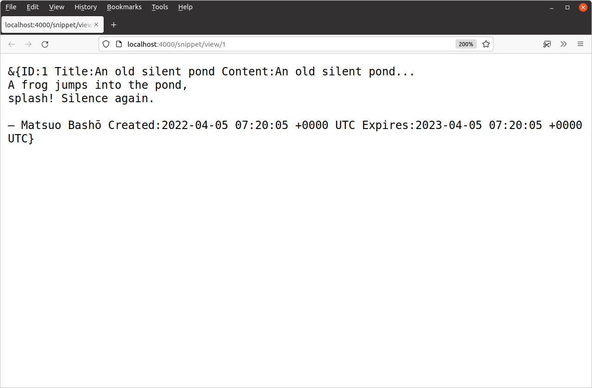
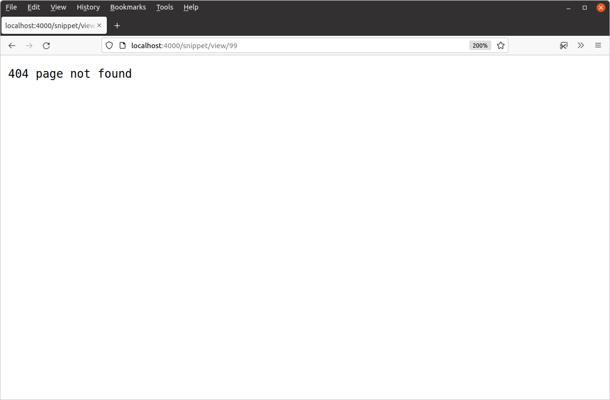

# 单记录 SQL 查询

执行语句从数据库检索单个记录的模式`SELECT`稍微复杂一些。让我们通过更新`SnippetModel.Get()`方法以使其根据其 ID 返回单个特定代码段来解释如何执行此操作。

为此，我们需要在数据库上运行以下 SQL 查询：

```sql
SELECT id, title, content, created, expires FROM snippets
WHERE expires > UTC_TIMESTAMP() AND id = ?
```

由于我们的`snippets`表使用`id`列作为主键，因此此查询将仅返回一个数据库行（或根本不返回）。查询还包括对到期时间的检查，以便我们不会返回任何已过期的代码片段。

还注意到我们再次使用占位符参数作为值吗`id`？

打开`internal/models/snippets.go`文件并添加以下代码：

文件：internal/models/snippets.go

```go
package models

import (
    "database/sql"
    "errors" // New import
    "time" 
)

...

func (m *SnippetModel) Get(id int) (Snippet, error) {
    // Write the SQL statement we want to execute. Again, I've split it over two
    // lines for readability.
    stmt := `SELECT id, title, content, created, expires FROM snippets
    WHERE expires > UTC_TIMESTAMP() AND id = ?`

    // Use the QueryRow() method on the connection pool to execute our
    // SQL statement, passing in the untrusted id variable as the value for the
    // placeholder parameter. This returns a pointer to a sql.Row object which
    // holds the result from the database.
    row := m.DB.QueryRow(stmt, id)

    // Initialize a new zeroed Snippet struct.
    var s Snippet

    // Use row.Scan() to copy the values from each field in sql.Row to the
    // corresponding field in the Snippet struct. Notice that the arguments
    // to row.Scan are *pointers* to the place you want to copy the data into,
    // and the number of arguments must be exactly the same as the number of
    // columns returned by your statement.
    err := row.Scan(&s.ID, &s.Title, &s.Content, &s.Created, &s.Expires)
    if err != nil {
        // If the query returns no rows, then row.Scan() will return a
        // sql.ErrNoRows error. We use the errors.Is() function check for that
        // error specifically, and return our own ErrNoRecord error
        // instead (we'll create this in a moment).
        if errors.Is(err, sql.ErrNoRows) {
            return Snippet{}, ErrNoRecord
        } else {
            return Snippet{}, err
        }
    }

    // If everything went OK, then return the filled Snippet struct.
    return s, nil
}

...
```

驱动程序的后台`rows.Scan()`会自动将 SQL 数据库的原始输出转换为所需的原生 Go 类型。只要你对 SQL 和 Go 之间映射的类型有把握，这些转换通常就可以正常工作。通常：

- `CHAR`，`VARCHAR`并`TEXT`映射到`string`。
- `BOOLEAN`映射到`bool`。
- `INT`映射到`int`；`BIGINT`映射到`int64`。
- `DECIMAL`并`NUMERIC`映射到`float`。
- `TIME`，`DATE`并`TIMESTAMP`映射到`time.Time`。

> **注意：**我们的 MySQL 驱动程序的一个怪癖是，我们需要使用`parseTime=true`DSN 中的参数来强制它将`TIME`和`DATE`字段转换为`time.Time`。否则它会将这些作为对象返回。这是它提供的 众多[特定于驱动程序的参数](https://github.com/go-sql-driver/mysql#parameters)`[]byte`之一。

如果此时尝试运行该应用程序，你应该会收到一个编译时错误，提示该`ErrNoRecord`值未定义：

```sh
$ go run ./cmd/web/
# snippetbox.alexedwards.net/internal/models
internal/models/snippets.go:82:25: undefined: ErrNoRecord
```

让我们继续在新`internal/models/errors.go`文件中创建它。如下所示：

```sh
$ touch internal/models/errors.go
```

文件：internal/models/errors.go

```go
package models

import (
    "errors"
)

var ErrNoRecord = errors.New("models: no matching record found")
```

另外，你可能想知道为什么我们要从方法`ErrNoRecord`中返回错误`SnippetModel.Get()`，而不是`sql.ErrNoRows`直接返回。原因是为了帮助完全封装模型，这样我们的处理程序就不关心底层数据存储区，也不依赖于特定于数据存储区的错误（如`sql.ErrNoRows`）来执行其行为。

## 在我们的处理程序中使用模型

好吧，让我们将这个`SnippetModel.Get()`方法付诸实践。

打开`cmd/web/handlers.go`文件并更新`snippetView`处理程序，以便它将特定记录的数据作为 HTTP 响应返回：

文件：cmd/web/handlers.go

```go
package main

import (
    "errors" // New import
    "fmt"
    "html/template"
    "net/http"
    "strconv"

    "snippetbox.alexedwards.net/internal/models" // New import
)

...

func (app *application) snippetView(w http.ResponseWriter, r *http.Request) {
    id, err := strconv.Atoi(r.PathValue("id"))
    if err != nil || id < 1 {
        http.NotFound(w, r)
        return
    }

    // Use the SnippetModel's Get() method to retrieve the data for a
    // specific record based on its ID. If no matching record is found,
    // return a 404 Not Found response.
    snippet, err := app.snippets.Get(id)
    if err != nil {
        if errors.Is(err, models.ErrNoRecord) {
            http.NotFound(w, r)
        } else {
            app.serverError(w, r, err)
        }
        return
    }

    // Write the snippet data as a plain-text HTTP response body.
    fmt.Fprintf(w, "%+v", snippet)
}

...
```

让我们尝试一下。重新启动应用程序，然后打开 Web 浏览器并访问[`http://localhost:4000/snippet/view/1`](http://localhost:4000/snippet/view/1)。你应该看到类似于以下内容的 HTTP 响应：



你可能还想尝试对其他已过期或尚不存在的代码段（如`id`的值`99`）发出一些请求，以验证它们是否返回`404 page not found`响应：



## 附加信息

### 检查特定错误

在本章中，我们多次使用该[`errors.Is()`](https://tip.golang.org/pkg/errors/#Is)函数来检查错误是否与特定值匹配。像这样：

```go
if errors.Is(err, models.ErrNoRecord) {
    http.NotFound(w, r)
} else {
    app.serverError(w, r, err)
}
```

在非常旧的 Go 版本中（1.13 之前），比较错误的惯用方法是使用相等运算符`==`，如下所示：

```go
if err == models.ErrNoRecord {
    http.NotFound(w, r)
} else {
    app.serverError(w, r, err)
}
```

但是，虽然该代码仍然可以编译，但使用函数是更安全且最佳的做法`errors.Is()`。

[*这是因为 Go 1.13 引入了通过包装*](https://go.dev/blog/go1.13-errors#wrapping-errors-with-w)错误来向错误添加附加信息的功能。 如果错误碰巧被包装，则会创建一个全新的错误值 — — 这反过来意味着无法使用常规`==`相等运算符检查原始底层错误的值。

该`errors.Is()`函数的工作原理是在检查匹配之前根据需要*解开错误。*

还有另一个函数，[`errors.As()`](https://tip.golang.org/pkg/errors/#As)你可以使用它来检查（可能包装的）错误是否具有特定的*类型*。我们将在本书后面使用它。

#### 简写单记录查询

我故意把代码写得`SnippetModel.Get()`稍微冗长一些，以帮助澄清和强调代码背后发生的事情。

实际上，你可以利用从 到 的错误`DB.QueryRow()`被延迟到`Scan()`调用的事实来稍微缩短代码。这不会产生任何功能差异，但如果你愿意，完全可以重写代码，使其看起来像这样：

```go
func (m *SnippetModel) Get(id int) (Snippet, error) {
    var s Snippet
    
    err := m.DB.QueryRow("SELECT ...", id).Scan(&s.ID, &s.Title, &s.Content, &s.Created, &s.Expires)
    if err != nil {
        if errors.Is(err, sql.ErrNoRows) {
            return Snippet{}, ErrNoRecord
        } else {
             return Snippet{}, err
        }
    }

    return s, nil
}
```

