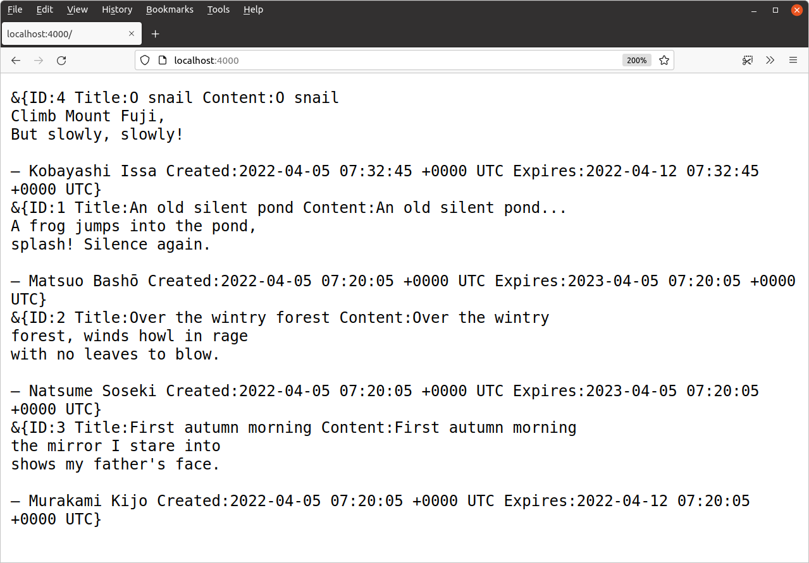

# 多记录 SQL 查询

最后，让我们看一下执行返回多行的 SQL 语句的模式。我将通过使用以下 SQL 查询更新方法以返回*最近创建的*`SnippetModel.Latest()`十个代码片段（只要它们尚未过期）来演示这一点：

```sql
SELECT id, title, content, created, expires FROM snippets
WHERE expires > UTC_TIMESTAMP() ORDER BY id DESC LIMIT 10
```

打开`internal/models/snippets.go`文件并添加以下代码：

文件：internal/models/snippets.go

```go
package models

...

func (m *SnippetModel) Latest() ([]Snippet, error) {
    // Write the SQL statement we want to execute.
    stmt := `SELECT id, title, content, created, expires FROM snippets
    WHERE expires > UTC_TIMESTAMP() ORDER BY id DESC LIMIT 10`

    // Use the Query() method on the connection pool to execute our
    // SQL statement. This returns a sql.Rows resultset containing the result of
    // our query.
    rows, err := m.DB.Query(stmt)
    if err != nil {
        return nil, err
    }

    // We defer rows.Close() to ensure the sql.Rows resultset is
    // always properly closed before the Latest() method returns. This defer
    // statement should come *after* you check for an error from the Query()
    // method. Otherwise, if Query() returns an error, you'll get a panic
    // trying to close a nil resultset.
    defer rows.Close()

    // Initialize an empty slice to hold the Snippet structs.
    var snippets []Snippet

    // Use rows.Next to iterate through the rows in the resultset. This
    // prepares the first (and then each subsequent) row to be acted on by the
    // rows.Scan() method. If iteration over all the rows completes then the
    // resultset automatically closes itself and frees-up the underlying
    // database connection.
    for rows.Next() {
        // Create a pointer to a new zeroed Snippet struct.
        var s Snippet
        // Use rows.Scan() to copy the values from each field in the row to the
        // new Snippet object that we created. Again, the arguments to row.Scan()
        // must be pointers to the place you want to copy the data into, and the
        // number of arguments must be exactly the same as the number of
        // columns returned by your statement.
        err = rows.Scan(&s.ID, &s.Title, &s.Content, &s.Created, &s.Expires)
        if err != nil {
            return nil, err
        }
        // Append it to the slice of snippets.
        snippets = append(snippets, s)
    }

    // When the rows.Next() loop has finished we call rows.Err() to retrieve any
    // error that was encountered during the iteration. It's important to
    // call this - don't assume that a successful iteration was completed
    // over the whole resultset.
    if err = rows.Err(); err != nil {
        return nil, err
    }

    // If everything went OK then return the Snippets slice.
    return snippets, nil
}
```

> **重要提示：**在上面的代码中，使用 关闭结果集`defer rows.Close()`至关重要。只要结果集处于打开状态，它就会保持底层数据库连接处于打开状态……因此，如果此方法出现问题并且结果集未关闭，则可能迅速导致池中的所有连接都被用完。

## 在我们的处理程序中使用模型

返回`cmd/web/handlers.go`文件并更新`home`处理程序以使用该`SnippetModel.Latest()`方法，将代码片段内容转储到 HTTP 响应。现在只需注释掉与模板渲染相关的代码，如下所示：

文件：cmd/web/handlers.go

```go
package main

import (
    "errors"
    "fmt"
    // "html/template"
    "net/http"
    "strconv"

    "snippetbox.alexedwards.net/internal/models"
)

func (app *application) home(w http.ResponseWriter, r *http.Request) {
    w.Header().Add("Server", "Go")
    
    snippets, err := app.snippets.Latest()
    if err != nil {
        app.serverError(w, r, err)
        return
    }

    for _, snippet := range snippets {
        fmt.Fprintf(w, "%+v\n", snippet)
    }

    // files := []string{
    //     "./ui/html/base.tmpl",
    //     "./ui/html/partials/nav.tmpl",
    //     "./ui/html/pages/home.tmpl",
    // }

    // ts, err := template.ParseFiles(files...)
    // if err != nil {
    //     app.serverError(w, r, err)
    //     return
    // }

    // err = ts.ExecuteTemplate(w, "base", nil)
    // if err != nil {
    //     app.serverError(w, r, err)
    // }
}

...
```

如果你现在运行该应用程序并[`http://localhost:4000`](http://localhost:4000/)在浏览器中访问，你应该会得到类似这样的响应：

