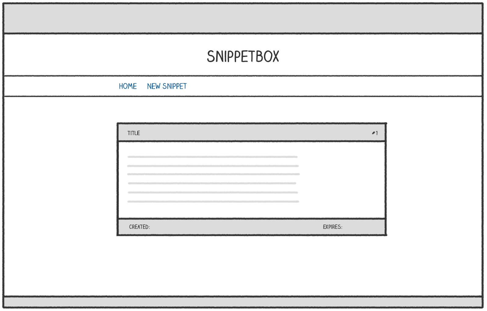
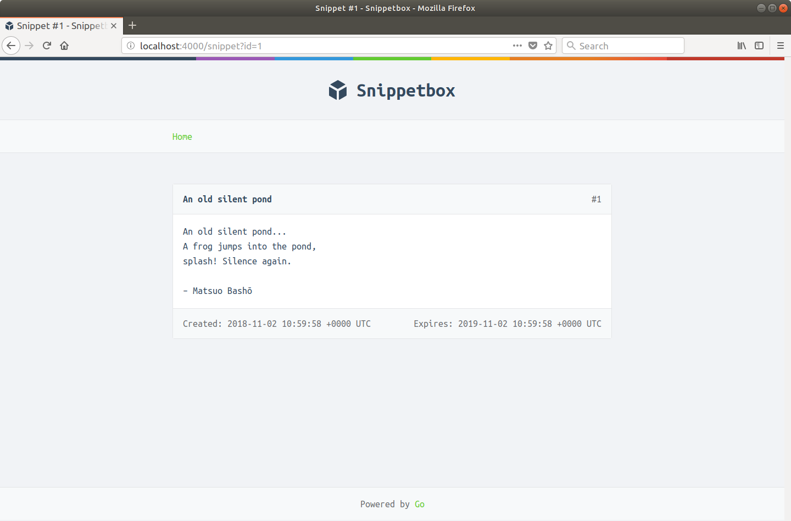
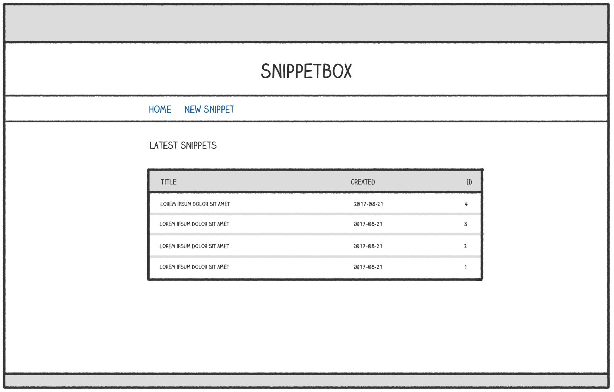
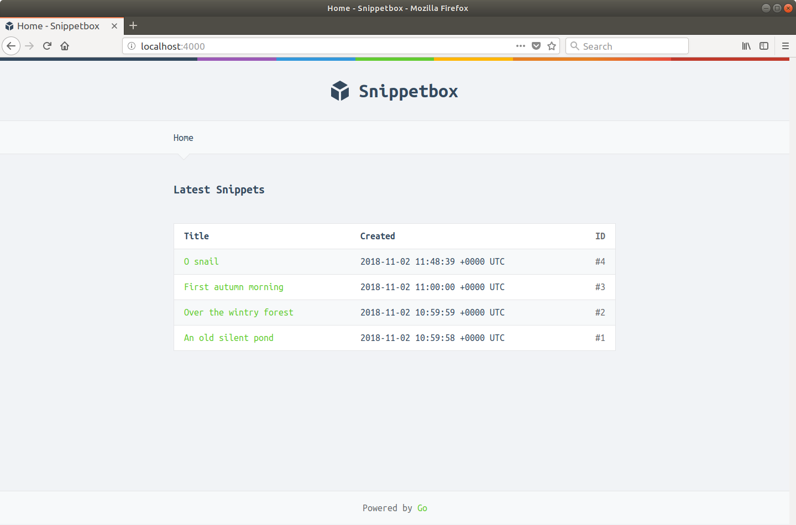
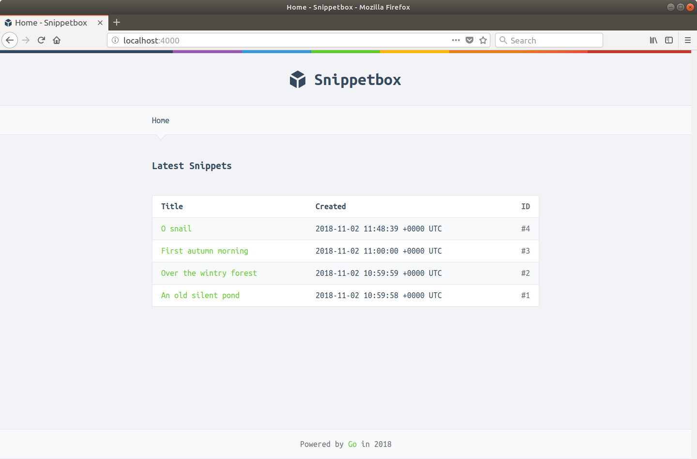
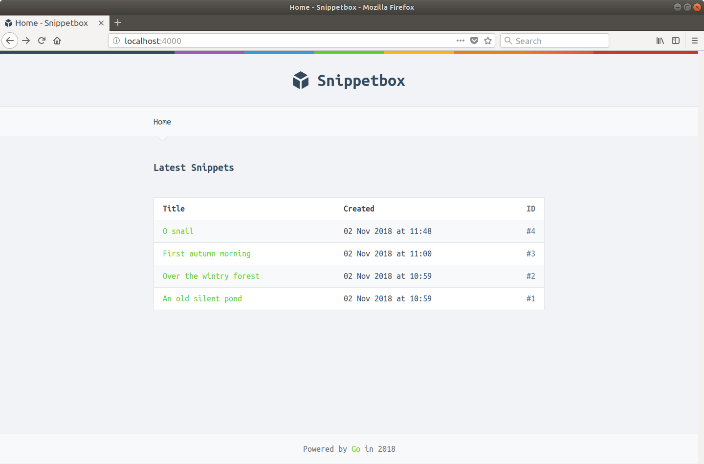
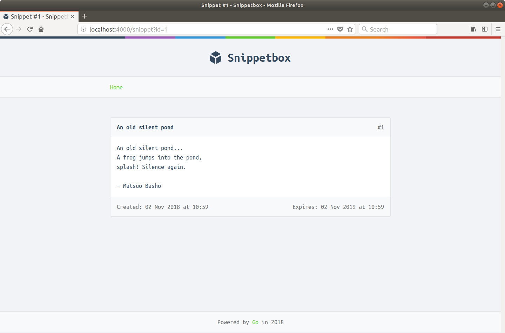

# 动态 HTML 模板

在本书的这一部分，我们将专注于在一些适当的 HTML 页面中显示来自 MySQL 数据库的动态数据。

你将学习如何：

- 以简单、可扩展和类型安全的方式将动态数据传递到你的 HTML 模板。
- 使用 Go 的 html/template 包中的各种动作和函数来控制动态数据的显示。
- 创建模板缓存，以便不会为每个 HTTP 请求从磁盘读取模板。
- 在运行时优雅地处理模板渲染错误。
- 实现一种模式，无需重复代码即可将常用动态数据传递到你的网页。
- 创建你自己的自定义函数来格式化和显示 HTML 模板中的数据。

## 显示动态数据

目前，我们的 showSnippet 处理程序函数从数据库中获取一个 models.Snippet 对象，然后将内容转储到纯文本 HTTP 响应中。

在本节中，我们将对其进行更新，以便数据显示在适当的 HTML 网页中，该网页看起来有点像这样：



让我们从 showSnippet 处理程序开始，并添加一些代码来呈现新的 show.page.tmpl 模板文件（我们将在稍后创建）。希望这在本书前面的内容中对你来说应该很熟悉。

文件：cmd/web/handlers.go

```go
package main

import (
    "errors"
    "fmt"
    "html/template" // Uncomment import
    "net/http"
    "strconv"

    "alexedwards.net/snippetbox/pkg/models"
)

...

func (app *application) showSnippet(w http.ResponseWriter, r *http.Request) {
    id, err := strconv.Atoi(r.URL.Query().Get("id"))
    if err != nil || id < 1 {
        app.notFound(w)
        return
    }

    s, err := app.snippets.Get(id)
    if err != nil {
        if errors.Is(err, models.ErrNoRecord) {
            app.notFound(w)
        } else {
            app.serverError(w, err)
        }
        return
    }

    // Initialize a slice containing the paths to the show.page.tmpl file,
    // plus the base layout and footer partial that we made earlier.
    files := []string{
        "./ui/html/show.page.tmpl",
        "./ui/html/base.layout.tmpl",
        "./ui/html/footer.partial.tmpl",
    }

    // Parse the template files...
    ts, err := template.ParseFiles(files...)
    if err != nil {
        app.serverError(w, err)
        return
    }

    // And then execute them. Notice how we are passing in the snippet
    // data (a models.Snippet struct) as the final parameter.
    err = ts.Execute(w, s)
    if err != nil {
        app.serverError(w, err)
    }
}

...
```

接下来，我们需要创建包含页面 HTML 标记的 show.page.tmpl 文件。但在我们开始之前，我需要解释一个小理论......

在你的 HTML 模板中，你传入的任何动态数据都由 .字符（称为点）。

在这种特定情况下，点的基础类型将是一个 models.Snippet 结构。当 dot 的底层类型是结构体时，你可以通过在字段名称后缀 dot 来呈现（或产生）任何导出字段的值。所以，因为我们的 models.Snippet 结构有一个 Title 字段，我们可以通过在我们的模板中写入 {{.Title}} 来产生片段标题。

我来示范。在 ui/html/show.page.tmpl 创建一个新文件并添加以下标记：

```sh
$ touch ui/html/show.page.tmpl
```

文件：ui/html/show.page.tmpl

```html
{{template "base" .}}

{{define "title"}}Snippet #{{.ID}}{{end}}

{{define "main"}}
<div class='snippet'>
    <div class='metadata'>
        <strong>{{.Title}}</strong>
        <span>#{{.ID}}</span>
    </div>
    <pre><code>{{.Content}}</code></pre>
    <div class='metadata'>
        <time>Created: {{.Created}}</time>
        <time>Expires: {{.Expires}}</time>
    </div>
</div>
{{end}}
```

如果重新启动应用程序并在浏览器中访问 http://localhost:4000/snippet?id=1 ，你应该会发现从数据库中获取相关代码段，传递给模板，并且内容正确呈现。



### 渲染多条数据

需要解释的重要一点是，Go 的 html/template 包允许你在渲染模板时传入一项——而且只有一项——动态数据。但是在实际应用程序中，你通常希望在同一页面中显示多条动态数据。

实现此目的的一种轻量级且类型安全的方法是将动态数据包装在一个结构中，该结构充当数据的单个“保持结构”。

让我们创建一个新的 cmd/web/templates.go 文件，其中包含一个 templateData 结构来执行此操作。

```sh
$ touch cmd/web/templates.go
```

文件：cmd/web/templates.go

```go
package main

import "alexedwards.net/snippetbox/pkg/models"

// Define a templateData type to act as the holding structure for
// any dynamic data that we want to pass to our HTML templates.
// At the moment it only contains one field, but we'll add more
// to it as the build progresses.
type templateData struct {
    Snippet *models.Snippet
}
```

然后让我们更新 showSnippet 处理程序以在执行我们的模板时使用这个新结构：

文件：cmd/web/handlers.go

```go
package main

...

func (app *application) showSnippet(w http.ResponseWriter, r *http.Request) {
    id, err := strconv.Atoi(r.URL.Query().Get("id"))
    if err != nil || id < 1 {
        app.notFound(w)
        return
    }

    s, err := app.snippets.Get(id)
    if err != nil {
        if errors.Is(err, models.ErrNoRecord) {
            app.notFound(w)
        } else {
            app.serverError(w, err)
        }
        return
    }

    // Create an instance of a templateData struct holding the snippet data.
    data := &templateData{Snippet: s}

    files := []string{
        "./ui/html/show.page.tmpl",
        "./ui/html/base.layout.tmpl",
        "./ui/html/footer.partial.tmpl",
    }

    ts, err := template.ParseFiles(files...)
    if err != nil {
        app.serverError(w, err)
        return
    }

    // Pass in the templateData struct when executing the template.
    err = ts.Execute(w, data)
    if err != nil {
        app.serverError(w, err)
    }
}

...
```

所以现在，我们的代码片段数据包含在 templateData 结构中的 models.Snippet 结构中。要生成数据，我们需要将适当的字段名称链接在一起，如下所示：
文件：ui/html/show.page.tmpl

```html
{{template "base" .}}

{{define "title"}}Snippet #{{.Snippet.ID}}{{end}}

{{define "main"}}
<div class='snippet'>
    <div class='metadata'>
        <strong>{{.Snippet.Title}}</strong>
        <span>#{{.Snippet.ID}}</span>
    </div>
    <pre><code>{{.Snippet.Content}}</code></pre>
    <div class='metadata'>
        <time>Created: {{.Snippet.Created}}</time>
        <time>Expires: {{.Snippet.Expires}}</time>
    </div>
</div>
{{end}}
```

随意重新启动应用程序并再次访问 http://localhost:4000/snippet?id=1。你应该会看到与以前一样在浏览器中呈现的页面。

### 附加信息

#### 转义

html/template 包会自动转义 {{ }} 标签之间产生的任何数据。这种行为对于避免跨站点脚本 (XSS) 攻击非常有帮助，这也是你应该使用 html/template 包而不是 Go 还提供的更通用的 text/template 包的原因。

作为转义的一个例子，如果你想要产生的动态数据是：

```html
<span>{{"<script>alert('xss attack')</script>"}}</span>
```

它将无害地呈现为：

```html
<span>&lt;script&gt;alert(&#39;xss attack&#39;)&lt;/script&gt;</span>
```

html/template 包也足够智能，可以使转义依赖于上下文。它将根据数据是否在包含 HTML、CSS、Javascript 或 URI 的页面部分中呈现来使用适当的转义序列。

#### 嵌套模板

需要注意的是，当你从另一个模板调用一个模板时，需要将 dot 显式传递或管道传输到被调用的模板，这一点非常重要。你可以通过将其包含在每个 {{template}} 或 {{block}} 操作的末尾来做到这一点，如下所示：

```html
{{template "base" .}}
{{template "main" .}}
{{template "footer" .}}
{{block "sidebar" .}}{{end}}
```

通常，我的建议是养成在使用 {{template}} 或 {{block}} 操作调用模板时始终使用流水线的习惯，除非你有充分的理由不这样做。

#### 调用方法

如果你生成的对象具有针对它定义的方法，你可以调用它们（只要它们被导出并且它们只返回一个值——或者一个值和一个错误）。

例如，如果 .Snippet.Created 具有基础类型 time.Time（它确实如此），你可以通过调用它的 Weekday() 方法来呈现工作日的名称，如下所示：

```go
<span>{{.Snippet.Created.Weekday}}</span>
```

你还可以将参数传递给方法。例如，你可以使用 AddDate() 方法将六个月添加到如下所示的时间：

```html
<span>{{.Snippet.Created.AddDate 0 6 0}}</span>
```


请注意，这与在 Go 中调用函数的语法不同——参数没有被括号包围，而是由单个空格字符分隔，而不是逗号。

#### HTML 注释

最后， html/template 包总是去除你在模板中包含的任何 HTML 注释，包括任何条件注释。

这样做的原因是为了帮助在呈现动态内容时避免 XSS 攻击。允许条件注释意味着 Go 并不总是能够预测浏览器将如何解释页面中的标记，因此它不一定能够适当地转义所有内容。为了解决这个问题，Go 简单地去掉了所有的 HTML 注释。

## 模板操作和函数

在本节中，我们将查看 Go 提供的模板操作和函数。

我们已经讨论了一些操作——{{define}}、{{template}} 和 {{block}}——但是还有另外三个可以用来控制动态数据的显示——{{if}} , {{with}} 和 {{range}}。

| Action                                | Description                                                  |
| ------------------------------------- | ------------------------------------------------------------ |
| {{if .Foo}} C1 {{else}} C2 {{end}}    | 如果 .Foo 不为空，则渲染内容 C1，否则渲染内容 C2。           |
| {{with .Foo}} C1 {{else}} C2 {{end}}  | 如果 .Foo 不为空，则将 dot 设置为 .Foo 的值并渲染内容 C1，否则渲染内容 C2。 |
| {{range .Foo}} C1 {{else}} C2 {{end}} | 如果 .Foo 的长度大于零，则循环遍历每个元素，将 dot 设置为每个元素的值并呈现内容 C1。 如果 .Foo 的长度为零，则呈现内容 C2。 .Foo 的底层类型必须是数组、切片、映射或通道。 |

关于这些模板，有几点需要指出：

- 对于所有三个操作，{{else}} 子句是可选的。例如，如果没有要渲染的 C2 内容，你可以编写 {{if .Foo}} C1 {{end}}。
- 空值是 false、0、任何 nil 指针或接口值，以及任何长度为零的数组、切片、映射或字符串。
- 重要的是要掌握 with 和 range 动作会改变 dot 的值。一旦你开始使用它们，根据你在模板中的位置和你在做什么，点代表的内容可能会有所不同。

html/template 包还提供了一些模板函数，你可以使用这些函数向模板添加额外的逻辑并控制在运行时呈现的内容。你可以在此处找到完整的函数列表，但最重要的是：

| Function                     | Description                                                  |
| ---------------------------- | ------------------------------------------------------------ |
| {{eq .Foo .Bar}}             | 如果 .Foo 等于 .Bar 则返回 true                              |
| {{ne .Foo .Bar}}             | 如果 .Foo 不等于 .Bar 则返回 true                            |
| {{not .Foo}}                 | 产生 .Foo 的布尔否定                                         |
| {{or .Foo .Bar}}             | 如果 .Foo 不为空，则产生 .Foo； 否则会产生 .Bar              |
| {{index .Foo i}}             | 在索引 i 处产生 .Foo 的值。 .Foo 的底层类型必须是映射、切片或数组。 |
| {{printf "%s-%s" .Foo .Bar}} | 生成一个包含 .Foo 和 .Bar 值的格式化字符串。 与 fmt.Sprintf() 的工作方式相同。 |
| {{len .Foo}}                 | 将 .Foo 的长度作为整数产生。                                 |
| {{$bar := len .Foo}}         | 将 .Foo 的长度分配给模板变量 $bar                            |

最后一行是声明模板变量的示例。如果要存储函数的结果并在模板的多个位置使用它，模板变量特别有用。变量名称必须以美元符号为前缀，并且只能包含字母数字字符。

### 使用 With 操作

使用 {{with}} 操作的一个好机会是我们在上一章中创建的 show.page.tmpl 文件。继续并像这样更新它：

文件：ui/html/show.page.tmpl

```html
{{template "base" .}}

{{define "title"}}Snippet #{{.Snippet.ID}}{{end}}

{{define "main"}}
    {{with .Snippet}}
    <div class='snippet'>
        <div class='metadata'>
            <strong>{{.Title}}</strong>
            <span>#{{.ID}}</span>
        </div>
        <pre><code>{{.Content}}</code></pre>
        <div class='metadata'>
            <time>Created: {{.Created}}</time>
            <time>Expires: {{.Expires}}</time>
        </div>
    </div>
    {{end}}
{{end}}
```

所以现在，在 {{with .Snippet}} 和对应的 {{end}} 标签之间，dot 的值被设置为 .Snippet。 Dot 本质上变成了 models.Snippet 结构，而不是父 templateData 结构。

### 使用 If 和 Range 操作

让我们在一个具体示例中也使用 {{if}} 和 {{range}} 操作并更新我们的主页以显示最新片段的表格，有点像这样：




首先更新 templateData 结构，使其包含一个用于保存片段切片的 Snippets 字段，如下所示：

文件：cmd/web/templates.go

```go
package main

import "alexedwards.net/snippetbox/pkg/models"

// Include a Snippets field in the templateData struct.
type templateData struct {
    Snippet  *models.Snippet
    Snippets []*models.Snippet
}
```

然后更新 home 处理函数，以便它从我们的数据库模型中获取最新的片段并将它们传递给 home.page.tmpl 模板：

文件：cmd/web/handlers.go

```go
package main

...

func (app *application) home(w http.ResponseWriter, r *http.Request) {
    if r.URL.Path != "/" {
        app.notFound(w)
        return
    }

    s, err := app.snippets.Latest()
    if err != nil {
        app.serverError(w, err)
        return
    }

    // Create an instance of a templateData struct holding the slice of
    // snippets.
    data := &templateData{Snippets: s}

    files := []string{
        "./ui/html/home.page.tmpl",
        "./ui/html/base.layout.tmpl",
        "./ui/html/footer.partial.tmpl",
    }

    ts, err := template.ParseFiles(files...)
    if err != nil {
        app.serverError(w, err)
        return
    }

    // Pass in the templateData struct when executing the template.
    err = ts.Execute(w, data)
    if err != nil {
        app.serverError(w, err)
    }
}

...
```

现在让我们转到 ui/html/home.page.tmpl 文件并使用 {{if}} 和 {{range}} 操作更新它以在表格中显示这些片段。具体来说：

- 我们想使用 {{if}} 操作来检查片段切片是否为空。如果它是空的，我们想要显示“这里还没有什么可看的！消息。否则，我们想要呈现一个包含片段信息的表格。
- 我们想使用 {{range}} 操作迭代切片中的所有片段，在表格行中呈现每个片段的内容。

这是标记：

文件：ui/html/home.page.tmpl

```html
{{template "base" .}}

{{define "title"}}Home{{end}}

{{define "main"}}
    <h2>Latest Snippets</h2>
    {{if .Snippets}}
     <table>
        <tr>
            <th>Title</th>
            <th>Created</th>
            <th>ID</th>
        </tr>
        {{range .Snippets}}
        <tr>
            <td><a href='/snippet?id={{.ID}}'>{{.Title}}</a></td>
            <td>{{.Created}}</td>
            <td>#{{.ID}}</td>
        </tr>
        {{end}}
    </table>
    {{else}}
        <p>There's nothing to see here... yet!</p>
    {{end}}
{{end}}
```

确保所有文件都已保存，重新启动应用程序并在 Web 浏览器中访问 http://localhost:4000。如果一切都按计划进行，你应该会看到一个看起来像这样的页面：



## 缓存模板

在我们向 HTML 模板添加更多功能之前，现在是对我们的代码库进行一些优化的好时机。目前主要有两个问题：

每次我们渲染网页时，我们的应用程序都会使用 template.ParseFiles() 函数读取和解析相关的模板文件。我们可以通过在启动应用程序时解析文件一次并将解析的模板存储在内存缓存中来避免这种重复工作。

home 和 showSnippet 处理程序中有重复的代码，我们可以通过创建一个辅助函数来减少这种重复。

让我们先解决第一点，然后创建一个类型为 map[string]*template.Template 的内存映射来缓存解析的模板。打开你的 cmd/web/templates.go 文件并添加以下代码：

文件：cmd/web/templates.go

```go
package main

import (
    "html/template" // New import
    "path/filepath" // New import

    "alexedwards.net/snippetbox/pkg/models"
)

...

func newTemplateCache(dir string) (map[string]*template.Template, error) {
    // Initialize a new map to act as the cache.
    cache := map[string]*template.Template{}

    // Use the filepath.Glob function to get a slice of all filepaths with
    // the extension '.page.tmpl'. This essentially gives us a slice of all the
    // 'page' templates for the application.
    pages, err := filepath.Glob(filepath.Join(dir, "*.page.tmpl"))
    if err != nil {
        return nil, err
    }

    // Loop through the pages one-by-one.
    for _, page := range pages {
        // Extract the file name (like 'home.page.tmpl') from the full file path
        // and assign it to the name variable.
        name := filepath.Base(page)

        // Parse the page template file in to a template set.
        ts, err := template.ParseFiles(page)
        if err != nil {
            return nil, err
        }

        // Use the ParseGlob method to add any 'layout' templates to the
        // template set (in our case, it's just the 'base' layout at the
        // moment).
        ts, err = ts.ParseGlob(filepath.Join(dir, "*.layout.tmpl"))
        if err != nil {
            return nil, err
        }

        // Use the ParseGlob method to add any 'partial' templates to the
        // template set (in our case, it's just the 'footer' partial at the
        // moment).
        ts, err = ts.ParseGlob(filepath.Join(dir, "*.partial.tmpl"))
        if err != nil {
            return nil, err
        }

        // Add the template set to the cache, using the name of the page
        // (like 'home.page.tmpl') as the key.
        cache[name] = ts
    }

    // Return the map.
    return cache, nil
}
```

下一步是在 main() 函数中初始化此缓存，并通过应用程序结构使其作为依赖项提供给我们的处理程序，如下所示：

文件：cmd/web/main.go

```go
package main

import (
    "database/sql"
    "flag"
    "html/template" // New import
    "log"
    "net/http"
    "os"

    "alexedwards.net/snippetbox/pkg/models/mysql"

    _ "github.com/go-sql-driver/mysql"
)

...

// Add a templateCache field to the application struct.
type application struct {
    errorLog      *log.Logger
    infoLog       *log.Logger
    snippets      *mysql.SnippetModel
    templateCache map[string]*template.Template
}

func main() {
    dsn := flag.String("dsn", "web:pass@/snippetbox?parseTime=true", "MySQL data source name")
    addr := flag.String("addr", ":4000", "HTTP network address")
    flag.Parse()

    infoLog := log.New(os.Stdout, "INFO\t", log.Ldate|log.Ltime)
    errorLog := log.New(os.Stderr, "ERROR\t", log.Ldate|log.Ltime|log.Lshortfile)

    db, err := openDB(*dsn)
    if err != nil {
        errorLog.Fatal(err)
    }
    defer db.Close()

    // Initialize a new template cache...
    templateCache, err := newTemplateCache("./ui/html/")
    if err != nil {
        errorLog.Fatal(err)
    }

    // And add it to the application dependencies.
    app := &application{
        errorLog:      errorLog,
        infoLog:       infoLog,
        snippets:      &mysql.SnippetModel{DB: db},
        templateCache: templateCache,
    }

    srv := &http.Server{
        Addr:     *addr,
        ErrorLog: errorLog,
        Handler:  app.routes(),
    }

    infoLog.Printf("Starting server on %s", *addr)
    err = srv.ListenAndServe()
    errorLog.Fatal(err)
}

...
```

因此，此时，我们已经为每个页面设置了相关模板集的内存缓存，并且我们的处理程序可以通过应用程序结构访问该缓存。

现在让我们解决重复代码的第二个问题，并创建一个辅助方法，以便我们可以轻松地从缓存中渲染模板。

打开你的 cmd/web/helpers.go 文件并添加以下方法：

文件：cmd/web/helpers.go

```go
package main

...

func (app *application) render(w http.ResponseWriter, r *http.Request, name string, td *templateData) {
    // Retrieve the appropriate template set from the cache based on the page name
    // (like 'home.page.tmpl'). If no entry exists in the cache with the
    // provided name, call the serverError helper method that we made earlier.
    ts, ok := app.templateCache[name]
    if !ok {
        app.serverError(w, fmt.Errorf("The template %s does not exist", name))
        return
    }

    // Execute the template set, passing in any dynamic data.
    err := ts.Execute(w, td)
    if err != nil {
        app.serverError(w, err)
    }
}
```

此时你可能想知道为什么 render() 方法的签名包含一个 *http.Request 参数......即使它没有在任何地方使用。这只是为了将来证明方法签名，因为在本书的后面我们将需要访问它。

完成后，我们现在可以看到这些更改的回报，并且可以显着简化处理程序中的代码：

文件：cmd/web/handlers.go

```go
package main

import (
    "errors"
    "fmt"
    "net/http"
    "strconv"

    "alexedwards.net/snippetbox/pkg/models"
)

func (app *application) home(w http.ResponseWriter, r *http.Request) {
    if r.URL.Path != "/" {
        app.notFound(w)
        return
    }

    s, err := app.snippets.Latest()
    if err != nil {
        app.serverError(w, err)
        return
    }

    // Use the new render helper.
    app.render(w, r, "home.page.tmpl", &templateData{
        Snippets: s,
    })
}

func (app *application) showSnippet(w http.ResponseWriter, r *http.Request) {
    id, err := strconv.Atoi(r.URL.Query().Get("id"))
    if err != nil || id < 1 {
        app.notFound(w)
        return
    }

    s, err := app.snippets.Get(id)
    if err != nil {
        if errors.Is(err, models.ErrNoRecord) {
            app.notFound(w)
        } else {
            app.serverError(w, err)
        }
        return
    }

    // Use the new render helper.
    app.render(w, r, "show.page.tmpl", &templateData{
        Snippet: s,
    })
}

...
```

## 捕获运行时错误

一旦我们开始向 HTML 模板添加动态行为，就有遇到运行时错误的风险。

让我们故意向 show.page.tmpl 模板添加一个错误，看看会发生什么：

文件：ui/html/show.page.tmpl

```html
{{template "base" .}}

{{define "title"}}Snippet #{{.Snippet.ID}}{{end}}

{{define "main"}}
    {{with .Snippet}}
    <div class='snippet'>
        <div class='metadata'>
            <strong>{{.Title}}</strong>
            <span>#{{.ID}}</span>
        </div>
        {{len nil}} <!-- Deliberate error -->
        <pre><code>{{.Content}}</code></pre>
        <div class='metadata'>
            <time>Created: {{.Created}}</time>
            <time>Expires: {{.Expires}}</time>
        </div>
    </div>
    {{end}}
{{end}}
```

在上面的这个标记中，我们添加了行 {{len nil}}，它应该在运行时产生一个错误，因为在 Go 中 nil 值没有长度。

现在尝试运行该应用程序。你会发现一切仍然编译正常：

```sh
$ go run ./cmd/web
INFO    2018/09/09 11:50:25 Starting server on :4000
```

但是如果你使用 curl 向 http://localhost:4000/snippet?id=1 发出请求，你会得到一个看起来像这样的响应。

```sh
$ curl -i http://localhost:4000/snippet?id=1
HTTP/1.1 200 OK
Date: Sun, 09 Sep 2018 09:50:27 GMT
Content-Length: 615
Content-Type: text/html; charset=utf-8

&lt;!doctype html&gt;
&lt;html lang='en'&gt;
    &lt;head&gt;
        &lt;meta charset='utf-8'&gt;
        &lt;title&gt;Snippet #1 - Snippetbox&lt;/title&gt;

        &lt;link rel='stylesheet' href='/static/css/main.css'&gt;
        &lt;link rel='shortcut icon' href='/static/img/favicon.ico' type='image/x-icon'&gt;
        &lt;link rel='stylesheet' href='https://fonts.googleapis.com/css?family=Ubuntu+Mono:400,700'&gt;
    &lt;/head&gt;
    &lt;body&gt;
        &lt;header&gt;
            &lt;h1&gt;&lt;a href='/'&gt;Snippetbox&lt;/a&gt;&lt;/h1&gt;
        &lt;/header&gt;
        &lt;nav&gt;
            &lt;a href='/'&gt;Home&lt;/a&gt;
        &lt;/nav&gt;
        &lt;section&gt;


    &lt;div class='snippet'&gt;
        &lt;div class='metadata'&gt;
            &lt;strong&gt;An old silent pond&lt;/strong&gt;
            &lt;span&gt;#1&lt;/span&gt;
        &lt;/div&gt;
        Internal Server Error
```

这很糟糕。我们的应用程序抛出了一个错误，但用户错误地收到了 200 OK 响应。更糟糕的是，他们收到了一个半完整的 HTML 页面。

为了解决这个问题，我们需要使模板呈现一个两阶段的过程。首先，我们应该通过将模板写入缓冲区来进行“试用”渲染。如果失败，我们可以用错误消息响应用户。但是如果它有效，我们就可以将缓冲区的内容写入我们的 http.ResponseWriter。

让我们更新渲染助手以使用这种方法：

文件：cmd/web/helpers.go

```go
package main

import (
    "bytes" // New import
    "fmt"
    "net/http"
    "runtime/debug"
)

...

func (app *application) render(w http.ResponseWriter, r *http.Request, name string, td *templateData) {
    ts, ok := app.templateCache[name]
    if !ok {
        app.serverError(w, fmt.Errorf("The template %s does not exist", name))
        return
    }

    // Initialize a new buffer.
    buf := new(bytes.Buffer)

    // Write the template to the buffer, instead of straight to the
    // http.ResponseWriter. If there's an error, call our serverError helper and then
    // return.
    err := ts.Execute(buf, td)
    if err != nil {
        app.serverError(w, err)
        return
    }

    // Write the contents of the buffer to the http.ResponseWriter. Again, this
    // is another time where we pass our http.ResponseWriter to a function that
    // takes an io.Writer.
    buf.WriteTo(w)
}
```

重新启动应用程序并尝试再次发出相同的请求。你现在应该会收到正确的错误消息和 500 Internal Server Error 响应。

```sh
$ curl -i http://localhost:4000/snippet?id=1
HTTP/1.1 500 Internal Server Error
Content-Type: text/plain; charset=utf-8
X-Content-Type-Options: nosniff
Date: Sun, 09 Sep 2018 09:55:13 GMT
Content-Length: 22

Internal Server Error
```

好东西。这样看起来好多了。

在我们继续下一章之前，回到 show.page.tmpl 文件并删除故意的错误：

文件：ui/html/show.page.tmpl

```html
{{template "base" .}}

{{define "title"}}Snippet #{{.Snippet.ID}}{{end}}

{{define "main"}}
    {{with .Snippet}}
    <div class='snippet'>
        <div class='metadata'>
            <strong>{{.Title}}</strong>
            <span>#{{.ID}}</span>
        </div>
        <pre><code>{{.Content}}</code></pre>
        <div class='metadata'>
            <time>Created: {{.Created}}</time>
            <time>Expires: {{.Expires}}</time>
        </div>
    </div>
    {{end}}
{{end}}
```

## 通用动态数据

在某些 Web 应用程序中，你可能希望在多个（甚至每个）网页中包含常见的动态数据。例如，你可能希望在所有带有表单的页面中包含当前用户的姓名和个人资料图片，或 CSRF 令牌。

在我们的例子中，让我们从一些简单的事情开始，假设我们希望在每一页的页脚中包含当前年份。

为此，我们将首先向 templateData 结构添加一个新的 CurrentYear 字段，如下所示：

文件：cmd/web/templates.go

```go
package main

...

// Add a CurrentYear field to the templateData struct.
type templateData struct {
    CurrentYear int
    Snippet     *models.Snippet
    Snippets    []*models.Snippet
}

...
```

然后下一步是为我们的应用程序创建一个新的 addDefaultData() 辅助方法，该方法会将当前年份注入到 templateData 结构的实例中。

然后我们可以从我们的 render() 助手中调用它来为每个页面自动添加默认数据。

我将演示：

文件：cmd/web/helpers.go

```go
package main

import (
    "bytes"
    "fmt"
    "net/http"
    "runtime/debug"
    "time" // New import
)

...

// Create an addDefaultData helper. This takes a pointer to a templateData
// struct, adds the current year to the CurrentYear field, and then returns
// the pointer. Again, we're not using the *http.Request parameter at the
// moment, but we will do later in the book.
func (app *application) addDefaultData(td *templateData, r *http.Request) *templateData {
    if td == nil {
        td = &templateData{}
    }
    td.CurrentYear = time.Now().Year()
    return td
}

func (app *application) render(w http.ResponseWriter, r *http.Request, name string, td *templateData) {
    ts, ok := app.templateCache[name]
    if !ok {
        app.serverError(w, fmt.Errorf("The template %s does not exist", name))
        return
    }

    buf := new(bytes.Buffer)

    // Execute the template set, passing the dynamic data with the current
    // year injected.
    err := ts.Execute(buf, app.addDefaultData(td, r))
    if err != nil {
        app.serverError(w, err)
        return
    }

    buf.WriteTo(w)
}
```

现在我们只需要更新 ui/html/footer.partial.tmpl 文件来显示年份，如下所示：

文件：ui/html/footer.partial.tmpl

```html
{{define "footer"}}
<footer>Powered by <a href='https://golang.org/'>Go</a>  in {{.CurrentYear}}</footer>
{{end}}
```

重新启动应用程序并访问主页 http://localhost:4000。你应该在页脚中看到当前年份，如下所示：



## 自定义模板函数

在本节关于模板和动态数据的最后一部分，我想解释如何创建自己的自定义函数以在 Go 模板中使用。

为了说明这一点，让我们创建一个自定义 humanDate() 函数，该函数以一种很好的“人性化”格式输出日期时间，例如 02 Jan 2019 at 15:04，而不是以 2019-01-02 15:04:00 的默认格式输出日期+0000 UTC 就像我们现在一样。

执行此操作有两个主要步骤：

1. 我们需要创建一个包含自定义 humanDate() 函数的 template.FuncMap 对象。
2. 在解析模板之前，我们需要使用 template.Funcs() 方法来注册它。

继续并将以下代码添加到你的 templates.go 文件中：

文件：cmd/web/templates.go

```go
package main

import (
    "html/template"
    "path/filepath"
    "time" // New import

    "alexedwards.net/snippetbox/pkg/models"
)

...

// Create a humanDate function which returns a nicely formatted string
// representation of a time.Time object.
func humanDate(t time.Time) string {
    return t.Format("02 Jan 2006 at 15:04")
}

// Initialize a template.FuncMap object and store it in a global variable. This is
// essentially a string-keyed map which acts as a lookup between the names of our
// custom template functions and the functions themselves.
var functions = template.FuncMap{
    "humanDate": humanDate,
}

func newTemplateCache(dir string) (map[string]*template.Template, error) {
    cache := map[string]*template.Template{}

    pages, err := filepath.Glob(filepath.Join(dir, "*.page.tmpl"))
    if err != nil {
        return nil, err
    }

    for _, page := range pages {
        name := filepath.Base(page)

        // The template.FuncMap must be registered with the template set before you
        // call the ParseFiles() method. This means we have to use template.New() to
        // create an empty template set, use the Funcs() method to register the
        // template.FuncMap, and then parse the file as normal.
        ts, err := template.New(name).Funcs(functions).ParseFiles(page)
        if err != nil {
            return nil, err
        }

        ts, err = ts.ParseGlob(filepath.Join(dir, "*.layout.tmpl"))
        if err != nil {
            return nil, err
        }

        ts, err = ts.ParseGlob(filepath.Join(dir, "*.partial.tmpl"))
        if err != nil {
            return nil, err
        }

        cache[name] = ts
    }

    return cache, nil
}
```

在我们继续之前，我应该解释一下：自定义模板函数（如我们的 humanDate() 函数）可以接受任意数量的参数，但它们必须只返回一个值。唯一的例外是如果你想返回一个错误作为第二个值，在这种情况下也可以。

现在我们可以像使用内置模板函数一样使用我们的 humanDate() 函数：

文件：ui/html/home.page.tmpl

```html
{{template "base" .}}

{{define "title"}}Home{{end}}

{{define "main"}}
    <h2>Latest Snippets</h2>
    {{if .Snippets}}
     <table>
        <tr>
            <th>Title</th>
            <th>Created</th>
            <th>ID</th>
        </tr>
        {{range .Snippets}}
        <tr>
            <td><a href='/snippet?id={{.ID}}'>{{.Title}}</a></td>
            <!-- Use the new template function here -->
            <td>{{humanDate .Created}}</td>
            <td>#{{.ID}}</td>
        </tr>
        {{end}}
    </table>
    {{else}}
        <p>There's nothing to see here... yet!</p>
    {{end}}
{{end}}
```

文件：ui/html/show.page.tmpl

```html
{{template "base" .}}

{{define "title"}}Snippet #{{.Snippet.ID}}{{end}}

{{define "main"}}
    {{with .Snippet}}
    <div class='snippet'>
        <div class='metadata'>
            <strong>{{.Title}}</strong>
            <span>#{{.ID}}</span>
        </div>
        <pre><code>{{.Content}}</code></pre>
        <div class='metadata'>
            <!-- Use the new template function here -->
            <time>Created: {{humanDate .Created}}</time>
            <time>Expires: {{humanDate .Expires}}</time>
        </div>
    </div>
    {{end}}
{{end}}
```

完成后重新启动应用程序。如果你在浏览器中访问 http://localhost:4000 和 http://localhost:4000/snippet?id=1 ，你应该会看到正在使用的新的、格式良好的日期。





### 附加信息

#### 流水线

在上面的代码中，我们像这样调用我们的自定义模板函数：

```html
<time>Created: {{humanDate .Created}}</time>
```

另一种方法是使用 |字符到管道值到函数。这有点像在 Unix 终端中将一个命令的输出流水线化到另一个命令。我们可以将上面的内容重写为：

```html
<time>Created: {{.Created | humanDate}}</time>
```

流水线的一个很好的特性是你可以创建一个任意长的模板函数链，这些模板函数使用一个的输出作为下一个的输入。例如，我们可以将 humanDate 函数的输出通过管道传输到内置的 printf 函数，如下所示：

```html
<time>{{.Created | humanDate | printf "Created: %s"}}</time>
