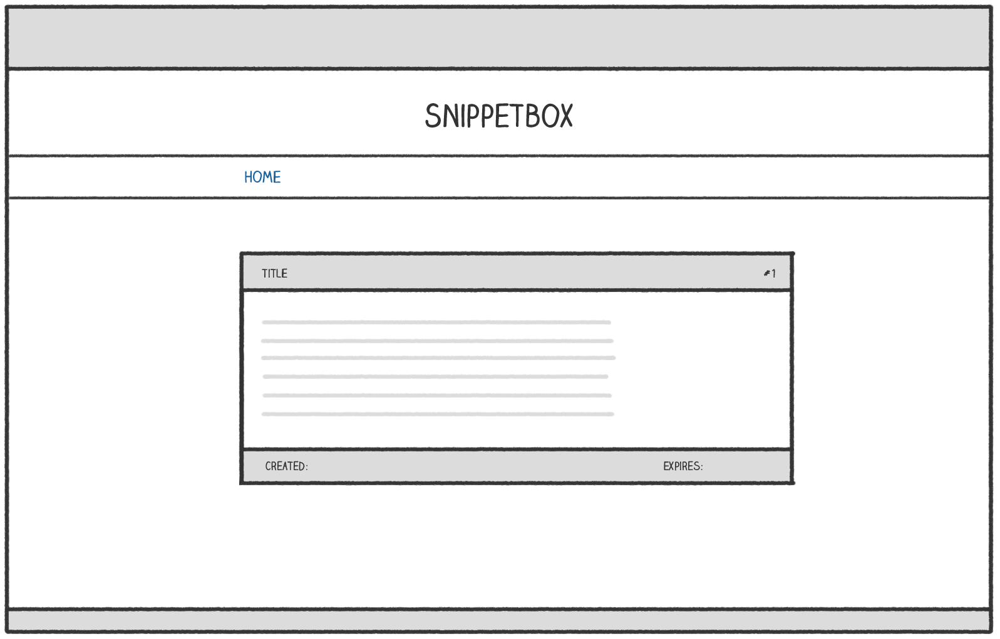

# 显示动态数据

目前，我们的`snippetView`处理函数`models.Snippet`从数据库中获取一个对象，然后将内容转储到纯文本 HTTP 响应中。

在本章中，我们将对此进行改进，以便数据显示在正确的 HTML 网页中，如下所示：



让我们从`snippetView`处理程序开始，添加一些代码来呈现新的`view.tmpl`模板文件（我们将在稍后创建）。希望这对你来说应该很熟悉，因为本书前面已经介绍过。

文件：cmd/web/handlers.go

```go
package main

import (
    "errors"
    "fmt"
    "html/template" // Uncomment import
    "net/http"
    "strconv"

    "snippetbox.alexedwards.net/internal/models"
)

...

func (app *application) snippetView(w http.ResponseWriter, r *http.Request) {
    id, err := strconv.Atoi(r.PathValue("id"))
    if err != nil || id < 1 {
        http.NotFound(w, r)
        return
    }

    snippet, err := app.snippets.Get(id)
    if err != nil {
        if errors.Is(err, models.ErrNoRecord) {
            http.NotFound(w, r)
        } else {
            app.serverError(w, r, err)
        }
        return
    }

    // Initialize a slice containing the paths to the view.tmpl file,
    // plus the base layout and navigation partial that we made earlier.
    files := []string{
        "./ui/html/base.tmpl",
        "./ui/html/partials/nav.tmpl",
        "./ui/html/pages/view.tmpl",
    }

    // Parse the template files...
    ts, err := template.ParseFiles(files...)
    if err != nil {
        app.serverError(w, r, err)
        return
    }

    // And then execute them. Notice how we are passing in the snippet
    // data (a models.Snippet struct) as the final parameter?
    err = ts.ExecuteTemplate(w, "base", snippet)
    if err != nil {
        app.serverError(w, r, err)
    }
}

...
```

接下来，我们需要创建`view.tmpl`包含页面 HTML 标记的文件。但在这之前，我需要解释一些理论……

作为最终参数传递的任何数据都以字符（称为*点*`ts.ExecuteTemplate()`）在 HTML 模板中表示。`.`

在这个特定情况下，点的底层类型将是一个`models.Snippet`结构体。当点的底层类型是结构体时，你可以通过在点后面加上字段名称来呈现（或*产生*）模板中任何导出字段的值。因此，因为我们的`models.Snippet`结构体有一个字段，所以我们可以通过在模板中`Title`写入来产生代码片段标题。`{{.Title}}`

我将进行演示。在 处创建一个新文件`ui/html/pages/view.tmpl`并添加以下标记：

```sh
$ touch ui/html/pages/view.tmpl
```

文件：ui/html/pages/view.tmpl

```html
{{define "title"}}Snippet #{{.ID}}{{end}}

{{define "main"}}
    <div class='snippet'>
        <div class='metadata'>
            <strong>{{.Title}}</strong>
            <span>#{{.ID}}</span>
        </div>
        <pre><code>{{.Content}}</code></pre>
        <div class='metadata'>
            <time>Created: {{.Created}}</time>
            <time>Expires: {{.Expires}}</time>
        </div>
    </div>
{{end}}
```

如果你重新启动应用程序并[`http://localhost:4000/snippet/view/1`](http://localhost:4000/snippet/view/1)在浏览器中访问，你应该发现从数据库中获取相关代码片段并将其传递给模板，并且内容被正确呈现。


## 渲染多条数据

需要说明的一件重要事情是，Go 的`html/template`包允许你在渲染模板时传入一个（且只有一个）动态数据项。但在实际应用中，你通常希望在同一页面中显示多个动态数据。

实现此目的的一种轻量级且类型安全的方法是将动态数据包装在一个结构中，该结构充当数据的单一“保存结构”。

让我们创建一个新`cmd/web/templates.go`文件，其中包含一个`templateData`用于执行此操作的结构。

```sh
$ touch cmd/web/templates.go
```

文件：cmd/web/templates.go

```go
package main

import "snippetbox.alexedwards.net/internal/models"

// Define a templateData type to act as the holding structure for
// any dynamic data that we want to pass to our HTML templates.
// At the moment it only contains one field, but we'll add more
// to it as the build progresses.
type templateData struct {
    Snippet models.Snippet
}
```

然后让我们更新`snippetView`处理程序以在执行模板时使用这个新的结构：

文件：cmd/web/handlers.go

```go
package main

...

func (app *application) snippetView(w http.ResponseWriter, r *http.Request) {
    id, err := strconv.Atoi(r.PathValue("id"))
    if err != nil || id < 1 {
        http.NotFound(w, r)
        return
    }

    snippet, err := app.snippets.Get(id)
    if err != nil {
        if errors.Is(err, models.ErrNoRecord) {
            http.NotFound(w, r)
        } else {
            app.serverError(w, r, err)
        }
        return
    }

    files := []string{
        "./ui/html/base.tmpl",
        "./ui/html/partials/nav.tmpl",
        "./ui/html/pages/view.tmpl",
    }

    ts, err := template.ParseFiles(files...)
    if err != nil {
        app.serverError(w, r, err)
        return
    }

    // Create an instance of a templateData struct holding the snippet data.
    data := templateData{
        Snippet: snippet,
    }

    // Pass in the templateData struct when executing the template.
    err = ts.ExecuteTemplate(w, "base", data)
    if err != nil {
        app.serverError(w, r, err)
    }
}

...
```

现在，我们的代码片段数据包含在*结构体**`models.Snippet`中的结构体中`templateData`*。为了获取数据，我们需要将适当的字段名称链接在一起，如下所示：

文件：ui/html/pages/view.tmpl

```html
{{define "title"}}Snippet #{{.Snippet.ID}}{{end}}

{{define "main"}}
    <div class='snippet'>
        <div class='metadata'>
            <strong>{{.Snippet.Title}}</strong>
            <span>#{{.Snippet.ID}}</span>
        </div>
        <pre><code>{{.Snippet.Content}}</code></pre>
        <div class='metadata'>
            <time>Created: {{.Snippet.Created}}</time>
            <time>Expires: {{.Snippet.Expires}}</time>
        </div>
    </div>
{{end}}
```

你可以重新启动应用程序并[`http://localhost:4000/snippet/view/1`](http://localhost:4000/snippet/view/1)再次访问。你应该会看到浏览器中呈现的页面与之前相同。

## 附加信息

### 动态内容转义

`html/template` 包会自动转义 `{{ }}` 标签之间的任何数据。此行为对于避免跨站点脚本 (XSS) 攻击非常有帮助，这也是你应该使用 `html/template` 包而不是 `Go` 提供的更通用的 `text/template` 包的原因。

作为转义的一个例子，如果你想要产生的动态数据是：

```hmtl
<span>{{"<script>alert('xss attack')</script>"}}</span>
```

它将被无害地呈现为：

```html
<span>&lt;script&gt;alert(&#39;xss attack&#39;)&lt;/script&gt;</span>
```

该`html/template`包还足够智能，可以根据上下文进行转义。它将根据数据是否呈现在包含 HTML、CSS、Javascript 或 URI 的页面部分来使用适当的转义序列。

### 嵌套模板

需要特别注意的是，当你从另一个模板调用一个模板时，需要将点明确传递或*流水线传送*`{{template}}`到被调用的模板。你可以通过在每个或操作的末尾添加点来实现这一点`{{block}}`，如下所示：

```html
{{template "main" .}}
{{block "sidebar" .}}{{end}}
```

作为一般规则，我的建议是养成每当你使用或`{{template}}`操作调用模板时始终使用流水线点的习惯`{{block}}`，除非你有充分的理由不这样做。

### 调用方法

如果你在标签之间产生的类型`{{ }}`具有针对其定义的方法，那么你可以调用这些方法（只要它们被导出并且它们只返回单个值 - 或者单个值和一个错误）。

例如，我们的`.Snippet.Created`结构字段具有基础类型，这意味着你可以通过如下`time.Time`调用其方法来呈现星期几的名称：[`Weekday()`](https://pkg.go.dev/time/#Time.Unix)

```html
<span>{{.Snippet.Created.Weekday}}</span>
```

你还可以将参数传递给方法。例如，你可以使用该[`AddDate()`](https://pkg.go.dev/time/#Time.AddDate)方法将六个月添加到某个时间，如下所示：

```html
<span>{{.Snippet.Created.AddDate 0 6 0}}</span>
```

请注意，这与在 Go 中调用函数的语法不同 - 参数*不*被括号括起来，并且由单个空格字符分隔，而不是逗号。

### HTML 注释

最后，该`html/template`包总是会删除你在模板中包含的任何 HTML 注释，包括任何[条件注释](https://en.wikipedia.org/wiki/Conditional_comment)。

这样做的原因是为了在呈现动态内容时避免 XSS 攻击。允许条件注释意味着 Go 并不总是能够预测浏览器将如何解释页面中的标记，因此它不一定能够正确地转义所有内容。为了解决这个问题，Go 简单地删除了*所有*HTML 注释。