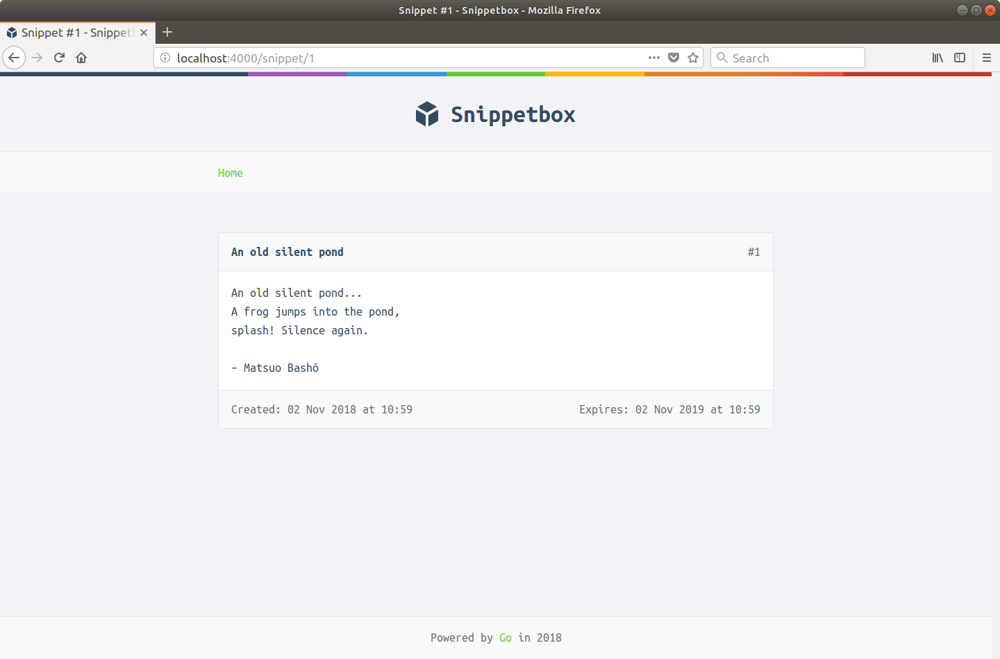

# RESTful 路由

在本书的下一部分中，我们将向我们的 Web 应用程序添加一个 HTML 表单，以便用户可以创建新的片段。

为了使这项工作顺利进行，我们将更新我们的应用程序路由，以便根据请求方法以不同的方式处理对 /snippet/create 的请求。具体来说：

对于 GET /snippet/create 请求，我们希望向用户显示用于添加新代码段的 HTML 表单。
对于 POST /snippet/create 请求，我们希望处理此表单数据，然后将新的片段记录插入到我们的数据库中。
当我们在做的时候，限制我们的其他路由——它只是返回信息——只支持 GET（和 HEAD）请求是有意义的。

本质上，我们希望我们的应用程序路由看起来像这样：

| Method | Pattern         | Handler           | Action                 |
| ------ | --------------- | ----------------- | ---------------------- |
| GET    | /               | home              | 显示首页               |
| GET    | /snippet?id=1   | showSnippet       | 显示特定snippet        |
| GET    | /snippet/create | createSnippetForm | 显示新的snippet表单    |
| POST   | /snippet/create | createSnippet     | 创建一个新的snippet    |
| GET    | /static/        | http.FileServer   | 提供一个特定的静态文件 |

另一个与路由相关的改进是使用语义 URL，以便所有变量都包含在 URL 路径中，而不是作为查询字符串附加，如下所示：

| Method | Pattern         | Handler           | Action                 |
| ------ | --------------- | ----------------- | ---------------------- |
| GET    | /               | home              | 显示首页               |
| GET    | /snippet/:id    | showSnippet       | 显示特定snippet        |
| GET    | /snippet/create | createSnippetForm | 显示新的snippet表单    |
| POST   | /snippet/create | createSnippet     | 创建一个新的snippet    |
| GET    | /static/        | http.FileServer   | 提供一个特定的静态文件 |

进行这些更改将为我们提供一个遵循 REST 基本原则的应用程序路由结构，任何从事现代 Web 应用程序工作的人都应该感到熟悉和合乎逻辑。

但正如我在本书前面提到的，Go 的 servemux 不支持基于方法的路由或其中包含变量的语义 URL。你可以使用一些技巧来解决这个问题，但大多数人倾向于认为使用第三方包来帮助路由更容易。

在本书的这一部分，我们将：

- 简述几款不错的第三方路由器的特点。
- 更新我们的应用程序以使用这些路由器之一并遵循 RESTful 路由结构。

## 安装路由器

有数以百计的第三方路由器可供 Go 选择。而且（幸运或不幸，取决于你的观点）它们的工作方式都略有不同。它们有不同的 API、不同的路由匹配逻辑以及不同的行为怪癖。

在我尝试过的所有第三方路由器中，我可能会推荐两个作为起点：Pat 和 Gorilla Mux。两者都有很好的文档，不错的测试覆盖率，并且与我们迄今为止在本书中使用的处理程序和中间件的标准模式配合得很好。

bmizerany/pat 是两个包中更专注和轻量级的。它提供基于方法的路由和对语义 URL 的支持……除此之外别无他物。但它的功能很扎实，有一个优雅的 API，并且代码本身非常清晰且写得很好。一个可能的缺点是该包不再真正得到维护。

gorilla/mux 的功能要全面得多。除了基于方法的路由和对语义 URL 的支持之外，你还可以使用它来基于方案、主机和标头进行路由。还支持 URL 中的正则表达式模式。该包的缺点是它相对较慢且需要大量内存——但对于像我们这样的数据库驱动的 Web 应用程序，对整个 HTTP 请求的生命周期的影响可能很小。

对于我们正在构建的 Web 应用程序，我们的需求很简单，并且不需要 Gorilla Mux 提供的更高级的功能。所以，在这两个包中，我们会选择 Pat。

在撰写本文时， bmizerany/pat 包没有任何可用的语义版本控制版本。因此，如果你按照以下步骤操作，请继续安装最新版本，如下所示：

```sh
$ go get github.com/bmizerany/pat
go: downloading github.com/bmizerany/pat v0.0.0-20210406213842-e4b6760bdd6f
```

### 替代路由器

我已经建议将上面的两个路由器作为起点，但如果你想探索更多替代方案，那么我建议你查看以下选项 - 所有这些都本身就很好 - 看看它们是否适合你和你的具体项目。

- go-zoo/bone 提供与 Pat 类似的功能，但具有额外的便利功能，用于注册处理程序函数并支持基于正则表达式的路由。一个缺点是 - 在撰写本文时 - 包的测试覆盖范围仍然不完整。
- julienschmidt/httprouter 是一个著名的基于快速基数树的路由器，它支持基于方法的路由和语义 URL。然而，它无法处理由通配符参数引起的冲突模式，这对于使用 RESTful 路由方案的应用程序可能是一个问题（在我们的例子中 /snippet/create 和 /snippet/:id 是冲突模式）。如果这不适用于你，那么这是一个不错的选择。
    
    > 提示：如果你使用 julienschmidt/httprouter，则 Router.Handler() 和 Router.HandlerFunc() 方法与标准 Go 中间件和处理程序模式兼容。
- dimfeld/httptreemux 是另一个基于基数树的路由器，但其设计使其不会受到 julienschmidt/httprouter 所具有的冲突模式问题的影响。一个缺点是它只允许你注册 http.HandlerFunc 对象——而不是 http.Handler 对象——这意味着它不能很好地与使用我们之前描述的标准模式的特定于路由的中间件一起工作。
- go-chi/chi 是另一个流行的选项，它使用基数树进行模式匹配，并有一个漂亮、灵活的 API。值得注意的是，它还包括一个包含一系列有用中间件的 go-chi/chi/middleware 子包。

## 实现 RESTful 路由

创建路由器并使用 bmizerany/pat 包注册路由的基本语法如下所示：

```go
mux := pat.New()
mux.Get("/snippet/:id", http.HandlerFunc(app.showSnippet))
```

在这段代码中：

- “/snippet/:id”模式包括一个命名的捕获:id。命名的捕获就像一个通配符，而模式的其余部分按字面意思匹配。 Pat 会在后台运行时将命名捕获的内容添加到 URL 查询字符串中。
- mux.Get() 方法用于注册 URL 模式和处理程序，仅当请求具有 GET HTTP 方法时才会调用该处理程序。还提供了对应的Post()、Put()、Delete()等方法。
- Pat 不允许我们直接注册处理程序函数，因此你需要使用 http.HandlerFunc() 适配器转换它们。

考虑到所有这些，让我们转到 routes.go 文件并更新它以使用 Pat：

文件：cmd/web/routes.go

```go
package main

import (
    "net/http"

    "github.com/bmizerany/pat" // New import
    "github.com/justinas/alice"
)

func (app *application) routes() http.Handler {
    standardMiddleware := alice.New(app.recoverPanic, app.logRequest, secureHeaders)

    mux := pat.New()
    mux.Get("/", http.HandlerFunc(app.home))
    mux.Get("/snippet/create", http.HandlerFunc(app.createSnippetForm))
    mux.Post("/snippet/create", http.HandlerFunc(app.createSnippet))
    mux.Get("/snippet/:id", http.HandlerFunc(app.showSnippet)) // Moved down

    fileServer := http.FileServer(http.Dir("./ui/static/"))
    mux.Get("/static/", http.StripPrefix("/static", fileServer))

    return standardMiddleware.Then(mux)
}
```

这里有一些重要的事情需要指出。

- Pat 按照它们注册的顺序匹配模式。在我们的应用程序中，对 GET "/snippet/create" 的 HTTP 请求实际上是两个路由的有效匹配——它是 /snippet/create 的精确匹配，以及 /snippet/:id 的通配符匹配（“create”部分路径将被视为 :id 参数）。因此，为了确保精确匹配优先，我们需要在任何通配符路由之前注册精确匹配路由。
- 以斜杠结尾的 URL 模式（如“/static/”）的工作方式与 Go 内置的 servemux 相同。任何与模式开头匹配的请求都将被分派到相应的处理程序。
- 模式“/”是一个特例。它只会匹配 URL 路径正好是“/”的请求。

考虑到这些，我们现在还需要对 handlers.go 文件进行一些更改：

文件：cmd/web/handlers.go

```go
package main

...

func (app *application) home(w http.ResponseWriter, r *http.Request) {
    // Because Pat matches the "/" path exactly, we can now remove the manual check
    // of r.URL.Path != "/" from this handler.

    s, err := app.snippets.Latest()
    if err != nil {
        app.serverError(w, err)
        return
    }

    app.render(w, r, "home.page.tmpl", &templateData{
        Snippets: s,
    })
}

func (app *application) showSnippet(w http.ResponseWriter, r *http.Request) {
    // Pat doesn't strip the colon from the named capture key, so we need to
    // get the value of ":id" from the query string instead of "id".
    id, err := strconv.Atoi(r.URL.Query().Get(":id"))
    if err != nil || id < 1 {
        app.notFound(w)
        return
    }

    s, err := app.snippets.Get(id)
    if err != nil {
        if errors.Is(err, models.ErrNoRecord) {
            app.notFound(w)
        } else {
            app.serverError(w, err)
        }
        return
    }

    app.render(w, r, "show.page.tmpl", &templateData{
        Snippet: s,
    })
}

// Add a new createSnippetForm handler, which for now returns a placeholder response.
func (app *application) createSnippetForm(w http.ResponseWriter, r *http.Request) {
    w.Write([]byte("Create a new snippet..."))
}

func (app *application) createSnippet(w http.ResponseWriter, r *http.Request) {
    // Checking if the request method is a POST is now superfluous and can be
    // removed.

    title := "O snail"
    content := "O snail\nClimb Mount Fuji,\nBut slowly, slowly!\n\n– Kobayashi Issa"
    expires := "7"

    id, err := app.snippets.Insert(title, content, expires)
    if err != nil {
        app.serverError(w, err)
        return
    }
    // Change the redirect to use the new semantic URL style of /snippet/:id
    http.Redirect(w, r, fmt.Sprintf("/snippet/%d", id), http.StatusSeeOther)
}
```

最后，我们需要更新 home.page.tmpl 文件中的表格，以便 HTML 中的链接也使用新的语义 URL 样式 /snippet/:id。

```html
{{template "base" .}}

{{define "title"}}Home{{end}}

{{define "main"}}
    <h2>Latest Snippets</h2>
    {{if .Snippets}}
     <table>
        <tr>
            <th>Title</th>
            <th>Created</th>
            <th>ID</th>
        </tr>
        {{range .Snippets}}
        <tr>
            <!-- Use the new semantic URL style-->
            <td><a href='/snippet/{{.ID}}'>{{.Title}}</a></td>
            <td>{{humanDate .Created}}</td>
            <td>#{{.ID}}</td>
        </tr>
        {{end}}
    </table>
    {{else}}
        <p>There's nothing to see here... yet!</p>
    {{end}}
{{end}}
```

完成后，重新启动应用程序，你现在应该能够通过语义 URL 查看文本片段。例如：http://localhost:4000/snippet/1。



你还可以看到使用不受支持的 HTTP 方法的请求会遇到 405 Method Not Allowed 响应。例如，尝试使用 curl 向同一个 URL 发出 POST 请求：

```sh
$ curl -I -X POST http://localhost:4000/snippet/1
HTTP/1.1 405 Method Not Allowed
Allow: HEAD, GET
Content-Type: text/plain; charset=utf-8
X-Content-Type-Options: nosniff
X-Frame-Options: deny
X-Xss-Protection: 1; mode=block
Date: Mon, 23 Jul 2018 10:10:33 GMT
Content-Length: 19
```

