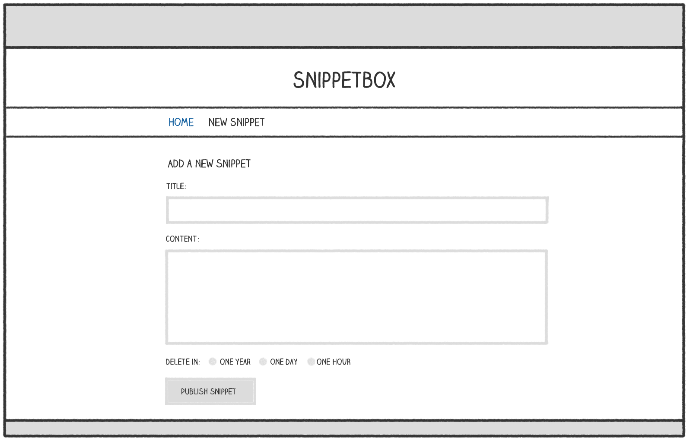
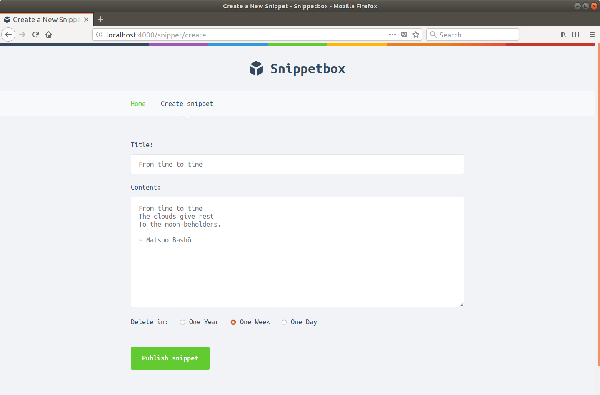
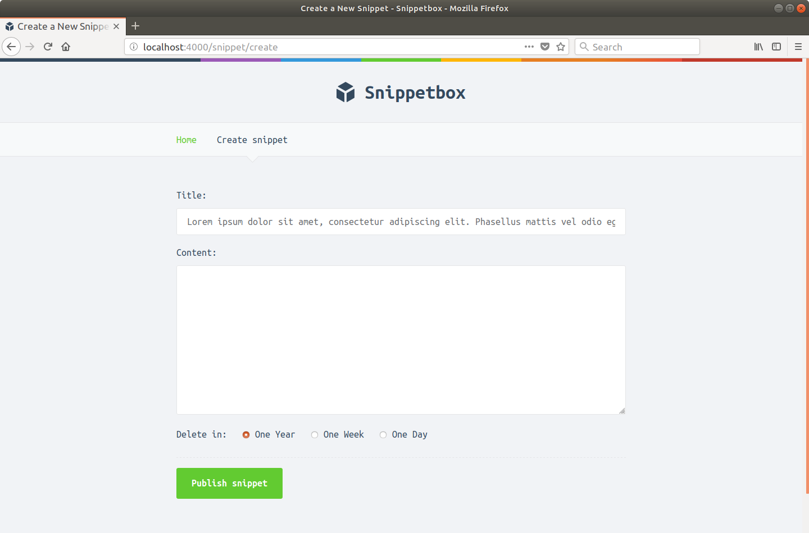
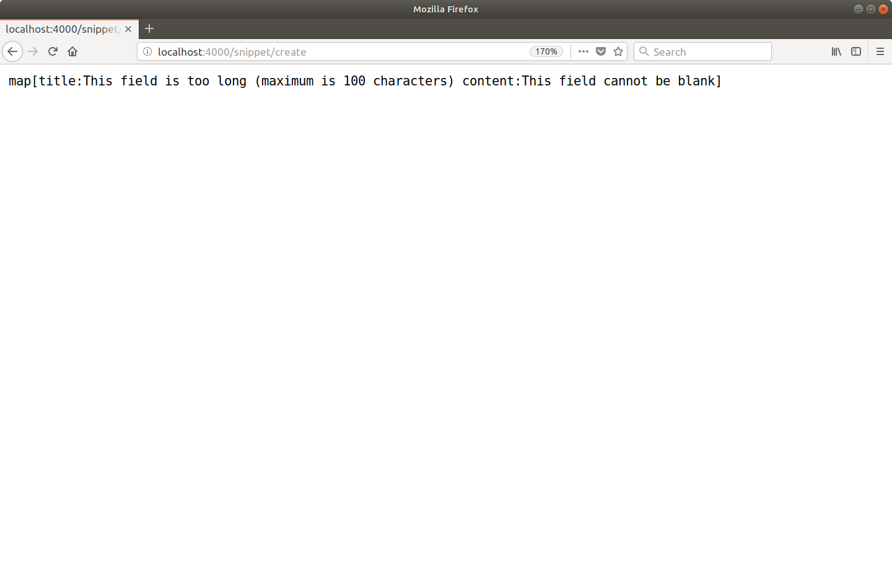
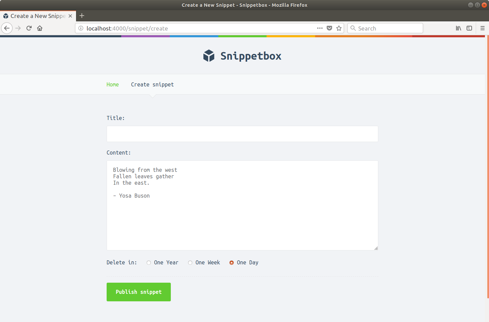
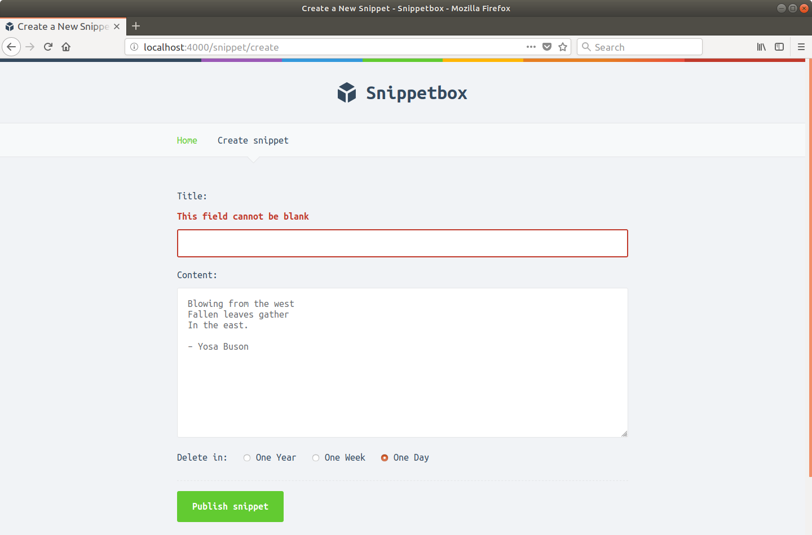
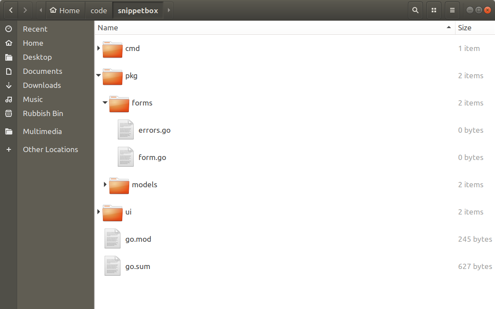

# 处理表单

在本书的这一部分中，我们将重点关注允许我们的 Web 应用程序的用户通过 HTML 表单创建新的片段，该表单看起来有点像这样：



处理此表单的高级工作流将遵循标准的 Post-Redirect-Get 模式，如下所示：

- 当用户向 /snippet/create 发出 GET 请求时，他们会看到空白表单。
- 用户完成表单并通过对 /snippet/create 的 POST 请求将其提交给服务器。
- 表单数据将由我们的 createSnippet 处理程序验证。如果有任何验证失败，表单将重新显示并突出显示相应的表单字段。如果它通过我们的验证检查，新代码段的数据将被添加到数据库中，然后我们将用户重定向到“/snippet/:id”。

作为其中的一部分，你将学习：

- 如何解析和访问在 POST 请求中发送的表单数据。
- 对表单数据执行常见验证检查的一些技术。
- 一种用户友好的模式，用于提醒用户验证失败并使用先前提交的数据重新填充表单字段。
- 如何通过在单独的可重用包中创建表单助手来扩大验证并保持处理程序清洁。

## 设置表单

让我们首先创建一个新的 ui/html/create.page.tmpl 文件来保存表单的 HTML...

```sh
$ touch ui/html/create.page.tmpl
```

...然后使用我们在本书前面使用的相同模式添加以下标记：

文件：ui/html/create.page.tmpl

```html
{{template "base" .}}

{{define "title"}}Create a New Snippet{{end}}

{{define "main"}}
<form action='/snippet/create' method='POST'>
    <div>
        <label>Title:</label>
        <input type='text' name='title'>
    </div>
    <div>
        <label>Content:</label>
        <textarea name='content'></textarea>
    </div>
    <div>
        <label>Delete in:</label>
        <input type='radio' name='expires' value='365' checked> One Year
        <input type='radio' name='expires' value='7'> One Week
        <input type='radio' name='expires' value='1'> One Day
    </div>
    <div>
        <input type='submit' value='Publish snippet'>
    </div>
</form>
{{end}}
```

到目前为止，这没有什么特别的。我们的主模板包含一个标准的 Web 表单，它发送三个表单值：标题、内容和过期时间（代码段应该过期的天数）。唯一真正需要指出的是表单的操作和方法属性——我们已经设置了这些属性，以便表单在提交时将数据 POST 到 URL /snippet/create。

现在让我们为我们的应用程序的导航栏添加一个新的“创建代码段”链接，这样点击它就会将用户带到这个新表单。

文件：ui/html/base.layout.tmpl

```html
{{define "base"}}
<!doctype html>
<html lang='en'>
    <head>
        <meta charset='utf-8'>
        <title>{{template "title" .}} - Snippetbox</title>
        <link rel='stylesheet' href='/static/css/main.css'>
        <link rel='shortcut icon' href='/static/img/favicon.ico' type='image/x-icon'>
        <link rel='stylesheet' href='https://fonts.googleapis.com/css?family=Ubuntu+Mono:400,700'>
    </head>
    <body>
        <header>
            <h1><a href='/'>Snippetbox</a></h1>
        </header>
        <nav>
            <a href='/'>Home</a>
            <!-- Add a link to the new form -->
            <a href='/snippet/create'>Create snippet</a>
        </nav>
        <main>
            {{template "main" .}}
        </main>
        {{template "footer" .}}
        <script src="/static/js/main.js" type="text/javascript"></script>
    </body>
</html>
{{end}}
```

最后，我们需要更新 createSnippetForm 处理程序，以便它像这样呈现我们的新页面：

文件：cmd/web/handlers.go

```go
package main

...

func (app *application) createSnippetForm(w http.ResponseWriter, r *http.Request) {
    app.render(w, r, "create.page.tmpl", nil)
}

...
```

此时，你可以启动应用程序并在浏览器中访问 http://localhost:4000/snippet/create。你应该会看到一个如下所示的表单：


## 解析表单数据

感谢我们之前在 RESTful 路由部分所做的工作，任何 POST /snippets/create 请求都已经被分派到我们的 createSnippet 处理程序。我们现在将更新此处理程序以在提交时处理和使用表单数据。

在高层次上，我们可以将其分解为两个不同的步骤。

首先，我们需要使用 r.ParseForm() 方法来解析请求体。这会检查请求正文的格式是否正确，然后将表单数据存储在请求的 r.PostForm 映射中。如果在解析正文时遇到任何错误（比如没有正文，或者它太大而无法处理），那么它将返回一个错误。 r.ParseForm() 方法也是幂等的；它可以安全地在同一个请求上多次调用而没有任何副作用。

然后我们可以使用 r.PostForm.Get() 方法获取 r.PostForm 中包含的表单数据。例如，我们可以使用 r.PostForm.Get("title") 检索标题字段的值。如果表单中没有匹配的字段名称，这将返回空字符串 ""，类似于本书前面查询字符串参数的工作方式。

打开你的 cmd/web/handlers.go 文件并更新它以包含以下代码：

文件：cmd/web/handlers.go

```go
package main

...

func (app *application) createSnippet(w http.ResponseWriter, r *http.Request) {
    // First we call r.ParseForm() which adds any data in POST request bodies
    // to the r.PostForm map. This also works in the same way for PUT and PATCH
    // requests. If there are any errors, we use our app.ClientError helper to send
    // a 400 Bad Request response to the user.
    err := r.ParseForm()
    if err != nil {
        app.clientError(w, http.StatusBadRequest)
        return
    }

    // Use the r.PostForm.Get() method to retrieve the relevant data fields
    // from the r.PostForm map.
    title := r.PostForm.Get("title")
    content := r.PostForm.Get("content")
    expires := r.PostForm.Get("expires")

    // Create a new snippet record in the database using the form data.
    id, err := app.snippets.Insert(title, content, expires)
    if err != nil {
        app.serverError(w, err)
        return
    }

    http.Redirect(w, r, fmt.Sprintf("/snippet/%d", id), http.StatusSeeOther)
}
```

好的，让我们试试这个！重新启动应用程序并尝试使用片段的标题和内容填写表单，有点像这样：



然后提交表单。如果一切正常，你应该被重定向到一个页面，显示你的新代码段，如下所示：


### 附加信息

#### r.Form 地图

在上面的代码中，我们通过 r.PostForm 映射访问表单值。但另一种方法是使用（略有不同） r.Form 映射。

r.PostForm 映射仅针对 POST、PATCH 和 PUT 请求填充，并包含来自请求正文的表单数据。

相比之下，r.Form 映射针对所有请求（无论其 HTTP 方法如何）进行填充，并包含来自任何请求正文和任何查询字符串参数的表单数据。所以，如果我们的表单被提交到 /snippet/create?foo=bar，我们也可以通过调用 r.Form.Get("foo") 来获取 foo 参数的值。请注意，在发生冲突时，请求正文值将优先于查询字符串参数。

如果你的应用程序以 HTML 表单和 URL 发送数据，或者你的应用程序不知道如何传递参数，则使用 r.Form 映射会很有用。但在我们的案例中，这些东西并不适用。我们希望我们的表单数据只在请求体中发送，所以我们通过 r.PostForm 访问它是明智的。

#### FormValue 和 PostFormValue 方法

net/http 包还提供了 r.FormValue() 和 r.PostFormValue() 方法。这些本质上是快捷函数，它们为你调用 r.ParseForm()，然后分别从 r.Form 或 r.PostForm 获取适当的字段值。

我建议避免使用这些快捷方式，因为它们会默默地忽略 r.ParseForm() 返回的任何错误。这并不理想——这意味着我们的应用程序可能会遇到错误和用户失败，但没有反馈机制让他们知道。

#### 多值字段

严格来说，我们上面使用的 r.PostForm.Get() 方法只返回特定表单字段的第一个值。这意味着你不能将它与可能发送多个值的表单字段一起使用，例如一组复选框。

```html
<input type="checkbox" name="items" value="foo"> Foo
<input type="checkbox" name="items" value="bar"> Bar
<input type="checkbox" name="items" value="baz"> Baz
```

在这种情况下，你需要直接使用 r.PostForm 映射。 r.PostForm 映射的底层类型是 url.Values，它又具有底层类型 map[string][]string。因此，对于具有多个值的字段，你可以遍历底层映射以访问它们，如下所示：

```go
for i, item := range r.PostForm["items"] {
    fmt.Fprintf(w, "%d: Item %s\n", i, item)
}
```

#### 表单尺寸

除非你要发送多部分数据（即你的表单具有 enctype="multipart/form-data" 属性），否则 POST、PUT 和 PATCH 请求正文限制为 10MB。如果超过此值，则 r.ParseForm() 将返回错误。

如果你想改变这个限制，你可以像这样使用 http.MaxBytesReader() 函数：

```go
// Limit the request body size to 4096 bytes
r.Body = http.MaxBytesReader(w, r.Body, 4096)
err := r.ParseForm()
if err != nil {
    http.Error(w, "Bad Request", http.StatusBadRequest)
    return
}
```

使用此代码，在 r.ParseForm() 期间将仅读取请求正文的前 4096 个字节。尝试超出此限制进行读取将导致 MaxBytesReader 返回错误，随后 r.ParseForm() 将显示该错误。

此外 - 如果达到限制 - MaxBytesReader 在 http.ResponseWriter 上设置一个标志，指示服务器关闭底层 TCP 连接。

## 数据验证

现在我们的代码有一个明显的问题：我们没有以任何方式验证来自表单的（不受信任的）用户输入。我们应该这样做以确保表单数据存在、类型正确并符合我们拥有的任何业务规则。

特别是对于这种形式，我们希望：

- 检查标题、内容和过期字段是否为空。
- 检查标题字段的长度是否不超过 100 个字符。
- 检查 expires 值是否与我们允许的值之一（1、7 或 365 天）匹配。

使用 Go 的字符串和 unicode/utf8 包中的一些 if 语句和各种函数来实现所有这些检查都相当简单。

打开你的 handlers.go 文件并更新 createSnippet 处理程序以包含适当的验证规则，如下所示：

文件：cmd/web/handlers.go

```go
package main

import (
    "errors"
    "fmt"
    "net/http"
    "strconv"
    "strings"      // New import
    "unicode/utf8" // New import

    "alexedwards.net/snippetbox/pkg/models"
)

...

func (app *application) createSnippet(w http.ResponseWriter, r *http.Request) {
    err := r.ParseForm()
    if err != nil {
        app.clientError(w, http.StatusBadRequest)
        return
    }

    title := r.PostForm.Get("title")
    content := r.PostForm.Get("content")
    expires := r.PostForm.Get("expires")

    // Initialize a map to hold any validation errors.
    errors := make(map[string]string)

    // Check that the title field is not blank and is not more than 100 characters
    // long. If it fails either of those checks, add a message to the errors
    // map using the field name as the key.
    if strings.TrimSpace(title) == "" {
        errors["title"] = "This field cannot be blank"
    } else if utf8.RuneCountInString(title) > 100 {
        errors["title"] = "This field is too long (maximum is 100 characters)"
    }

    // Check that the Content field isn't blank.
    if strings.TrimSpace(content) == "" {
        errors["content"] = "This field cannot be blank"
    }

    // Check the expires field isn't blank and matches one of the permitted
    // values ("1", "7" or "365").
    if strings.TrimSpace(expires) == "" {
        errors["expires"] = "This field cannot be blank"
    } else if expires != "365" && expires != "7" && expires != "1" {
        errors["expires"] = "This field is invalid"
    }

    // If there are any errors, dump them in a plain text HTTP response and return
    // from the handler.
    if len(errors) > 0 {
        fmt.Fprint(w, errors)
        return
    }

    id, err := app.snippets.Insert(title, content, expires)
    if err != nil {
        app.serverError(w, err)
        return
    }

    http.Redirect(w, r, fmt.Sprintf("/snippet/%d", id), http.StatusSeeOther)
}
```

> 注意：当我们检查 title 字段的长度时，我们使用的是 utf8.RuneCountInString() 函数——而不是 Go 的 len() 函数。这是因为我们要计算标题中的字符数而不是字节数。为了说明差异，字符串“Zoë”有 3 个字符，但由于带有变音 ë 字符，因此长度为 4 个字节。

好的，让我们试试这个！重新启动应用程序并尝试提交带有太长片段标题和空白内容字段的表单，有点像这样......



你应该会看到相应验证失败消息的转储，如下所示：



> 提示：你可以在这篇博文中找到一系列用于处理和验证不同类型输入的代码模式。

### 显示验证错误和重新填充字段

现在 createSnippet 处理程序正在验证数据，下一阶段是优雅地管理这些验证错误。

如果有任何验证错误，我们希望重新显示表单，突出显示验证失败的字段并自动重新填充以前提交的任何数据。

为此，让我们首先向 templateData 结构中添加两个新字段：FormErrors 用于保存任何验证错误，FormData 用于保存任何先前提交的数据，如下所示：

文件：cmd/web/templates.go

```go
package main

import (
    "html/template"
    "net/url" // New import
    "path/filepath"
    "time"

    "alexedwards.net/snippetbox/pkg/models"
)

// Add FormData and FormErrors fields to the templateData struct.
type templateData struct {
    CurrentYear int
    FormData    url.Values
    FormErrors  map[string]string
    Snippet     *models.Snippet
    Snippets    []*models.Snippet
}

...
```

注意：在此结构中，FormData 字段的类型为 url.Values，它与 r.PostForm 映射（保存在请求正文中发送的数据）的基础类型相同。

现在让我们再次更新 createSnippet 处理程序，以便如果遇到任何验证错误，表单将重新显示，相关错误和表单数据传递给模板。像这样：

文件：cmd/web/handlers.go

```go
package main

...

func (app *application) createSnippet(w http.ResponseWriter, r *http.Request) {
    err := r.ParseForm()
    if err != nil {
        app.clientError(w, http.StatusBadRequest)
        return
    }

    title := r.PostForm.Get("title")
    content := r.PostForm.Get("content")
    expires := r.PostForm.Get("expires")

    errors := make(map[string]string)

    if strings.TrimSpace(title) == "" {
        errors["title"] = "This field cannot be blank"
    } else if utf8.RuneCountInString(title) > 100 {
        errors["title"] = "This field is too long (maximum is 100 characters)"
    }

    if strings.TrimSpace(content) == "" {
        errors["content"] = "This field cannot be blank"
    }

    if strings.TrimSpace(expires) == "" {
        errors["expires"] = "This field cannot be blank"
    } else if expires != "365" && expires != "7" && expires != "1" {
        errors["expires"] = "This field is invalid"
    }

    // If there are any validation errors, re-display the create.page.tmpl
    // template passing in the validation errors and previously submitted
    // r.PostForm data.
    if len(errors) > 0 {
        app.render(w, r, "create.page.tmpl", &templateData{
            FormErrors: errors,
            FormData:   r.PostForm,
        })
        return
    }

    id, err := app.snippets.Insert(title, content, expires)
    if err != nil {
        app.serverError(w, err)
        return
    }

    http.Redirect(w, r, fmt.Sprintf("/snippet/%d", id), http.StatusSeeOther)
}
```

所以现在当有任何验证错误时，我们重新显示 create.page.tmpl 模板，在模板数据的 FormErrors 字段中传入错误映射，并在 FormData 字段中传入先前提交的数据。

那么我们将如何在模板中呈现这些错误呢？

FormErrors 字段的基础类型是 map[string]string（以表单字段名称为键）。对于映射，可以通过简单地在键名后缀点来访问给定键的值。例如，要为标题字段呈现任何错误消息，我们可以在模板中使用标签 {{.FormErrors.title}}。重要的是要提到 - 与结构字段不同 - 映射键名称不必大写即可从模板访问它们。

FormData 的底层类型是 url.Values，我们可以使用它的 Get() 方法来检索字段的值，就像我们在 createSnippet 处理程序中所做的那样。例如，要为标题字段呈现先前提交的值，我们可以在模板中使用标记 {{.FormData.Get "title"}}。

考虑到这一点，让我们更新 create.page.tmpl 文件以显示每个字段的数据和验证错误消息（如果存在）：

文件：ui/html/create.page.tmpl

```html
{{template "base" .}}

{{define "title"}}Create a New Snippet{{end}}

{{define "main"}}
<form action='/snippet/create' method='POST'>
    <div>
        <label>Title:</label>
        {{with .FormErrors.title}}
            <label class='error'>{{.}}</label>
        {{end}}
        <input type='text' name='title' value='{{.FormData.Get "title"}}'>
    </div>
    <div>
        <label>Content:</label>
        {{with .FormErrors.content}}
            <label class='error'>{{.}}</label>
        {{end}}
        <textarea name='content'>{{.FormData.Get "content"}}</textarea>
    </div>
    <div>
        <label>Delete in:</label>
        {{with .FormErrors.expires}}
            <label class='error'>{{.}}</label>
        {{end}}
        {{$exp := or (.FormData.Get "expires") "365"}}
        <input type='radio' name='expires' value='365' {{if (eq $exp "365")}}checked{{end}}> One Year
        <input type='radio' name='expires' value='7' {{if (eq $exp "7")}}checked{{end}}> One Week
        <input type='radio' name='expires' value='1' {{if (eq $exp "1")}}checked{{end}}> One Day
    </div>
    <div>
        <input type='submit' value='Publish snippet'>
    </div>
</form>
{{end}}
```

希望这个标记和我们使用 {{with}} 操作来控制动态数据的显示通常是清楚的——它只是使用我们在本书前面已经看到和讨论过的技术。

但让我们花点时间谈谈这一行：

```html
{{$exp := or (.FormData.Get "expires") "365"}}
```

这实质上是创建一个新的 $exp 模板变量，它使用 or 模板函数将变量设置为 .FormData.Get "expires" 产生的值，或者如果它为空，则使用默认值 "365" 代替。

请注意这里我们如何使用 () 括号对 .FormData.Get 方法及其参数进行分组，以便将其输出传递给 or 操作？

然后我们将这个变量与 eq 函数结合使用，将选中的属性添加到适当的单选按钮，如下所示：

```html
{{if (eq $exp "365")}}checked{{end}}
```

无论如何，重新启动应用程序并在浏览器中访问 http://localhost:4000/snippet/create。

尝试添加一些内容并更改默认到期时间，但将标题字段留空，如下所示：



提交后，你现在应该会看到重新显示的表单，正确重新填充内容和到期选项以及标题字段旁边的“此字段不能为空”错误消息：



在我们继续之前，请随意花一些时间来处理表单和验证规则，直到你确信一切都按预期工作。

## 扩展数据验证

好的，现在我们的应用程序根据我们的业务规则验证表单数据并优雅地处理任何验证错误。太好了，但要到达那里需要做很多工作。

虽然我们采用的方法是一次性的，但如果你的应用程序有很多表单，那么你最终可能会在代码和验证规则中出现大量重复。更不用说，编写用于验证表单的代码并不是最令人兴奋的消磨时间的方式。

让我们通过创建一个表单包来抽象一些这种行为并减少处理程序中的样板代码来解决这个问题。我们实际上根本不会改变应用程序为用户工作的方式；这只是我们代码库的重构。

我们将首先在项目目录中创建一个新的 pkg/forms 文件夹并添加两个文件——forms.go 和 errors.go——像这样：

```sh
$ cd $HOME/code/snippetbox
$ mkdir pkg/forms
$ touch pkg/forms/errors.go
$ touch pkg/forms/form.go
```



完成后，打开 errors.go 文件并创建一个新的错误类型，我们将使用它来保存表单的验证错误消息，如下所示：

文件：pkg/forms/errors.go

```go
package forms

// Define a new errors type, which we will use to hold the validation error
// messages for forms. The name of the form field will be used as the key in
// this map.
type errors map[string][]string

// Implement an Add() method to add error messages for a given field to the map.
func (e errors) Add(field, message string) {
    e[field] = append(e[field], message)
}

// Implement a Get() method to retrieve the first error message for a given
// field from the map.
func (e errors) Get(field string) string {
    es := e[field]
    if len(es) == 0 {
        return ""
    }
    return es[0]
}
```

然后在 form.go 文件中添加以下代码：

文件：pkg/forms/form.go

```go
package forms

import (
    "fmt"
    "net/url"
    "strings"
    "unicode/utf8"
)

// Create a custom Form struct, which anonymously embeds a url.Values object
// (to hold the form data) and an Errors field to hold any validation errors
// for the form data.
type Form struct {
    url.Values
    Errors errors
}

// Define a New function to initialize a custom Form struct. Notice that
// this takes the form data as the parameter?
func New(data url.Values) *Form {
    return &Form{
        data,
        errors(map[string][]string{}),
    }
}

// Implement a Required method to check that specific fields in the form
// data are present and not blank. If any fields fail this check, add the
// appropriate message to the form errors.
func (f *Form) Required(fields ...string) {
    for _, field := range fields {
        value := f.Get(field)
        if strings.TrimSpace(value) == "" {
            f.Errors.Add(field, "This field cannot be blank")
        }
    }
}

// Implement a MaxLength method to check that a specific field in the form
// contains a maximum number of characters. If the check fails then add the
// appropriate message to the form errors.
func (f *Form) MaxLength(field string, d int) {
    value := f.Get(field)
    if value == "" {
        return
    }
    if utf8.RuneCountInString(value) > d {
        f.Errors.Add(field, fmt.Sprintf("This field is too long (maximum is %d characters)", d))
    }
}

// Implement a PermittedValues method to check that a specific field in the form
// matches one of a set of specific permitted values. If the check fails
// then add the appropriate message to the form errors.
func (f *Form) PermittedValues(field string, opts ...string) {
    value := f.Get(field)
    if value == "" {
        return
    }
    for _, opt := range opts {
        if value == opt {
            return
        }
    }
    f.Errors.Add(field, "This field is invalid")
}

// Implement a Valid method which returns true if there are no errors.
func (f *Form) Valid() bool {
    return len(f.Errors) == 0
}
```

下一步是更新 templateData 结构，以便我们可以将这个新的 forms.Form 结构传递给我们的模板：

文件：cmd/web/templates.go

```go
package main

import (
    "html/template"
    "path/filepath"
    "time"

    "alexedwards.net/snippetbox/pkg/forms" // New import
    "alexedwards.net/snippetbox/pkg/models"
)

// Update the templateData fields, removing the individual FormData and
// FormErrors fields and replacing them with a single Form field.
type templateData struct {
    CurrentYear int
    Form        *forms.Form
    Snippet     *models.Snippet
    Snippets    []*models.Snippet
}

...
```

现在为了回报……打开你的 handlers.go 文件并更新它以使用我们刚刚创建的 forms.Form 结构和验证方法，如下所示：

文件：cmd/web/handlers.go

```go
package main

import (
    "errors"
    "fmt"
    "net/http"
    "strconv"

    "alexedwards.net/snippetbox/pkg/forms" // New import
    "alexedwards.net/snippetbox/pkg/models"
)

...

func (app *application) createSnippetForm(w http.ResponseWriter, r *http.Request) {
    app.render(w, r, "create.page.tmpl", &templateData{
        // Pass a new empty forms.Form object to the template.
        Form: forms.New(nil),
    })
}

func (app *application) createSnippet(w http.ResponseWriter, r *http.Request) {
    err := r.ParseForm()
    if err != nil {
        app.clientError(w, http.StatusBadRequest)
        return
    }

    // Create a new forms.Form struct containing the POSTed data from the
    // form, then use the validation methods to check the content.
    form := forms.New(r.PostForm)
    form.Required("title", "content", "expires")
    form.MaxLength("title", 100)
    form.PermittedValues("expires", "365", "7", "1")

    // If the form isn't valid, redisplay the template passing in the
    // form.Form object as the data.
    if !form.Valid() {
        app.render(w, r, "create.page.tmpl", &templateData{Form: form})
        return
    }

    // Because the form data (with type url.Values) has been anonymously embedded
    // in the form.Form struct, we can use the Get() method to retrieve
    // the validated value for a particular form field.
    id, err := app.snippets.Insert(form.Get("title"), form.Get("content"), form.Get("expires"))
    if err != nil {
        app.serverError(w, err)
        return
    }

    http.Redirect(w, r, fmt.Sprintf("/snippet/%d", id), http.StatusSeeOther)
}
```


剩下的就是更新 create.page.tmpl 文件以使用新的 form.Form 结构中包含的数据，如下所示：

文件：ui/html/create.page.tmpl

```html
{{template "base" .}}

{{define "title"}}Create a New Snippet{{end}}

{{define "main"}}
<form action='/snippet/create' method='POST'>
    {{with .Form}}
        <div>
            <label>Title:</label>
            {{with .Errors.Get "title"}}
                <label class='error'>{{.}}</label>
            {{end}}
            <input type='text' name='title' value='{{.Get "title"}}'>
        </div>
        <div>
            <label>Content:</label>
            {{with .Errors.Get "content"}}
                <label class='error'>{{.}}</label>
            {{end}}
            <textarea name='content'>{{.Get "content"}}</textarea>
        </div>
        <div>
            <label>Delete in:</label>
            {{with .Errors.Get "expires"}}
                <label class='error'>{{.}}</label>
            {{end}}
            {{$exp := or (.Get "expires") "365"}}
            <input type='radio' name='expires' value='365' {{if (eq $exp "365")}}checked{{end}}> One Year
            <input type='radio' name='expires' value='7' {{if (eq $exp "7")}}checked{{end}}> One Week
            <input type='radio' name='expires' value='1' {{if (eq $exp "1")}}checked{{end}}> One Day
        </div>
        <div>
            <input type='submit' value='Publish snippet'>
        </div>
    {{end}}
</form>
{{end}}
```

这是很好地塑造。

我们现在有一个带有验证规则和逻辑的表单包，可以在我们的应用程序中重复使用。它也可以很容易地扩展到将来包含其他规则（我们将在本书后面进行）。表单数据和错误都被巧妙地封装在一个 forms.Form 对象中——我们可以轻松地将它传递给我们的模板——它提供了一个简单且一致的 API 来检索和显示表单数据和任何错误消息。

继续并立即重新运行应用程序。一切顺利，你应该会发现表单和验证规则以与以前相同的方式正常工作。
