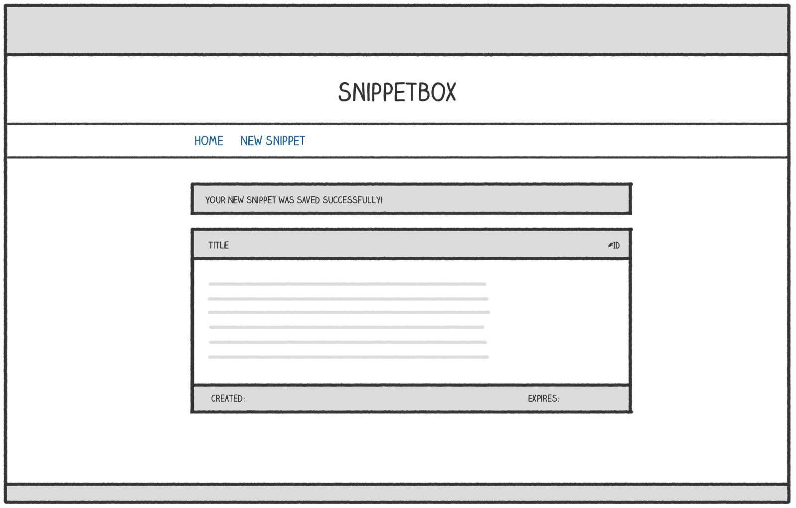
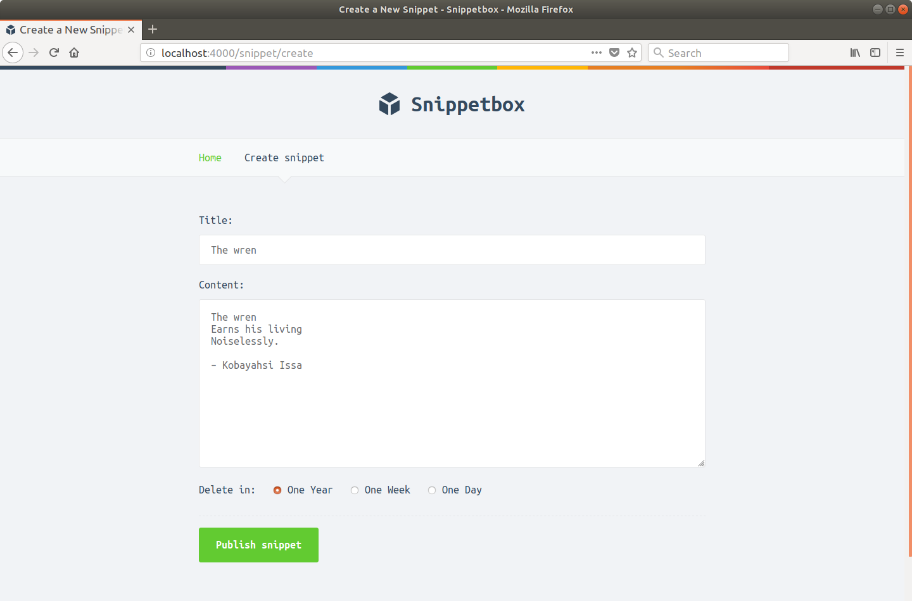
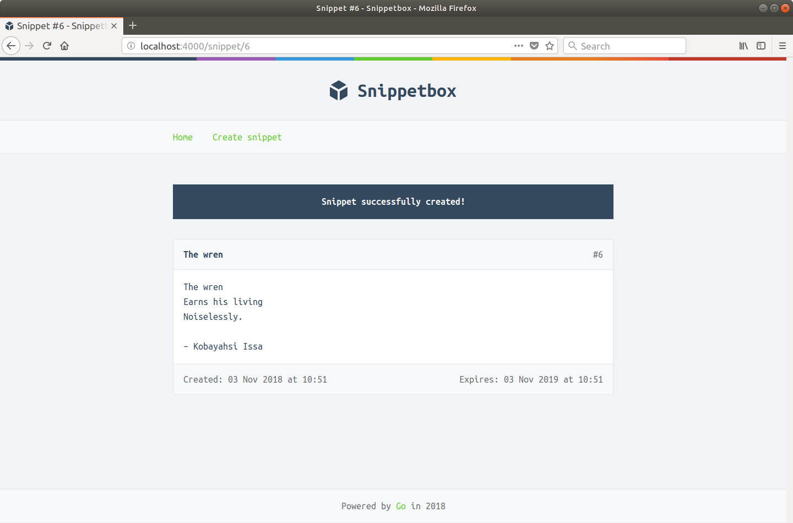
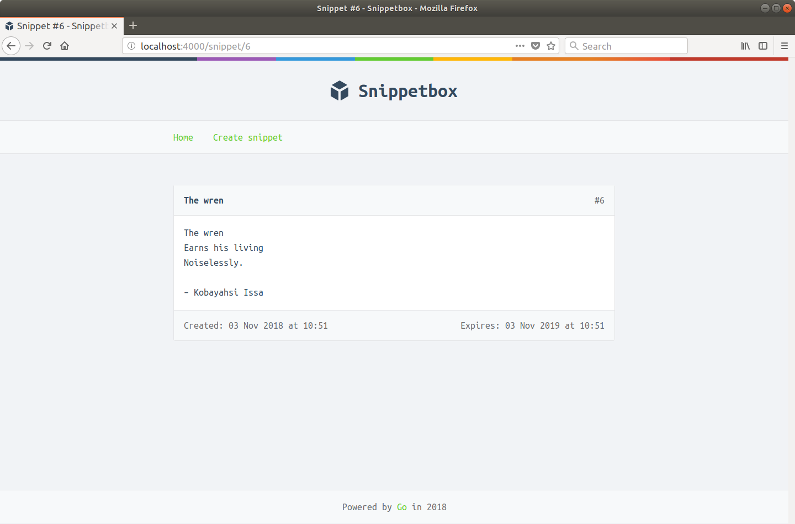

# 有状态的 HTTP

改善我们的用户体验的一个很好的方法是显示用户在添加新代码段后看到的一次性确认消息。像这样：



像这样的确认消息应该只向用户显示一次（在创建代码段后立即），其他用户不应看到该消息。如果你有 Rails、Django、Laravel 或类似框架的背景，你可能会知道这种类型的功能是一条快闪消息。

为了实现这一点，我们需要开始在同一用户的 HTTP 请求之间共享数据（或状态）。最常见的方法是为用户实现一个会话。

在本节中，你将学习：

- 哪些会话管理器可以帮助我们在 Go 中实现会话。
- 如何根据应用程序的需要自定义会话行为（包括超时和 cookie 设置）。
- 如何使用会话在特定用户的请求之间安全可靠地共享数据。

## 安装会话管理器

在使用会话时有很多安全考虑因素，正确的实现是非常重要的。除非你真的需要推出自己的实现，否则最好使用现有的、经过良好测试的第三方软件包。

与路由器不同的是，Go 的会话管理包只有几个不是特定于框架的：

- gorilla/sessions 是最成熟和最知名的包。它有一个简单易用的 API，并支持大量的第三方会话存储，包括 MySQL、PostgreSQL 和 Redis。然而，重要的是（不幸的是）存在内存泄漏问题，并且它没有提供更新会话令牌的机制——这意味着如果你使用第三方服务器端会话之一，它很容易受到会话固定攻击商店。这两个问题都将在软件包的第 2 版中得到解决，但在撰写本文时尚不可用。
- alexedwards/scs 是另一个会话管理器，它支持各种服务器端会话存储，包括 MySQL、PostgreSQL 和 Redis。它没有与 Gorilla Sessions 相同的安全性和内存泄漏问题，支持通过中间件自动加载和保存会话数据，并具有用于类型安全数据操作的漂亮界面。
- golangcollege/sessions 使用加密和认证的 cookie 提供基于 cookie 的会话存储。它轻量级且专注，具有简单的 API，并支持通过中间件自动加载和保存会话数据。因为它使用 cookie 来存储会话数据，所以它非常高效且易于设置，但有几个重要的缺点：你可以存储的信息量是有限的（至 4KB），并且你不能以与你相同的方式撤销会话可以使用服务器端存储。

一般来说，如果你喜欢使用基于 cookie 的会话，那么我建议你使用 golangcollege/sessions 包，这正是我们将在本书的其余部分中进行的操作。

如果你按照以下步骤进行操作，请继续安装该软件包的 v1，如下所示：

```sh
$ cd $HOME/code/snippetbox
$ go get github.com/golangcollege/sessions@v1
go: downloading github.com/golangcollege/sessions v1.2.0
go: downloading golang.org/x/crypto v0.0.0-20200317142112-1b76d66859c6
go: downloading golang.org/x/sys v0.0.0-20190412213103-97732733099d
```

注意 golang.org/x/crypto 和 golang.org/x/sys 包——它们是 golangcollege/sessions 的子依赖项——是如何自动下载的？

## 设置会话管理器

在本章中，我将介绍设置和使用 golangcollege/sessions 包的过程，但如果你打算在生产应用程序中使用它，我建议你阅读文档和 API 参考以熟悉所有特征。

我们需要做的第一件事是在我们的 main.go 文件中建立一个会话管理器，并通过应用程序结构使其对我们的处理程序可用。会话管理器保存我们会话的配置设置，还提供了一些中间件和辅助方法来处理会话数据的加载和保存。

我们需要的另一件事是一个 32 字节长的密钥，用于加密和验证会话 cookie。我们将更新我们的应用程序，以便它可以通过新的命令行标志接受此密钥。

打开你的 main.go 文件并按如下方式更新它：

文件：cmd/web/main.go

```go
package main

import (
    "database/sql"
    "flag"
    "html/template"
    "log"
    "net/http"
    "os"
    "time" // New import

    "alexedwards.net/snippetbox/pkg/models/mysql"

    _ "github.com/go-sql-driver/mysql"
    "github.com/golangcollege/sessions" // New import
)

// Add a new session field to the application struct.
type application struct {
    errorLog      *log.Logger
    infoLog       *log.Logger
    session       *sessions.Session
    snippets      *mysql.SnippetModel
    templateCache map[string]*template.Template
}

func main() {
    addr := flag.String("addr", ":4000", "HTTP network address")
    dsn := flag.String("dsn", "web:pass@/snippetbox?parseTime=true", "MySQL data source name")
    // Define a new command-line flag for the session secret (a random key which
    // will be used to encrypt and authenticate session cookies). It should be 32
    // bytes long.
    secret := flag.String("secret", "s6Ndh+pPbnzHbS*+9Pk8qGWhTzbpa@ge", "Secret key")
    flag.Parse()

    infoLog := log.New(os.Stdout, "INFO\t", log.Ldate|log.Ltime)
    errorLog := log.New(os.Stderr, "ERROR\t", log.Ldate|log.Ltime|log.Lshortfile)

    db, err := openDB(*dsn)
    if err != nil {
        errorLog.Fatal(err)
    }
    defer db.Close()

    templateCache, err := newTemplateCache("./ui/html/")
    if err != nil {
        errorLog.Fatal(err)
    }

    // Use the sessions.New() function to initialize a new session manager,
    // passing in the secret key as the parameter. Then we configure it so
    // sessions always expires after 12 hours.
    session := sessions.New([]byte(*secret))
    session.Lifetime = 12 * time.Hour

    // And add the session manager to our application dependencies.
    app := &application{
        errorLog:      errorLog,
        infoLog:       infoLog,
        session:       session,
        snippets:      &mysql.SnippetModel{DB: db},
        templateCache: templateCache,
    }

    srv := &http.Server{
        Addr:     *addr,
        ErrorLog: errorLog,
        Handler:  app.routes(),
    }

    infoLog.Printf("Starting server on %s", *addr)
    err = srv.ListenAndServe()
    errorLog.Fatal(err)
}

...
```

> 注意：sessions.New() 函数返回一个 Session 结构，它保存会话的配置设置。在上面的代码中，我们设置了该结构体的 Lifetime 字段，以便会话在 12 小时后到期，但是你可以并且应该根据应用程序的需要配置一系列其他字段。

为了使会话工作，我们还需要使用 Session.Enable() 方法提供的中间件包装我们的应用程序路由。该中间件根据每个 HTTP 请求和响应加载和保存会话 cookie 的会话数据。

需要注意的是，我们不需要这个中间件来处理我们所有的应用程序路由。具体来说，我们不需要在 /static/ 路由上使用它，因为它所做的只是提供静态文件，不需要任何有状态的行为。

因此，因此，将会话中间件添加到我们现有的标准中间件链中是没有意义的。

相反，让我们创建一个新的 dynamicMiddleware 链，其中包含仅适用于我们的动态应用程序路由的中间件。

打开routes.go文件并像这样更新它：

文件：cmd/web/routes.go

```go
package main

import (
    "net/http"

    "github.com/bmizerany/pat"
    "github.com/justinas/alice"
)

func (app *application) routes() http.Handler {
    standardMiddleware := alice.New(app.recoverPanic, app.logRequest, secureHeaders)

    // Create a new middleware chain containing the middleware specific to
    // our dynamic application routes. For now, this chain will only contain
    // the session middleware but we'll add more to it later.
    dynamicMiddleware := alice.New(app.session.Enable)

    mux := pat.New()
    // Update these routes to use the new dynamic middleware chain followed
    // by the appropriate handler function.
    mux.Get("/", dynamicMiddleware.ThenFunc(app.home))
    mux.Get("/snippet/create", dynamicMiddleware.ThenFunc(app.createSnippetForm))
    mux.Post("/snippet/create", dynamicMiddleware.ThenFunc(app.createSnippet))
    mux.Get("/snippet/:id", dynamicMiddleware.ThenFunc(app.showSnippet))

    // Leave the static files route unchanged.
    fileServer := http.FileServer(http.Dir("./ui/static/"))
    mux.Get("/static/", http.StripPrefix("/static", fileServer))

    return standardMiddleware.Then(mux)
}
```

如果你现在运行该应用程序，你会发现它编译一切正常，并且你的应用程序路由继续正常工作。

### 附加信息

#### 不使用alice

如果你没有使用 justinas/alice 包来帮助管理你的中间件链，那么你只需要用会话中间件包装你的处理程序函数。像这样：

```go
mux := pat.New()
mux.Get("/", app.session.Enable(http.HandlerFunc(app.home)))
mux.Get("/snippet/create", app.session.Enable(http.HandlerFunc(app.createSnippetForm)))
// ... etc
```

## 使用会话数据

在本章中，让我们使用会话功能，并使用它来持久化我们之前讨论过的 HTTP 请求之间的确认闪存消息。

要将确认消息添加到用户的会话数据中，我们应该使用 *Session.Put() 方法。第二个参数是数据的键，我们也将使用它随后从会话中检索数据。它看起来有点像这样：

```go
app.session.Put(r, "flash", "Snippet successfully created!")
```

要从会话中检索数据，我们有两种选择。我们可以使用 *Session.Get() 方法（它返回一个 interface{} 类型）并将值类型断言为一个字符串，有点像这样：

```go
flash, ok := app.session.Get(r, "flash").(string)
if !ok {
    app.serverError(w, errors.New("type assertion to string failed"))
}
```

或者，我们可以使用 *Session.GetString() 方法来为我们处理类型转换。如果会话数据中没有匹配的键——或者无法将检索到的值断言为字符串——此方法将返回空字符串“”。

```go
flash := app.session.GetString(r, "flash")
```

golangcollege/sessions 包也提供了类似的帮助器来检索 bool、[]byte、float64、int 和 time.Time 类型。

然而，因为我们希望我们的确认消息被显示一次——而且只显示一次——我们还需要在检索它后从会话数据中删除该消息。

我们可以使用 *Session.Remove() 方法来执行此操作，但更好的选择是 *Session.PopString() 方法，该方法检索给定键的字符串值，然后一步将其从会话数据中删除。

```go
flash := app.session.PopString(r, "flash")
```

这是添加和删除会话数据的基本功能的快速概述，但如果你计划在生产应用程序中使用它，我再次建议你熟悉完整的包文档。

### 在实践中使用会话数据

让我们将刚刚学到的知识付诸行动并更新 createSnippet 处理程序，以便它向当前用户的会话数据添加一条确认消息，如下所示：

文件：cmd/web/handlers.go

```go
package main

...

func (app *application) createSnippet(w http.ResponseWriter, r *http.Request) {
    err := r.ParseForm()
    if err != nil {
        app.clientError(w, http.StatusBadRequest)
        return
    }

    form := forms.New(r.PostForm)
    form.Required("title", "content", "expires")
    form.MaxLength("title", 100)
    form.PermittedValues("expires", "365", "7", "1")

    if !form.Valid() {
        app.render(w, r, "create.page.tmpl", &templateData{Form: form})
        return
    }

    id, err := app.snippets.Insert(form.Get("title"), form.Get("content"), form.Get("expires"))
    if err != nil {
        app.serverError(w, err)
        return
    }

    // Use the Put() method to add a string value ("Your snippet was saved
    // successfully!") and the corresponding key ("flash") to the session
    // data. Note that if there's no existing session for the current user
    // (or their session has expired) then a new, empty, session for them
    // will automatically be created by the session middleware.
    app.session.Put(r, "flash", "Snippet successfully created!")

    http.Redirect(w, r, fmt.Sprintf("/snippet/%d", id), http.StatusSeeOther)
}
```


接下来，我们希望我们的 showSnippet 处理程序检索确认消息（如果当前用户的会话中存在确认消息）并将其传递给模板以供后续显示。

文件：cmd/web/handlers.go

```go
package main

...

func (app *application) showSnippet(w http.ResponseWriter, r *http.Request) {
    id, err := strconv.Atoi(r.URL.Query().Get(":id"))
    if err != nil || id < 1 {
        app.notFound(w)
        return
    }

    s, err := app.snippets.Get(id)
    if err != nil {
        if errors.Is(err, models.ErrNoRecord) {
            app.notFound(w)
        } else {
            app.serverError(w, err)
        }
        return
    }

    // Use the PopString() method to retrieve the value for the "flash" key.
    // PopString() also deletes the key and value from the session data, so it
    // acts like a one-time fetch. If there is no matching key in the session
    // data this will return the empty string.
    flash := app.session.PopString(r, "flash")

    // Pass the flash message to the template.
    app.render(w, r, "show.page.tmpl", &templateData{
        Flash:   flash,
        Snippet: s,
    })
}

...
```

如果你现在尝试运行该应用程序，编译器将（正确地）抱怨我们的 templateData 结构中未定义 Flash 字段。继续并像这样添加它：

文件：cmd/web/templates.go

```go
package main

import (
    "html/template"
    "path/filepath"
    "time"

    "alexedwards.net/snippetbox/pkg/forms"
    "alexedwards.net/snippetbox/pkg/models"
)

// Add a Flash field to the templateData struct.
type templateData struct {
    CurrentYear int
    Flash       string
    Form        *forms.Form
    Snippet     *models.Snippet
    Snippets    []*models.Snippet
}

...
```

现在，我们可以更新 base.layout.tmpl 文件以显示 flash 消息（如果存在）。

文件：ui/html/base.layout.tmpl

```html
{{define "base"}}
<!doctype html>
<html lang='en'>
    <head>
        <meta charset='utf-8'>
        <title>{{template "title" .}} - Snippetbox</title>
        <link rel='stylesheet' href='/static/css/main.css'>
        <link rel='shortcut icon' href='/static/img/favicon.ico' type='image/x-icon'>
        <link rel='stylesheet' href='https://fonts.googleapis.com/css?family=Ubuntu+Mono:400,700'>
    </head>
    <body>
        <header>
            <h1><a href='/'>Snippetbox</a></h1>
        </header>
        <nav>
            <a href='/'>Home</a>
            <a href='/snippet/create'>Create snippet</a>
        </nav>
        <main>
            {{with .Flash}}
            <div class='flash'>{{.}}</div>
            {{end}}
            {{template "main" .}}
        </main>
        {{template "footer" .}}
        <script src="/static/js/main.js" type="text/javascript"></script>
    </body>
</html>
{{end}}
```

请记住，只有当 .Flash 的值不是空字符串时，才会评估 {{with .Flash}} 块。因此，如果当前用户的会话中没有“flash”键，结果就是不会显示新标记块。

完成后，保存所有文件并重新启动应用程序。尝试添加一个像这样的新片段......



重定向后，你应该会看到正在显示的 Flash 消息：




如果你尝试刷新页面，你可以确认 Flash 消息不再显示——这是当前用户创建代码段后立即发送的一次性消息。



### 自动显示 Flash 消息

我们可以做的一个小改进（这将节省我们稍后在构建中的一些工作）是自动显示 flash 消息，以便在下次呈现任何页面时自动包含任何消息。

我们可以通过我们之前创建的 addDefaultData() 辅助方法向模板数据添加任何 flash 消息来实现这一点，如下所示：

文件：cmd/web/helpers.go

```go
package main

...

func (app *application) addDefaultData(td *templateData, r *http.Request) *templateData {
    if td == nil {
        td = &templateData{}
    }
    td.CurrentYear = time.Now().Year()
    // Add the flash message to the template data, if one exists.
    td.Flash = app.session.PopString(r, "flash")
    return td
}

...
```

进行这种更改意味着我们不再需要检查 showSnippet 处理程序中的 flash 消息，并且可以将代码还原为如下所示：

```go
package main

...

func (app *application) showSnippet(w http.ResponseWriter, r *http.Request) {
    id, err := strconv.Atoi(r.URL.Query().Get(":id"))
    if err != nil || id < 1 {
        app.notFound(w)
        return
    }

    s, err := app.snippets.Get(id)
    if err != nil {
        if errors.Is(err, models.ErrNoRecord) {
            app.notFound(w)
        } else {
            app.serverError(w, err)
        }
        return
    }

    app.render(w, r, "show.page.tmpl", &templateData{
        Snippet: s,
    })
}

...
```

随意尝试再次运行该应用程序并创建另一个代码段。你应该会发现 Flash 消息功能仍然按预期工作。
